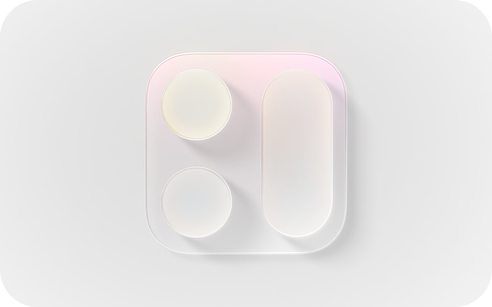
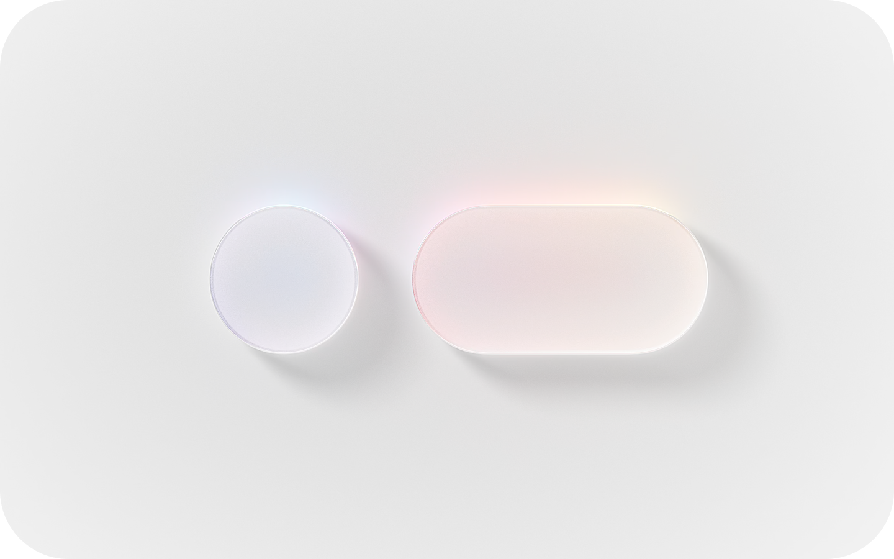
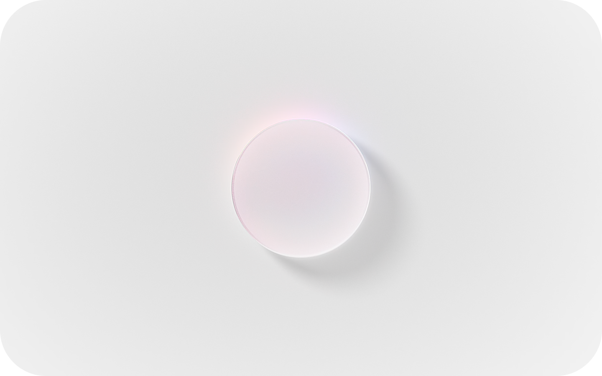

# Human Interface Guidelines

The HIG contains guidance and best practices that can help you design a great experience for any Apple platform.

As you design interfaces for Apple platforms, keep these principles in mind:

#### Hierarchy

Establish a clear visual hierarchy where controls and interface elements elevate and distinguish the content beneath them.

#### Harmony

Align with the concentric design of the hardware and software to create harmony between interface elements, system experiences, and devices.

#### Consistency

Adopt platform conventions to maintain a consistent design that continuously adapts across window sizes and displays.

For developer guidance, see [Adopting Liquid Glass](https://developer.apple.com/documentation/TechnologyOverviews/adopting-liquid-glass).

## Design fundamentals

- [App icons](./app-icons.md)
- [Color](./color.md)
- [Materials](./materials.md)
- [Layout](./layout.md)
- [Icons](./icons.md)
- [Accessibility](./accessibility.md)

## New and updated

- [Multitasking](./multitasking.md)
- [The menu bar](./the-menu-bar.md)
- [Toolbars](./toolbars.md)
- [Search fields](./search-fields.md)
- [Game Center](./game-center.md)
- [Generative AI](./generative-ai.md)

## Topics

- [Getting started](./getting-started.md)

- [Foundations](./foundations.md)

- [Patterns](./patterns.md)

- [Components](./components.md)

- [Inputs](./inputs.md)

- [Technologies](./technologies.md)
