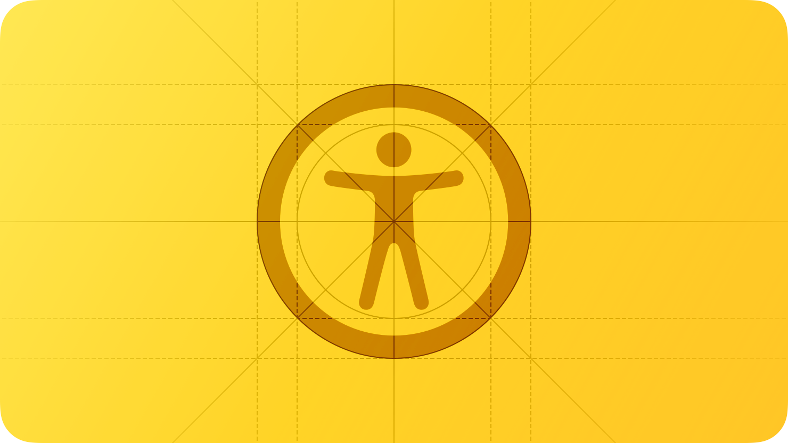
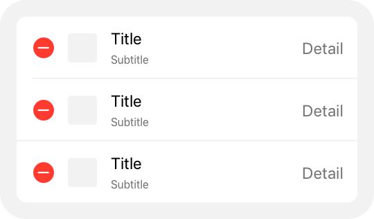
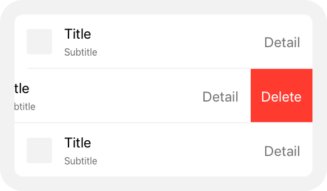
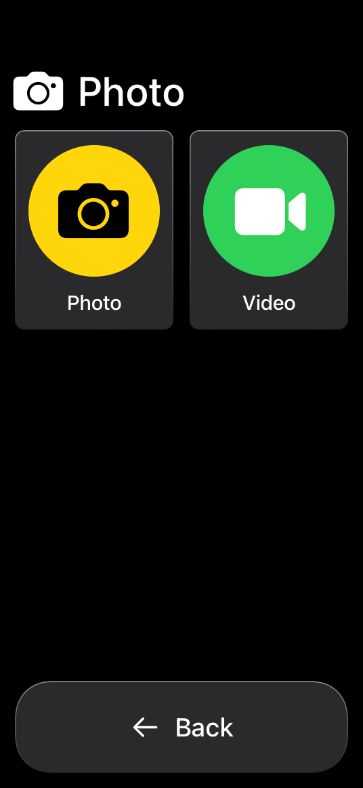
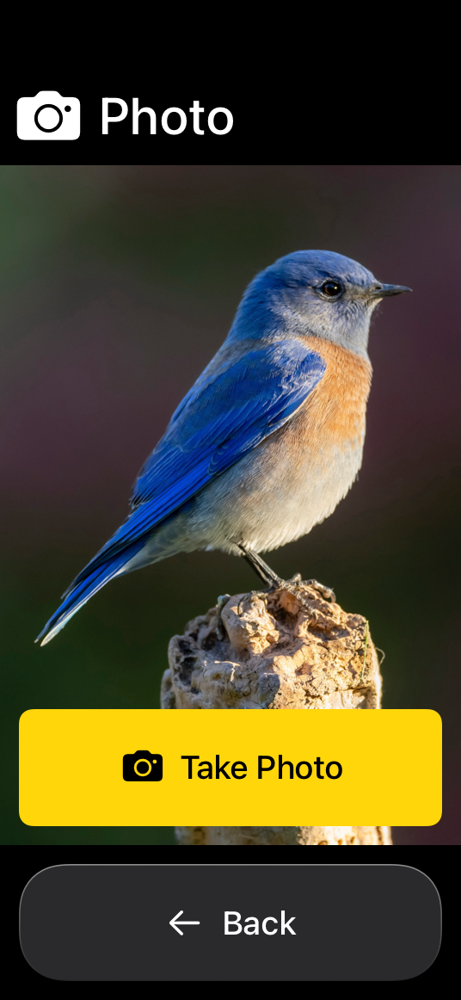

# Accessibility

Accessible user interfaces empower everyone to have a great experience with your app or game.

When you design for accessibility, you reach a larger audience and create a more inclusive experience. An accessible interface allows people to experience your app or game regardless of their capabilities or how they use their devices. Accessibility makes information and interactions available to everyone. An accessible interface is:

- **Intuitive.** Your interface uses familiar and consistent interactions that make tasks straightforward to perform.
- **Perceivable.** Your interface doesn’t rely on any single method to convey information. People can access and interact with your content, whether they use sight, hearing, speech, or touch.
- **Adaptable.** Your interface adapts to how people want to use their device, whether by supporting system accessibility features or letting people personalize settings.

As you design your app, audit the accessibility of your interface. Use [Accessibility Inspector](https://developer.apple.com/documentation/Accessibility/accessibility-inspector) to highlight accessibility issues with your interface and to understand how your app represents itself to people using system accessibility features. You can also communicate how accessible your app is on the App Store using Accessibility Nutrition Labels. To learn more about how to evaluate and indicate accessibility feature support, see [Accessibility Nutrition Labels](https://developer.apple.com/help/app-store-connect/manage-app-accessibility/overview-of-accessibility-nutrition-labels) in App Store Connect help.

## Vision

The people who use your interface may be blind, color blind, or have low vision or light sensitivity. They may also be in situations where lighting conditions and screen brightness affect their ability to interact with your interface.

**Support larger text sizes.** Make sure people can adjust the size of your text or icons to make them more legible, visible, and comfortable to read. Ideally, give people the option to enlarge text by at least 200 percent (or 140 percent in watchOS apps). Your interface can support font size enlargement either through custom UI, or by adopting Dynamic Type. Dynamic Type is a systemwide setting that lets people adjust the size of text for comfort and legibility. For more guidance, see [Supporting Dynamic Type](./typography.md).

**Use recommended defaults for custom type sizes.** Each platform has different default and minimum sizes for system-defined type styles to promote readability. If you’re using custom type styles, follow the recommended defaults.

| Platform | Default size | Minimum size |
| --- | --- | --- |
| iOS, iPadOS | 17 pt | 11 pt |
| macOS | 13 pt | 10 pt |
| tvOS | 29 pt | 23 pt |
| visionOS | 17 pt | 12 pt |
| watchOS | 16 pt | 12 pt |

**Bear in mind that font weight can also impact how easy text is to read.** If you’re using a custom font with a thin weight, aim for larger than the recommended sizes to increase legibility. For more guidance, see [Typography](./typography.md).

**Strive to meet color contrast minimum standards.** To ensure all information in your app is legible, it’s important that there’s enough contrast between foreground text and icons and background colors. Two popular standards of measure for color contrast are the [Web Content Accessibility Guidelines (WCAG)](https://www.w3.org/TR/WCAG/) and the Accessible Perceptual Contrast Algorithm (APCA). Use standard contrast calculators to ensure your UI meets acceptable levels. [Accessibility Inspector](https://developer.apple.com/documentation/Accessibility/accessibility-inspector) uses the following values from WCAG Level AA as guidance in determining whether your app’s colors have an acceptable contrast.

| Text size | Text weight | Minimum contrast ratio |
| --- | --- | --- |
| Up to 17 pts | All | 4.5:1 |
| 18 pts | All | 3:1 |
| All | Bold | 3:1 |

If your app doesn’t provide this minimum contrast by default, ensure it at least provides a higher contrast color scheme when the system setting Increase Contrast is turned on. If your app supports [Dark Mode](./dark-mode.md), make sure to check the minimum contrast in both light and dark appearances.

**Prefer system-defined colors.** These colors have their own accessible variants that automatically adapt when people adjust their color preferences, such as enabling Increase Contrast or toggling between the light and dark appearances. For guidance, see [Color](./color.md).

**Convey information with more than color alone.** Some people have trouble differentiating between certain colors and shades. For example, people who are color blind may have particular difficulty with pairings such as red-green and blue-orange. Offer visual indicators, like distinct shapes or icons, in addition to color to help people perceive differences in function and changes in state. Consider allowing people to customize color schemes such as chart colors or game characters so they can personalize your interface in a way that’s comfortable for them.

**Describe your app’s interface and content for VoiceOver.** VoiceOver is a screen reader that lets people experience your app’s interface without needing to see the screen. For more guidance, see [VoiceOver](./voiceover.md).

## Hearing

The people who use your interface may be deaf or hard of hearing. They may also be in noisy or public environments.

**Support text-based ways to enjoy audio and video.** It’s important that dialogue and crucial information about your app or game isn’t communicated through audio alone. Depending on the context, give people different text-based ways to experience their media, and allow people to customize the visual presentation of that text:

- **Captions** give people the textual equivalent of audible information in video or audio-only content. Captions are great for scenarios like game cutscenes and video clips where text synchronizes live with the media.
- **Subtitles** allow people to read live onscreen dialogue in their preferred language. Subtitles are great for TV shows and movies.
- **Audio descriptions** are interspersed between natural pauses in the main audio of a video and supply spoken narration of important information that’s presented only visually.
- **Transcripts** provide a complete textual description of a video, covering both audible and visual information. Transcripts are great for longer-form media like podcasts and audiobooks where people may want to review content as a whole or highlight the transcript as media is playing.

For developer guidance, see [Selecting subtitles and alternative audio tracks](https://developer.apple.com/documentation/AVFoundation/selecting-subtitles-and-alternative-audio-tracks).

**Use haptics in addition to audio cues.** If your interface conveys information through audio cues — such as a success chime, error sound, or game feedback — consider pairing that sound with matching haptics for people who can’t perceive the audio or have their audio turned off. In iOS and iPadOS, you can also use [Music Haptics](https://developer.apple.com/documentation/MediaAccessibility/music-haptics) and [Audio graphs](https://developer.apple.com/documentation/Accessibility/audio-graphs) to let people experience music and infographics through vibration and texture. For guidance, see [Playing haptics](./playing-haptics.md).

**Augment audio cues with visual cues.** This is especially important for games and spatial apps where important content might be taking place off screen. When using audio to guide people towards a specific action, also add in visual indicators that point to where you want people to interact.

## Mobility

Ensure your interface offers a comfortable experience for people with limited dexterity or mobility.

**Offer sufficiently sized controls.** Controls that are too small are hard for many people to interact with and select. Strive to meet the recommended minimum control size for each platform to ensure controls and menus are comfortable for all when tapping and clicking.

| Platform | Default control size | Minimum control size |
| --- | --- | --- |
| iOS, iPadOS | 44x44 pt | 28x28 pt |
| macOS | 28x28 pt | 20x20 pt |
| tvOS | 66x66 pt | 56x56 pt |
| visionOS | 60x60 pt | 28x28 pt |
| watchOS | 44x44 pt | 28x28 pt |

**Consider spacing between controls as important as size.** Include enough padding between elements to reduce the chance that someone taps the wrong control. In general, it works well to add about 12 points of padding around elements that include a bezel. For elements without a bezel, about 24 points of padding works well around the element’s visible edges.

**Support simple gestures for common interactions.** For many people, with or without disabilities, complex gestures can be challenging. For interactions people do frequently in your app or game, use the simplest gesture possible — avoid custom multifinger and multihand gestures — so repetitive actions are both comfortable and easy to remember.

**Offer alternatives to gestures.** Make sure your UI’s core functionality is accessible through more than one type of physical interaction. Gestures can be less comfortable for people who have limited dexterity, so offer onscreen ways to achieve the same outcome. For example, if you use a swipe gesture to dismiss a view, also make a button available so people can tap or use an assistive device.

**Let people use Voice Control to give guidance and enter information verbally.** With Voice Control, people can interact with their devices entirely by speaking commands. They can perform gestures, interact with screen elements, dictate and edit text, and more. To ensure a smooth experience, label interface elements appropriately. For developer guidance, see [Voice Control](https://developer.apple.com/documentation/Accessibility/voice-control).

**Integrate with Siri and Shortcuts to let people perform tasks using voice alone.** When your app supports Siri and Shortcuts, people can automate the important and repetitive tasks they perform regularly. They can initiate these tasks from Siri, the Action button on their iPhone or Apple Watch, and shortcuts on their Home Screen or in Control Center. For guidance, see [Siri](./siri.md).

**Support mobility-related assistive technologies.** Features like [VoiceOver](./voiceover.md), AssistiveTouch, Full Keyboard Access, Pointer Control, and [Switch Control](https://developer.apple.com/documentation/Accessibility/switch-control) offer alternative ways for people with low mobility to interact with their devices. Conduct testing and verify that your app or game supports these technologies, and that your interface elements are appropriately labeled to ensure a great experience. For more information, see [Performing accessibility testing for your app](https://developer.apple.com/documentation/Accessibility/performing-accessibility-testing-for-your-app).

## Speech

Apple’s accessibility features help people with speech disabilities and people who prefer text-based interactions to communicate effectively using their devices.

**Let people use the keyboard alone to navigate and interact with your app.** People can turn on Full Keyboard Access to navigate apps using their physical keyboard. The system also defines accessibility keyboard shortcuts and a wide range of other [keyboard shortcuts](https://support.apple.com/en-us/102650) that many people use all the time. Avoid overriding system-defined keyboard shortcuts and evaluate your app to ensure it works well with Full Keyboard Access. For additional guidance, see [Keyboards](./keyboards.md). For developer guidance, see [Support Full Keyboard Access in your iOS app](https://developer.apple.com/videos/play/wwdc2021/10120).

**Support Switch Control.** Switch Control is an assistive technology that lets people control their devices through separate hardware, game controllers, or sounds such as a click or a pop. People can perform actions like selecting, tapping, typing, and drawing when your app or game supports the ability to navigate using Switch Control. For developer guidance, see [Switch Control](https://developer.apple.com/documentation/Accessibility/switch-control).

## Cognitive

When you minimize complexity in your app or game, all people benefit.

**Keep actions simple and intuitive.** Ensure that people can navigate your interface using easy-to-remember and consistent interactions. Prefer system gestures and behaviors people are already familiar with over creating custom gestures people must learn and retain.

**Minimize use of time-boxed interface elements.** Views and controls that auto-dismiss on a timer can be problematic for people who need longer to process information, and for people who use assistive technologies that require more time to traverse the interface. Prefer dismissing views with an explicit action.

**Consider offering difficulty accommodations in games.** Everyone has their own way of playing and enjoying games. To support a variety of cognitive abilities, consider adding the ability to customize the difficulty level of your game, such as offering options for people to reduce the criteria for successfully completing a level, adjust reaction time, or enable control assistance.

**Let people control audio and video playback.** Avoid autoplaying audio and video content without also providing controls to start and stop it. Make sure these controls are discoverable and easy to act upon, and consider global settings that let people opt out of auto-playing all audio and video. For developer guidance, see [Animated images](https://developer.apple.com/documentation/Accessibility/animated-images) and [isVideoAutoplayEnabled](https://developer.apple.com/documentation/UIKit/UIAccessibility/isVideoAutoplayEnabled).

**Allow people to opt out of flashing lights in video playback.** People might want to avoid bright, frequent flashes of light in the media they consume. A Dim Flashing Lights setting allows the system to calculate, mitigate, and inform people about flashing lights in a piece of media. If your app supports video playback, ensure that it responds appropriately to the Dim Flashing Lights setting. For developer guidance, see [Flashing lights](https://developer.apple.com/documentation/MediaAccessibility/flashing-lights).

**Be cautious with fast-moving and blinking animations.** When you use these effects in excess, it can be distracting, cause dizziness, and in some cases even result in epileptic episodes. People who are prone to these effects can turn on the Reduce Motion accessibility setting. When this setting is active, ensure your app or game responds by reducing automatic and repetitive animations, including zooming, scaling, and peripheral motion. Other best practices for reducing motion include:

- Tightening animation springs to reduce bounce effects
- Tracking animations directly with people’s gestures
- Avoiding animating depth changes in z-axis layers
- Replacing transitions in x-, y-, and z-axes with fades to avoid motion
- Avoiding animating into and out of blurs

**Optimize your app’s UI for Assistive Access.** Assistive Access is an accessibility feature in iOS and iPadOS that allows people with cognitive disabilities to use a streamlined version of your app. Assistive Access sets a default layout and control presentation for apps that reduces cognitive load, such as the following layout of the Camera app.

To optimize your app for this mode, use the following guidelines when Assistive Access is turned on:

- Identify the core functionality of your app and consider removing noncritical workflows and UI elements.
- Break up multistep workflows so people can focus on a single interaction per screen.
- Always ask for confirmation twice whenever people perform an action that’s difficult to recover from, such a deleting a file.

For developer guidance, see [Assistive Access](https://developer.apple.com/documentation/Accessibility/assistive-access).

## Platform considerations

*No additional considerations for iOS, iPadOS, macOS, tvOS, or watchOS.*

## Resources

#### Related

[Inclusion](./inclusion.md)

[Typography](./typography.md)

[VoiceOver](./voiceover.md)

#### Developer documentation

[Building accessible apps](https://developer.apple.com/accessibility/)

[Accessibility](https://developer.apple.com/documentation/Accessibility)

[Overview of Accessibility Nutrition Labels](https://devcms.apple.com/help/app-store-connect/manage-app-accessibility/overview-of-accessibility-nutrition-labels)

#### Videos

- [Principles of inclusive app design](https://developer.apple.com/videos/play/wwdc2025/316)
- [Evaluate your app for Accessibility Nutrition Labels](https://developer.apple.com/videos/play/wwdc2025/224)
- [Catch up on accessibility in SwiftUI](https://developer.apple.com/videos/play/wwdc2024/10073)

## Change log

| Date | Changes |
| --- | --- |
| June 9, 2025 | Added guidance and links for Assistive Access, Switch Control, and Accessibility Nutrition Labels. |
| March 7, 2025 | Expanded and refined all guidance. Moved Dynamic Type guidance to the Typography page, and moved VoiceOver guidance to a new VoiceOver page. |
| June 10, 2024 | Added a link to Apple’s Unity plug-ins for supporting Dynamic Type. |
| December 5, 2023 | Updated visionOS Zoom lens artwork. |
| June 21, 2023 | Updated to include guidance for visionOS. |
