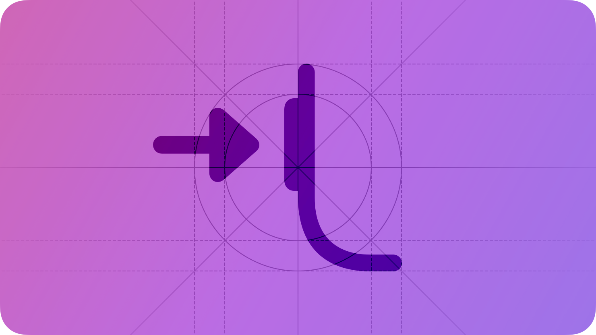

# Action button

The Action button gives people quick access to their favorite features on supported iPhone and Apple Watch models.

On a supported device, people can use the Action button to run [App Shortcuts](./app-shortcuts.md) or access system-provided functionality, like turning the flashlight on or off. On Apple Watch Ultra, the Action button supports activity-related actions, including workouts and dives.

A person chooses a function for the Action button when they set up their device; later, they can adjust this choice in Settings. When someone associates an App Shortcut with the Action button, pressing the button runs the App Shortcut similarly to using their voice with Siri or tapping it in Spotlight.

When designing your app or game, think of the Action button as another way for someone to quickly access a function that they use on a regular basis.

## Best practices

**Support the Action button with a set of your app’s essential functions.** For example, if your cooking app includes an egg timer, a “Start Egg Timer” action might be one that people want to initiate when they press the Action button. You don’t need to offer an App Shortcut that opens your app, because the system provides this function already. Your app icon, widgets, and Apple Watch complications give people other quick ways to open your app. For additional guidance, see [App Shortcuts](./app-shortcuts.md).

**For each action you support, write a short label that succinctly describes it.** People see your labels when they visit Settings to configure the Action button’s behavior. Create labels that use [title-style capitalization](https://support.apple.com/guide/applestyleguide/c-apsgb744e4a3/web#apdca93e113f1d64), begin with a verb, use present tense, and exclude articles and prepositions. Keep labels as short as possible, with a maximum of three words. For example, use “Start Race” instead of “Started Race” or “Start the Race.”

**Prefer letting the system show people how to use the Action button with your app.** When you support the Action button, the system automatically helps people configure it to initiate one of your app’s functions. Avoid creating content that repeats the guidance offered in Settings for the Action button, or other usage tips the system provides.

## Platform considerations

*Not supported in iPadOS, macOS, tvOS, or visionOS.*

### iOS

**Let people use your actions without leaving their current context.** When possible, make use of lightweight multitasking capabilities like [Live Activities](./live-activities.md) and custom snippets to provide functionality without opening your app. For example, the “Set Timer” action doesn’t launch the Clock app; it prompts people to set a duration for the timer, and then launches a Live Activity with the countdown.

## Resources

#### Related

[Workouts](./workouts.md)

[Digital Crown](./digital-crown.md)

[App Shortcuts](./app-shortcuts.md)

[Live Activities](./live-activities.md)

## Change log

| Date | Changes |
| --- | --- |
| September 12, 2023 | Updated to include guidance for iOS. |
| September 14, 2022 | New page. |
