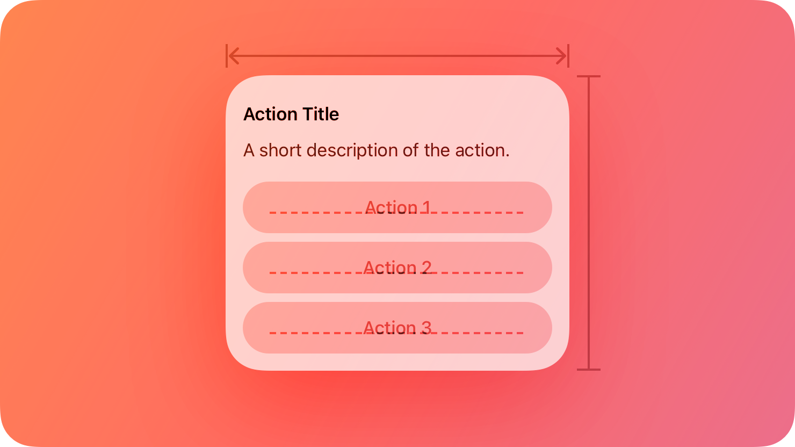
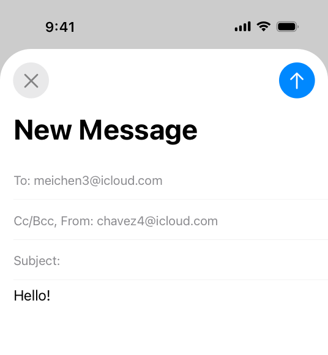
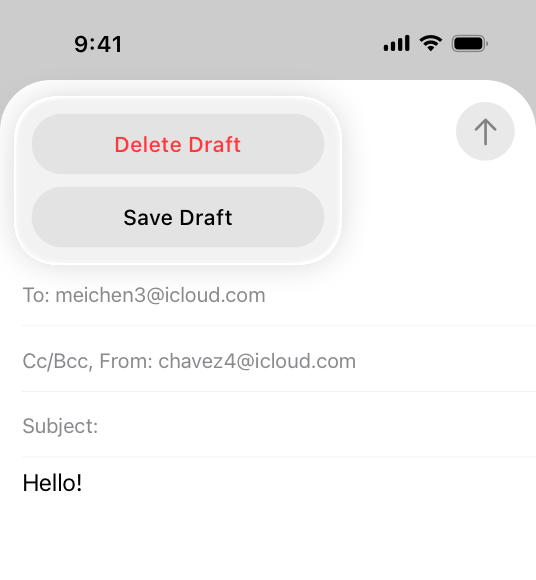

# Action sheets

An action sheet is a modal view that presents choices related to an action people initiate.

> **Note:**
> When you use SwiftUI, you can offer action sheet functionality in all platforms by specifying a [presentation modifier](https://developer.apple.com/documentation/swiftui/view-presentation) for a confirmation dialog. If you use UIKit, you use the [UIAlertController.Style.actionSheet](https://developer.apple.com/documentation/UIKit/UIAlertController/Style/actionSheet) to display an action sheet in iOS, iPadOS, and tvOS.

## Best practices

**Use an action sheet — not an alert — to offer choices related to an intentional action.** For example, when people cancel the message they’re editing in Mail on iPhone, an action sheet provides two choices: delete the draft, or save the draft. Although an alert can also help people confirm or cancel an action that has destructive consequences, it doesn’t provide additional choices related to the action. More importantly, an alert is usually unexpected, generally telling people about a problem or a change in the current situation that might require them to act. For guidance, see [Alerts](./alerts.md).

**Use action sheets sparingly.** Action sheets give people important information and choices, but they interrupt the current task to do so. To encourage people to pay attention to action sheets, avoid using them more than necessary.

**Aim to keep titles short enough to display on a single line.** A long title is difficult to read quickly and might get truncated or require people to scroll.

**Provide a message only if necessary.** In general, the title — combined with the context of the current action — provides enough information to help people understand their choices.

**If necessary, provide a Cancel button that lets people reject an action that might destroy data.** Place the Cancel button at the bottom of the action sheet (or in the upper-left corner of the sheet in watchOS). A SwiftUI confirmation dialog includes a Cancel button by default.

**Make destructive choices visually prominent.** Use the destructive style for buttons that perform destructive actions, and place these buttons at the top of the action sheet where they tend to be most noticeable. For developer guidance, see [destructive](https://developer.apple.com/documentation/SwiftUI/ButtonRole/destructive) (SwiftUI) or [UIAlertAction.Style.destructive](https://developer.apple.com/documentation/UIKit/UIAlertAction/Style-swift.enum/destructive) (UIKit).

## Platform considerations

*No additional considerations for macOS or tvOS. Not supported in visionOS.*

### iOS, iPadOS

**Use an action sheet — not a menu — to provide choices related to an action.** People are accustomed to having an action sheet appear when they perform an action that might require clarifying choices. In contrast, people expect a menu to appear when they choose to reveal it.

**Avoid letting an action sheet scroll.** The more buttons an action sheet has, the more time and effort it takes for people to make a choice. Also, scrolling an action sheet can be hard to do without inadvertently tapping a button.

## Resources

#### Related

[Modality](./modality.md)

[Sheets](./sheets.md)

[Alerts](./alerts.md)

#### Developer documentation

[confirmationDialog(_:isPresented:titleVisibility:actions:)](https://developer.apple.com/documentation/SwiftUI/View/confirmationDialog(_:isPresented:titleVisibility:actions:)-46zbb) — SwiftUI

[UIAlertController.Style.actionSheet](https://developer.apple.com/documentation/UIKit/UIAlertController/Style/actionSheet) — UIKit
