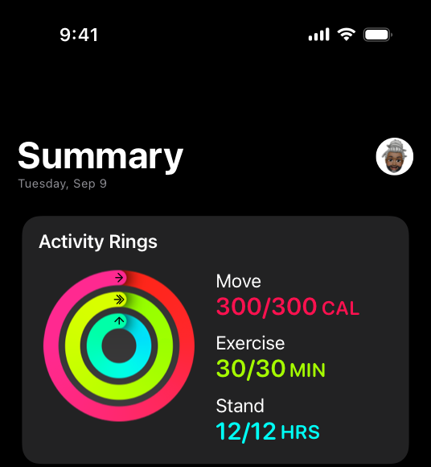
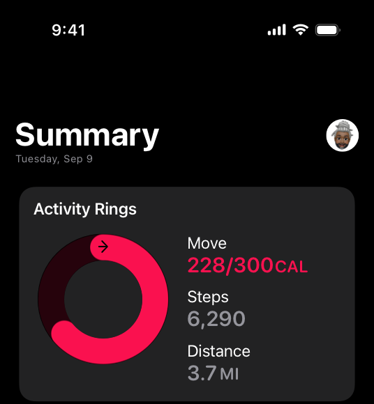

# Activity rings

Activity rings show an individual’s daily progress toward Move, Exercise, and Stand goals.

In watchOS, the Activity ring element always contains three rings, whose colors and meanings match those the Activity app provides. In iOS, the Activity ring element contains either a single Move ring representing an approximation of activity, or all three rings if an Apple Watch is paired.

## Best practices

**Display Activity rings when they’re relevant to the purpose of your app.** If your app is related to health or fitness, and especially if it contributes information to HealthKit, people generally expect to find Activity rings in your interface. For example, if you structure a workout or health session around the completion of Activity rings, consider displaying the element on a workout metrics screen so that people can track their progress during their session. Similarly, if you provide a summary screen that appears at the conclusion of a workout, you could display Activity rings to help people check on their progress toward their daily goals.

**Use Activity rings only to show Move, Exercise, and Stand information.** Activity rings are designed to consistently represent progress in these specific areas. Don’t replicate or modify Activity rings for other purposes. Never use Activity rings to display other types of data. Never show Move, Exercise, and Stand progress in another ring-like element.

**Use Activity rings to show progress for a single person.** Never use Activity rings to represent data for more than one person, and make sure it’s obvious whose progress you’re showing by using a label, a photo, or an avatar.

**Always keep the visual appearance of Activity rings the same, regardless of where you display them.** Follow these guidelines to provide a consistent experience:

- Never change the colors of the rings; for example, don’t use filters or modify opacity.
- Always display Activity rings on a black background.
- Prefer enclosing the rings and background within a circle. To do this, adjust the corner radius of the enclosing view rather than applying a circular mask.
- Ensure that the black background remains visible around the outermost ring. If necessary, add a thin, black stroke around the outer edge of the ring, and avoid including a gradient, shadow, or any other visual effect.
- Always scale the rings appropriately so they don’t seem disconnected or out of place.
- When necessary, design the surrounding interface to blend with the rings; never change the rings to blend with the surrounding interface.

**To display a label or value that’s directly associated with an Activity ring, use the colors that match it.** To display the ring-specific labels *Move*, *Exercise*, and *Stand*, or to display a person’s current and goal values for each ring, use the following colors, specified as RGB values.

| Move | Exercise | Stand |
| --- | --- | --- |
|  |  |  |

**Maintain Activity ring margins.** An Activity ring element must include a minimum outer margin of no less than the distance between rings. Never allow other elements to crop, obstruct, or encroach upon this margin or the rings themselves.

**Differentiate other ring-like elements from Activity rings.** Mixing different ring styles can lead to a visually confusing interface. If you must include other rings, use padding, lines, or labels to separate them from Activity rings. Color and scale can also help provide visual separation.

**Don’t send notifications that repeat the same information the Activity app sends.** The system already delivers Move, Exercise, and Stand progress updates, so it’s confusing for people to receive redundant information from your app. Also, don’t show an Activity ring element in your app’s notifications. It’s fine to reference Activity progress in a notification, but do so in a way that’s unique to your app and doesn’t replicate the same information the system provides.

**Don’t use Activity rings for decoration.** Activity rings provide information to people; they don’t just embellish your app’s design. Never display Activity rings in labels or background graphics.

**Don’t use Activity rings for branding.** Use Activity rings strictly to display Activity progress in your app. Never use Activity rings in your app’s icon or marketing materials.

## Platform considerations

*No additional considerations for iPadOS or watchOS. Not supported in macOS, tvOS, or visionOS.*

### iOS

Activity rings are available in iOS with [HKActivityRingView](https://developer.apple.com/documentation/HealthKitUI/HKActivityRingView). The appearance of the Activity ring element changes automatically depending on whether an Apple Watch is paired:

- With an Apple Watch paired, iOS shows all three Activity rings.
- Without an Apple Watch paired, iOS shows the Move ring only, which represents an approximation of a person’s activity based on their steps and workout information from other apps.

Because iOS shows Activity rings whether or not an Apple Watch is paired, activity history can include a combination of both styles. For example, Activity rings in Fitness have three rings when a person exercises with their Apple Watch paired, and only the Move ring when they exercise without their Apple Watch.

## Resources

#### Related

[Workouts](./workouts.md)

#### Developer documentation

[HKActivityRingView](https://developer.apple.com/documentation/HealthKitUI/HKActivityRingView) — HealthKit

#### Videos

- [Track workouts with HealthKit on iOS and iPadOS](https://developer.apple.com/videos/play/wwdc2025/322)
- [Build a workout app for Apple Watch](https://developer.apple.com/videos/play/wwdc2021/10009)
- [Build custom workouts with WorkoutKit](https://developer.apple.com/videos/play/wwdc2023/10016)

## Change log

| Date | Changes |
| --- | --- |
| March 29, 2024 | Enhanced guidance for displaying Activity rings and listed specific colors for displaying related content. |
| December 5, 2023 | Added artwork representing Activity rings in iOS. |
