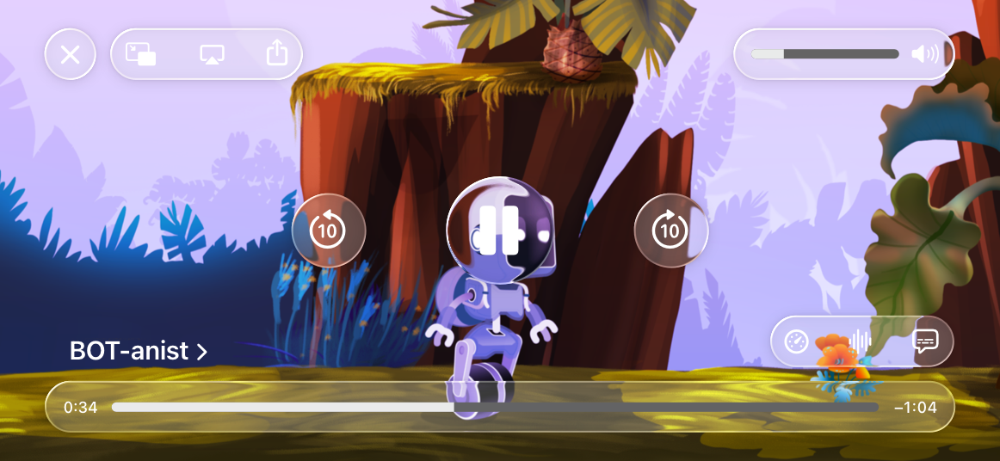

# AirPlay

AirPlay lets people stream media content wirelessly from iOS, iPadOS, macOS, and tvOS devices to Apple TV, HomePod, and TVs and speakers that support AirPlay.

## Best practices

**Prefer the system-provided media player.** The built-in media player offers a standard set of controls and supports features like chapter navigation, subtitles, closed captioning, and AirPlay streaming. It’s also easy to implement, provides a consistent and familiar playback experience across the system, and accommodates the needs of most media apps. Consider designing a custom video player only if the system-provided player doesn’t meet your app’s needs. For developer guidance, see [AVPlayerViewController](https://developer.apple.com/documentation/AVKit/AVPlayerViewController).

**Provide content in the highest possible resolution.** Your [HTTP Live Streaming](https://developer.apple.com/documentation/http-live-streaming) (HLS) playlist needs to include the full range of available resolutions so that people can experience your content in the resolution that’s appropriate for the device they’re using (AVFoundation automatically selects the resolution based on the device). If you don’t include a range of resolutions, your content looks low quality when people stream it to a device that can play at higher resolutions. For example, content that looks great on iPhone at 720p will look low quality when people use AirPlay to stream it to a 4K TV.

**Stream only the content people expect.** Avoid streaming content like background loops and short video experiences that make sense only within the context of the app itself. For developer guidance, see [usesExternalPlaybackWhileExternalScreenIsActive](https://developer.apple.com/documentation/AVFoundation/AVPlayer/usesExternalPlaybackWhileExternalScreenIsActive).

**Support both AirPlay streaming and mirroring.** Supporting both features gives people the most flexibility.

**Support remote control events.** When you do, people can choose actions like play, pause, and fast forward on the lock screen, and through interaction with Siri or HomePod. For developer guidance, see [Remote command center events](https://developer.apple.com/documentation/MediaPlayer/remote-command-center-events).

**Don’t stop playback when your app enters the background or when the device locks.** For example, people expect the TV show they started streaming from your app to continue while they check their mail or put their device to sleep. In this type of scenario, it’s also crucial to avoid automatic mirroring because people don’t want to stream other content on their device without explicitly choosing to do so.

**Don’t interrupt another app’s playback unless your app is starting to play immersive content.** For example, if your app plays a video when it launches or auto-plays inline videos, play this content on only the local device, while allowing current playback to continue. For developer guidance, see [ambient](https://developer.apple.com/documentation/AVFAudio/AVAudioSession/Category-swift.struct/ambient).

**Let people use other parts of your app during playback.** When AirPlay is active, your app needs to remain functional. If people navigate away from the playback screen, make sure other in-app videos don’t begin playing and interrupt the streaming content.

**If necessary, provide a custom interface for controlling media playback.** If you can’t use the system-provided media player, you can create a custom media player that gives people an intuitive way to enter AirPlay. If you need to do this, be sure to provide custom buttons that match the appearance and behavior of the system-provided ones, including distinct visual states that indicate when playback starts, is occurring, or is unavailable. Use only Apple-provided symbols in custom controls that initiate AirPlay, and position the AirPlay icon correctly in your custom player — that is, in the lower-right corner (in iOS 16 and iPadOS 16 and later).

## Using AirPlay icons

You can download AirPlay icons in [Resources](https://developer.apple.com/design/resources/). You have the following options for displaying the AirPlay icon in your app.

### Black AirPlay icon

Use the black AirPlay icon on white or light backgrounds when other technology icons also appear in black.

### White AirPlay icon

Use the white AirPlay icon on black or dark backgrounds when other technology icons also appear in white.

### Custom color AirPlay icon

Use a custom color when other technology icons also appear in the same color.

**Position the AirPlay icon consistently with other technology icons.** If you display other technology icons within shapes, you can display the AirPlay icon in the same manner.

**Don’t use the AirPlay icon or name in custom buttons or interactive elements.** Use the icon and the name *AirPlay* only in noninteractive ways.

**Pair the icon with the name *AirPlay* correctly.** You can show the name below or beside the icon if you also reference other technologies in this way. Use the same font you use in the rest of your layout. Avoid using the AirPlay icon within text or as a replacement for the name *AirPlay*.

**Emphasize your app over AirPlay.** Make references to AirPlay less prominent than your app name or main identity.

## Referring to AirPlay

**Use correct capitalization when using the term *AirPlay*.** *AirPlay* is one word, with an uppercase *A* and uppercase *P*, each followed by lowercase letters. If your layout displays only all-uppercase designations, you can typeset *AirPlay* in all uppercase to match the style of the rest of the layout.

**Always use *AirPlay* as a noun.**

|  | Example text |
| --- | --- |
|  | Use AirPlay to listen on your speaker |
|  | AirPlay to your speaker |
|  | You can AirPlay with [App Name] |

**Use terms like *works with*, *use*, *supports*, and *compatible*.**

|  | Example text |
| --- | --- |
|  | [App Name] is compatible with AirPlay |
|  | AirPlay-enabled speaker |
|  | You can use AirPlay with [App Name] |
|  | [App Name] has AirPlay |

**Use the name *Apple* with the name *AirPlay* if desired.**

|  | Example text |
| --- | --- |
|  | Compatible with Apple AirPlay |

**Refer to AirPlay if appropriate and to add clarity.** If your content is specific to AirPlay, you can use Airplay to make that clear. You can also refer to AirPlay in technical specifications.

|  | Example text |
| --- | --- |
|  | [App Name] now supports AirPlay |

## Platform considerations

*No additional considerations for iOS, iPadOS, macOS, tvOS, or visionOS. Not supported in watchOS.*

## Resources

#### Related

[Resources](https://developer.apple.com/design/resources/)

[Apple Trademark List](https://www.apple.com/legal/intellectual-property/trademark/appletmlist.html)

[Guidelines for Using Apple Trademarks and Copyrights](https://www.apple.com/legal/intellectual-property/guidelinesfor3rdparties.html)

#### Developer documentation

[AVFoundation](https://developer.apple.com/documentation/AVFoundation)

[AVKit](https://developer.apple.com/documentation/AVKit)

#### Videos

- [Reaching the Big Screen with AirPlay 2](https://developer.apple.com/videos/play/wwdc2019/501)

## Change log

| Date | Changes |
| --- | --- |
| May 2, 2023 | Consolidated guidance into one page. |
