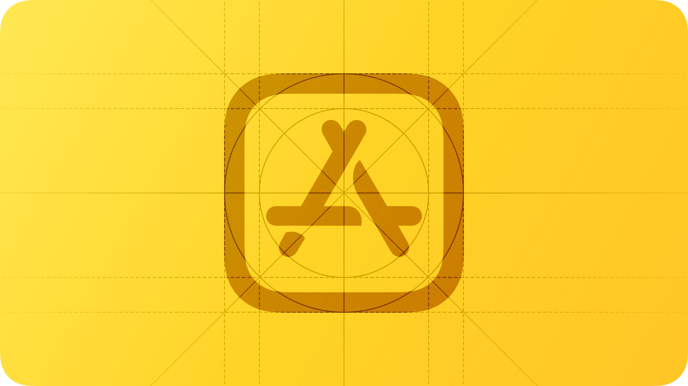
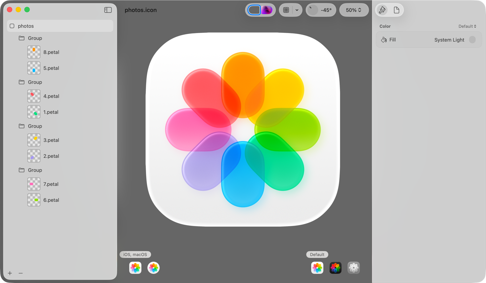
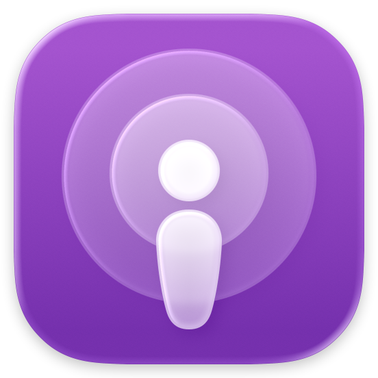
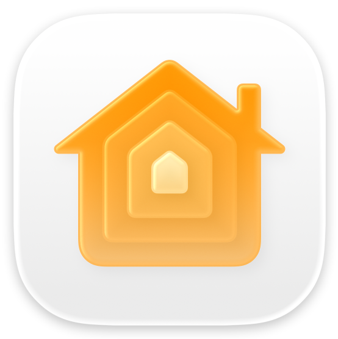
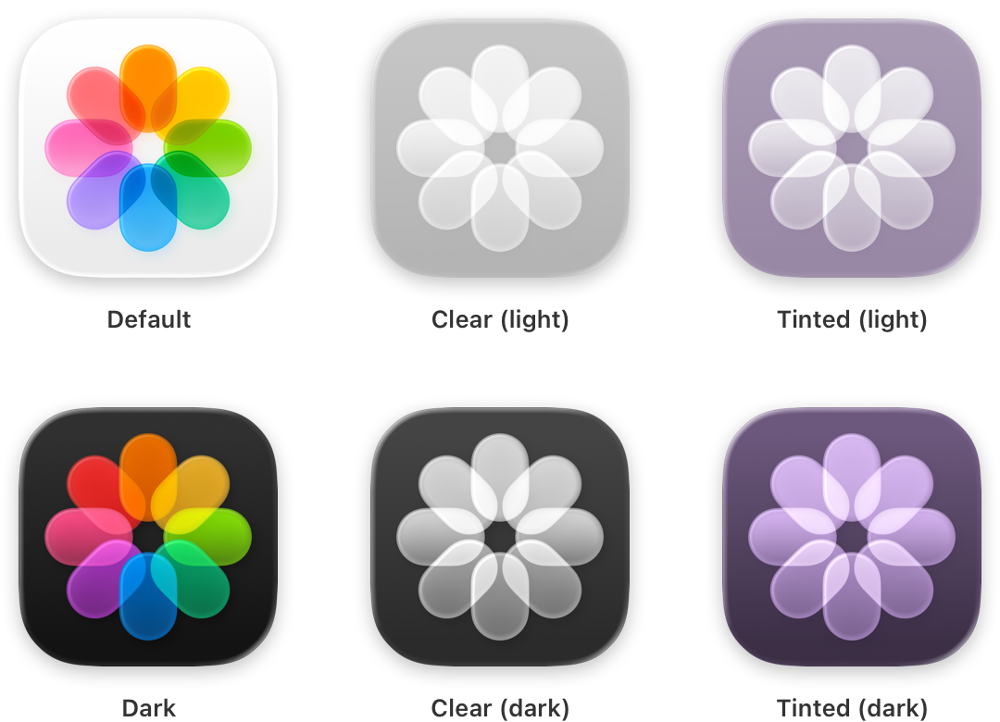

# App icons

A unique, memorable icon expresses your app’s or game’s purpose and personality and helps people recognize it at a glance.

Your app icon is a crucial aspect of your app’s or game’s branding and user experience. It appears on the Home Screen and in key locations throughout the system, including search results, notifications, system settings, and share sheets. A well-designed app icon conveys your app’s or game’s identity clearly and consistently across all Apple platforms.

## Layer design

Although you can provide a flattened image for your icon, layers give you the most control over how your icon design is represented. A layered app icon comes together to produce a sense of depth and vitality. On each platform, the system applies visual effects that respond to the environment and people’s interactions.

iOS, iPadOS, macOS, and watchOS app icons include a background layer and one or more foreground layers that coalesce to create dimensionality. These icons take on Liquid Glass attributes like specular highlights, frostiness, and translucency, which respond to changes in lighting and, in iOS and iPadOS, device movement.

tvOS app icons use between two and five layers to create a sense of dynamism as people bring them into focus. When focused, the app icon elevates to the foreground in response to someone’s finger movement on their remote, and gently sways while the surface illuminates. The separation between layers and the use of transparency produce a feeling of depth during the parallax effect.

A visionOS app icon includes a background layer and one or two layers on top, producing a three-dimensional object that subtly expands when people view it. The system enhances the icon’s visual dimensionality by adding shadows that convey a sense of depth between layers and by using the alpha channel of the upper layers to create an embossed appearance.

You use your favorite design tool to craft the individual foreground layers of your app icon. For iOS, iPadOS, macOS, and watchOS icons, you then import your icon layers into Icon Composer, a design tool included with Xcode and available from the [Apple Developer website](https://developer.apple.com/icon-composer). In Icon Composer, you define the background layer for your icon, adjust your foreground layer placement, apply visual effects like transparency, define default, dark, clear, and tinted appearance variants, and export your icon for use in Xcode. For additional guidance, see [Creating your app icon using Icon Composer](https://developer.apple.com/documentation/Xcode/creating-your-app-icon-using-icon-composer).

For tvOS and visionOS app icons, you add your icon layers directly to an image stack in Xcode to form your complete icon. For developer guidance, see [Configuring your app icon using an asset catalog](https://developer.apple.com/documentation/Xcode/configuring-your-app-icon).

**Prefer clearly defined edges in foreground layers.** To ensure system-drawn highlights and shadows look best, avoid soft and feathered edges on foreground layer shapes.

**Vary opacity in foreground layers to increase the sense of depth and liveliness.** For example, the Photos icon separates its centerpiece into multiple layers that contain translucent pieces, bringing greater dynamism to the design. Importing fully opaque layers and adjusting transparency in Icon Composer lets you preview and make adjustments to your design based on how transparency and system effects impact one another.

**Design a background that both stands out and emphasizes foreground content.** Subtle top-to-bottom, light-to-dark gradients tend to respond well to system lighting effects. Icon Composer supports solid colors and gradients for background layers, making it unnecessary to import custom background images in most cases. If you do import a background layer, make sure it’s full-bleed and opaque.

**Prefer vector graphics when bringing layers into Icon Composer.** Unlike raster images, vector graphics (such as SVG or PDF) scale gracefully and appear crisp at any size. Outline artwork and convert text to outline in your design. For mesh gradients and raster artwork, prefer PNG format because it’s a lossless image format.

## Icon shape

An app icon’s shape varies based on a platform’s visual language. In iOS, iPadOS, and macOS, icons are square, and the system applies masking to produce rounded corners that precisely match the curvature of other rounded interface elements throughout the system and the bezel of the physical device itself. In tvOS, icons are rectangular, also with concentric edges. In visionOS and watchOS, icons are square and the system applies circular masking.

**Produce appropriately shaped, unmasked layers.** The system masks all layer edges to produce an icon’s final shape. For iOS, iPadOS, and macOS icons, provide square layers so the system can apply rounded corners. For visionOS and watchOS, provide square layers so the system can create the circular icon shape. For tvOS, provide rectangular layers so the system can apply rounded corners. Providing layers with pre-defined masking negatively impacts specular highlight effects and makes edges look jagged.

**Keep primary content centered to avoid truncation when the system adjusts corners or applies masking.** Pay particular attention to centering content in visionOS and watchOS icons. To help with icon placement, use the grids in the app icon production templates, which you can find in [Apple Design Resources](https://developer.apple.com/design/resources/).

## Design

Embrace simplicity in your icon design. Simple icons tend to be easiest for people to understand and recognize. An icon with fine visual features might look busy when rendered with system-provided shadows and highlights, and details may be hard to discern at smaller sizes. Find a concept or element that captures the essence of your app or game, make it the core idea of your icon, and express it in a simple, unique way with a minimal number of shapes. Prefer a simple background, such as a solid color or gradient, that puts the emphasis on your primary design — you don’t need to fill the entire icon canvas with content.

**Provide a visually consistent icon design across all the platforms your app supports.** A consistent design helps people quickly find your app wherever it appears and prevents people from mistaking your app for multiple apps.

**Consider basing your icon design around filled, overlapping shapes.** Overlapping solid shapes in the foreground, particularly when paired with transparency and blurring, can give an icon a sense of depth.

**Include text only when it’s essential to your experience or brand.** Text in icons doesn’t support accessibility or localization, is often too small to read easily, and can make an icon appear cluttered. In some contexts, your app name already appears nearby, making it redundant to display the name within the icon itself. Although displaying a mnemonic like the first letter of your app’s name can help people recognize your app or game, avoid including nonessential words that tell people what to do with it — like “Watch” or “Play” — or context-specific terms like “New” or “For visionOS.” If you include text in a tvOS app icon, make sure it’s above other layers so it’s not cropped by the parallax effect.

**Prefer illustrations to photos and avoid replicating UI components.** Photos are full of details that don’t work well when displayed in different appearances, viewed at small sizes, or split into layers. Instead of using photos, create a graphic representation of the content that emphasizes the features you want people to notice. Similarly, if your app has an interface that people recognize, don’t just replicate standard UI components or use app screenshots in your icon.

**Don’t use replicas of Apple hardware products.** Apple products are copyrighted and can’t be reproduced in your app icons.

## Visual effects

**Let the system handle blurring and other visual effects.** The system dynamically applies visual effects to your app icon layers, so there’s no need to include specular highlights, drop shadows between layers, beveled edges, blurs, glows, and other effects. In addition to interfering with system-provided effects, custom effects are static, whereas the system supplies dynamic ones. If you do include custom visual effects on your icon layers, use them intentionally and test carefully with Icon Composer, in Simulator, or on device to make sure they appear as expected and don’t conflict with system effects.

**Create layer groupings to apply effects to multiple layers at once.** System effects typically occur on individual layers. If it makes sense for your design, however, you can group several layers together in Icon Composer or your design tool so effects occur at the group level.

## Appearances

In iOS, iPadOS, and macOS, people can choose whether their Home Screen app icons are default, dark, clear, or tinted in appearance. For example, someone may want to personalize their app icon appearance to complement their wallpaper. You can design app icon variants for every appearance variant, and the system automatically generates variants you don’t provide.

**Keep your icon’s features consistent across appearances.** To create a seamless experience, keep your icon’s core visual features the same in the default, dark, clear, and tinted appearances. Avoid creating custom icon variants that swap elements in and out with each variant, which may make it harder for people to find your app when they switch appearances.

**Design dark and tinted icons that feel at home beside system app icons and widgets.** You can preserve the color palette of your default icon, but be mindful that dark icons are more subdued, and clear and tinted icons are even more so. A great app icon is visible, legible, and recognizable, regardless of its appearance variant.

**Use your light app icon as the basis for your dark icon.** Choose complementary colors that reflect the default design, and avoid excessively bright images. Color backgrounds generally offer the greatest contrast in dark icons. For guidance, see [Dark Mode](./dark-mode.md).

**Consider offering alternate app icons.** In iOS, iPadOS, tvOS, and compatible apps running in visionOS, it’s possible to let people visit your app’s settings to choose an alternate version of your app icon. For example, a sports app might offer icons for different teams, letting someone choose their favorite. If you offer this capability, make sure each icon you design remains closely related to your content and experience. Avoid creating one someone might mistake for another app.

> **Note:**
> Alternate app icons in iOS and iPadOS require their own dark, clear, and tinted variants. As with your default app icon, all alternate and variant icons are subject to app review and must adhere to the [App Review Guidelines](https://developer.apple.com/app-store/review/guidelines/#design).

## Platform considerations

*No additional considerations for iOS, iPadOS, or macOS.*

## Specifications

The layout, size, style, and appearances of app icons vary by platform.

| Platform | Layout shape | Icon shape after system masking | Layout size | Style | Appearances |
| --- | --- | --- | --- | --- | --- |
| iOS, iPadOS, macOS | Square | Rounded rectangle (square) | 1024x1024 px | Layered | Default, dark, clear light, clear dark, tinted light, tinted dark |
| tvOS | Rectangle (landscape) | Rounded rectangle (rectangular) | 800x480 px | Layered (Parallax) | N/A |
| visionOS | Square | Circular | 1024x1024 px | Layered (3D) | N/A |
| watchOS | Square | Circular | 1088x1088 px | Layered | N/A |

The system automatically scales your icon to produce smaller variants that appear in certain locations, such as Settings and notifications.

App icons support the following color spaces:

- sRGB (color)
- Gray Gamma 2.2 (grayscale)
- Display P3 (wide-gamut color in iOS, iPadOS, macOS, tvOS, and watchOS only)

## Resources

#### Related

[Apple Design Resources](https://developer.apple.com/design/resources/)

[Icon Composer](https://developer.apple.com/icon-composer/)

[Icons](./icons.md)

[Images](./images.md)

[Dark Mode](./dark-mode.md)

#### Developer documentation

[Creating your app icon using Icon Composer](https://developer.apple.com/documentation/Xcode/creating-your-app-icon-using-icon-composer)

[Configuring your app icon using an asset catalog](https://developer.apple.com/documentation/Xcode/configuring-your-app-icon)

#### Videos

- [Say hello to the new look of app icons](https://developer.apple.com/videos/play/wwdc2025/220)
- [Create icons with Icon Composer](https://developer.apple.com/videos/play/wwdc2025/361)

## Change log

| Date | Changes |
| --- | --- |
| June 9, 2025 | Updated guidance to reflect layered icons, consistency across platforms, and best practices for Liquid Glass. |
| June 10, 2024 | Added guidance for creating dark and tinted app icon variants for iOS and iPadOS. |
| January 31, 2024 | Clarified platform availability for alternate app icons. |
| June 21, 2023 | Updated to include guidance for visionOS. |
| September 14, 2022 | Added specifications for Apple Watch Ultra. |
