# Apple Pay

Apple Pay is a secure, easy way to make payments for physical goods and services — as well as donations and subscriptions — in apps running on iPhone, iPad, Mac, Apple Vision Pro, Apple Watch, on websites, and on any browser.

People authorize payments and provide shipping and contact information, using credentials that are securely stored on the device.

> **Tip:**
> It’s important to understand the difference between Apple Pay and [In-app purchase](./in-app-purchase.md). Use Apple Pay in your app to sell physical goods like groceries, clothing, and appliances; for services such as club memberships, hotel reservations, and tickets for events; and for donations. Use In-App Purchase in your app to sell virtual goods, such as premium content for your app, and subscriptions for digital content.

Apps and websites that accept Apple Pay display it as an available payment option, and include an Apple Pay button in the purchasing flow that people tap to bring up a payment sheet. During checkout, the payment sheet can show the credit or debit card linked to Apple Pay, purchase amount (including tax and fees), shipping options, and contact information. People make any necessary adjustments and then authorize payment and complete the purchase. For developer guidance, see [Apple Pay](https://developer.apple.com/documentation/PassKit/apple-pay).

All websites that offer Apple Pay must include a privacy statement and adhere to the [Acceptable use guidelines for Apple Pay on the web](https://developer.apple.com/apple-pay/acceptable-use-guidelines-for-websites/). For developer guidance, see [Apple Pay on the Web](https://developer.apple.com/documentation/ApplePayontheWeb). For a hands-on demo of Apple Pay on the web, see [Apple Pay on the web interactive demo](https://applepaydemo.apple.com).

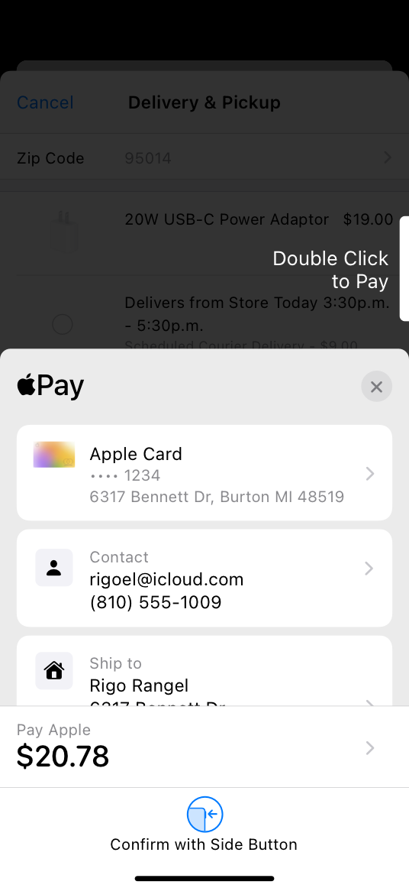

The device performs payment authentication in most cases where the device supports Face ID, Touch ID, or Optic ID. In some cases, the system transfers payment authentication to a nearby iPhone, iPad, or Apple Watch via a secure Bluetooth connection or a scannable code.

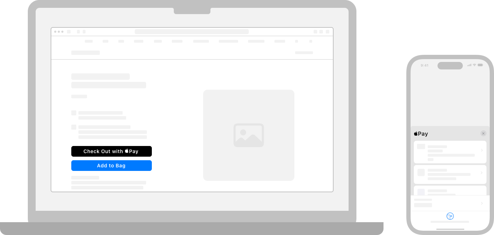

## Offering Apple Pay

**Offer Apple Pay on all devices and browsers that support it.** If the device doesn’t support Apple Pay, don’t present Apple Pay as a payment option. Use Apple Pay APIs to evaluate when a device can support Apple Pay. For developer guidance, see [PKPaymentAuthorizationController](https://developer.apple.com/documentation/PassKit/PKPaymentAuthorizationController) (iOS, watchOS) and [canMakePayments](https://developer.apple.com/documentation/ApplePayontheWeb/ApplePaySession/canMakePayments) (web).

**If you use Apple Pay APIs to find out whether someone has an active card in Wallet, you must make Apple Pay the primary — but not necessarily sole — payment option everywhere you use the APIs.** For example, you might pre-select Apple Pay as the payment option when you display it alongside other options. For developer guidance, see [Offering Apple Pay in Your App](https://developer.apple.com/documentation/PassKit/offering-apple-pay-in-your-app) (iOS, watchOS) and [Checking for Apple Pay availability](https://developer.apple.com/documentation/ApplePayontheWeb/checking-for-apple-pay-availability) (web).

**If you also offer other payment methods, offer Apple Pay at the same time.** Feature Apple Pay at least as prominently as the other options on every page or screen that offers or accepts payment methods.

**If you use an Apple Pay button to start the Apple Pay payment process, you must use the Apple-provided API to display it.** Unlike a button graphic, the buttons produced by the API always have the correct appearance and are localized automatically.

**If you use a custom button to start the Apple Pay payment process, make sure your custom button doesn’t display “Apple Pay” or the Apple Pay logo.** In this scenario, you must let people know that you accept Apple Pay by displaying the Apple Pay mark or referencing Apple Pay in text on the same page that displays your payment button.

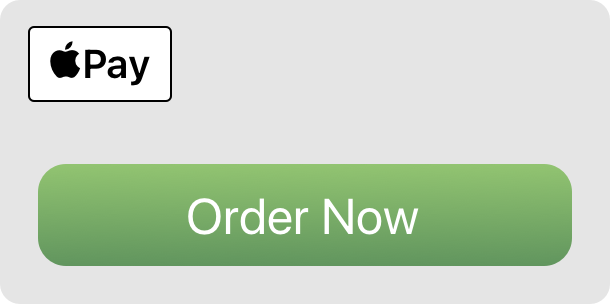

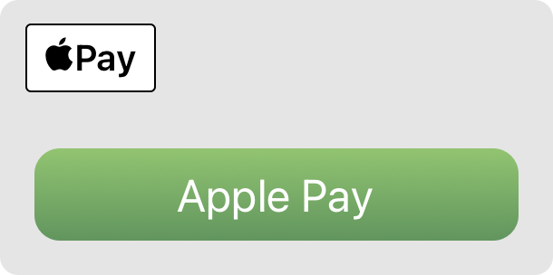

**Use Apple Pay buttons only to start the Apple Pay payment process and, when appropriate, the Apple Pay set-up process.** When people choose an Apple Pay button to make a purchase, but their device doesn’t have Apple Pay set up, they’re given the opportunity to set up Apple Pay. Don’t use Apple Pay buttons in any other ways.

**Don’t hide an Apple Pay button or make it appear unavailable.** If an Apple Pay button can’t be used yet, such as when a product size or color hasn’t been selected, gracefully point out the problem after someone taps or clicks the button.

**Use the Apple Pay mark only to communicate that Apple Pay is accepted.** The Apple Pay mark doesn’t facilitate payment. Never use it as a payment button or position it as a button. When using the Apple Pay mark to indicate Apple Pay as the selected payment method, you can create a separate custom button conforming to your app’s design to initiate the Apple Pay payment.

**Inform search engines that Apple Pay is accepted on your website.** If your website uses semantic markup to provide product details to search engines, list Apple Pay as a payment option.

For app developer guidance, see [Apple Pay](https://developer.apple.com/documentation/PassKit/apple-pay). For website developer guidance, including how to determine whether Apple Pay on the web is available, see [Apple Pay on the Web](https://developer.apple.com/documentation/ApplePayontheWeb).

## Streamlining checkout

**Provide a cohesive checkout experience.** It’s best when the entire checkout flow feels tightly integrated with your app or website. To strengthen people’s perception of integration, use your branding throughout the checkout experience and avoid opening different pages or windows. For website checkout flows in particular, opening new windows during the process can cause confusion and may even lead people to think they’ve been handed off to a different website.

**If Apple Pay is available, assume the person wants to use it.** Consider presenting the Apple Pay button as the first payment option, displaying it larger than other options, or using a line to visually separate it from other choices.

**Accelerate single-item purchases with Apple Pay buttons on product detail pages.** In addition to offering a shopping cart, consider putting Apple Pay buttons on product detail pages so people can purchase an individual item quickly. Purchases initiated in this way need to be for an individual item only, excluding any items that already reside in the shopping cart. If the shopping cart contains an item purchased directly from a product detail page, remove the item from the cart after the purchase is complete.

**Accelerate multi-item purchases with express checkout.** Consider providing an express checkout feature that immediately displays the payment sheet, allowing people to purchase multiple items quickly using a single shipping method and destination. If you offer a coupon or promotional code, you can enhance the express checkout experience by letting people enter it on the payment sheet.

**Collect necessary information, like color and size options, before people reach the Apple Pay button.** When additional information is needed at checkout time — perhaps because the customer forgot to choose an option — gracefully point out the problem and help them correct it. Use highlighting or warning text to identify missing information, and automatically navigate to the problematic field so people can correct it quickly and complete their purchase.

**Collect optional information before checkout begins.** There’s no way to input optional data — like gift messages or delivery instructions — on the payment sheet, so collect this information ahead of time or even after the purchase is complete.

**Gather multiple shipping methods and destinations before showing the payment sheet.** The payment sheet lets people select a single shipping method and destination for an entire order. If your customers can choose different shipping methods and destinations for individual items in an order, collect those details before Apple Pay checkout begins, instead of on the payment sheet.

**For in-store pickup, help people choose a pickup location before displaying the payment sheet.** After a customer chooses the pickup location they want, use the read-only format to display the location’s address on the payment sheet. For developer guidance, see [Displaying a Read-Only Pickup Address](https://developer.apple.com/documentation/PassKit/displaying-a-read-only-pickup-address).

**Prefer information from Apple Pay.** Assume that Apple Pay information is complete and up to date. Even if your app or website has existing contact, shipping, and payment information, consider fetching the latest from Apple Pay during checkout to reduce potential corrections.

**Avoid requiring account creation prior to purchase.** If you want people to register for an account, ask them to do so on the order confirmation page. Prepopulate as many registration fields as possible using information provided by the payment sheet during checkout.

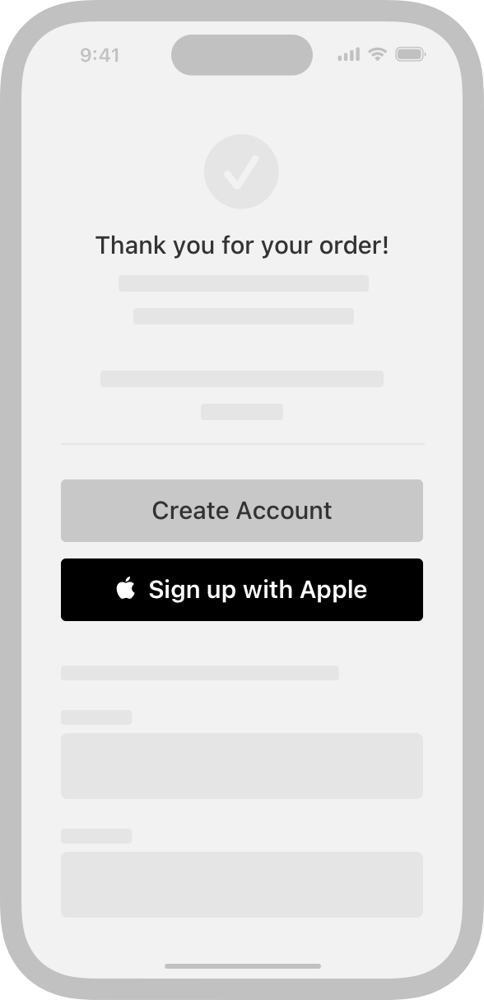

**Report the result of the transaction so that people can view it in the payment sheet.** In failure cases, the payment sheet can display the errors that you provide, so people can take steps to fix the problem.

**Display an order confirmation or thank-you page.** After the payment sheet shows the result of the transaction, display an order confirmation page to thank people for their purchase, provide details about when the order will ship, and indicate how to check its status. Listing Apple Pay on the confirmation page isn’t necessary, but if you do, show it after the last four digits of the account used to process the transaction or as a separate note. For example, ”1234 (Apple Pay)” or ”Paid with Apple Pay.”

### Customizing the payment sheet

**Only present and request essential information.** People may get confused or have privacy concerns if the payment sheet includes extraneous information. For example, it makes sense to see a contact email address but not a shipping address if the purchase is a gift card that will be delivered electronically. Showing or asking for a shipping address in this scenario may give the false impression that something will be physically delivered.

**Display the active coupon or promotional code, or give people a way to enter it.** For example, if people can enter a code before the payment sheet appears, displaying it on the sheet can reassure them that the code works as they expect. Alternatively, allowing code entry on the payment sheet can be particularly beneficial in an express checkout flow.

**Let people choose the shipping method in the payment sheet.** To the extent space permits, show a clear description, a cost, and, optionally, an estimated delivery or pickup date — or range of dates — for each available option. In iOS 15 and later, you can take advantage of the shipping method’s calendar and time-zone support to provide accurate delivery or pickup information, regardless of the customer’s current location. For developer guidance, see [PKDateComponentsRange](https://developer.apple.com/documentation/PassKit/PKDateComponentsRange).

**For in-store pickup, consider letting people choose a pickup window that works for them.** You can use the shipping method to supply a range of dates and times from which people can choose.

**Use line items to explain additional charges, discounts, pending costs, add-on donations, recurring, and future payments.** A line item includes a label and cost; a line item for a recurring payment can also include a frequency. Don’t use line items to show an itemized list of products that make up the purchase. For developer guidance, see [paymentSummaryItems](https://developer.apple.com/documentation/PassKit/PKPaymentRequest/paymentSummaryItems); for guidance on donations, see [Supporting donations](./apple-pay.md).

**Keep line items short.** Make line items specific and easily understandable at a glance. Whenever possible, fit line items on a single line.

**Provide a business name after the word *Pay* on the same line as the total.** Use the same business name people will see when they look for the charge on their bank or credit card statement. This provides reassurance that payment is going to the right place. For example, Pay [*Business_Name*].

**If you’re not the end merchant, specify both your business name and the end merchant’s name in the payment sheet.** There are a few ways your app, App Clip, or website might help people make a purchase from an end merchant that’s unrelated to your company. For example, a marketplace app can help people make a purchase from an end merchant they might not recognize. Another example is an app that offers a self-checkout service people can use to pay for an item in an end merchant’s physical store without visiting the store’s checkout counter. In scenarios like these, people might not realize two businesses are involved in the transaction, so it’s essential to name both businesses and clarify their roles. When your app acts as an intermediary for an end merchant, clearly and succinctly describe the situation in the Pay line of the payment sheet, using something like Pay [*End_Merchant_Business_Name* (via *Your_Business_Name*)].

**Clearly disclose when additional costs may be incurred after payment authorization.** In some cases, the total cost may be unknown at checkout time. For example, the price of a car ride based on distance or time might change after checkout. Or, a customer might want to add a tip after a product is delivered. In situations like these, and when local regulations allow, you can provide a clear explanation in the payment sheet and a subtotal marked as Amount Pending. If you’re preauthorizing a specific amount, be sure the payment sheet accurately reflects this information.

**Handle data entry and payment errors gracefully.** If an error occurs during checkout, help people resolve it quickly so they can complete their transaction. For related guidance, see [Data validation](./apple-pay.md).

### Displaying a website icon

Many websites provide an icon that can display with bookmarks, in URL fields, or on a device’s Home screen. Websites that support Apple Pay can display this icon in a summary view and in the payment sheet of the connected device that’s used to authorize payment. The icon provides visual reassurance that payment is going to the right place.

If your website supports Apple Pay, provide an icon in the following sizes for use in the summary view and the payment sheet:

| @2x | @3x |
| --- | --- |
| 60x60 pt (120x120 px @2x) | 60x60 pt (180x180 px @3x) |

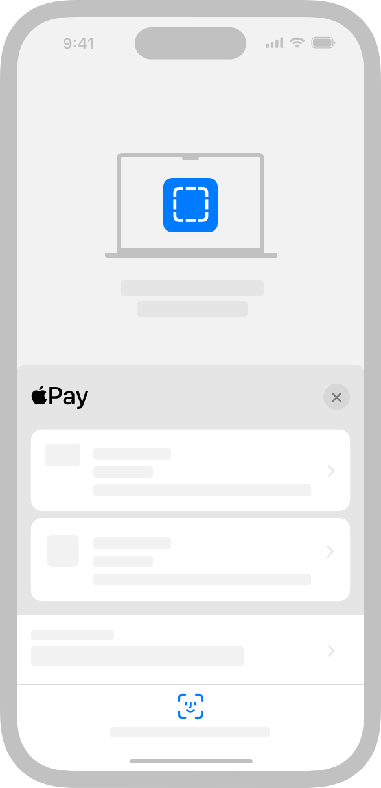

## Handling errors

Provide clear, actionable guidance when problems occur during checkout or payment processing, so people can resolve problems quickly and complete their transaction.

### Data validation

Your app or website can respond to user input when the payment sheet appears, when people change certain field values on the payment sheet, and after they authenticate the transaction. Use these opportunities to check for data entry problems and to provide clear and consistent messaging.

When data is invalid, system-provided error messaging calls attention to relevant fields on the payment sheet. People can choose a field to view additional details and resolve the problem. Provide customized error messages for the detail view that appears when people choose a problematic field.

For developer guidance, see [PKPaymentAuthorizationViewControllerDelegate](https://developer.apple.com/documentation/PassKit/PKPaymentAuthorizationViewControllerDelegate) (iOS, watchOS) and  [Apple Pay on the Web](https://developer.apple.com/documentation/ApplePayontheWeb) (web).

> **Note:**
> For privacy reasons, your app or website has limited access to data until people attempt to authorize a transaction. Prior to authorization, only the card type and a redacted shipping address are accessible. It’s critical to display errors when authorization fails, but to the extent possible, you also need to attempt to validate available information and report problems before authorization.

**Avoid forcing compliance with your business logic.** Design a data validation process that’s intelligent enough to ignore irrelevant data and infer missing data whenever possible. For example, if your app requires a five-digit zip code but someone enters a Zip+4 code, ignore the additional digits rather than asking for a correction. Let people enter phone numbers in multiple formats — such as with and without dashes, and with and without a country code — without producing an error.

**Provide accurate status reporting to the system.** When a problem occurs, it’s essential that your app or website accurately indicate the type of problem so the system can show the most relevant error message on the payment sheet. This is done by accompanying your custom error message with the correct status code. For developer guidance, see [PKPaymentError](https://developer.apple.com/documentation/PassKit/PKPaymentError) (iOS, watchOS) and [Apple Pay Status Codes](https://developer.apple.com/documentation/ApplePayontheWeb/apple-pay-status-codes) (web).

**Succinctly and specifically describe the problem when data is invalid or incorrectly formatted.** Reference the relevant field and indicate exactly what’s expected. For example, if people enter an invalid zip code, instead of showing “Address is invalid,” show a specific message like “Zip code doesn’t match city.” If the shipping address is unserviceable, indicate why with a message like “Shipping not available for this state.” Use noun phrases with sentence-style capitalization and no ending punctuation. Aim to keep messages at 128 characters or fewer to avoid truncation.

### Payment processing

**Handle interruptions correctly.** A user-driven event like a cancellation or a system-driven event like a timeout could cause an interruption in the payment flow, resulting in the payment sheet being dismissed. When such an event occurs, you must cancel any in-progress payment. After the payment sheet dismisses, people can restart the process by choosing the Apple Pay button again. For developer guidance, see [PKPaymentAuthorizationViewControllerDelegate](https://developer.apple.com/documentation/PassKit/PKPaymentAuthorizationViewControllerDelegate) (iOS, watchOS) and [oncancel](https://developer.apple.com/documentation/ApplePayontheWeb/ApplePaySession/oncancel) (web).

## Supporting subscriptions

Your app or website can use Apple Pay to request authorization for recurring fees. A recurring fee can be a fixed amount, such as a monthly movie ticket subscription, or — when local regulations allow — a variable amount like a weekly grocery order. The initial authorization can also include discounts and additional fees.

**Clarify subscription details before showing the payment sheet.** Before asking people to authorize a recurring payment, make sure they fully understand the billing frequency and any other terms of service. You can reiterate the billing frequency on the payment sheet.

**Include line items that reiterate billing frequency, discounts, and additional upfront fees.** Use these line items to remind people what they’re authorizing. If no payment is required at authorization time, clearly disclose when billing will occur.

**Clarify the current payment amount in the total line.** Make sure people know the amount they’re being billed at the time of authorization.

**Only show the payment sheet when a subscription change results in additional fees.** When the someone changes a subscription, authorization isn’t necessary if the cost decreases or remains the same.

### Supporting donations

[Approved nonprofits](https://developer.apple.com/support/apple-pay-nonprofits/) can use Apple Pay to accept donations.

**Use a line item to denote a donation.** Display a line item on the payment sheet that reminds people they’re authorizing a donation; for example, display Donation $50.00.

**Streamline checkout by offering predefined donation amounts.** You can reduce steps in the donation process by offering one-step recommended donations, like $25, $50, $100. Be sure to include an Other Amount option too, so people can customize the donation if they prefer.

## Using Apple Pay buttons

The system provides several Apple Pay button types and styles you can use in your app or website. In contrast to the Apple Pay buttons, you use the [Apple Pay mark](./apple-pay.md) to communicate the availability of Apple Pay as a payment option.

Don’t create your own Apple Pay button design or attempt to mimic the system-provided button designs.

For developer guidance, see [PKPaymentButtonType](https://developer.apple.com/documentation/PassKit/PKPaymentButtonType) and [PKPaymentButtonStyle](https://developer.apple.com/documentation/PassKit/PKPaymentButtonStyle) (iOS and macOS), [WKInterfacePaymentButton](https://developer.apple.com/documentation/WatchKit/WKInterfacePaymentButton) (watchOS), and [Apple Pay on the Web](https://developer.apple.com/documentation/ApplePayontheWeb) (web).

### Button types

Apple provides several types of buttons so you can choose the button type that fits best with the terminology and flow of your purchase or payment experience.

Use the Apple-provided APIs to create Apple Pay buttons. When you use the system-provided APIs, you get:

- A button that is guaranteed to use an Apple-approved caption, font, color, and style
- Assurance that the button’s contents maintain ideal proportions as you change its size
- Automatic translation of the button’s caption into the language that’s set for the device
- Support for configuring the button’s corner radius to match the style of your UI
- A system-provided alternative text label that lets VoiceOver describe the button

| Payment button type | Example usage |
| --- | --- |
|  | An area in an app or website where people can make a purchase, such as a product detail page or shopping cart page. |
|  | An app or website that lets people pay bills or invoices, such as those for a utility — like cable or electricity — or a service like plumbing or car repair. |
|  | An app or website offering a shopping cart or purchase experience that includes other payment buttons that start with the text *Check out*. |
|  | An app or website offering a shopping cart or purchase experience that includes other payment buttons that start with the text *Continue with*. |
|  | An app or website that helps people book flights, trips, or other experiences. |
|  | An app or website for an [Approved nonprofits](https://developer.apple.com/support/apple-pay-nonprofits/) that lets people make donations. |
|  | An app or website that lets people purchase a subscription, such as a gym membership or a meal-kit delivery service. |
|  | An app or website that uses the term *reload* to help people add money to a card, account, or payment system associated with a service, such as transit or a prepaid phone plan. |
|  | An app or website that uses the term *add money* to help people add money to a card, account, or payment system associated with a service, such as transit or a prepaid phone plan. |
|  | An app or website that uses the term *top up* to help people add money to a card, account, or payment system associated with a service, such as transit or a prepaid phone plan. |
|  | An app or website that lets people place orders for items like meals or flowers. |
|  | An app or website that lets people rent items like cars or scooters. |
|  | An app or website that uses the term *support* to help people give money to projects, causes, organizations, and other entities. |
|  | An app or website that uses the term *contribute* to help people give money to projects, causes, organizations, and other entities. |
|  | An app or website that lets people tip for goods or services. |
|  | An app or website that has stylistic reasons to use a button that can have a smaller minimum width or that doesn’t specify a call to action. If you choose a payment button type that isn’t supported on the version of the operating system your app or website is running in, the system may replace it with this button. |

When a device supports Apple Pay, but it hasn’t been set up yet, you can use the Set up Apple Pay button to show that Apple Pay is accepted and to give people an explicit opportunity to set it up.

You can display the Set up Apple Pay button on pages such as a Settings page, a user profile screen, or an interstitial page. Tapping the button in any of these locations needs to initiate the process of adding a card.

### Button styles

You can use the  *automatic* style to let the current system appearance determine the appearance of the Apple Pay buttons in your app (for developer guidance, see [PKPaymentButtonStyle.automatic](https://developer.apple.com/documentation/PassKit/PKPaymentButtonStyle/automatic)). If you want to control the button appearance yourself, you can use one of the following options. For web developer guidance, see [ApplePayButtonStyle](https://developer.apple.com/documentation/ApplePayontheWeb/ApplePayButtonStyle).

#### Black

Use on white or light-color backgrounds that provide sufficient contrast. Don’t use on black or dark backgrounds.

#### White with outline

Use on white or light-color backgrounds that don’t provide sufficient contrast. Don’t place on dark or saturated backgrounds.

#### White

Use on dark-color backgrounds that provide sufficient contrast.

### Button size and position

**Prominently display the Apple Pay button.** Make the Apple Pay button no smaller than other payment buttons, and avoid making people scroll to see it.

**Position the Apple Pay button correctly in relation to an Add to Cart button.** In a side-by-side layout, place the Apple Pay button to the right of an Add to Cart button.

In a stacked layout, place the Apple Pay button above an Add to Cart button.

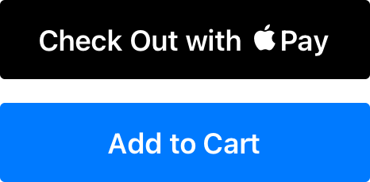

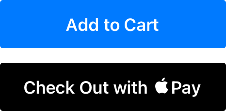

**Adjust the corner radius to match the appearance of other buttons.** By default, an Apple Pay button has rounded corners. You can change the corner radius to produce a button with square corners or a capsule-shape button. For developer guidance, see [cornerRadius](https://developer.apple.com/documentation/PassKit/PKPaymentButton/cornerRadius).

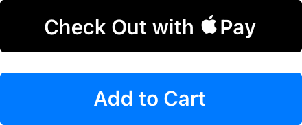

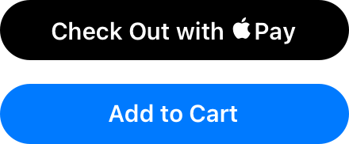

**Maintain the minimum button size and margins around the button.** Be mindful that the button title may vary in length depending on the locale.

> **Note:**
> If the size you specify doesn’t accommodate the translated title for the type of payment button you’re using, the system automatically replaces it with the plain Apple Pay button shown below on the left. There is no automatic replacement for the Set up Apple Pay button.

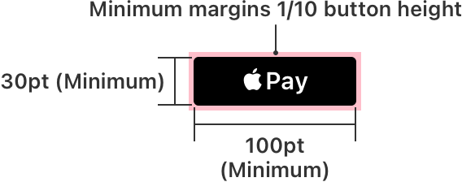

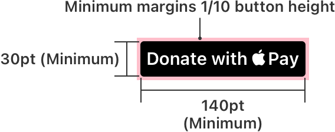

Use the following values for guidance.

| Button | Minimum width | Minimum height | Minimum margins |
| --- | --- | --- | --- |
| Apple Pay | 100pt (100px @1x, 200px @2x) | 30pt (30px @1x, 60px @2x) | 1/10 of the button’s height |
| Book with Apple Pay | 140pt (140px @1x, 280px @2x) | 30pt (30px @1x, 60px @2x) | 1/10 of the button’s height |
| Buy with Apple Pay |  |  |  |
| Check out with Apple Pay |  |  |  |
| Donate with Apple Pay |  |  |  |
| Set up Apple Pay |  |  |  |
| Subscribe with Apple Pay |  |  |  |

### Apple Pay mark

Use the Apple Pay mark graphic to show that Apple Pay is an available payment option when showing other payment options in a similar manner. The Apple Pay mark isn’t a button; if you need an Apple Pay button, choose one of the buttons described in [Button types](./apple-pay.md). For design guidance related to showing Apple Pay as a payment option, see [Offering Apple Pay](./apple-pay.md).

**Use only the artwork provided by Apple, with no alterations other than height.** You can specify a height for the Apple Pay mark, but make sure that the height you use is equal to or larger than other payment brand marks in your payment flow. Don’t adjust the width, corner radius, or aspect ratio of the artwork; don’t add a trademark symbol or any other content; don’t remove the border; don’t add visual effects to the mark, such as shadows, glows, or reflections; and don’t flip, rotate, or animate the Apple Pay mark.

**Maintain a minimum clear space around the mark of 1/10 of its height.** Don’t let the Apple Pay mark share its surrounding border with another graphic or button.

Download the Apple Pay mark graphic and full usage guidelines [here](https://developer.apple.com/apple-pay/marketing/).

## Referring to Apple Pay

As with all Apple product names, use Apple Pay exactly as shown in [Apple Trademark List](https://www.apple.com/legal/intellectual-property/trademark/appletmlist.html) — never make it plural or possessive — and adhere to [Guidelines for Using Apple Trademarks](https://www.apple.com/legal/intellectual-property/guidelinesfor3rdparties.html).

You can use plain text to promote Apple Pay and indicate that Apple Pay is a payment option.

**Capitalize Apple Pay in text as it appears in the Apple Trademark list.** Use two words with an uppercase *A*, an uppercase *P*, and lowercase for all other letters. Display Apple Pay entirely in uppercase only when doing so is necessary for conforming to an established, typographic interface style, such as in an app that capitalizes all text.

**Never use the Apple logo to represent the name *Apple* in text.** In the United States, use the registered trademark symbol (®) the first time Apple Pay appears in body text. Don’t include a registered trademark symbol when Apple Pay appears as a selection option during checkout.

|  | Example text |
| --- | --- |
|  | Purchase with Apple Pay |
|  | Purchase with Apple Pay® |
|  | Purchase with ApplePay |
|  | Purchase with  Pay |
|  | Purchase with APPLE PAY |

**Coordinate the font face and size with your app.** Don’t mimic Apple typography. Instead, use text attributes that are consistent with the rest of your app or website.

**Don’t translate *Apple Pay* or any other Apple trademark.** Always use Apple trademarks in English, even when they appear within non-English text.

**In a payment selection context, you can display a text-only description of Apple Pay only when all payment options have text-only descriptions.** If any other payment option description includes an icon or logo, you must use the Apple Pay mark as described in [Offering Apple Pay](./apple-pay.md).

**When promoting your app’s use of Apple Pay, follow App Store guidelines.** Before promoting Apple Pay for your app, refer to the [App Store marketing guidelines](https://developer.apple.com/app-store/marketing/guidelines/).

## Platform considerations

*No additional considerations for iOS, iPadOS, macOS, visionOS, or watchOS. Not supported in tvOS.*

## Resources

#### Related

[Apple Pay Marketing Guidelines](https://developer.apple.com/apple-pay/marketing/)

#### Developer documentation

[Apple Pay](https://developer.apple.com/documentation/PassKit/apple-pay) — PassKit

[Apple Pay on the Web](https://developer.apple.com/documentation/ApplePayontheWeb)

[WKInterfacePaymentButton](https://developer.apple.com/documentation/WatchKit/WKInterfacePaymentButton) — WatchKit

#### Videos

- [What’s new in Apple Pay](https://developer.apple.com/videos/play/wwdc2025/201)

## Change log

| Date | Changes |
| --- | --- |
| December 16, 2025 | Clarified supported platforms, including web browsers and Apple Vision Pro. |
| June 10, 2024 | Updated links to developer guidance for offering Apple Pay on the web. |
| September 12, 2023 | Updated artwork. |
| May 2, 2023 | Consolidated guidance into one page. |
