# Color

Judicious use of color can enhance communication, evoke your brand, provide visual continuity, communicate status and feedback, and help people understand information.

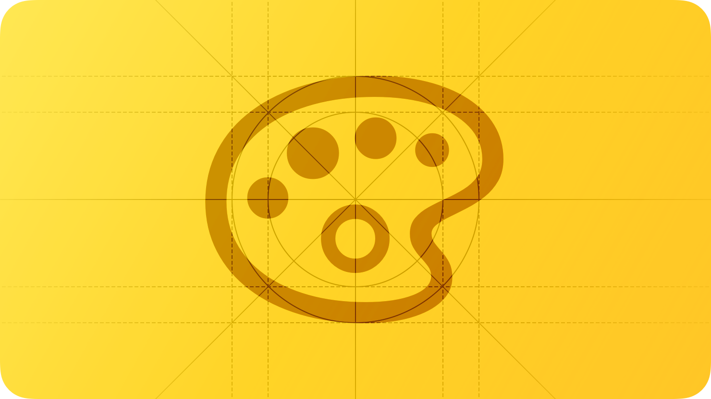

The system defines colors that look good on various backgrounds and appearance modes, and can automatically adapt to vibrancy and accessibility settings. Using system colors is a convenient way to make your experience feel at home on the device.

You may also want to use custom colors to enhance the visual experience of your app or game and express its unique personality. The following guidelines can help you use color in ways that people appreciate, regardless of whether you use system-defined or custom colors.

## Best practices

**Avoid using the same color to mean different things.** Use color consistently throughout your interface, especially when you use it to help communicate information like status or interactivity. For example, if you use your brand color to indicate that a borderless button is interactive, using the same or similar color to stylize noninteractive text is confusing.

**Make sure all your app’s colors work well in light, dark, and increased contrast contexts.** iOS, iPadOS, macOS, and tvOS offer both light and [Dark Mode](./dark-mode.md) appearance settings. [System colors](./color.md) vary subtly depending on the system appearance, adjusting to ensure proper color differentiation and contrast for text, symbols, and other elements. With the Increase Contrast setting turned on, the color differences become far more apparent. When possible, use system colors, which already define variants for all these contexts. If you define a custom color, make sure to supply light and dark variants, and an increased contrast option for each variant that provides a significantly higher amount of visual differentiation. Even if your app ships in a single appearance mode, provide both light and dark colors to support Liquid Glass adaptivity in these contexts.

**Test your app’s color scheme under a variety of lighting conditions.** Colors can look different when you view your app outside on a sunny day or in dim light. In bright surroundings, colors look darker and more muted. In dark environments, colors appear bright and saturated. In visionOS, colors can look different depending on the colors of a wall or object in a person’s physical surroundings and how it reflects light. Adjust app colors to provide an optimal viewing experience in the majority of use cases.

**Test your app on different devices.** For example, the True Tone display — available on certain iPhone, iPad, and Mac models — uses ambient light sensors to automatically adjust the white point of the display to adapt to the lighting conditions of the current environment. Apps that primarily support reading, photos, video, and gaming can strengthen or weaken this effect by specifying a white point adaptivity style (for developer guidance, see [UIWhitePointAdaptivityStyle](https://developer.apple.com/documentation/BundleResources/Information-Property-List/UIWhitePointAdaptivityStyle)). Test tvOS apps on multiple brands of HD and 4K TVs, and with different display settings. You can also test the appearance of your app using different color profiles on a Mac — such as P3 and Standard RGB (sRGB) — by choosing a profile in System Settings > Displays. For guidance, see [Color management](./color.md).

**Consider how artwork and translucency affect nearby colors.** Variations in artwork sometimes warrant changes to nearby colors to maintain visual continuity and prevent interface elements from becoming overpowering or underwhelming. Maps, for example, displays a light color scheme when in map mode but switches to a dark color scheme when in satellite mode. Colors can also appear different when placed behind or applied to a translucent element like a toolbar.

**If your app lets people choose colors, prefer system-provided color controls where available.** Using built-in color pickers provides a consistent user experience, in addition to letting people save a set of colors they can access from any app. For developer guidance, see [ColorPicker](https://developer.apple.com/documentation/SwiftUI/ColorPicker).

## Inclusive color

**Avoid relying solely on color to differentiate between objects, indicate interactivity, or communicate essential information.** When you use color to convey information, be sure to provide the same information in alternative ways so people with color blindness or other visual disabilities can understand it. For example, you can use text labels or glyph shapes to identify objects or states.

**Avoid using colors that make it hard to perceive content in your app.** For example,  insufficient contrast can cause icons and text to blend with the background and make content hard to read, and people who are color blind might not be able to distinguish some color combinations. For guidance, see [Accessibility](./accessibility.md).

**Consider how the colors you use might be perceived in other countries and cultures.** For example, red communicates danger in some cultures, but has positive connotations in other cultures. Make sure the colors in your app send the message you intend.

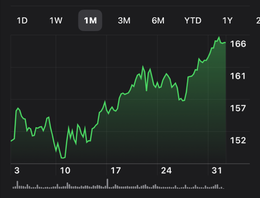

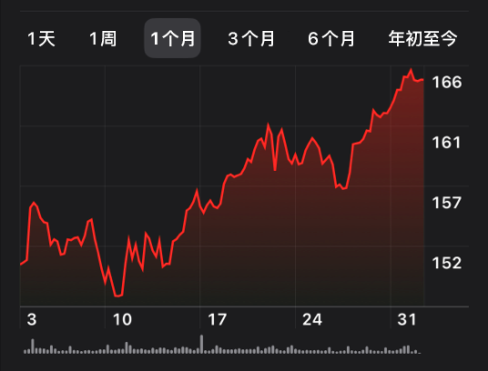

## System colors

**Avoid hard-coding system color values in your app.** Documented color values are for your reference during the app design process. The actual color values may fluctuate from release to release, based on a variety of environmental variables. Use APIs like [Color](https://developer.apple.com/documentation/SwiftUI/Color) to apply system colors.

iOS, iPadOS, macOS, and visionOS also define sets of *dynamic system colors* that match the color schemes of standard UI components and automatically adapt to both light and dark contexts. Each dynamic color is semantically defined by its purpose, rather than its appearance or color values. For example, some colors represent view backgrounds at different levels of hierarchy and other colors represent foreground content, such as labels, links, and separators.

**Avoid redefining the semantic meanings of dynamic system colors.** To ensure a consistent experience and ensure your interface looks great when the appearance of the platform changes, use dynamic system colors as intended. For example, don’t use the [separator](https://developer.apple.com/documentation/uikit/uicolor/separator) color as a text color, or [secondary text label](https://developer.apple.com/documentation/uikit/uicolor/secondarylabel) color as a background color.

## Liquid Glass color

By default, [Liquid Glass](./materials.md) has no inherent color, and instead takes on colors from the content directly behind it. You can apply color to some Liquid Glass elements, giving them the appearance of colored or stained glass. This is useful for drawing emphasis to a specific control, like a primary call to action, and is the approach the system uses for prominent button styling. Symbols or text labels on Liquid Glass controls can also have color.

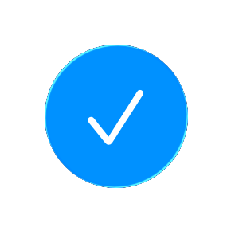

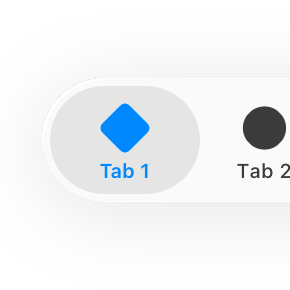

For smaller elements like toolbars and tab bars, the system can adapt Liquid Glass between a light and dark appearance in response to the underlying content. By default, symbols and text on these elements follow a monochromatic color scheme, becoming darker when the underlying content is light, and lighter when it’s dark. Liquid Glass appears more opaque in larger elements like sidebars to preserve legibility over complex backgrounds and accommodate richer content on the material’s surface.

**Apply color sparingly to the Liquid Glass material, and to symbols or text on the material.** If you apply color, reserve it for elements that truly benefit from emphasis, such as status indicators or primary actions. To emphasize primary actions, apply color to the background rather than to symbols or text. For example, the system applies the app accent color to the background in prominent buttons — such as the Done button — to draw attention and elevate their visual prominence. Refrain from adding color to the background of multiple controls.

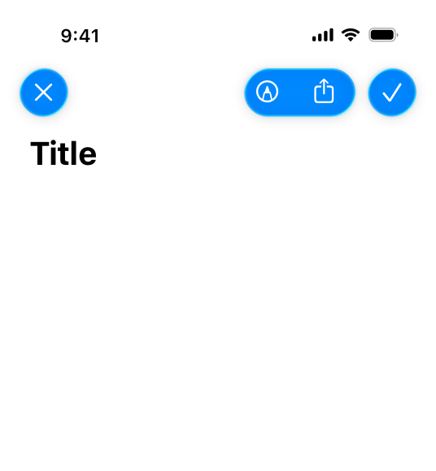

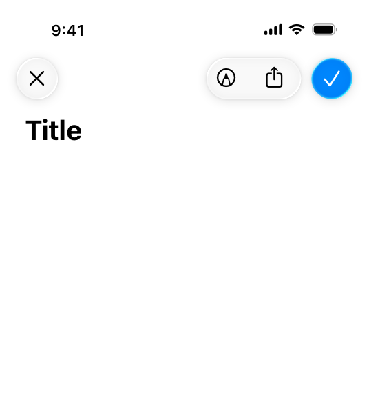

**Avoid using similar colors in control labels if your app has a colorful background.** While color can make apps more visually appealing, playful, or reflective of your brand, too much color can be overwhelming and make control labels more difficult to read. If your app features colorful backgrounds or visually rich content, prefer a monochromatic appearance for toolbars and tab bars, or choose an accent color with sufficient visual differentiation. By contrast, in apps with primarily monochromatic content or backgrounds, choosing your brand color as the app accent color can be an effective way to tailor your app experience and reflect your company’s identity.

**Be aware of the placement of color in the content layer.** Make sure your interface maintains sufficient contrast by avoiding overlap of similar colors in the content layer and controls when possible. Although colorful content might intermittently scroll underneath controls, make sure its default or resting state — like the top of a screen of scrollable content — maintains clear legibility.

## Color management

A *color space* represents the colors in a *color model* like RGB or CMYK. Common color spaces — sometimes called *gamuts* — are sRGB and Display P3.

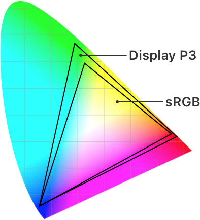

A *color profile* describes the colors in a color space using, for example, mathematical formulas or tables of data that map colors to numerical representations. An image embeds its color profile so that a device can interpret the image’s colors correctly and reproduce them on a display.

**Apply color profiles to your images.** Color profiles help ensure that your app’s colors appear as intended on different displays. The sRGB color space produces accurate colors on most displays.

**Use wide color to enhance the visual experience on compatible displays.** Wide color displays support a P3 color space, which can produce richer, more saturated colors than sRGB. As a result, photos and videos that use wide color are more lifelike, and visual data and status indicators that use wide color can be more meaningful. When appropriate, use the Display P3 color profile at 16 bits per pixel (per channel) and export images in PNG format. Note that you need to use a wide color display to design wide color images and select P3 colors.

**Provide color space–specific image and color variations if necessary.** In general, P3 colors and images appear fine on sRGB displays. Occasionally, it may be hard to distinguish two very similar P3 colors when viewing them on an sRGB display. Gradients that use P3 colors can also sometimes appear clipped on sRGB displays. To avoid these issues and to ensure visual fidelity on both wide color and sRGB displays, you can use the asset catalog of your Xcode project to provide different versions of images and colors for each color space.

## Platform considerations

### iOS, iPadOS

iOS defines two sets of dynamic background colors — *system* and *grouped* — each of which contains primary, secondary, and tertiary variants that help you convey a hierarchy of information. In general, use the grouped background colors ([systemGroupedBackground](https://developer.apple.com/documentation/UIKit/UIColor/systemGroupedBackground), [secondarySystemGroupedBackground](https://developer.apple.com/documentation/UIKit/UIColor/secondarySystemGroupedBackground), and [tertiarySystemGroupedBackground](https://developer.apple.com/documentation/UIKit/UIColor/tertiarySystemGroupedBackground)) when you have a grouped table view; otherwise, use the system set of background colors ([systemBackground](https://developer.apple.com/documentation/UIKit/UIColor/systemBackground), [secondarySystemBackground](https://developer.apple.com/documentation/UIKit/UIColor/secondarySystemBackground), and [tertiarySystemBackground](https://developer.apple.com/documentation/UIKit/UIColor/tertiarySystemBackground)).

With both sets of background colors, you generally use the variants to indicate hierarchy in the following ways:

- Primary for the overall view
- Secondary for grouping content or elements within the overall view
- Tertiary for grouping content or elements within secondary elements

For foreground content, iOS defines the following dynamic colors:

| Color | Use for… | UIKit API |
| --- | --- | --- |
| Label | A text label that contains primary content. | [label](https://developer.apple.com/documentation/UIKit/UIColor/label) |
| Secondary label | A text label that contains secondary content. | [secondaryLabel](https://developer.apple.com/documentation/UIKit/UIColor/secondaryLabel) |
| Tertiary label | A text label that contains tertiary content. | [tertiaryLabel](https://developer.apple.com/documentation/UIKit/UIColor/tertiaryLabel) |
| Quaternary label | A text label that contains quaternary content. | [quaternaryLabel](https://developer.apple.com/documentation/UIKit/UIColor/quaternaryLabel) |
| Placeholder text | Placeholder text in controls or text views. | [placeholderText](https://developer.apple.com/documentation/UIKit/UIColor/placeholderText) |
| Separator | A separator that allows some underlying content to be visible. | [separator](https://developer.apple.com/documentation/UIKit/UIColor/separator) |
| Opaque separator | A separator that doesn’t allow any underlying content to be visible. | [opaqueSeparator](https://developer.apple.com/documentation/UIKit/UIColor/opaqueSeparator) |
| Link | Text that functions as a link. | [link](https://developer.apple.com/documentation/UIKit/UIColor/link) |

### macOS

macOS defines the following dynamic system colors (you can also view them in the Developer palette of the standard Color panel):

| Color | Use for… | AppKit API |
| --- | --- | --- |
| Alternate selected control text color | The text on a selected surface in a list or table. | [alternateSelectedControlTextColor](https://developer.apple.com/documentation/AppKit/NSColor/alternateSelectedControlTextColor) |
| Alternating content background colors | The backgrounds of alternating rows or columns in a list, table, or collection view. | [alternatingContentBackgroundColors](https://developer.apple.com/documentation/AppKit/NSColor/alternatingContentBackgroundColors) |
| Control accent | The accent color people select in System Settings. | [controlAccentColor](https://developer.apple.com/documentation/AppKit/NSColor/controlAccentColor) |
| Control background color | The background of a large interface element, such as a browser or table. | [controlBackgroundColor](https://developer.apple.com/documentation/AppKit/NSColor/controlBackgroundColor) |
| Control color | The surface of a control. | [controlColor](https://developer.apple.com/documentation/AppKit/NSColor/controlColor) |
| Control text color | The text of a control that is available. | [controlTextColor](https://developer.apple.com/documentation/AppKit/NSColor/controlTextColor) |
| Current control tint | The system-defined control tint. | [currentControlTint](https://developer.apple.com/documentation/AppKit/NSColor/currentControlTint) |
| Unavailable control text color | The text of a control that’s unavailable. | [disabledControlTextColor](https://developer.apple.com/documentation/AppKit/NSColor/disabledControlTextColor) |
| Find highlight color | The color of a find indicator. | [findHighlightColor](https://developer.apple.com/documentation/AppKit/NSColor/findHighlightColor) |
| Grid color | The gridlines of an interface element, such as a table. | [gridColor](https://developer.apple.com/documentation/AppKit/NSColor/gridColor) |
| Header text color | The text of a header cell in a table. | [headerTextColor](https://developer.apple.com/documentation/AppKit/NSColor/headerTextColor) |
| Highlight color | The virtual light source onscreen. | [highlightColor](https://developer.apple.com/documentation/AppKit/NSColor/highlightColor) |
| Keyboard focus indicator color | The ring that appears around the currently focused control when using the keyboard for interface navigation. | [keyboardFocusIndicatorColor](https://developer.apple.com/documentation/AppKit/NSColor/keyboardFocusIndicatorColor) |
| Label color | The text of a label containing primary content. | [labelColor](https://developer.apple.com/documentation/AppKit/NSColor/labelColor) |
| Link color | A link to other content. | [linkColor](https://developer.apple.com/documentation/AppKit/NSColor/linkColor) |
| Placeholder text color | A placeholder string in a control or text view. | [placeholderTextColor](https://developer.apple.com/documentation/AppKit/NSColor/placeholderTextColor) |
| Quaternary label color | The text of a label of lesser importance than a tertiary label, such as watermark text. | [quaternaryLabelColor](https://developer.apple.com/documentation/AppKit/NSColor/quaternaryLabelColor) |
| Secondary label color | The text of a label of lesser importance than a primary label, such as a label used to represent a subheading or additional information. | [secondaryLabelColor](https://developer.apple.com/documentation/AppKit/NSColor/secondaryLabelColor) |
| Selected content background color | The background for selected content in a key window or view. | [selectedContentBackgroundColor](https://developer.apple.com/documentation/AppKit/NSColor/selectedContentBackgroundColor) |
| Selected control color | The surface of a selected control. | [selectedControlColor](https://developer.apple.com/documentation/AppKit/NSColor/selectedControlColor) |
| Selected control text color | The text of a selected control. | [selectedControlTextColor](https://developer.apple.com/documentation/AppKit/NSColor/selectedControlTextColor) |
| Selected menu item text color | The text of a selected menu. | [selectedMenuItemTextColor](https://developer.apple.com/documentation/AppKit/NSColor/selectedMenuItemTextColor) |
| Selected text background color | The background of selected text. | [selectedTextBackgroundColor](https://developer.apple.com/documentation/AppKit/NSColor/selectedTextBackgroundColor) |
| Selected text color | The color for selected text. | [selectedTextColor](https://developer.apple.com/documentation/AppKit/NSColor/selectedTextColor) |
| Separator color | A separator between different sections of content. | [separatorColor](https://developer.apple.com/documentation/AppKit/NSColor/separatorColor) |
| Shadow color | The virtual shadow cast by a raised object onscreen. | [shadowColor](https://developer.apple.com/documentation/AppKit/NSColor/shadowColor) |
| Tertiary label color | The text of a label of lesser importance than a secondary label. | [tertiaryLabelColor](https://developer.apple.com/documentation/AppKit/NSColor/tertiaryLabelColor) |
| Text background color | The background color behind text. | [textBackgroundColor](https://developer.apple.com/documentation/AppKit/NSColor/textBackgroundColor) |
| Text color | The text in a document. | [textColor](https://developer.apple.com/documentation/AppKit/NSColor/textColor) |
| Under page background color | The background behind a document’s content. | [underPageBackgroundColor](https://developer.apple.com/documentation/AppKit/NSColor/underPageBackgroundColor) |
| Unemphasized selected content background color | The selected content in a non-key window or view. | [unemphasizedSelectedContentBackgroundColor](https://developer.apple.com/documentation/AppKit/NSColor/unemphasizedSelectedContentBackgroundColor) |
| Unemphasized selected text background color | A background for selected text in a non-key window or view. | [unemphasizedSelectedTextBackgroundColor](https://developer.apple.com/documentation/AppKit/NSColor/unemphasizedSelectedTextBackgroundColor) |
| Unemphasized selected text color | Selected text in a non-key window or view. | [unemphasizedSelectedTextColor](https://developer.apple.com/documentation/AppKit/NSColor/unemphasizedSelectedTextColor) |
| Window background color | The background of a window. | [windowBackgroundColor](https://developer.apple.com/documentation/AppKit/NSColor/windowBackgroundColor) |
| Window frame text color | The text in the window’s title bar area. | [windowFrameTextColor](https://developer.apple.com/documentation/AppKit/NSColor/windowFrameTextColor) |

#### App accent colors

Beginning in macOS 11, you can specify an *accent color* to customize the appearance of your app’s buttons, selection highlighting, and sidebar icons. The system applies your accent color when the current value in General > Accent color settings is *multicolor*.

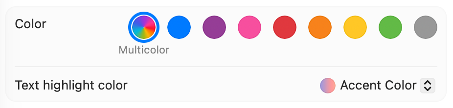

If people set their accent color setting to a value other than multicolor, the system applies their chosen color to the relevant items throughout your app, replacing your accent color. The exception is a sidebar icon that uses a fixed color you specify. Because a fixed-color sidebar icon uses a specific color to provide meaning, the system doesn’t override its color when people change the value of accent color settings. For guidance, see [Sidebars](./sidebars.md).

## Specifications

### System colors

| Name | SwiftUI API | Default (light) | Default (dark) | Increased contrast (light) | Increased contrast (dark) |
| --- | --- | --- | --- | --- | --- |
| Red | [red](https://developer.apple.com/documentation/SwiftUI/Color/red) | 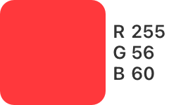 | 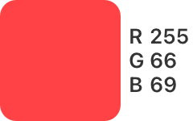 |  | 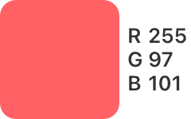 |
| Orange | [orange](https://developer.apple.com/documentation/SwiftUI/Color/orange) | 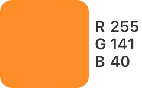 | 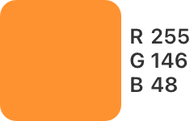 | 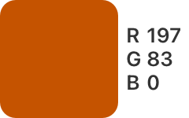 | 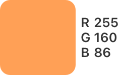 |
| Yellow | [yellow](https://developer.apple.com/documentation/SwiftUI/Color/yellow) |  | 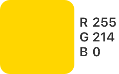 | 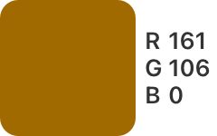 | 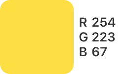 |
| Green | [green](https://developer.apple.com/documentation/SwiftUI/Color/green) | 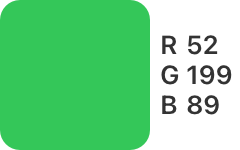 | 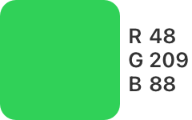 | 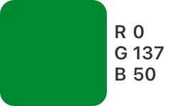 | 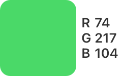 |
| Mint | [mint](https://developer.apple.com/documentation/SwiftUI/Color/mint) | 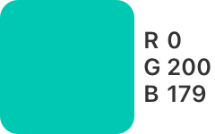 | 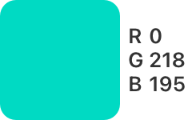 | 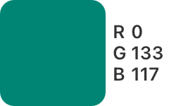 | 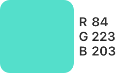 |
| Teal | [teal](https://developer.apple.com/documentation/SwiftUI/Color/teal) | 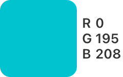 | 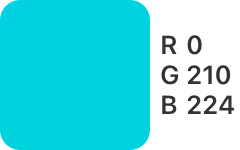 | 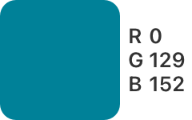 | 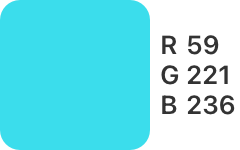 |
| Cyan | [cyan](https://developer.apple.com/documentation/SwiftUI/Color/cyan) | 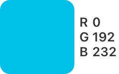 | 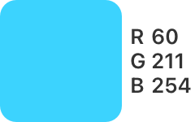 |  | 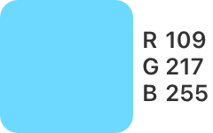 |
| Blue | [blue](https://developer.apple.com/documentation/SwiftUI/Color/blue) | 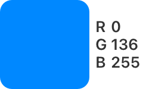 | 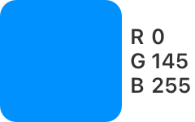 | 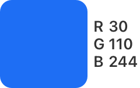 | 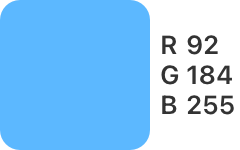 |
| Indigo | [indigo](https://developer.apple.com/documentation/SwiftUI/Color/indigo) | 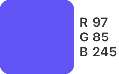 | 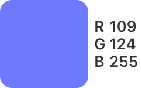 | 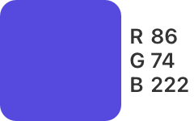 | 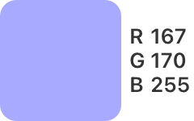 |
| Purple | [purple](https://developer.apple.com/documentation/SwiftUI/Color/purple) | 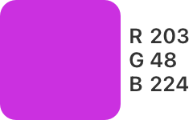 | 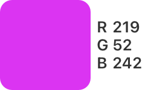 | 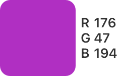 | 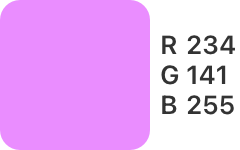 |
| Pink | [pink](https://developer.apple.com/documentation/SwiftUI/Color/pink) | 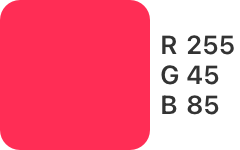 |  | 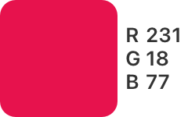 | 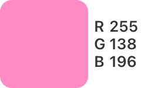 |
| Brown | [brown](https://developer.apple.com/documentation/SwiftUI/Color/brown) | 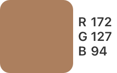 |  |  |  |

visionOS system colors use the default dark color values.

### iOS, iPadOS system gray colors

| Name | UIKit API | Default (light) | Default (dark) | Increased contrast (light) | Increased contrast (dark) |
| --- | --- | --- | --- | --- | --- |
| Gray | [systemGray](https://developer.apple.com/documentation/UIKit/UIColor/systemGray) |  |  |  |  |
| Gray (2) | [systemGray2](https://developer.apple.com/documentation/UIKit/UIColor/systemGray2) |  |  |  |  |
| Gray (3) | [systemGray3](https://developer.apple.com/documentation/UIKit/UIColor/systemGray3) |  |  |  |  |
| Gray (4) | [systemGray4](https://developer.apple.com/documentation/UIKit/UIColor/systemGray4) |  |  |  |  |
| Gray (5) | [systemGray5](https://developer.apple.com/documentation/UIKit/UIColor/systemGray5) |  |  |  |  |
| Gray (6) | [systemGray6](https://developer.apple.com/documentation/UIKit/UIColor/systemGray6) |  |  |  |  |

In SwiftUI, the equivalent of `systemGray` is [gray](https://developer.apple.com/documentation/SwiftUI/Color/gray).

## Resources

#### Related

[Dark Mode](./dark-mode.md)

[Accessibility](./accessibility.md)

[Materials](./materials.md)

[Apple Design Resources](https://developer.apple.com/design/resources/)

#### Developer documentation

[Color](https://developer.apple.com/documentation/SwiftUI/Color) — SwiftUI

[UIColor](https://developer.apple.com/documentation/UIKit/UIColor) — UIKit

[Color](https://developer.apple.com/documentation/AppKit/color) — AppKit

#### Videos

- [Meet Liquid Glass](https://developer.apple.com/videos/play/wwdc2025/219)

## Change log

| Date | Changes |
| --- | --- |
| December 16, 2025 | Updated guidance for Liquid Glass. |
| June 9, 2025 | Updated system color values, and added guidance for Liquid Glass. |
| February 2, 2024 | Distinguished UIKit and SwiftUI gray colors in iOS and iPadOS, and added guidance for balancing brightness levels in visionOS apps. |
| September 12, 2023 | Enhanced guidance for using background color in watchOS views, and added color swatches for tvOS. |
| June 21, 2023 | Updated to include guidance for visionOS. |
| June 5, 2023 | Updated guidance for using background color in watchOS. |
| December 19, 2022 | Corrected RGB values for system mint color (Dark Mode) in iOS and iPadOS. |
