# Complications

A complication displays timely, relevant information on the watch face, where people can view it each time they raise their wrist.

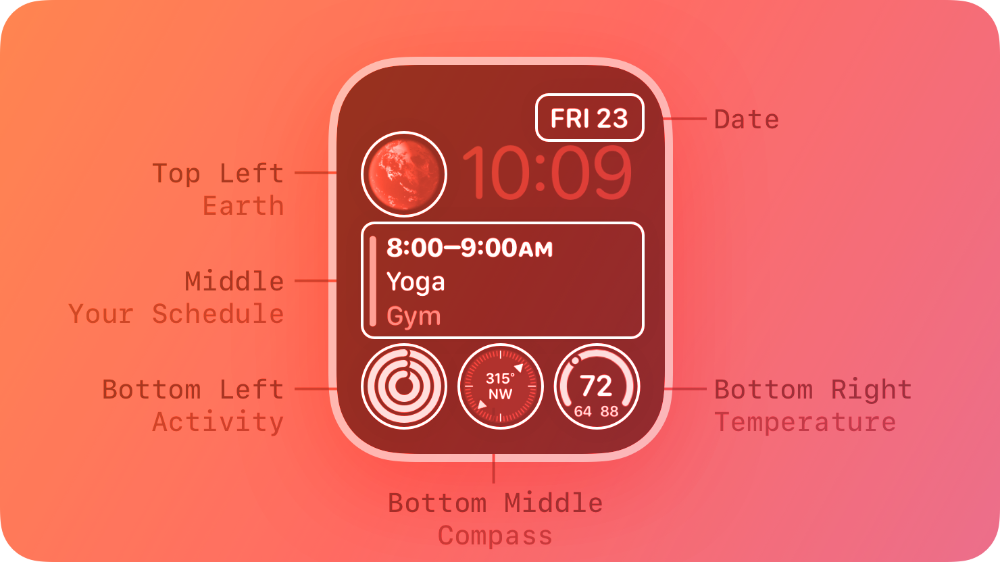

People often prefer apps that provide multiple, powerful complications, because it gives them quick ways to view the data they care about, even when they don’t open the app.

Most watch faces can display at least one complication; some can display four or more.

Starting in watchOS 9, the system organizes complications (also known as *accessories*) into several families — like [circular](https://developer.apple.com/design/human-interface-guidelines/complications#Circular) and [inline](https://developer.apple.com/design/human-interface-guidelines/complications#Inline) — and defines some recommended layouts you can use to display your complication data. A watch face can specify the family it supports in each complication slot. Complications that work in earlier versions of watchOS can use the [legacy templates](https://developer.apple.com/design/human-interface-guidelines/complications#Legacy-templates), which define nongraphic complication styles that don’t take on a wearer’s selected color.

> **Note:**
> Prefer using [WidgetKit](https://developer.apple.com/documentation/WidgetKit) to develop complications for watchOS 9 and later. For guidance, see [Migrating ClockKit complications to WidgetKit](https://developer.apple.com/documentation/WidgetKit/Converting-A-ClockKit-App). To support earlier versions of watchOS, continue to implement the ClockKit complication data source protocol (see [CLKComplicationDataSource](https://developer.apple.com/documentation/ClockKit/CLKComplicationDataSource)).

## Best practices

**Identify essential, dynamic content that people want to view at a glance.** Although people can use a complication to quickly launch an app, the complication behavior they appreciate more is the display of relevant information that always feels up to date. A static complication that doesn’t display meaningful data may be less likely to remain in a prominent position on the watch face.

**Support all complication families when possible.** Supporting more families means that your complications are available on more watch faces. If you can’t display useful information for a particular complication family, provide an image that represents your app — like your app icon — that still lets people launch your app from the watch face.

**Consider creating multiple complications for each family.** Supporting multiple complications helps you take advantage of shareable watch faces and lets people configure a watch face that’s centered on an app they love. For example, an app that helps people train for triathlons could offer three circular complications — one for each segment of the race — each of which deep-links to the segment-specific area in the app. This app could also offer a shareable watch face that’s preconfigured to include its swimming, biking, and running complications and to use its custom images and colors. When people choose this watch face, they don’t have to do any configuration before they can start using it. For guidance, see [Watch faces](./watch-faces.md).

**Define a different deep link for each complication you support.** It works well when each complication opens your app to the most relevant area. If all the complications you support open the same area in your app, they can seem less useful.

**Keep privacy in mind.** With the Always-On Retina display, information on the watch face might be visible to people other than the wearer. Make sure you help people prevent potentially sensitive information from being visible to others. For guidance, see [Always On](./always-on.md).

**Carefully consider when to update data.** You provide a complication’s data in the form of a timeline where each entry has a value that specifies the time at which to display your data on the watch face. Different data sets might require different time values. For example, a meeting app might display information about an upcoming meeting an hour before the meeting starts, but a weather app might display forecast information at the time those conditions are expected to occur. You can update the timeline a limited number of times each day, and the system stores a limited number of timeline entries for each app, so you need to choose times that enhance the usefulness of your data. For developer guidance, see [Migrating ClockKit complications to WidgetKit](https://developer.apple.com/documentation/WidgetKit/Converting-A-ClockKit-App#Configure-your-timeline-provider).

## Visual design

**Choose a ring or gauge style based on the data you need to display.** Many families support a ring or gauge layout that provides consistent ways to represent numerical values that can change over time. For example:

- The closed style can convey a value that’s a percentage of a whole, such as for a battery gauge.
- The open style works well when the minimum and maximum values are arbitrary — or don’t represent a percentage of the whole — like for a speed indicator.
- Similar to the open style, the segmented style also displays values within an app-defined range, and can convey rapid value changes, such as in the Noise complication.

**Make sure images look good in tinted mode.** In tinted mode, the system applies a solid color to a complication’s text, gauges, and images, and desaturates full-color images unless you provide tinted versions of them. For developer guidance, see [WidgetRenderingMode](https://developer.apple.com/documentation/WidgetKit/WidgetRenderingMode). (If you’re using legacy templates, tinted mode applies only to graphic complications.) To help your complications perform well in tinted mode:

- Avoid using color as the only way to communicate important information. You want people to get the same information in tinted mode as they do in nontinted mode.
- When necessary, provide an alternative tinted-mode version of a full-color image. If your full-color image doesn’t look good when it’s desaturated, you can supply a different version of the image for the system to use in tinted mode.

**Recognize that people might prefer to use tinted mode for complications, instead of viewing them in full color.** When people choose tinted mode, the system automatically desaturates your complication, converting it to grayscale and tinting its images, gauges, and text using a single color that’s based on the wearer’s selected color.

**When creating complication content, generally use line widths of two points or greater.** Thinner lines can be difficult to see at a glance, especially when the wearer is in motion. Use line weights that suit the size and complexity of the image.

**Provide a set of static placeholder images for each complication you support.** The system uses placeholder images when there’s no other content to display for your complication’s data. For example, when people first install your app, the system can display a static placeholder while it checks to see if your app can generate a localized placeholder to use instead. Placeholder images can also appear in the carousel from which people select complications. Note that complication image sizes vary per layout (and per legacy template) and the size of a placeholder image may not match the size of the actual image you supply for that complication. For developer guidance, see [placeholder(in:)](https://developer.apple.com/documentation/WidgetKit/TimelineProvider/placeholder(in:)).

## Circular

Circular layouts can include text, gauges, and full-color images in circular areas on the Infograph and Infograph Modular watch faces. The circular family also defines extra-large layouts for displaying content on the X-Large watch face.

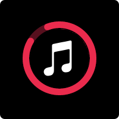

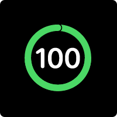

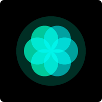

You can also add text to accompany a regular-size circular image, using a design that curves the text along the bezel of some watch faces, like Infograph. The text can fill nearly 180 degrees of the bezel before truncating.

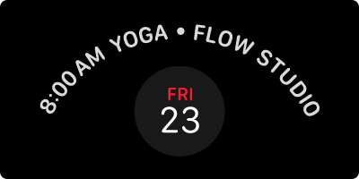

As you design images for a regular-size circular complication, use the following values for guidance.

| Image | 40mm | 41mm | 44mm | 45mm/49mm |
| --- | --- | --- | --- | --- |
| Image | 42x42 pt (84x84 px @2x) | 44.5x44.5 pt (89x89 px @2x) | 47x47 pt (94x94 px @2x) | 50x50 pt (100x100 px @2x) |
| Closed gauge | 27x27 pt (54x54 px @2x) | 28.5x28.5 pt (57x57 px @2x) | 31x31 pt (62x62 px @2x) | 32x32 pt (64x64 px @2x) |
| Open gauge | 11x11 pt (22x22 px @2x) | 11.5x11.5 pt (23x23 px @2x) | 12x12 pt (24x24 px @2x) | 13x13 pt (26x26 px @2x) |
| Stack (not text) | 28x14 pt (56x28 px @2x) | 29.5x15 pt (59X30 px @2x) | 31x16 pt (62x32px @ 2x) | 33.5x16.5 pt (67x33 px @2x) |

> **Note:**
> The system applies a circular mask to each image.

A SwiftUI view that implements a regular-size circular complication uses the following default text values:

- Style: Rounded
- Weight: Medium
- Text size: 12 pt (40mm), 12.5 pt (41mm), 13 pt (44mm), 14.5 pt (45mm/49mm)

If you want to design an oversized treatment of important information that can appear on the X-Large watch face — for example, the Contacts complication, which features a contact photo — use the extra-large versions of the circular family’s layouts. The following layouts let you display full-color images, text, and gauges in a large circular region that fills most of the X-Large watch face. Some of the text fields can support multicolor text.

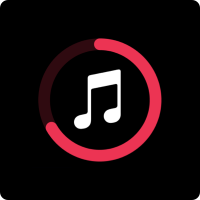

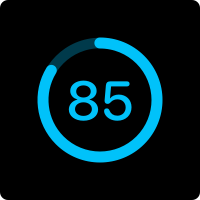

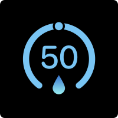

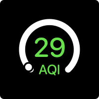

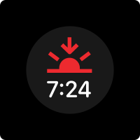

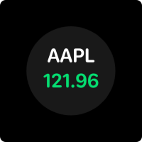

Use the following values for guidance as you create images for an extra-large circular complication.

| Image | 40mm | 41mm | 44mm | 45mm/49mm |
| --- | --- | --- | --- | --- |
| Image | 120x120 pt (240x240 px @2x) | 127x127 pt (254x254 px @2x) | 132x132 pt (264x264 px @2x) | 143x143 pt (286x286 px @2x) |
| Open gauge | 31x31 pt (62x62 px @2x) | 33x33 pt (66x66 px @2x) | 33x33 pt (66x66 px @2x) | 37x37 pt (74x74 px @2x) |
| Closed gauge | 77x77 pt (154x154 px @2x) | 81.5x81.5 (163x163 px @2x) | 87x87 pt (174x174 px @2x) | 91.5x91.5 (183x183 px @2x) |
| Stack | 80x40 pt (160x80 px @2x) | 85x42 (170x84 px @2x) | 87x44 pt (174x88 px @2x) | 95x48 pt (190x96 px @2x ) |

> **Note:**
> The system applies a circular mask to the circular, open-gauge, and closed-gauge images.

Use the following values to create no-content placeholder images for your circular-family complications.

| Layout | 38mm | 40mm/42mm | 41mm | 44mm | 45mm/49mm |
| --- | --- | --- | --- | --- | --- |
| Circular | – | 42x42 pt (84x84 px @2x) | 44.5x44.5 pt (89x89 px @2x) | 47x47 pt (94x94 px @2x) | 50x50 pt (100x100 px @2x) |
| Bezel | – | 42x42 pt (84x84 px @2x) | 44.5x44.5 pt (89x89 px @2x) | 47x47 pt (94x94 px @2x) | 50x50 pt (100x100 px @2x) |
| Extra Large | – | 120x120 pt (240x240 px @2x) | 127x127 pt (254x254 px @2x) | 132x132 pt (264x264 px @2x) | 143x143 pt (286x286 px @2x) |

A SwiftUI view that implements an extra-large circular layout uses the following default text values:

- Style: Rounded
- Weight: Medium
- Text size: 34.5 pt (40mm), 36.5 pt (41mm), 36.5 pt (44mm), 41 pt (45mm/49mm)

## Corner

Corner layouts let you display full-color images, text, and gauges in the corners of the watch face, like Infograph. Some of the templates also support multicolor text.

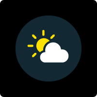

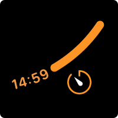

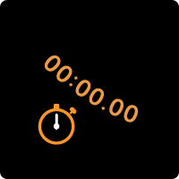

As you design images for a corner complication, use the following values for guidance.

| Image | 40mm | 41mm | 44mm | 45mm/49mm |
| --- | --- | --- | --- | --- |
| Circular | 32x32 pt (64x64 px @2x) | 34x34 pt (68x68 px @2x) | 36x36 pt (72x72 px @2x) | 38x38 pt (76x76 px @2x ) |
| Gauge | 20x20 pt (40x40 px @2x) | 21x21 pt (42x42 px @2x) | 22x22 pt (44x44 px @2x) | 24x24 pt (48x48 px @2x) |
| Text | 20x20 pt (40x40 px @2x) | 21x21 pt (42x42 px @2x) | 22x22 pt (44x44 px @2x) | 24x24 pt (48x48 px @2x) |

> **Note:**
> The system applies a circular mask to each image.

Use the following values to create no-content placeholder images for your corner-family complications.

| 38mm | 40mm/42mm | 41mm | 44mm | 45mm/49mm |
| --- | --- | --- | --- | --- |
| – | 20x20 pt (40x40 px @2x) | 21x21 pt (42x42 px @2x) | 22x22 pt (44x44 px @2x) | 24x24 pt (48x48 px @2x) |

A SwiftUI view that implements a corner layout uses the following default text values:

- Style: Rounded
- Weight: Semibold
- Text size: 10 pt (40mm), 10.5 pt (41mm), 11 pt (44mm), 12 pt (45mm/49mm)

## Inline

Inline layouts include utilitarian small and large layouts.

Utilitarian small layouts are intended to occupy a rectangular area in the corner of a watch face, such as the Chronograph and Simple watch faces. The content can include an image, interface icon, or a circular graph.

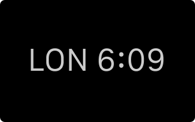

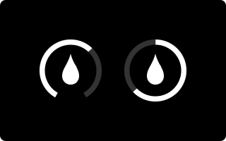

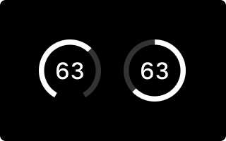

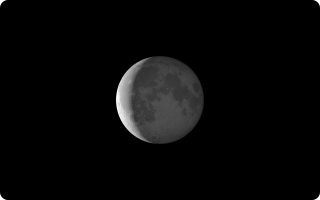

As you design images for a utilitarian small layout, use the following values for guidance.

| Content | 38mm | 40mm/42mm | 41mm | 44mm | 45mm/49mm |
| --- | --- | --- | --- | --- | --- |
| Flat | 9-21x9 pt (18-42x18 px @2x) | 10-22x10 pt (20-44x20 px @2x) | 10.5-23.5x21 pt (21-47x21 @2x) | N/A | 12-26x12 pt (24-52x24 px @2x) |
| Ring | 14x14 pt (28x28 px @2x) | 14x14 pt (28x28 px @2x) | 15x15 pt (30x30 px @2x) | 16x16 pt (32x32 px @2x) | 16.5x16.5 pt (33x33 px @2x) |
| Square | 20x20 pt (40x40 px @2x) | 22x22 pt (44x44 px @2x) | 23.5x23.5 pt (47x47 px @2x) | 25x25 pt (50x50 px @2x) | 26x26 pt (52x52 px @2x) |

The utilitarian large layout is primarily text-based, but also supports an interface icon placed on the leading side of the text. This layout spans the bottom of a watch face, like the Utility or Motion watch faces.

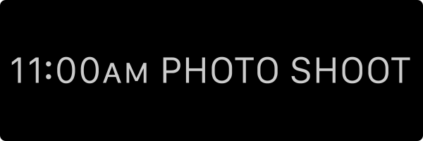

As you design images for a utilitarian large layout, use the following values for guidance.

| Content | 38mm | 40mm/42mm | 41mm | 44mm | 45mm/49mm |
| --- | --- | --- | --- | --- | --- |
| Flat | 9-21x9 pt (18-42x18 px @2x) | 10-22x10 pt (20-44x20 px @2x) | 10.5-23.5x10.5 pt (21-47x21 px @2x) | N/A | 12-26x12 pt (24-52x24 px @2x) |

## Rectangular

Rectangular layouts can display full-color images, text, a gauge, and an optional title in a large rectangular region. Some of the text fields can support multicolor text.

The large rectangular region works well for showing details about a value or process that changes over time, because it provides room for information-rich charts, graphs, and diagrams. For example, the Heart Rate complication displays a graph of heart-rate values within a 24-hour period. The graph uses high-contrast white and red for the primary content and a lower-contrast gray for the graph lines and labels, making the data easy to understand at a glance.

Starting with watchOS 10, if you have created a rectangular layout for your watchOS app, the system may display it in the Smart Stack. You can optimize this presentation in a few ways:

- By supplying background color or content that communicates information or aids in recognition
- By using [intents](https://developer.apple.com/documentation/appintents/app-intents) to specify relevancy, and help ensure that your widget is displayed in the Smart Stack at times that are most appropriate and useful to people
- By creating a custom layout of your information that is optimized for the Smart Stack

For developer guidance, see [WidgetFamily.accessoryRectangular](https://developer.apple.com/documentation/WidgetKit/WidgetFamily/accessoryRectangular). See [Widgets](./widgets.md) for additional guidance on designing widgets for the Smart Stack.

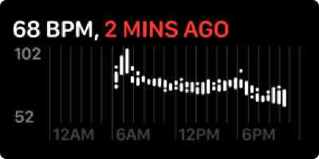

Use the following values for guidance as you create images for a rectangular layout.

| Content | 40mm | 41mm | 44mm | 45mm/49mm |
| --- | --- | --- | --- | --- |
| Large image with title * | 150x47 pt (300x94 px @2x) | 159x50 pt (318x100 px @2x) | 171x54 pt (342x108 px @2x) | 178.5x56 pt (357x112 px @2x) |
| Large image without title * | 162x69 pt (324x138 px @2x) | 171.5x73 pt (343x146 px @2x) | 184x78 pt (368x156 px @2x) | 193x82 pt (386x164 px @2x) |
| Standard body | 12x12 pt (24x24 px @2x) | 12.5x12.5 pt (25x25 px @2x) | 13.5x13.5 pt (27x27 px @2x) | 14.5x14.5 pt (29x29 px @2x) |
| Text gauge | 12x12 pt (24x24 px @2x) | 12.5x12.5 pt (25x25 px @2x) | 13.5x13.5 pt (27x27 px @2x) | 14.5x14.5 pt (29x29 px @2x) |

> **Note:**
> Both large-image layouts automatically include a four-point corner radius.

A SwiftUI view that implements a rectangular layout uses the following default text values:

- Style: Rounded
- Weight: Medium
- Text size: 16.5 pt (40mm), 17.5 pt (41mm), 18 pt (44mm), 19.5 pt (45mm/49mm)

## Legacy templates

### Circular small

Circular small templates display a small image or a few characters of text. They appear in the corner of the watch face (for example, in the Color watch face).

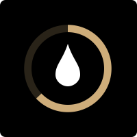

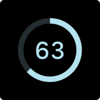

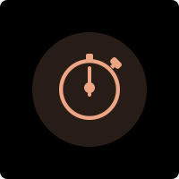

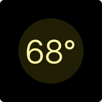

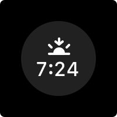

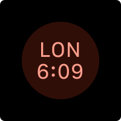

As you design images for a circular small complication, use the following values for guidance.

| Image | 38mm | 40mm/42mm | 41mm | 44mm | 45mm/49mm |
| --- | --- | --- | --- | --- | --- |
| Ring | 20x20 pt (40x40 px @2x) | 22x22 pt (44x44 px @2x) | 23.5x23.5 pt (47x47 px @2x) | 24x24 pt (48x48 px @2x) | 26x26 pt (52x52 px @2x) |
| Simple | 16x16 pt (32x32 px @2x) | 18x18 pt (36x36 px @2x) | 19x19 pt (38x38 px @2x) | 20x20 pt (40x40 px @2x) | 21.5x21.5 pt (43x43 px @2x) |
| Stack | 16x7 pt (32x14 px @2x) | 17x8 pt (34x16 px @2x) | 18x8.5 pt (36x17 px @2x) | 19x9 pt (38x18 px @2x) | 19x9.5 pt (38x19 px @2x) |
| Placeholder | 16x16 pt (32x32 px @2x) | 18x18x pt (36x36 px @2x) | 19x19 pt (38x38 px @2x) | 20x20 pt (40x40 px @2x) | 21.5x21.5 pt (43x43 px @2x) |

> **Note:**
> In each stack measurement, the width value represents the maximum size.

### Modular small

Modular small templates display two stacked rows consisting of an icon and content, a circular graph, or a single larger item (for example, the bottom row of complications on the Modular watch face).

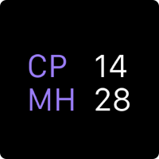

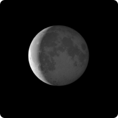

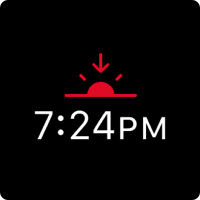

As you design icons and images for a modular small complication, use the following values for guidance.

| Image | 38mm | 40mm/42mm | 41mm | 44mm | 45mm/49mm |
| --- | --- | --- | --- | --- | --- |
| Ring | 18x18 pt (36x36 px @2x) | 19x19 pt (38x38 px @2x) | 20x20 pt (40x40 px @2x) | 21x21 pt (42x42 px @2x) | 22.5x22.5 pt (45x45 px @2x) |
| Simple | 26x26 pt (52x52 px @2x) | 29x29 pt (58x58 px @2x) | 30.5x30.5 pt (61x61 px @2x) | 32x32 pt (64x64 px @2x) | 34.5x34.5 pt (69x69 px @2x) |
| Stack | 26x14 pt (52x28 px @2x) | 29x15 pt (58x30 px @2x) | 30.5x16 pt (61x32 px @2x) | 32x17 pt (64x34 px @2x) | 34.5x18 pt (69x36 px @2x) |
| Placeholder | 26x26 pt (52x52 px @2x) | 29x29 pt (58x58 px @2x) | 30.5x30.5 pt (61x61 px @2x) | 32x32 pt (64x64 px @2x) | 34.5x34.5 pt (69x69 px @2x) |

> **Note:**
> In each stack measurement, the width value represents the maximum size.

### Modular large

Modular large templates offer a large canvas for displaying up to three rows of content (for example, in the center of the Modular watch face).

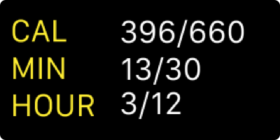

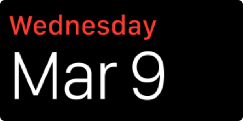

As you design icons and images for a modular large complication, use the following values for guidance.

| Content | 38mm | 40mm/42mm | 41mm | 44mm | 45mm/49mm |
| --- | --- | --- | --- | --- | --- |
| Columns | 11-32x11 pt (22-64x22 px @2x) | 12-37x12 pt (24-74x24 px @2x) | 12.5-39x12.5 pt (25-78x25 px @2x) | 14-42x14 pt (28-84x28 px @2x) | 14.5-44x14.5 pt (29-88x29 px @2x) |
| Standard body | 11-32x11 pt (22-64x22 px @2x) | 12-37x12 pt (24-74x24 px @2x) | 12.5-39x12.5 pt (25-78x25 px @2x) | 14-42x14 pt (28-84x28 px @2x) | 14.5-44x14.5 pt (29-88x29 px @2x) |
| Table | 11-32x11 pt (22-64x22 px @2x) | 12-37x12 pt (24-74x24 px @2x) | 12.5-39x12.5 pt (25-78x25 px @2x) | 14-42x14 pt (28-84x28 px @2x) | 14.5-44x14.5 pt (29-88x29 px @2x) |

### Extra large

Extra large templates display larger text and images (for example, on the X-Large watch faces).

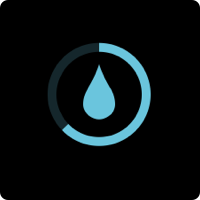

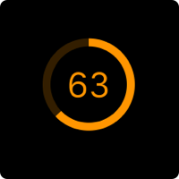

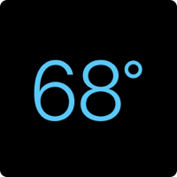

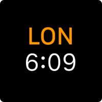

As you design icons and images for an extra large complication, use the following values for guidance.

| Image | 38mm | 40mm/42mm | 41mm | 44mm | 45mm/49mm |
| --- | --- | --- | --- | --- | --- |
| Ring | 63x63 pt (126x126 px @2x) | 66.5x66.5 pt (133x133 px @2x) | 70.5x70.5 pt (141x141 px @2x) | 73x73 pt (146x146 px @2x) | 79x79 pt (158x158 px @2x) |
| Simple | 91x91 pt (182x182 px @2x) | 101.5x101.5 pt (203x203 px @2x) | 107.5x107.5 pt (215x215 px @2x) | 112x112 pt (224x224 px @2x) | 121x121 pt (242x242 px @2x ) |
| Stack | 78x42 pt (156x84 px @2x) | 87x45 pt (174x90 px @2x) | 92x47.5 pt (184x95 px @2x) | 96x51 pt (192x102 px @2x) | 103.5x53.5 pt (207x107 px @2x) |
| Placeholder | 91x91 pt (182x182 px @2x) | 101.5x101.5 pt (203x203 px @2x) | 107.5x107.5 pt (215x215 px @2x) | 112x112 pt (224x224 px @2x) | 121x121 pt (242x242 px @2x) |

> **Note:**
> In each stack measurement, the width value represents the maximum size.

## Platform considerations

*Not supported in iOS, iPadOS, macOS, tvOS, or visionOS.*

## Resources

#### Related

[Watch faces](./watch-faces.md)

#### Developer documentation

[WidgetKit](https://developer.apple.com/documentation/WidgetKit)

#### Videos

- [Design widgets for the Smart Stack on Apple Watch](https://developer.apple.com/videos/play/wwdc2023/10309)
- [Go further with Complications in WidgetKit](https://developer.apple.com/videos/play/wwdc2022/10051)
- [Complications and widgets: Reloaded](https://developer.apple.com/videos/play/wwdc2022/10050)

## Change log

| Date | Changes |
| --- | --- |
| October 24, 2023 | Replaced links to deprecated ClockKit documentation with links to WidgetKit documentation. |
| June 5, 2023 | Updated guidance for rectangular complications to support them as widgets in the Smart Stack. |
| September 14, 2022 | Added specifications for Apple Watch Ultra. |
