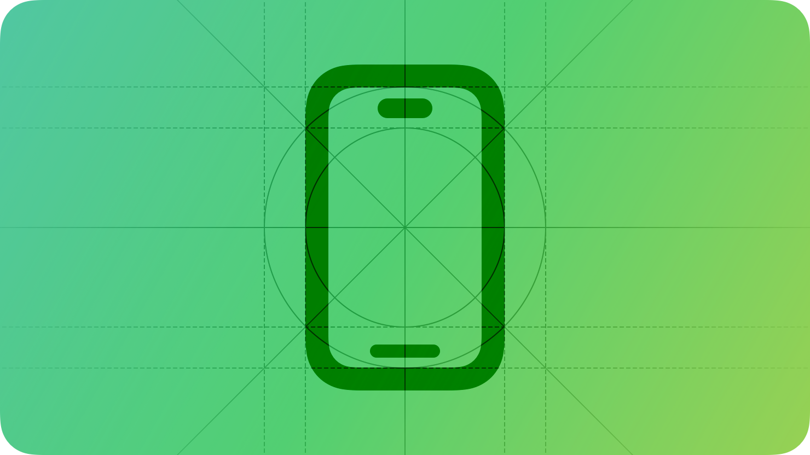

# Designing for iOS

People depend on their iPhone to help them stay connected, play games, view media, accomplish tasks, and track personal data in any location and while on the go.

As you begin designing your app or game for iOS, start by understanding the following fundamental device characteristics and patterns that distinguish the iOS experience. Using these characteristics and patterns to inform your design decisions can help you provide an app or game that iPhone users appreciate.

**Display.** iPhone has a medium-size, high-resolution display.

**Ergonomics.** People generally hold their iPhone in one or both hands as they interact with it, switching between landscape and portrait orientations as needed. While people are interacting with the device, their viewing distance tends to be no more than a foot or two.

**Inputs.** Multi-Touch [gestures](https://developer.apple.com/design/human-interface-guidelines/gestures), [virtual keyboards](https://developer.apple.com/design/human-interface-guidelines/virtual-keyboards), and [voice](https://developer.apple.com/design/human-interface-guidelines/siri) control let people perform actions and accomplish meaningful tasks while they’re on the go. In addition, people often want apps to use their [personal data](https://developer.apple.com/design/human-interface-guidelines/privacy) and input from the device’s [gyroscope and accelerometer](https://developer.apple.com/design/human-interface-guidelines/gyro-and-accelerometer), and they may also want to participate in [spatial interactions](https://developer.apple.com/design/human-interface-guidelines/spatial-interactions).

**App interactions.** Sometimes, people spend just a minute or two checking on event or social media updates, tracking data, or sending messages. At other times, people can spend an hour or more browsing the web, playing games, or enjoying media. People typically have multiple apps open at the same time, and they appreciate switching frequently among them.

**System features.** iOS provides several features that help people interact with the system and their apps in familiar, consistent ways.

- [Widgets](./widgets.md)
- [Home Screen quick actions](./home-screen-quick-actions.md)
- [Spotlight](https://developer.apple.com/design/human-interface-guidelines/searching)
- [Shortcuts](https://developer.apple.com/design/human-interface-guidelines/siri#Shortcuts-and-suggestions)
- [Activity views](./activity-views.md)

## Best practices

Great iPhone experiences integrate the platform and device capabilities that people value most. To help your design feel at home in iOS, prioritize the following ways to incorporate these features and capabilities.

- Help people concentrate on primary tasks and content by limiting the number of onscreen controls while making secondary details and actions discoverable with minimal interaction.
- Adapt seamlessly to appearance changes — like device orientation, Dark Mode, and Dynamic Type — letting people choose the configurations that work best for them.
- Support interactions that accommodate the way people usually hold their device. For example, it tends to be easier and more comfortable for people to reach a control when it’s located in the middle or bottom area of the display, so it’s especially important let people swipe to navigate back or initiate actions in a list row.
- With people’s permission, integrate information available through platform capabilities in ways that enhance the experience without asking people to enter data. For example, you might accept payments, provide security through biometric authentication, or offer features that use the device’s location.

## Resources

#### Related

[Apple Design Resources](https://developer.apple.com/design/resources/#ios-apps)

#### Developer documentation

[iOS Pathway](https://developer.apple.com/ios/get-started/)

#### Videos

- [Meet Liquid Glass](https://developer.apple.com/videos/play/wwdc2025/219)
- [Get to know the new design system](https://developer.apple.com/videos/play/wwdc2025/356)
