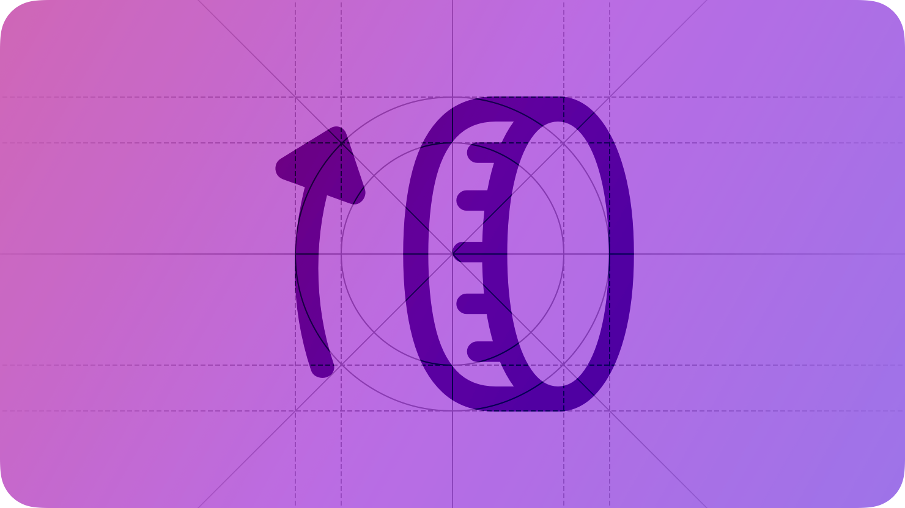
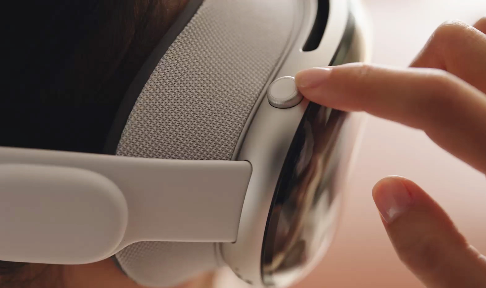
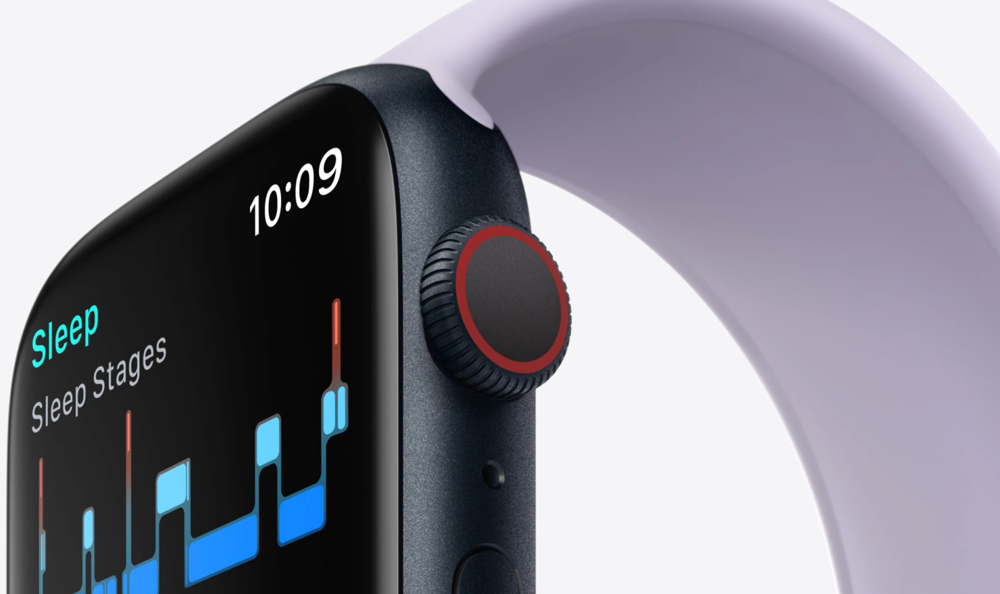

# Digital Crown

The Digital Crown is an important hardware input for Apple Vision Pro and Apple Watch.

On both Apple Vision Pro and Apple Watch, people can use the Digital Crown to interact with the system; on Apple Watch, people can also use the Digital Crown to interact with apps.

## Apple Vision Pro

On Apple Vision Pro, people use the Digital Crown to:

- Adjust volume
- Adjust the amount of immersion in a portal, an Environment, or an app or game running in a Full Space (for guidance, see [Immersive experiences](./immersive-experiences.md))
- Recenter content so it’s in front of them
- Open Accessibility settings
- Exit an app and return to the Home View

## Apple Watch

As people turn the Digital Crown, it generates information you can use to enhance or facilitate interactions with your app, like scrolling or operating standard or custom controls.

Starting with watchOS 10, the Digital Crown takes on an elevated role as the primary input for navigation. On the watch face, people turn the Digital Crown to view widgets in the Smart Stack, and on the Home Screen, people use it to move vertically through their collection of apps. Within apps, people turn the Digital Crown to switch between vertically paginated tabs, and to scroll through list views and variable height pages.

Beyond its use for navigation, turning the Digital Crown generates information you can use to enhance or facilitate interactions with your app, such as inspecting data or operating standard or custom controls.

> **Note:**
> Apps don’t respond to presses on the Digital Crown because watchOS reserves these interactions for system-provided functionality like revealing the Home Screen.

Most Apple Watch models provide haptic feedback for the Digital Crown, which gives people a more tactile experience as they scroll through content. By default, the system provides linear haptic *detents* — or taps — as people turn the Digital Crown a specific distance. Some system controls, like table views, provide detents as new items scroll onto the screen.

**Anchor your app’s navigation to the Digital Crown.** Starting with watchOS 10, turning the Digital Crown is the main way people navigate within and between apps. List, tab, and scroll views are vertically oriented, allowing people to use the Digital Crown to easily move between the important elements of your app’s interface. When anchoring interactions to the Digital Crown, also be sure to back them up with corresponding touch screen interactions.

**Consider using the Digital Crown to inspect data in contexts where navigation isn’t necessary.** In contexts where the Digital Crown doesn’t need to navigate through lists or between pages, it’s a great tool to inspect data in your app. For example, in World Clock, turning the Digital Crown advances the time of day at a selected location, allowing people to compare various times of day to their current time.

**Provide visual feedback in response to Digital Crown interactions.** For example, pickers change the currently displayed value as people use the Digital Crown. If you track turns directly, use this data to update your interface programmatically. If you don’t provide visual feedback, people are likely to assume that turning the Digital Crown has no effect in your app.

**Update your interface to match the speed with which people turn the Digital Crown.** People expect turning the Digital Crown to give them precise control over an interface, so it works well to use this speed to determine the speed at which you make changes. Avoid updating content at a rate that makes it difficult for people to select values.

**Use the default haptic feedback when it makes sense in your app.** If haptic feedback doesn’t feel right in the context of your app — for example, if the default detents don’t match your app’s animation — turn off the detents. You can also adjust the haptic feedback behavior for tables, letting them use linear detents instead of row-based detents. For example, if your table has rows with significantly different heights, linear detents may give people a more consistent experience.

## Platform considerations

*Not supported in iOS, iPadOS, macOS, or tvOS.*

## Resources

#### Related

[Feedback](./feedback.md)

[Action button](./action-button.md)

[Immersive experiences](./immersive-experiences.md)

#### Developer documentation

[WKCrownDelegate](https://developer.apple.com/documentation/WatchKit/WKCrownDelegate) — WatchKit

## Change log

| Date | Changes |
| --- | --- |
| December 5, 2023 | Added artwork for Apple Vision Pro and Apple Watch, and clarified that visionOS apps don’t receive direct information from the Digital Crown. |
| June 21, 2023 | Updated to include guidance for visionOS. |
| June 5, 2023 | Added guidelines emphasizing the central role of the Digital Crown for navigation. |
