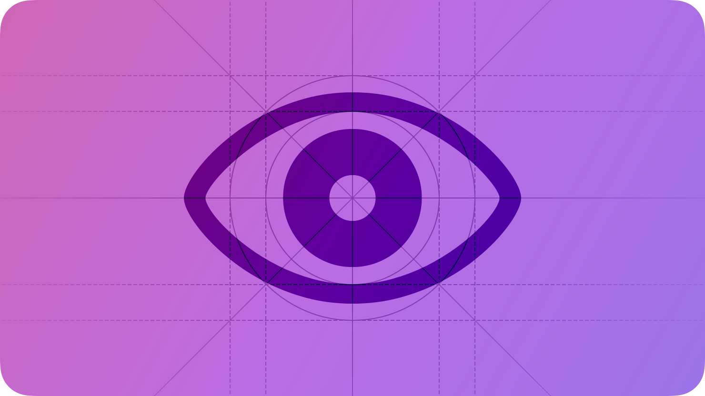
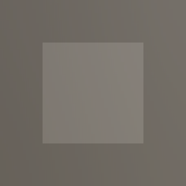

# Eyes

In visionOS, people look at a virtual object to identify it as a target they can interact with.

When people look at an interactive element, visionOS highlights it, providing visual feedback that helps them confirm the item is one they want. The visual feedback, or *hover effect*, shows people that they can use an [visionOS](./gestures.md) like tap to interact with the element.

In some cases, the system can automatically display an expanded view of a component after people look at it. For example, when people look at a tab bar, the entire bar resizes to reveal text labels next to each tab. In this scenario, an individual tab also highlights before the tab bar expansion to let people select it before revealing the labels. Another example is a button that can reveal a tooltip when people look at it.

> **Important:**
> To help preserve people’s privacy, visionOS doesn’t provide direct information about where people are looking before they tap. When you use system-provided components, visionOS automatically tells you when people tap the component. For developer guidance, see [Adopting best practices for privacy and user preferences](https://developer.apple.com/documentation/visionOS/adopting-best-practices-for-privacy).

visionOS also supports *focus effects* that help people navigate apps and the system using a connected input device like a keyboard or game controller. Focus effects are unrelated to the hover effect; to learn more, see [Focus and selection](./focus-and-selection.md).

## Best practices

**Always give people multiple ways to interact with your app.** Design your app to support the accessibility features people use to personalize the ways they interact with their devices. For guidance, see [Accessibility](./accessibility.md).

**Design for visual comfort.** Help people accomplish their primary task by making sure that the objects they need to use are within their [Field of view](./spatial-layout.md). When your app or game is running in the Shared Space or a Full Space, the system automatically places the first window or volume people open in a convenient location in front of them. While running in a Full Space, your app or game can also request access to information about a person’s head pose to help you place 3D content appropriately. In all cases, you can improve the visual comfort of your experience when you avoid requiring people to make multiple quick eye adjustments, either over a large area or through multiple levels of depth. For guidance, see [Depth](./spatial-layout.md).

**Place content at a comfortable viewing distance.** For example, to help people remain comfortable while they read or engage with content over time, aim to place it at least one meter away. In general, you don’t want to place content very close to people unless they’ll view or interact with it for only a little while.

**Prefer using standard UI components.** System-provided components respond consistently when people look at them. If your custom components use different visual cues to provide visual feedback, it can be difficult for people to learn and remember how these components work.

## Making items easy to see

**Minimize visual distractions.** When there’s a lot of visual noise, it can be difficult for people to find the object they’re looking for. Visual movement can be even more distracting: When people sense movement — especially in their peripheral vision — they tend to respond automatically by looking at it, making it hard to keep looking at the object they’re interested in. For example, revealing content near a button people are looking at can cause them to involuntarily look at the new content instead of the button.

**Make it easy for people to look at an item by providing enough space around it.** Because eyes naturally tend to make small, quick adjustments in direction even while people are looking at one place, crowding UI objects together can make it difficult for people to look at one of them without jumping to another. You can help ensure that there’s enough space between interactive items by using a margin of at least 16 points around the bounds of each item or by placing items so that their centers are always at least 60 points apart. For additional layout guidance, see [Layout](./layout.md) and [Spatial layout](./spatial-layout.md).

**Avoid using a repeating pattern or texture that fills the field of view.** In some cases, people’s eyes can lock onto different elements in a pattern or texture, making the elements appear to have different depths. To avoid this effect, consider using the pattern in a smaller area.

## Encouraging interaction

**Consider using subtle visual cues to encourage people to look at the item they’re most likely to want.** For example, it often works well to place the item near the center of the field of view or use techniques like gentle motion, increased contrast, or variations in color or scale to draw people’s attention. In general, prefer cues that are noticeable without being flashy or harsh.

**In general, give an interactive item a rounded shape.** People’s eyes tend to be drawn toward the corners in a shape, making it difficult to keep looking at the shape’s center. The more rounded an item’s shape, the easier it is for people to use their eyes to target it.

**If you create an interactive component that consists of more than one element, be sure to provide an overall containing shape that visionOS can highlight.** For example, if an image and a label below it combine to act as one interactive component, you need to define a custom region that encompasses both elements, allowing visionOS to highlight the entire region when people look at either element.

## Custom hover effects

When it makes sense in your app or game, you can design a hover effect that animates in a custom way when people look at an element, including system-provided or custom UI elements and RealityKit entities. You can use a custom hover effect to replace or augment a standard effect.

Before you start designing custom hover effects, it’s important to understand how they work. To enable a custom hover effect for an element, you create two states or appearances for it: one that shows the custom hover effect and one that doesn’t. When someone looks at the element in your app or game, the system applies your predefined hover effect in a process that’s outside of your software’s process. This means that you don’t know when the system applies a custom hover effect or what state the element is in at that moment. The out-of-process nature of a custom hover effect also means that it can’t run code that requires knowing when people are looking at the element.

As an example that shows what a custom hover effect can and can’t do, consider a photo-browsing app where a photo’s custom effect displays a different symbol depending on whether people have added the photo to Favorites. The app specifies the appropriate symbol for a photo’s custom hover effect and the system displays the effect if people look at the photo. However, the hover effect can’t perform the favoriting action because the system doesn’t tell the app when someone is looking at the photo.

**Prefer using a custom hover effect to emphasize or enhance a special moment in your experience.** People are accustomed to the standard hover effects that provide visual feedback or, in the case of tab bars or tooltips, additional information, so a custom hover effect can be especially noticeable. Adding too many custom hover effects — or using them when standard effects are sufficient — can dilute the impact of your design, distract people from their task, and even cause visual discomfort.

**Choose the right delay.** An element’s custom hover effect can appear instantly, after a short delay, or after a slightly longer delay, depending on how you expect people to interact with the element.

- **No delay (default).** A custom hover effect that appears without delay tends to be especially useful when the effect is subtle or invites interaction, like when a knob appears on a slider.
- **Short delay.** Consider using a short delay to let people look at an element and quickly interact with it without waiting for the effect to appear; for example, the expansion of tabs in a tab bar works this way.
- **Long delay.** If your custom hover effect shows additional information, like when a tooltip appears below a button, a slightly longer delay can work well because most people won’t need to view the additional information every time.

**Aim to keep one or more of the element’s primary views unchanged in both states of a custom hover effect.** When at least one primary view remains constant during a hover effect’s animation, it provides visual stability that can help people follow the element’s transition. If all of an element’s views move or change during a custom hover effect, it can disorient people and make them lose track of what’s happening.

**Thoroughly test custom hover effects.** Testing is the only way to determine whether a custom hover effect looks good, responds appropriately, and makes your experience feel alive without distracting people. Aim to test your custom hover effects while wearing Apple Vision Pro so you can develop intuition about how to use them to enhance your experience.

## Platform considerations

*Not supported in iOS, iPadOS, macOS, tvOS, or watchOS.*

## Resources

#### Related

[Immersive experiences](./immersive-experiences.md)

[Gestures](./gestures.md)

[Spatial layout](./spatial-layout.md)

#### Developer documentation

[Adopting best practices for privacy and user preferences](https://developer.apple.com/documentation/visionOS/adopting-best-practices-for-privacy) — visionOS

#### Videos

- [Design hover interactions for visionOS](https://developer.apple.com/videos/play/wwdc2025/303)
- [Design for spatial input](https://developer.apple.com/videos/play/wwdc2023/10073)
- [Design considerations for vision and motion](https://developer.apple.com/videos/play/wwdc2023/10078)

## Change log

| Date | Changes |
| --- | --- |
| June 10, 2024 | Added guidance for custom hover effects. |
| March 29, 2024 | Added artwork showing the visionOS hover effect. |
| October 24, 2023 | Clarified the difference between focus effects and the visionOS hover effect. |
| June 21, 2023 | New page. |
