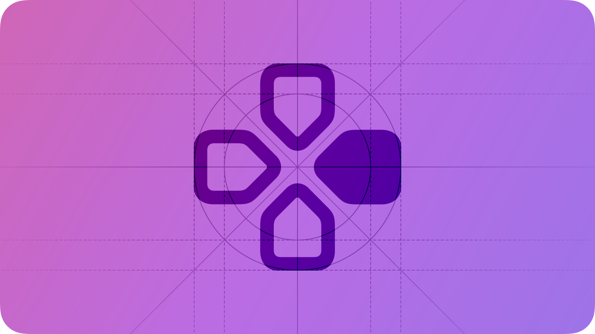
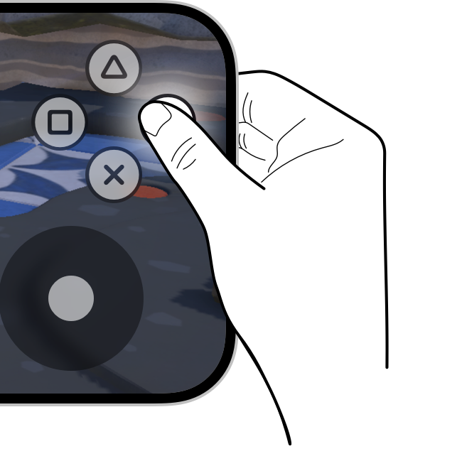
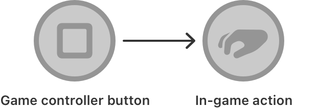
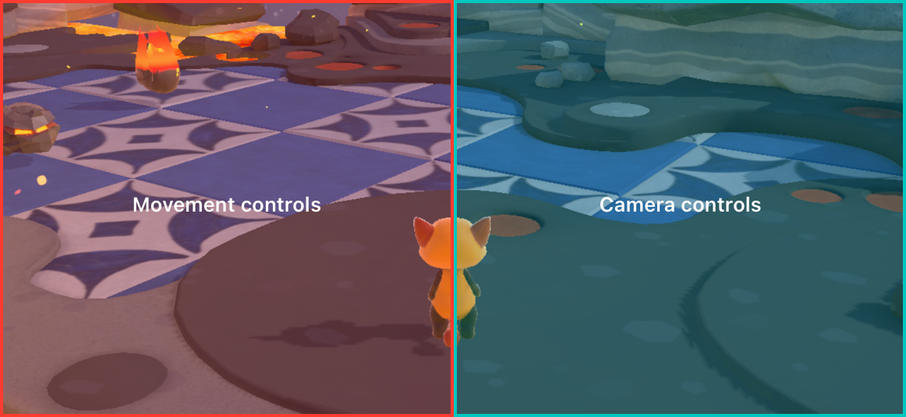
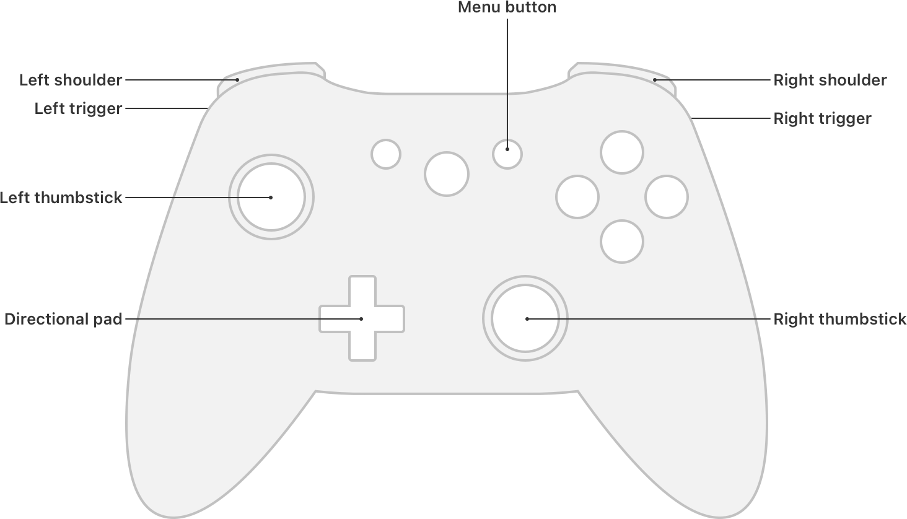
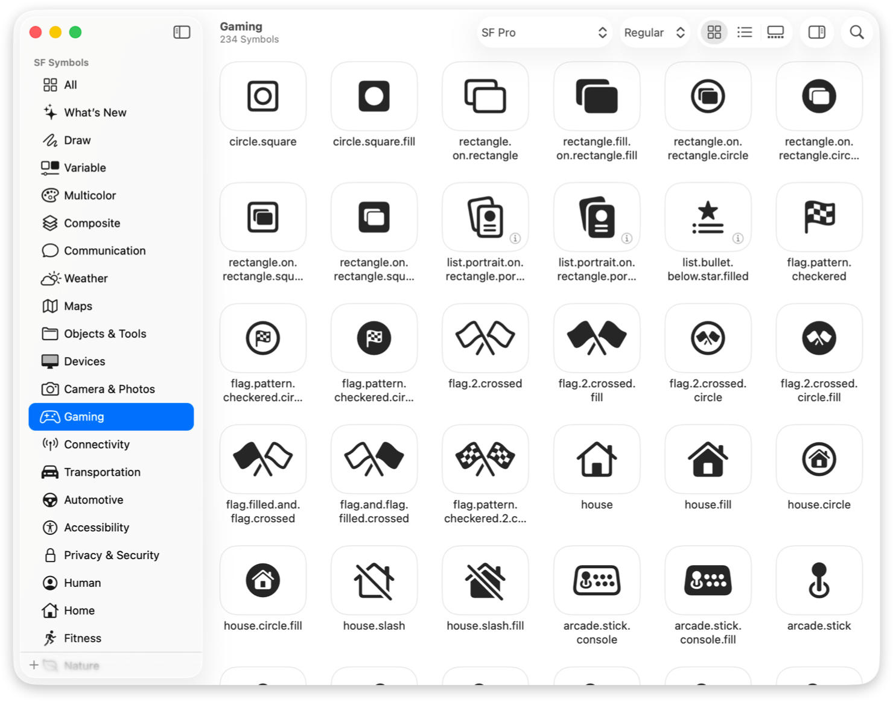

# Game controls

Precise, intuitive game controls enhance gameplay and can increase a player’s immersion in the game.

On Apple platforms, a game can support input from physical game controllers or default system interactions, like touch, a remote, or a mouse and keyboard. Players might prefer to use physical game controllers, but there are two important reasons to also support a platform’s default interaction methods:

- Even though all platforms except watchOS support physical game controllers, not every player might have access to one.
- Players appreciate games that let them use the platform interaction method they’re most familiar with.

To reach the widest audience and provide the best experience for each platform, keep these factors in mind when choosing the input methods to support.

## Touch controls

For iOS and iPadOS games, supporting touch interaction means that you can provide virtual controls on top of game content while also letting players interact with game elements by touching them directly. You can use the [Touch Controller](https://developer.apple.com/documentation/TouchController) framework to add these virtual controls to your game. Keep the following guidelines in mind to create an enjoyable touch control experience.

**Determine whether it makes sense to display virtual controls on top of game content.** In general, virtual game controls benefit games that offer a large number of actions or require players to control movement. However, sometimes gameplay is more immersive and effective when players can interact directly with in-game objects. Look for opportunities to reduce the amount of virtual controls that overlap your game content by associating actions with in-game gestures instead. For example, consider letting players tap objects to select them instead of adding a virtual selection button.

**Place virtual buttons where they’re easy to access.** Take into account the device’s boundaries and [Guides and safe areas](./layout.md) as well as comfortable locations for controls. Make sure to position buttons where they don’t overlap system features like the Home indicator or Dynamic Island on iPhone. Place frequently used buttons near a player’s thumb, avoiding the circular regions where players expect movement and camera input to happen. Place secondary controls, like menus, at the top of the screen.

**Make sure controls are large enough.** Make sure frequently used controls are a minimum size of 44x44 pt, and less important controls, such as menus, are a minimum size of 28x28 pt to accommodate people’s fingers.

**Always include visible and tactile press states.** A virtual control feels unresponsive without a visual and physical press state. Help players understand when they successfully interact with a button by adding a visual press state effect, such as a glow, that they can see even when their finger is covering the control. Combine this press state with sound and haptics to enhance the feeling of feedback. For guidance, see [Playing haptics](./playing-haptics.md).

**Use symbols that communicate the actions they perform.** Choose artwork that visually represents the action each button performs, such as a graphic of a weapon to represent an attack. Avoid using abstract shapes or controller-based naming like A, X, or R1 as artwork, which makes it harder for players to understand and remember what specific controls do.

**Show and hide virtual controls to reflect gameplay.** Take advantage of the dynamic nature of touch controls and adapt what controls players see onscreen depending on their context. You can hide controls when an action isn’t available or relevant, letting you reduce clutter and help players concentrate on what’s important. For example, consider hiding movement controls until a player touches the screen to reduce the amount of UI overlapping your game content.

**Combine functionality into a single control.** Consider redesigning game mechanics that require players to press multiple buttons at the same time or in a sequence. Leverage gestures such as double tap and touch and hold to provide different variations of the same action, such as touch and hold to use a special powered up version of an attack. For multiple actions, such as walking or sprinting, consider combining the actions into a single control.

**Map movement and camera controls to predictable behavior.** Typically, players expect to control movement using the left side of their screen, and control camera direction using the right side of their screen. Maximize the amount of space that players can control both movement and the camera direction by using as large of an input area as possible. For movement control, opt to show a virtual thumbstick wherever the player lands their thumb instead of a static thumbstick position. For camera control, opt to use direct touch to pan the camera instead of a virtual thumbstick.

## Physical controllers

**Support the platform’s default interaction method.** A game controller is an optional purchase, but every iPhone and iPad has a touchscreen, every Mac has a keyboard and a trackpad or mouse, every Apple TV has a remote, and every Apple Vision Pro responds to gestures people make with their eyes and hands. If you support game controllers, try to make sure there’s a fallback for using the platform’s default interaction method. For developer guidance, see [Adding virtual controls to games that support game controllers in iOS](https://developer.apple.com/documentation/GameController/adding-virtual-controls-to-games-that-support-game-controllers-in-ios).

**Tell people about game controller requirements.** In tvOS and visionOS, you can require the use of a physical game controller. The App Store displays a “Game Controller Required” badge to help people identify such apps. Remember that people can open your game at any time, even without a connected controller. If your app requires a game controller, check for its presence and gracefully prompt people to connect one. For developer guidance, see [GCRequiresControllerUserInteraction](https://developer.apple.com/documentation/BundleResources/Information-Property-List/GCRequiresControllerUserInteraction).

**Automatically detect whether a controller is paired.** Instead of having players manually set up a physical game controller, you can automatically detect whether a controller is paired and get its profile. For developer documentation, see [Game Controller](https://developer.apple.com/documentation/GameController).

**Customize onscreen content to match the connected game controller.** To simplify your game’s code, the Game Controller framework assigns standard names to controller elements based on their placement, but the colors and symbols on an actual game controller may differ. Be sure to use the connected controller’s labeling scheme when referring to controls or displaying related content in your interface. For developer guidance, see [GCControllerElement](https://developer.apple.com/documentation/GameController/GCControllerElement).

**Map controller buttons to expected UI behavior.** Outside of gameplay, players expect to navigate your game’s UI in a way that matches the familiar behavior of the platform they’re playing on. When not controlling gameplay, follow these conventions across all Apple platforms:

| Button | Expected behavior for UI |
| --- | --- |
| A | Activates a control |
| B | Cancels an action or returns to previous screen |
| X | — |
| Y | — |
| Left shoulder | Navigates left to a different screen or section |
| Right shoulder | Navigates right to a different screen or section |
| Left trigger | — |
| Right trigger | — |
| Left/right thumbstick | Moves selection |
| Directional pad | Moves selection |
| Home/logo | Reserved for system controls |
| Menu | Opens game settings or pauses gameplay |

**Support multiple connected controllers.** If there are multiple controllers connected, use labels and glyphs that match the one that the player is actively using. If your game supports multiplayer, use the appropriate labels and symbols when referring to a specific player’s controller. If you need to refer to buttons on multiple controllers, consider listing them together.

**Prefer using symbols, not text, to refer to game controller elements.** The Game Controller framework makes [SF Symbols](./sf-symbols.md) available for most elements, including the buttons on various brands of game controllers. Using symbols instead of text descriptions can be especially helpful for players who aren’t experienced with controllers because it doesn’t require them to hunt for a specific button label during gameplay.

## Keyboards

Keyboard players appreciate using keyboard bindings to speed up their interactions with apps and games.

**Prioritize single-key commands.** Single-key commands are generally easier and faster for players to perform, especially while they’re simultaneously using a mouse or trackpad. For example, you might use the first letter of a menu item as a shortcut, such as I for Inventory or M for Map; you might also map the game’s main action to the Space bar, taking advantage of the key’s relatively large size.

**Test key binding comfort game using an Apple keyboard.** For example, if a key binding uses the Control key (^) on a non-Apple keyboard, consider remapping it to the Command key (⌘) on an Apple keyboard. On Apple keyboards, the Command key is conveniently located next to the Space bar, making it especially easy to reach when players are using the W, A, S, and D keys.

**Take the proximity of keys into account.** For example, if players navigate using the W, A, S, and D keys, consider using nearby keys to define other high-value commands. Similarly, if there’s a group of closely related actions, it can work well to map their bindings to keys that are physically close together, such as using the number keys for inventory categories.

**Let players customize key bindings.** Although players tend to expect a reasonable set of defaults, many people need to customize a game’s key bindings for personal comfort and play style.

## Platform considerations

*No additional considerations for iOS, iPadOS, macOS, or tvOS. Not supported in watchOS.*

## Resources

#### Related

[Designing for games](./designing-for-games.md)

[Gestures](./gestures.md)

[Keyboards](./keyboards.md)

[Playing haptics](./playing-haptics.md)

#### Developer documentation

[Create games for Apple platforms](https://developer.apple.com/games/)

[Touch Controller](https://developer.apple.com/documentation/TouchController)

[Game Controller](https://developer.apple.com/documentation/GameController)

#### Videos

- [Design advanced games for Apple platforms](https://developer.apple.com/videos/play/wwdc2024/10085)
- [Tap into virtual and physical game controllers](https://developer.apple.com/videos/play/wwdc2021/10081)
- [Explore game input in visionOS](https://developer.apple.com/videos/play/wwdc2024/10094)

## Change log

| Date | Changes |
| --- | --- |
| June 9, 2025 | Updated touch control best practices, updated game controller mapping for UI, and added guidance for spatial game controller support in visionOS. |
| June 10, 2024 | Added guidance for supporting touch controls and changed title from Game controllers. |
