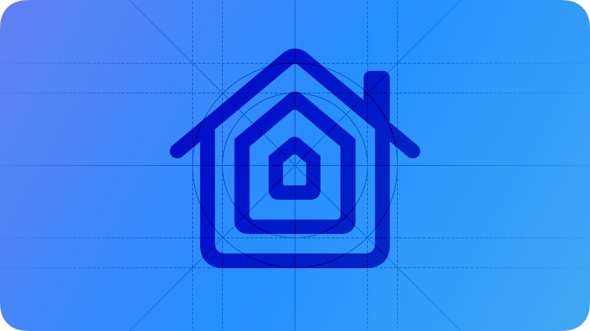
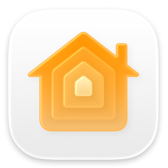
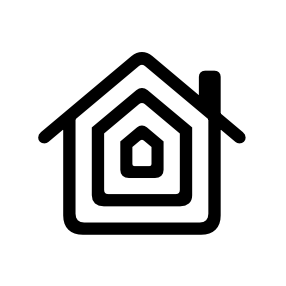
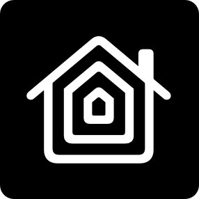
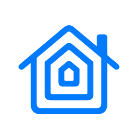
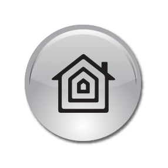
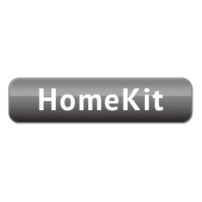
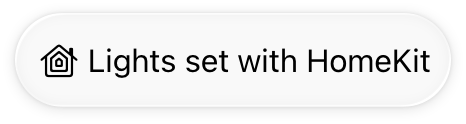
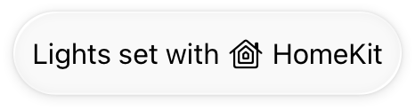
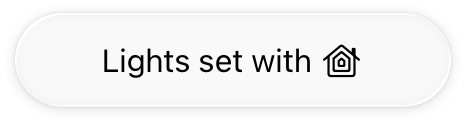

# HomeKit

HomeKit lets people securely control connected accessories in their homes using Siri or the Home app on iPhone, iPad, Apple Watch, and Mac.

In iOS, the Home app also lets people manage and configure accessories.

Your iOS, tvOS, or watchOS app can integrate with HomeKit (and by extension the Home app) to provide a custom or accessory-specific experience. For example, you can:

- Help people set up, name, and organize their accessories
- Allow fine-grained accessory configuration and control
- Provide access to custom accessory features
- Show people how to create powerful, hands-free automations
- Provide support

For developer guidance, see [HomeKit](https://developer.apple.com/documentation/HomeKit). If you’re an MFi licensee, visit the [MFi portal](https://mfi.apple.com) for guidance on naming and messaging for accessory packaging.

## Terminology and layout

HomeKit models the home as a hierarchy of objects and defines a vocabulary of terms that refer to them. The Home app uses the HomeKit object model and terminology to give people intuitive control of accessories by voice, app, and automation.

It’s crucial for your app to use the terminology and object model that HomeKit defines, so that you can reinforce people’s understanding and make home automation feel approachable.

In the HomeKit model, the home object is the root of a hierarchy that contains all other objects, such as rooms, accessories, and zones. When there’s more than one home, each home is the root of a different hierarchy.

**Acknowledge the hierarchical model that HomeKit uses.** Even if your app doesn’t organize accessories by rooms and zones in its UI, it’s useful to reference the HomeKit model when helping people set up or control their accessories. People need to know where accessories are located so they can use Siri and HomePod to control them by speaking commands like “Siri, turn on the lights upstairs,” or “It’s dark in here.” For more guidance, see [Siri interactions](./homekit.md).

**Make it easy for people to find an accessory’s related HomeKit details.** If your app’s organization is based on accessories, don’t hide other HomeKit information, such as an accessory’s zone or room, in a hard-to-discover settings screen. Instead, consider making the related HomeKit information easily available in an accessory detail view.

**Recognize that people can have more than one home.** Even if your app doesn’t support the concept of multiple homes per user, consider providing the relevant home information in an accessory detail view.

**Don’t present duplicate home settings.** If your app has a different perspective on the organization of a home, don’t confuse people by asking them to set up all or parts of their homes again or by showing a duplicate settings view. Always defer to the settings people made in the Home app and find an intuitive way to present these details in your UI.

### Homes

HomeKit uses the term *home* to represent a physical home, office, or other location of relevance to people. One person might have multiple homes.

### Rooms

A *room* represents a physical room in a home. Rooms don’t have attributes like size or location; they’re simply names that have meaning to people, such as *Bedroom* or *Office*. When people assign accessories to a room, they can use voice commands like “Siri, turn on all the lights except the bedroom,” or “Siri, turn on the kitchen and hallway lights.”

### Accessories, services, and characteristics

The term *accessory* represents a physical, connected home accessory, like a ceiling fan, lamp, lock, or camera. HomeKit uses *category* to represent a type of accessory, such as thermostat, fan, or light. Typically, an accessory manufacturer assigns each accessory to a category, but your app can help people make this assignment if necessary. For example, a switch that’s connected to a fan or a lamp needs to be assigned to the same category as the accessory it controls.

A controllable feature of an accessory, such as the switch on a connected light, is known as a *service*. Some accessories offer multiple services. For example, a connected garage door might let people control the light and the door separately, or a connected outlet might support separate control of the top outlet and the bottom outlet. Apps don’t use the word *service* in the UI; instead, they use names that describe the service, such as *garage door opener* and *ceiling fan light*. When people use Siri to control the accessories in their homes, they speak the service name, not the accessory name. For more guidance on naming, see [Help people choose useful names](./homekit.md).

A *characteristic* is a controllable attribute of a service. For example, in a ceiling fan, the fan service might have a speed characteristic and the light service might have a brightness characteristic. Apps don’t use the word *characteristic* in the UI; instead, they use terms that describe the attribute, such as *speed* and *brightness*.

A *service group* represents a group of accessory services that someone might want to control as a unit. For example, if there’s a floor lamp and two table lamps in one corner of a room, people might assign all three services to a service group named *reading lamps*. Doing so would let people use the *reading lamps* service group to control these three lights independently of all other lights in the room.

### Actions and scenes

The term *action* refers to the changing of a service’s characteristic, such as adjusting the speed of a fan or the brightness of a light. People and automation can initiate actions.

A *scene* is a group of actions that control one or more services in one or more accessories. For example, people might create a *Movie Time* scene that lowers the shades and dims the lights in the living room, or a *Good Morning* scene that turns on the lights, raises the shades, and starts the coffee maker in the kitchen.

> **Tip:**
> The HomeKit API uses the term *action set* instead of *scene*. In your app’s UI, always use the term *scene*.

### Automations

*Automations* cause accessories to react to certain situations, such as when a person’s location changes, a particular time of day occurs, another accessory turns on or off, or a sensor detects something. For example, an automation could turn on the house lights at sunset or when people arrive home.

### Zones

A *zone* represents an area in the home that contains multiple rooms, such as *upstairs* or *downstairs*. Setting up a zone is optional, but doing so lets people control multiple accessories at one time. For example, assigning all downstairs lights to a zone named *downstairs* lets people use voice commands like “Siri, turn off all the lights downstairs.”

## Setup

**Use the system-provided setup flow to give people a familiar experience.** The HomeKit setup flow works more quickly than traditional setup flows because it lets people name accessories, join networks, pair with HomeKit, assign room and service categories, and designate favorites in just a few steps. Using the system-provided setup flow lets you concentrate on promoting the custom functionality that makes your accessory unique. For developer guidance, see [performAccessorySetup(using:completionHandler:)](https://developer.apple.com/documentation/HomeKit/HMAccessorySetupManager/performAccessorySetup(using:completionHandler:)).

**Provide context to explain why you need access to people’s Home data.** Create a purpose string with a phrase that describes why you’re asking for permission to access data, such as “Lets you control this accessory with the Apple Home app and Siri across your Apple devices.”

**Don’t require people to create an account or supply personal information.** Instead, defer to HomeKit for any information you might need. If your app provides additional services that require an account, such as cloud services, make account setup optional and wait until after initial HomeKit setup to offer it.

**Honor people’s setup choices.** When people choose to use HomeKit to set up your accessory, don’t force them to set up other platforms during the HomeKit setup flow. A cross-platform setup experience prevents people from using the accessory right away and can cause confusion by presenting too many ways to control the accessory.

**Carefully consider how and when to provide a custom accessory setup experience.** Always begin by presenting the system-provided setup flow. Then, after the accessory’s basic functionality is available, offer a custom post-setup experience that highlights the unique features of your accessory and helps people get the most out of it. For example, a light manufacturer’s app could help people create personalized light scenes in their homes using key colors scanned in from photos in their library.

### Help people choose useful names

**Suggest service names that suit your accessory.** If your app detects when someone creates a suboptimal name for Siri voice controls, recommend alternatives that you know will work well for most people. Never suggest company names or model numbers for use as service names.

**Check that the names people provide follow HomeKit naming rules.** If your app lets people rename services, make sure that the new names follow the rules. (The system-provided setup flow automatically checks the original names.) If people enter a name that breaks one or more rules, briefly explain the problem and suggest some alternative names that work. Here are the rules:

- Use only alphanumeric, space, and apostrophe characters.
- Start and end with an alphabetic or numeric character.
- Don’t include emojis.

|  | Example service names |
| --- | --- |
|  | Reading lamp |
|  | 📚 lamp |
|  | 2nd garage door |
|  | #2 garage door |

**Help people avoid creating names that include location information.** Although it’s natural for someone to use “kitchen light” to name a light in the kitchen, including the room name in the service name can lead to unpredictable results when controlling the accessory by voice. Your app can detect service names that duplicate location information and help people fix them. For example, you might present a post-setup experience that removes the room or zone from a service name and encourages people to assign the accessory to that room or zone instead.

## Siri interactions

HomeKit supports powerful, hands-free control using voice commands. You can help people use Siri to interact with accessories, services, and zones in their home quickly and efficiently.

**Present example voice commands to demonstrate using Siri to control accessories during setup.** As soon as people complete the setup of a new accessory, consider using the service name they chose in a few example Siri phrases and encourage people to try them out.

**After setup, consider teaching people about more complex Siri commands.** People might not be aware of the broad range of natural language phrases they can use with Siri and HomePod to control their accessories. After setup is complete, find useful places throughout your app to help people learn about these types of commands. For example, in a scene detail view, you could tell people, *You can say “Hey Siri, set ‘Movie Time.’”*

In addition to recognizing the names of homes, rooms, zones, services, and scenes, Siri can also use information such as accessory category and characteristic to identify a service. For example, when people use terms like *brighter* or *dim*, Siri recognizes that they’re referring to a service that has a brightness characteristic, even if they don’t speak the name of the service.

To illustrate the power and flexibility of Siri commands, here are some examples of the types of phrases that people could use to control their accessories.

| Phrase | Siri understands |
| --- | --- |
| “Turn on the floor lamp” | Service (*floor lamp*) |
| “Show me the entryway camera” | Service (*entryway camera*) |
| “Turn on the light” | Accessory category (*light*) |
| “Turn off the living room light” | Room (*living room*) |
|  | Accessory category (*light*) |
| “Make the living room a little bit brighter” | Room (*living room*) |
|  | Accessory category (implied) |
|  | Brightness characteristic (*brighter*) |
| “Turn on the recessed lights” | Service group (*recessed lights*) |
| “Turn off the lights upstairs” | Accessory category (*lights*) |
|  | Zone (*upstairs*) |
| “Dim the lights in the bedroom and nursery” | Accessory category (*lights*) |
|  | Brightness characteristic (*dim*) |
|  | Rooms (*bedroom*, *nursery*) |
| “Run Good night” | Scene (*Good night*) |
| “Is someone in the living room?” | Accessory category (implied) |
|  | Occupancy detection characteristic (implied) |
| “Is my security system tripped?” | Accessory category (*security system*) |
| “Did I leave the garage door open?” | Accessory category (*garage door*) |
|  | Open characteristic (*open*) |
| “Did I forget to turn off the lights in the Tahoe House?” | Accessory category (*lights*) |
|  | Home (*Tahoe House*) |
| “It’s dark in here” | Current home (*here*) |
|  | Current room (via HomePod) |
|  | Accessory category (implied) |

**Recommend that people create zones and service groups, if they make sense for your accessory.** If people might benefit from using context-specific voice commands to control your accessory, suggest these types of interactions and help people set them up. For example, if you provide an accessory such as a light, switch, or thermostat, you could suggest setting up a zone named “upstairs” or a service group named “media center” to support commands like “Siri, turn off the upstairs lights,” or “Siri, activate the media center.”

**Offer shortcuts only for accessory-specific functionality that HomeKit doesn’t support.** HomeKit lets people use ordinary (or natural) language to control accessories without requiring any additional configuration, so you avoid confusing people by offering shortcuts that duplicate HomeKit functionality. Instead, consider offering shortcuts for complementary functionality that your app provides. For example, if people often want to order filters for an air conditioner that you support, you might offer a shortcut like “Order AC filters.” To learn how to provide phrases that people can use for shortcuts, see [Shortcuts and suggestions](./siri.md).

**If your app supports both HomeKit and shortcuts, help people understand the difference between these types of voice control.** People can get confused if they’re presented with multiple methods of voice control. Be sure you clearly indicate what’s possible with shortcuts, and never encourage people to create a shortcut for a scene or action that HomeKit already supports.

## Custom functionality

Your app is a great place to help people appreciate the unique functionality of your accessory. For example, an app for a light that displays different colors could help people create HomeKit scenes using colors imported from their photos.

**Be clear about what people can do in your app and when they might want to use the Home app.** For example, if your app supports only lights, consider encouraging people to create a “Movie Time” scene that not only dims the lights, but also closes the shades, and turns on the TV to a specific input. To do this, first guide people to set up a scene that includes only your accessory’s actions — in this scenario, dimming the lights. Then, your app can suggest that people open the Home app to add their HomeKit-compatible shades and TV to the scene you helped them create. For guidance on how to refer to the Home app, see [Referring to HomeKit](./homekit.md).

**Defer to HomeKit if your database differs from the HomeKit database.** Give people a seamless experience by automatically reflecting changes made in the Home app or in other third-party HomeKit apps. If you must ask people to manage conflicts in your app, present the conflict visually so that they have a clear picture of the choice they need to confirm. For example, if someone changes an accessory’s service name in the Home app, your app can detect this change and could show both names side by side to confirm that the person wants to use the new name in your app, too.

**Ask permission to update the HomeKit database when people make changes in your app.** You don’t want to surprise people by changing something in the Home app, so it’s essential to get permission or an indication of intent before you write to the database. In particular, never overwrite HomeKit database settings without a person’s explicit direction.

### Cameras

Your app can display still images or streaming video from a connected HomeKit IP camera.

**Don’t block camera images.** It’s fine to supplement the camera’s content with useful features, such as an alert calling attention to potentially interesting activity. However, avoid covering portions of the camera’s images with other content.

**Show a microphone button only if the camera supports bidirectional audio.** A nonfunctioning microphone button takes up valuable display space in your app and risks confusing people.

## Using HomeKit icons

Use the HomeKit icon in setup or instructional communications related to HomeKit technology.

In addition, you can use the Apple Home app icon when referencing the Apple Home app or in a button that opens the Apple Home app [product page](https://itunes.apple.com/us/app/home/id1110145103?mt=8) in the App Store.

**Use only Apple-provided icons.** Don’t create your own HomeKit or Home app icon design or attempt to mimic the Apple-provided designs. Download HomeKit icons in [Resources](https://developer.apple.com/design/resources/).

### Styles

You have several options for displaying the HomeKit icon.

#### Black HomeKit icon

Use the HomeKit icon on white or light backgrounds when other technology icons appear in black.

#### White HomeKit icon

Use the HomeKit icon on black or dark backgrounds when other technology icons appear in white.

#### Custom color HomeKit icon

Use a custom color when other technology icons appear in the same color.

**Position the HomeKit icon consistently with other technology icons.** When other technology icons are contained within shapes, treat the HomeKit icon in the same manner.

**Use the HomeKit icon noninteractively.** Don’t use the icon and the name *HomeKit* in custom interactive elements or buttons. You can use the Apple Home app icon to open the app’s product page in the App Store.

**Don’t use the HomeKit icon within text or as a replacement for the word HomeKit.** See [Referring to HomeKit](./homekit.md) to learn how to properly reference HomeKit in text.

**Pair the icon with the name *HomeKit* correctly.** You can show the name below or beside the icon if other technologies are referenced in this way. Use the same font that’s used on the rest of your layout. For related guidance, see [Referring to HomeKit](./homekit.md).

## Referring to HomeKit

**Emphasize your app over HomeKit.** Make references to HomeKit or Apple Home less prominent than your app name or main identity.

**Adhere to Apple’s trademark guidelines.** Apple trademarks can’t appear in your app name or images. In text, use Apple product names exactly as shown on the [Apple Trademark List](https://www.apple.com/legal/intellectual-property/trademark/appletmlist.html).

- Use Apple product names in singular form only; do not make Apple product names possessive.
- Don’t translate Apple, Apple Home, HomeKit, or any other Apple trademark.
- Don’t use category descriptors. For example, say iPad, not tablet.
- Don’t indicate any kind of sponsorship, partnership, or endorsement from Apple.
- Attribute Apple, HomeKit, and all other Apple trademarks with the correct credit lines wherever legal information appears within your app.
- Refer to Apple devices and operating systems only in technical specifications or compatibility descriptions.

|  | Example text |
| --- | --- |
|  | Use HomeKit to turn on your lights from your iPhone or iPad. |
|  | Use HomeKit to turn on your lights from your iOS devices. |

See [Guidelines for Using Apple Trademarks](https://www.apple.com/legal/intellectual-property/guidelinesfor3rdparties.html).

### Referencing HomeKit and the Home app

**Use correct capitalization when using the term *HomeKit*.** *HomeKit* is one word, with an uppercase *H* and uppercase *K*, followed by lowercase letters. *Apple Home* is two words, with an uppercase *A* and uppercase *H*, followed by lowercase letters. If your layout displays only all-uppercase designations, *HomeKit* or *Apple Home* can be typeset in all uppercase to match the style of the rest of the layout.

**Don’t use the name *HomeKit* as a descriptor.** Instead use terms like *works with*, *use*, *supports*, or *compatible*.

|  | Example text |
| --- | --- |
|  | [Brand] lightbulbs work with HomeKit. |
|  | HomeKit-enabled thermostat. |
|  | You can use HomeKit with [App Name]. |
|  | HomeKit lightbulbs. |

**Don’t suggest that HomeKit is performing an action or function.**

|  | Example text |
| --- | --- |
|  | Back door is unlocked with HomeKit. |
|  | HomeKit unlocked the back door. |

**Use the name *Apple* with the name *HomeKit*, if desired.**

|  | Example text |
| --- | --- |
|  | Compatible with Apple HomeKit. |

**Use the name *HomeKit* for setup, configuration, and instructions, if desired.**

|  | Example text |
| --- | --- |
|  | Open HomeKit settings. |

**Use the app name *Apple Home* whenever referring specifically to the app.** On the first mention of the app in body copy, use the complete name *Apple Home*. Subsequent mentions can refer to the Home app.

|  | Example text |
| --- | --- |
|  | Open the Apple Home app. |
|  | Open the Apple Home app. Your accessory and room will now appear in the Home app. |
|  | Open Home. |

## Platform considerations

*No additional considerations for iOS, iPadOS, macOS, tvOS, visionOS, or watchOS.*

## Resources

#### Related

[Resources](https://developer.apple.com/design/resources/)

[Guidelines for Using Apple Trademarks](https://www.apple.com/legal/intellectual-property/guidelinesfor3rdparties.html)

#### Developer documentation

[HomeKit](https://developer.apple.com/documentation/HomeKit)

#### Videos

- [Add support for Matter in your smart home app](https://developer.apple.com/videos/play/wwdc2021/10298)

## Change log

| Date | Changes |
| --- | --- |
| May 2, 2023 | Consolidated guidance into one page. |
