# Icons

An effective icon is a graphic asset that expresses a single concept in ways people instantly understand.

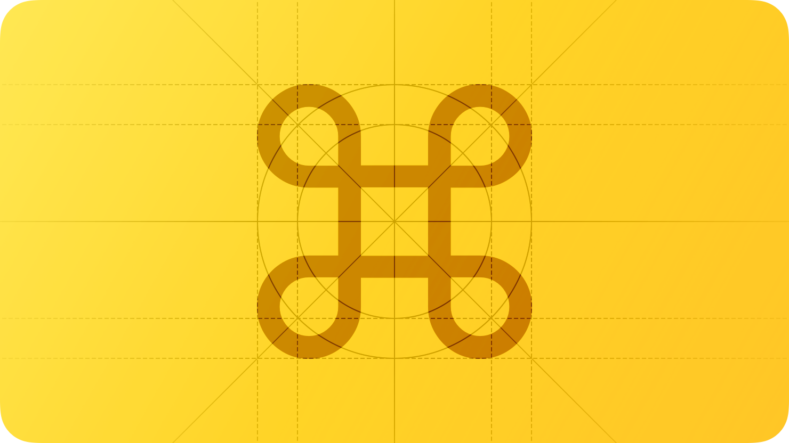

Apps and games use a variety of simple icons to help people understand the items, actions, and modes they can choose. Unlike [App icons](./app-icons.md), which can use rich visual details like shading, texturing, and highlighting to evoke the app’s personality, an *interface icon* typically uses streamlined shapes and touches of color to communicate a straightforward idea.

You can design interface icons — also called *glyphs* — or you can choose symbols from the SF Symbols app, using them as-is or customizing them to suit your needs. Both interface icons and symbols use black and clear colors to define their shapes; the system can apply other colors to the black areas in each image. For guidance, see [SF Symbols](./sf-symbols.md).

## Best practices

**Create a recognizable, highly simplified design.** Too many details can make an interface icon confusing or unreadable. Strive for a simple, universal design that most people will recognize quickly. In general, icons work best when they use familiar visual metaphors that are directly related to the actions they initiate or content they represent.

**Maintain visual consistency across all interface icons in your app.** Whether you use only custom icons or mix custom and system-provided ones, all interface icons in your app need to use a consistent size, level of detail, stroke thickness (or weight), and perspective. Depending on the visual weight of an icon, you may need to adjust its dimensions to ensure that it appears visually consistent with other icons.

**In general, match the weights of interface icons and adjacent text.** Unless you want to emphasize either the icons or the text, using the same weight for both gives your content a consistent appearance and level of emphasis.

**If necessary, add padding to a custom interface icon to achieve optical alignment.** Some icons — especially asymmetric ones — can look unbalanced when you center them geometrically instead of optically. For example, the download icon shown below has more visual weight on the bottom than on the top, which can make it look too low if it’s geometrically centered.

In such cases, you can slightly adjust the position of the icon until it’s optically centered. When you create an asset that includes your adjustments as padding around an interface icon (as shown below on the right), you can optically center the icon by geometrically centering the asset.

Adjustments for optical centering are typically very small, but they can have a big impact on your app’s appearance.

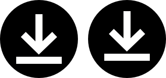

**Provide a selected-state version of an interface icon only if necessary.** You don’t need to provide selected and unselected appearances for an icon that’s used in standard system components such as toolbars, tab bars, and buttons. The system updates the visual appearance of the selected state automatically.

**Use inclusive images.** Consider how your icons can be understandable and welcoming to everyone. Prefer depicting gender-neutral human figures and avoid images that might be hard to recognize across different cultures or languages. For guidance, see [Inclusion](./inclusion.md).

**Include text in your design only when it’s essential for conveying meaning.** For example, using a character in an interface icon that represents text formatting can be the most direct way to communicate the concept. If you need to display individual characters in your icon, be sure to localize them. If you need to suggest a passage of text, design an abstract representation of it, and include a flipped version of the icon to use when the context is right-to-left. For guidance, see [Right to left](./right-to-left.md).

**If you create a custom interface icon, use a vector format like PDF or SVG.** The system automatically scales a vector-based interface icon for high-resolution displays, so you don’t need to provide high-resolution versions of it. In contrast, PNG — used for app icons and other images that include effects like shading, textures, and highlighting — doesn’t support scaling, so you have to supply multiple versions for each PNG-based interface icon. Alternatively, you can create a custom SF Symbol and specify a scale that ensures the symbol’s emphasis matches adjacent text. For guidance, see [SF Symbols](./sf-symbols.md).

**Provide alternative text labels for custom interface icons.** Alternative text labels — or accessibility descriptions — aren’t visible, but they let VoiceOver audibly describe what’s onscreen, simplifying navigation for people with visual disabilities. For guidance, see [VoiceOver](./voiceover.md).

**Avoid using replicas of Apple hardware products.** Hardware designs tend to change frequently and can make your interface icons and other content appear dated. If you must display Apple hardware, use only the images available in [Apple Design Resources](https://developer.apple.com/design/resources/) or the SF Symbols that represent various Apple products.

## Standard icons

For icons to represent common actions in [Menus](./menus.md), [Toolbars](./toolbars.md), [Buttons](./buttons.md), and other places in interfaces across Apple platforms, you can use these [SF Symbols](./sf-symbols.md).

### Editing

| Action | Icon | Symbol name |
| --- | --- | --- |
| Cut |  | `scissors` |
| Copy |  | `document.on.document` |
| Paste |  | `document.on.clipboard` |
| Done |  | `checkmark ` |
| Save |  |  |
| Cancel |  | `xmark` |
| Close |  |  |
| Delete |  | `trash` |
| Undo |  | `arrow.uturn.backward` |
| Redo |  | `arrow.uturn.forward` |
| Compose |  | `square.and.pencil` |
| Duplicate |  | `plus.square.on.square` |
| Rename |  | `pencil` |
| Move to |  | `folder` |
| Folder |  |  |
| Attach |  | `paperclip` |
| Add |  | `plus` |
| More |  | `ellipsis` |

### Selection

| Action | Icon | Symbol name |
| --- | --- | --- |
| Select |  | `checkmark.circle` |
| Deselect |  | `xmark` |
| Close |  |  |
| Delete |  | `trash` |

### Text formatting

| Action | Icon | Symbol name |
| --- | --- | --- |
| Superscript |  | `textformat.superscript` |
| Subscript |  | `textformat.subscript` |
| Bold |  | `bold` |
| Italic |  | `italic` |
| Underline |  | `underline` |
| ​​Align Left |  | `text.alignleft` |
| Center |  | `text.aligncenter` |
| Justified |  | `text.justify` |
| Align Right |  | `text.alignright` |

### Search

| Action | Icon | Symbol name |
| --- | --- | --- |
| Search |  | `magnifyingglass` |
| Find |  | `text.page.badge.magnifyingglass` |
| Find and Replace |  |  |
| Find Next |  |  |
| Find Previous |  |  |
| Use Selection for Find |  |  |
| Filter |  | `line.3.horizontal.decrease` |

### Sharing and exporting

| Action | Icon | Symbol name |
| --- | --- | --- |
| Share |  | `square.and.arrow.up` |
| Export |  |  |
| Print |  | `printer` |

### Users and accounts

| Action | Icon | Symbol name |
| --- | --- | --- |
| Account |  | `person.crop.circle` |
| User |  |  |
| Profile |  |  |

### Ratings

| Action | Icon | Symbol name |
| --- | --- | --- |
| Dislike |  | `hand.thumbsdown` |
| Like |  | `hand.thumbsup` |

### Layer ordering

| Action | Icon | Symbol name |
| --- | --- | --- |
| Bring to Front |  | `square.3.layers.3d.top.filled` |
| Send to Back |  | `square.3.layers.3d.bottom.filled` |
| Bring Forward |  | `square.2.layers.3d.top.filled` |
| Send Backward |  | `square.2.layers.3d.bottom.filled` |

### Other

| Action | Icon | Symbol name |
| --- | --- | --- |
| Alarm |  | `alarm` |
| Archive |  | `archivebox` |
| Calendar |  | `calendar` |

## Platform considerations

*No additional considerations for iOS, iPadOS, tvOS, visionOS, or watchOS.*

### macOS

#### Document icons

If your macOS app can use a custom document type, you can create a document icon to represent it. Traditionally, a document icon looks like a piece of paper with its top-right corner folded down. This distinctive appearance helps people distinguish documents from apps and other content, even when icon sizes are small.

If you don’t supply a document icon for a file type you support, macOS creates one for you by compositing your app icon and the file’s extension onto the canvas. For example, Preview uses a system-generated document icon to represent JPG files.

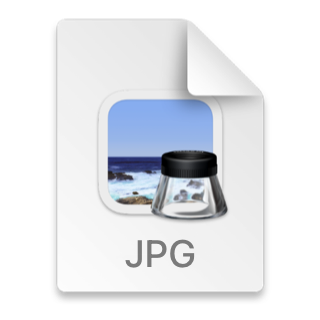

In some cases, it can make sense to create a set of document icons to represent a range of file types your app handles. For example, Xcode uses custom document icons to help people distinguish projects, AR objects, and Swift code files.

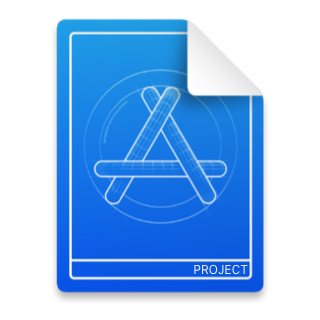

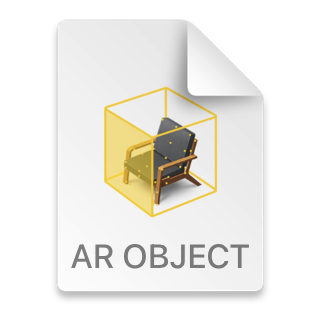

To create a custom document icon, you can supply any combination of background fill, center image, and text. The system layers, positions, and masks these elements as needed and composites them onto the familiar folded-corner icon shape.

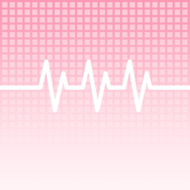

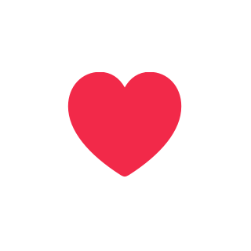

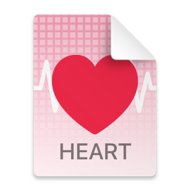

[Apple Design Resources](https://developer.apple.com/design/resources/#macos-apps) provides a template you can use to create a custom background fill and center image for a document icon. As you use this template, follow the guidelines below.

**Design simple images that clearly communicate the document type.** Whether you use a background fill, a center image, or both, prefer uncomplicated shapes and a reduced palette of distinct colors. Your document icon can display as small as 16x16 px, so you want to create designs that remain recognizable at every size.

**Designing a single, expressive image for the background fill can be a great way to help people understand and recognize a document type.** For example, Xcode and TextEdit both use rich background images that don’t include a center image.

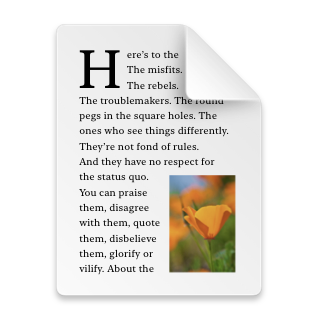

**Consider reducing complexity in the small versions of your document icon.** Icon details that are clear in large versions can look blurry and be hard to recognize in small versions. For example, to ensure that the grid lines in the custom heart document icon remain clear in intermediate sizes, you might use fewer lines and thicken them by aligning them to the reduced pixel grid. In the 16x16 px size, you might remove the lines altogether.

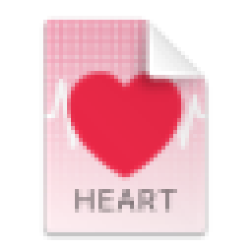

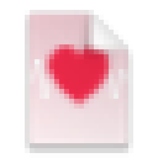

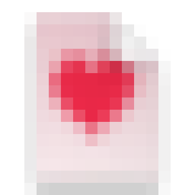

**Avoid placing important content in the top-right corner of your background fill.** The system automatically masks your image to fit the document icon shape and draws the white folded corner on top of the fill. Create a set of background images in the sizes listed below.

- 512x512 px @1x, 1024x1024 px @2x
- 256x256 px @1x, 512x512 px @2x
- 128x128 px @1x, 256x256 px @2x
- 32x32 px @1x, 64x64 px @2x
- 16x16 px @1x, 32x32 px @2x

**If a familiar object can convey a document’s type or its connection with your app, consider creating a center image that depicts it.** Design a simple, unambiguous image that’s clear and recognizable at every size. The center image measures half the size of the overall document icon canvas. For example, to create a center image for a 32x32 px document icon, use an image canvas that measures 16x16 px. You can provide center images in the following sizes:

- 256x256 px @1x, 512x512 px @2x
- 128x128 px @1x, 256x256 px @2x
- 32x32 px @1x, 64x64 px @2x
- 16x16 px @1x, 32x32 px @2x

**Define a margin that measures about 10% of the image canvas and keep most of the image within it.** Although parts of the image can extend into this margin for optical alignment, it’s best when the image occupies about 80% of the image canvas. For example, most of the center image in a 256x256 px canvas would fit in an area that measures 205x205 px.

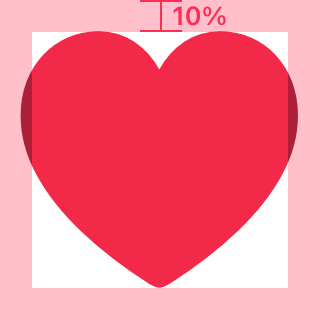

**Specify a succinct term if it helps people understand your document type.** By default, the system displays a document’s extension at the bottom edge of the document icon, but if the extension is unfamiliar you can supply a more descriptive term. For example, the document icon for a SceneKit scene file uses the term *scene* instead of the file extension *scn*. The system automatically scales the extension text to fit in the document icon, so be sure to use a term that’s short enough to be legible at small sizes. By default, the system capitalizes every letter in the text.

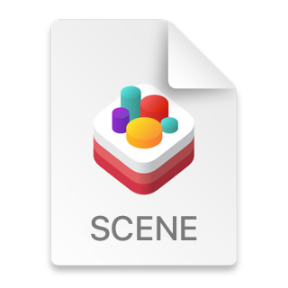

## Resources

#### Related

[App icons](./app-icons.md)

[SF Symbols](./sf-symbols.md)

#### Videos

- [Designing Glyphs](https://developer.apple.com/videos/play/wwdc2017/823)

## Change log

| Date | Changes |
| --- | --- |
| June 9, 2025 | Added a table of SF Symbols that represent common actions. |
| June 21, 2023 | Updated to include guidance for visionOS. |
