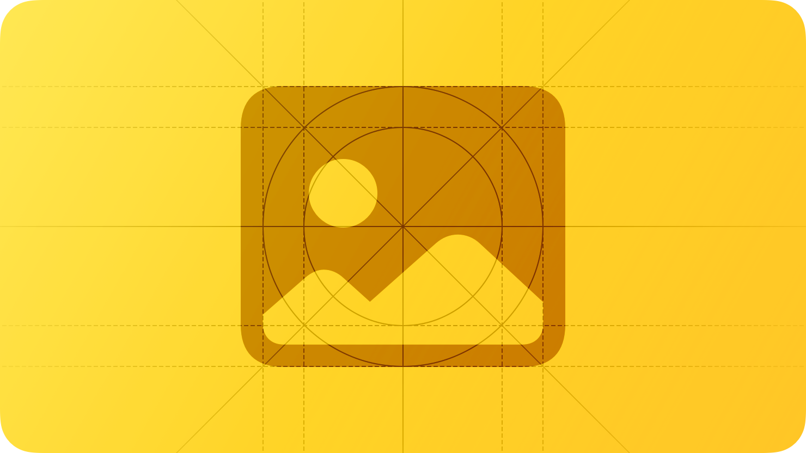
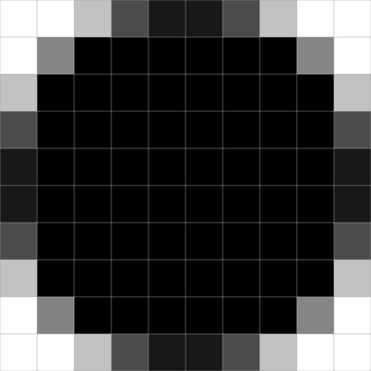
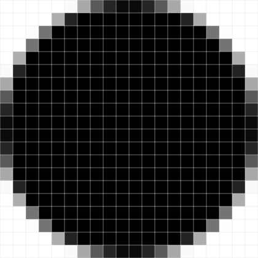
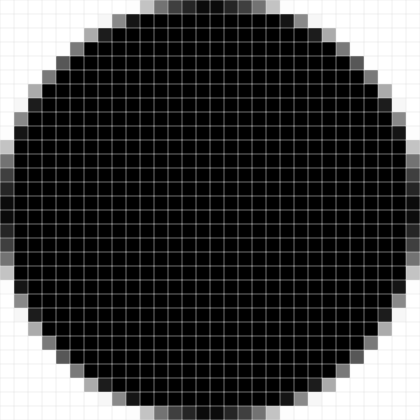

# Images

To make sure your artwork looks great on all devices you support, learn how the system displays content and how to deliver art at the appropriate scale factors.

## Resolution

Different devices can display images at different resolutions. For example, a 2D device displays images according to the resolution of its screen.

A *point* is an abstract unit of measurement that helps visual content remain consistent regardless of how it’s displayed. In 2D platforms, a point maps to a number of pixels that can vary according to the resolution of the display; in visionOS, a point is an angular value that allows visual content to scale according to its distance from the viewer.

When creating bitmap images, you specify a *scale factor* which determines the resolution of an image. You can visualize scale factor by considering the density of pixels per point in 2D displays of various resolutions. For example, a scale factor of 1 (also called @1x) describes a 1:1 pixel density, where one pixel is equal to one point. High-resolution 2D displays have higher pixel densities, such as 2:1 or 3:1. A 2:1 density (called @2x) has a scale factor of 2, and a 3:1 density (called @3x) has a scale factor of 3. Because of higher pixel densities, high-resolution displays demand images with more pixels.

**Provide high-resolution assets for all bitmap images in your app, for every device you support.** As you add each image to your project’s asset catalog, identify its scale factor by appending “@1x,” “@2x,” or “@3x” to its filename. Use the following values for guidance; for additional scale factors, see [Layout](./layout.md).

| Platform | Scale factors |
| --- | --- |
| iPadOS, watchOS | @2x |
| iOS | @2x and @3x |
| visionOS | @2x or higher (see [visionOS](./images.md)) |
| macOS, tvOS | @1x and @2x |

**In general, design images at the lowest resolution and scale them up to create high-resolution assets.** When you use resizable vectorized shapes, you might want to position control points at whole values so that they’re cleanly aligned at 1x. This positioning allows the points to remain cleanly aligned to the raster grid at higher resolutions, because 2x and 3x are multiples of 1x.

## Formats

As you create different types of images, consider the following recommendations.

| Image type | Format |
| --- | --- |
| Bitmap or raster work | De-interlaced PNG files |
| PNG graphics that don’t require full 24-bit color | An 8-bit color palette |
| Photos | JPEG files, optimized as necessary, or HEIC files |
| Stereo or spatial photos | Stereo HEIC |
| Flat icons, interface icons, and other flat artwork that requires high-resolution scaling | PDF or SVG files |

## Best practices

**Include a color profile with each image.** Color profiles help ensure that your app’s colors appear as intended on different displays. For guidance, see [Color management](./color.md).

**Always test images on a range of actual devices.** An image that looks great at design time may appear pixelated, stretched, or compressed when viewed on various devices.

## Platform considerations

*No additional considerations for iOS, iPadOS, or macOS.*

## Resources

#### Related

[Apple Design Resources](https://developer.apple.com/design/resources/)

#### Developer documentation

[Drawing sharp layer-based content in visionOS](https://developer.apple.com/documentation/visionOS/drawing-sharp-layer-based-content) — visionOS

[Images](https://developer.apple.com/documentation/SwiftUI/Images) — SwiftUI

[UIImageView](https://developer.apple.com/documentation/UIKit/UIImageView) — UIKit

[NSImageView](https://developer.apple.com/documentation/AppKit/NSImageView) — AppKit

#### Videos

- [Support HDR images in your app](https://developer.apple.com/videos/play/wwdc2023/10181)
- [Get Started with Display P3](https://developer.apple.com/videos/play/wwdc2017/821)

## Change log

| Date | Changes |
| --- | --- |
| December 16, 2025 | Added guidance for spatial photos and spatial scenes in visionOS. |
| December 5, 2023 | Clarified guidance on choosing a resolution for a rasterized image in a visionOS app. |
| June 21, 2023 | Updated to include guidance for visionOS. |
| September 14, 2022 | Added specifications for Apple Watch Ultra. |
