# Live Activities

A Live Activity lets people track the progress of an activity, event, or task at a glance.

Live Activities let people keep track of tasks and events in glanceable locations across devices.  They go beyond push notifications, delivering frequent content and status updates over a few hours and letting people interact with the displayed information.

For example, a Live Activity might show the remaining time until a food delivery order arrives, live in-game information for a soccer match, or real-time fitness metrics and interactive controls to pause or cancel a workout.

Live Activities start on iPhone or iPad and automatically appear in system locations across a person’s devices:

| Platform or system experience | Location |
| --- | --- |
| iPhone and iPad | Lock Screen, Home Screen, in the Dynamic Island and StandBy on iPhone |
| Mac | The menu bar |
| Apple Watch | Smart Stack |
| CarPlay | CarPlay Dashboard |

## Anatomy

Live Activities appear across the system in various locations like the *Dynamic Island* and the Lock Screen. It serves as a unified home for alerts and indicators of ongoing activity. Depending on the device and system location where a Live Activity appears, the system chooses a *presentation* style or a combination of styles to compose the appearance of your Live Activity. As a result, your Live Activity must support:

- [Compact](./live-activities.md)
- [Minimal](./live-activities.md)
- [Expanded](./live-activities.md)
- [Lock Screen](./live-activities.md)

In iOS and iPadOS, your Live Activity appears throughout the system using these presentations. Additionally, the system uses them to create default appearances for other contexts. For example, the compact presentation appears in the Dynamic Island on iPhone and consists of two elements that the system combines into a single view for Apple Watch and in CarPlay.

### Compact

In the Dynamic Island, the system uses the compact presentation when only one Live Activity is active. The presentation consists of two separate elements: one on the leading side of the TrueDepth camera and one on the trailing side. Despite its limited space, the compact presentation displays up-to-date information about your app’s Live Activity.

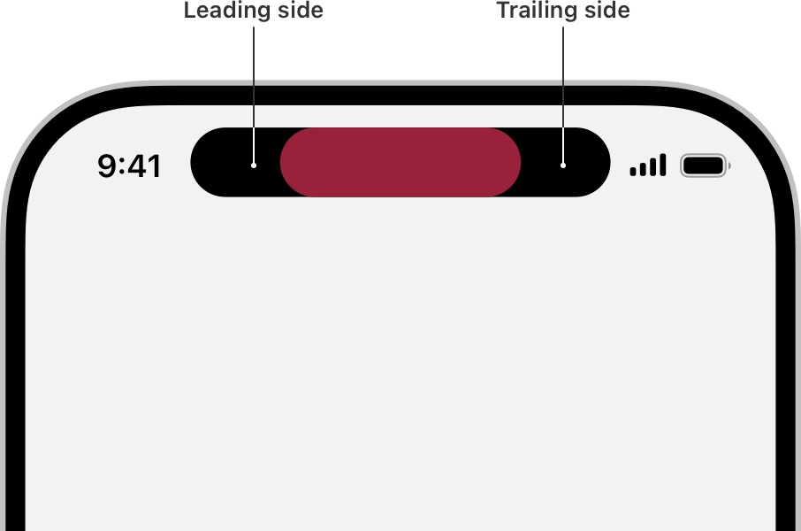

For design guidance, see [Compact presentation](./live-activities.md).

### Minimal

When multiple Live Activities are active, the system uses the minimal presentation to display two of them in the Dynamic Island. One appears attached to the Dynamic Island while the other appears detached. Depending on its content size, the detached minimal presentation appears circular or oval. As with the compact presentation, people tap the minimal presentation to open its app or touch and hold it to see the expanded presentation.

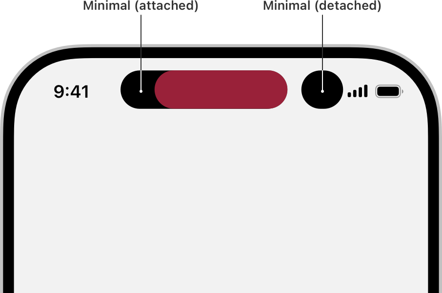

For design guidance, see [Minimal presentation](./live-activities.md).

### Expanded

When people touch and hold a Live Activity in compact or minimal presentation, the system displays the expanded presentation.

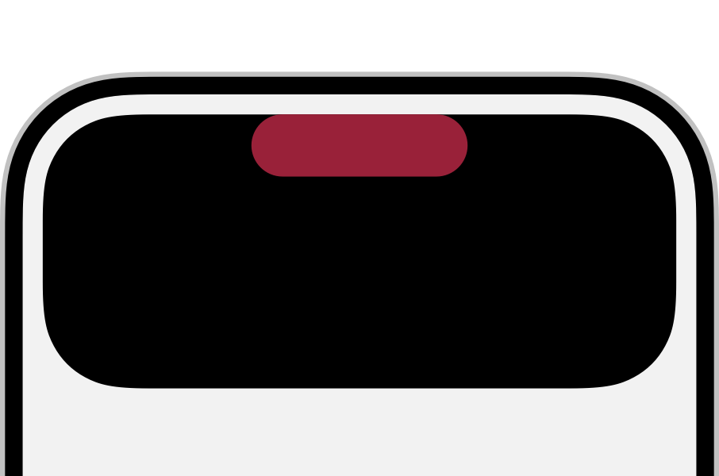

For design guidance, see [Expanded presentation](./live-activities.md).

### Lock Screen

The system uses the Lock Screen presentation to display a banner at the bottom of the Lock Screen. In this presentation, use a layout similar to the expanded presentation.

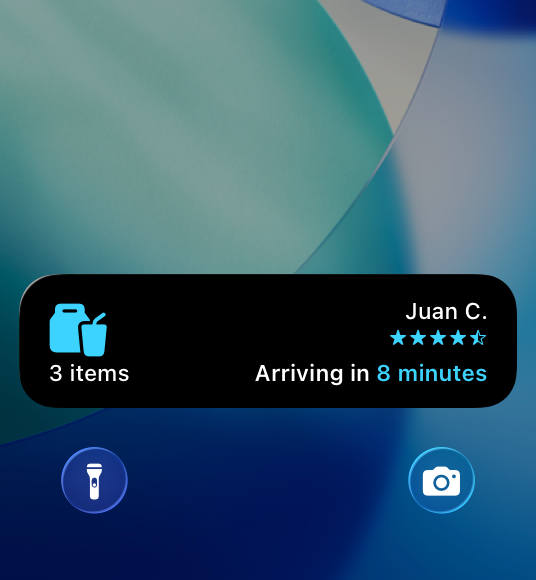

When you alert people about Live Activity updates on devices that don’t support the Dynamic Island, the Lock Screen presentation briefly appears as a banner that overlays the Home Screen or other apps.

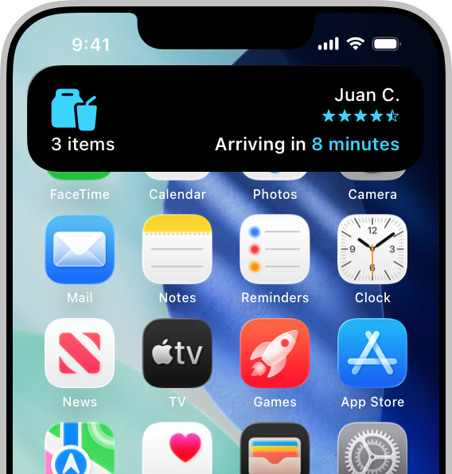

For design guidance, see [Lock Screen presentation](./live-activities.md).

### StandBy

On iPhone in StandBy, your Live Activity appears in the minimal presentation. When someone taps it, it transitions to the Lock Screen presentation, scaled up by 2x to fill the screen. If your Lock Screen presentation uses a custom background color, the system automatically extends it to the whole screen to create a seamless, full-screen design.

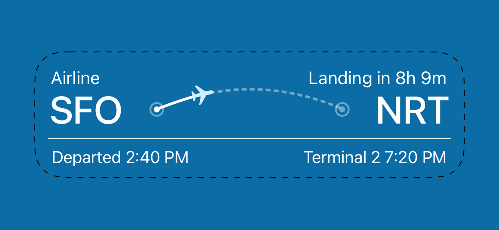

For design guidance, see [StandBy presentation](./live-activities.md).

## Best practices

**Offer Live Activities for tasks and events that have a defined beginning and end.** Live Activities work best for tracking short to medium duration activities that don’t exceed eight hours.

**Focus on important information that people need to see at a glance.** Your Live Activity doesn’t need to display everything. Think about what information people find most useful and prioritize sharing it in a concise way. When a person wants to learn more, they can tap your Live Activity to open your app where you can provide additional detail.

**Don’t use a Live Activity to display ads or promotions**. Live Activities help people stay informed about ongoing events and tasks, so it’s important to display only information that’s related to those events and tasks.

**Avoid displaying sensitive information.** Live Activities are prominently visible and could be viewed by casual observers; for example, on the Lock Screen or in the Always-On display. For content people might consider sensitive or private, display an innocuous summary and let people tap the Live Activity to view the sensitive information in your app. Alternatively, redact views that may contain sensitive information and let people configure whether to show sensitive data. For developer guidance, see [Creating a widget extension](https://developer.apple.com/documentation/WidgetKit/Creating-a-Widget-Extension#Hide-sensitive-content).

**Create a Live Activity that matches your app’s visual aesthetic and personality in both dark and light appearances.** This makes it easier for people to recognize your Live Activity and creates a visual connection to your app.

**If you include a logo mark, display it without a container.** This better integrates the logo mark with your Live Activity layout. Don’t use the entire app icon.

**Don’t add elements to your app that draw attention to the Dynamic Island.** Your Live Activity appears in the Dynamic Island while your app isn’t in use, and other items can appear in the Dynamic Island when your app is open.

**Ensure text is easy to read.** Use large, heavier-weight text — a medium weight or higher. Use small text sparingly and make sure key information is legible at a glance.

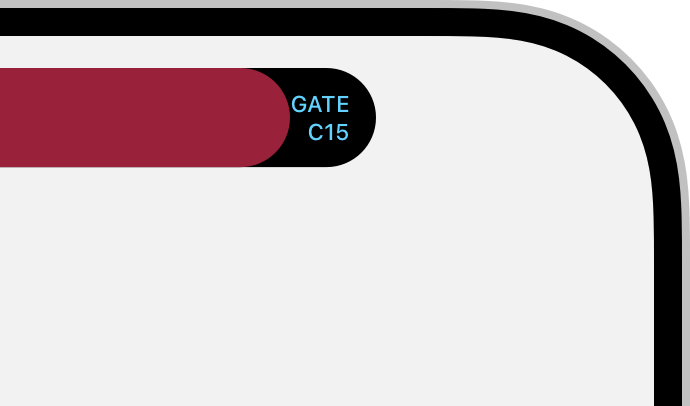

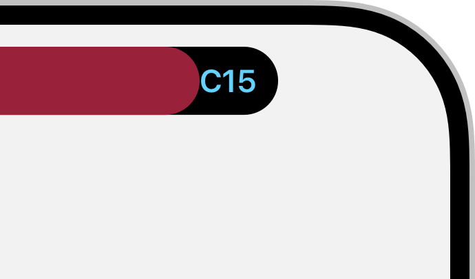

### Creating Live Activity layouts

**Adapt to different screen sizes and presentations.** Live Activities scale to fit various device screens. Create layouts and assets for various devices and scale factors, recognizing that the actual size on screen may vary or change. Ensure they look great everywhere by using the values in [Specifications](./live-activities.md) as guidance and providing appropriately sized content.

**Adjust element size and placement for efficient use of space.** Create a layout that only uses the space you need to clearly display its content. Adapt the size and placement of elements in your Live Activity so they fit well together.

**Use familiar layouts for custom views and layouts.** Templates with default system margins and recommended text sizes are available in [Apple Design Resources](https://developer.apple.com/design/resources/). Using them helps your Live Activity remain legible at a glance and fit in with the visual language of its surroundings; for example, the Smart Stack on Apple Watch.

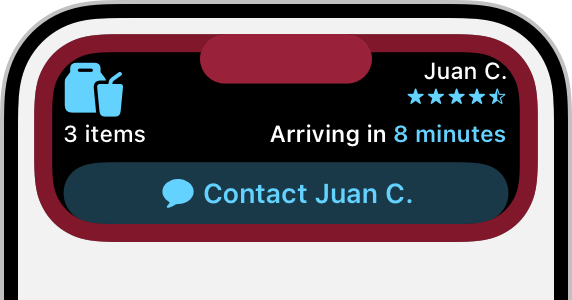

**Use consistent margins and concentric placement.** Use even, matching margins between rounded shapes and the edges of the Live Activity, including corners, to ensure a harmonious fit. This prevents elements from poking into the rounded shape of the Live Activity and creating visual tension. For example, when placing a rounded rectangle near a corner of your Live Activity, match its corner radius to the outer corner radius of the Live Activity by subtracting the margin and using a SwiftUI container to apply the correct corner radius. For developer guidance, see [ContainerRelativeShape](https://developer.apple.com/documentation/SwiftUI/ContainerRelativeShape).

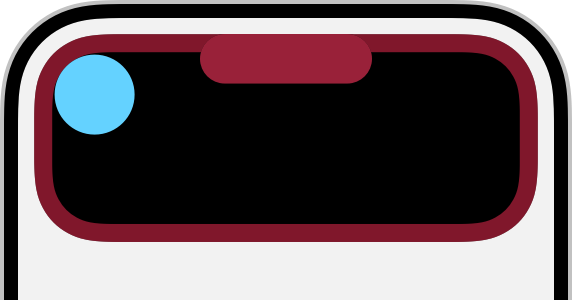

Keep content compact and snug within a margin that’s concentric to the outer edge of the Live Activity.

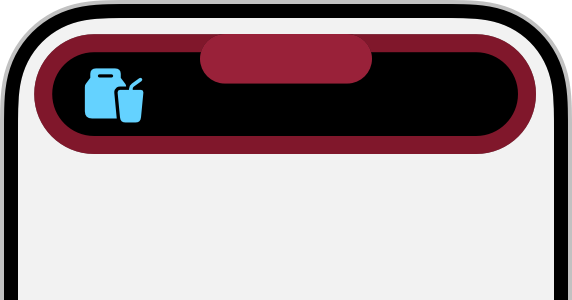

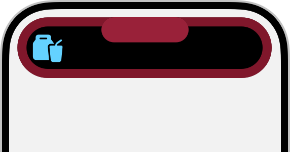

**When separating a block of content, place it in an inset container shape or use a thick line.** Don’t draw content all the way to the edge of the Dynamic Island.

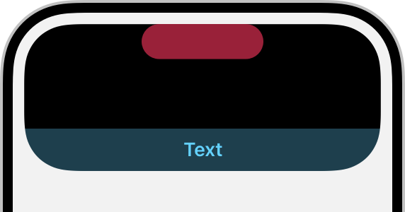

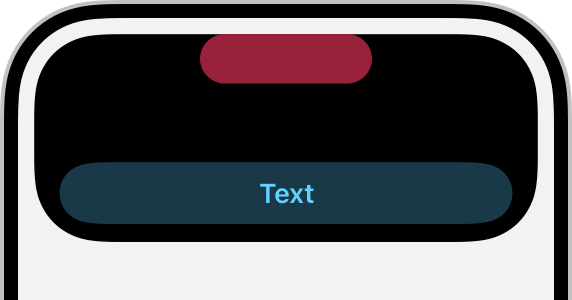

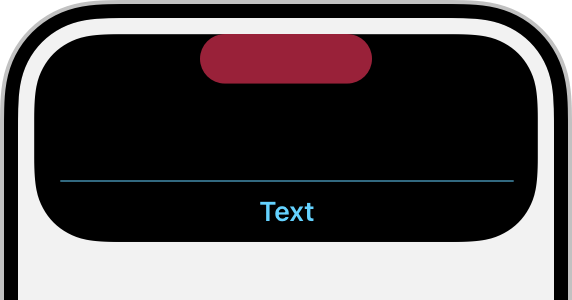

> **Tip:**
> To align nonrounded content in the rounded corners of the Live Activity view, it may be helpful to blur the nonrounded content in your drawing tool. When the content is blurred, it may be easier to find the positioning that best aligns with the outer perimeter of the view.

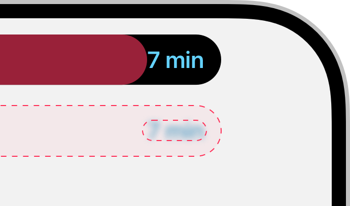

**Dynamically change the height of your Live Activity on the Lock Screen or in the expanded presentation.** When there’s less information to show, reduce the height of the Live Activity to only use the space needed for the content. When more information becomes available, increase the height to display additional content. For example, a rideshare app might display a more compact Live Activity without additional details while it locates a driver. The app’s height extends as more information is available to display the estimated pickup time, driver details, and so on.

### Choosing colors

**Carefully consider using a custom background color and opacity.** You can’t customize background colors for compact, minimal, and expanded presentations. However, you can use a custom background color for the Lock Screen presentation. If you set a custom background color or image for the Lock Screen presentation, ensure sufficient contrast — especially for tint colors on devices that feature an Always-On display with reduced luminance.

**Use color to express the character and identity of your app.** Live Activities in the Dynamic Island use a black opaque background. Consider using bold colors for text and objects to convey the personality and brand of your app. Bold colors make your Live Activity recognizable at a glance, stand out from other Live Activities, and feel like a small, glanceable part of your app. Additionally, bold colors can help reinforce the relationship between elements in the Live Activity itself.

**Tint your Live Activity’s key line color so that it matches your content.** When the background is dark — for example, in Dark Mode — a key line appears around the Dynamic Island to distinguish it from other content. Choose a key line color that’s consistent with the color of other elements in your Live Activity. For developer guidance, see [Creating custom views for Live Activities](https://developer.apple.com/documentation/ActivityKit/creating-custom-views-for-live-activities#Use-custom-colors).

### Adding transitions and animating content updates

In addition to extending and contracting transitions, Live Activities use system and custom animations with a maximum duration of two seconds. Note that the system doesn’t perform animations on Always-On displays with reduced luminance.

**Use animations to reinforce the information you’re communicating and to bring attention to updates.** In addition to moving the position of elements, you can animate elements in and out with the default content-replace transition, or create custom transitions using scale, opacity, and movement. For example, a sports app might use numeric content transitions for score changes or fade a timer in and out when it reaches zero.

**Animate layout changes.** Content updates can require a change to your Live Activity layout — for example, when it expands to fill the screen in StandBy or when more information becomes available. During the transition to a new layout, preserve as much of the existing layout as possible by animating existing elements to their new positions rather than removing and animating them back in.

**Try to avoid overlapping elements.** Sometimes, it’s best to animate out certain elements and then re-animate them in at a new position to avoid colliding with other parts of your transition. For example, when animating items in lists, only animate the element that moves to a new position and use fade-in-and-out transitions for the other list items.

For developer guidance, see [Animating data updates in widgets and Live Activities](https://developer.apple.com/documentation/WidgetKit/Animating-data-updates-in-widgets-and-live-activities).

### Offering interactivity

**Make sure tapping the Live Activity opens your app at the right location.** Take people directly to related details and actions  — don’t make them navigate to find relevant information. For developer guidance on SwiftUI views that support deep linking to specific screens, see [Linking to specific app scenes from your widget or Live Activity](https://developer.apple.com/documentation/WidgetKit/Linking-to-specific-app-scenes-from-your-widget-or-Live-Activity).

**Focus on simple, direct actions.** Buttons or toggles take up space that might otherwise display useful information. Only include interactive elements for essential functionality that’s directly related to your Live Activity and that people activate once or temporarily pause and resume, like music playback, workouts, or apps that access the microphone to record live audio. If you offer interactivity, prefer limiting it to a single element to help people avoid accidentally tapping the wrong control.

**Consider letting people respond to event or progress updates.** If an update to your Live Activity is something that a person could respond to, consider offering a button or toggle to let people take action. For example, the Live Activity of a rideshare app could include a button to contact the driver while waiting for a ride to arrive.

### Starting, updating, and ending a Live Activity

**Start Live Activities at appropriate times, and make it easy for people to turn them off in your app.** People expect Live Activities to start and provide important updates for a task at hand or at specific times, even automatically. For example, they might expect a Live Activity to start after a food order, making a rideshare request, or when their favorite sports team’s match begins. However, Live Activities that appear unexpectedly can be surprising or even unwanted. Consider offering controls that allow people to turn off a Live Activity in the app view that corresponds to the activity. For example, a sports app may offer a button that lets people unfollow a game or team. When people can’t easily control the appearance of Live Activities from your app, they may choose to turn off Live Activities in Settings altogether.

**Offer an App Shortcut that starts your Live Activity.** App Shortcuts expose functionality to the system, allowing access in various contexts. For example, create an App Shortcut that allows people to start your Live Activity using the Action button on iPhone. For more information, see [App Shortcuts](./app-shortcuts.md).

**Update a Live Activity only when new content is available.** If the underlying content or status remains the same, maintain the same display until the underlying content or status changes.

**Alert people only for essential updates that require their attention.** Live Activity alerts light up the screen and by default play the notification sound to alert people about updates they shouldn’t miss. Alerts also show the expanded presentation in the Dynamic Island or a banner on devices that don’t support the Dynamic Island. To ensure your Live Activities provide the most value, avoid alerting people too often or with updates that aren’t crucial, and don’t use push notifications alongside Live Activities for the same updates.

**Let people track multiple events efficiently with a single Live Activity.** Instead of creating separate Live Activities people need to jump between to track different events, prefer a single Live Activity that uses a dynamic layout and rotates through events. For example, a sports app could offer a single Live Activity that cycles through scored points, substitutions, and fouls across multiple matches.

**Always end a Live Activity immediately when the task or event ends, and consider setting a custom dismissal time.** When a Live Activity ends, the system immediately removes it from the Dynamic Island and in CarPlay. On the Lock Screen, in the Mac menu bar, and the watchOS Smart Stack, it remains for up to four hours. Depending on the Live Activity, showing a summary may only be relevant for a brief time after it ends. Consider choosing a custom dismissal time that’s proportional to the duration of your Live Activity. In most cases, 15 to 30 minutes is adequate. For example, a rideshare app could end its Live Activity when a ride completes and remain visible for 30 minutes to allow people to view the ride summary and leave a tip. For developer guidance, refer to [Displaying live data with Live Activities](https://developer.apple.com/documentation/ActivityKit/displaying-live-data-with-live-activities#End-the-Live-Activity).

## Presentation

Your Live Activity needs to support all locations, devices, and their corresponding appearances. Because it appears across systems at different dimensions, create Live Activity layouts that best support each place they appear.

**Start with the iPhone design, then refine it for other contexts.** Create standard designs for each presentation first. Then, depending on the functionality that your Live Activity provides, design additional custom layouts for specific contexts like iPhone in StandBy, CarPlay, or Apple Watch. For more information about custom layouts, refer to [StandBy](./live-activities.md), [CarPlay](./live-activities.md), and [watchOS](./live-activities.md).

### Compact presentation

**Focus on the most important information.** Use the compact presentation to show dynamic, up-to-date information that’s essential to the Live Activity and easy to understand. For example, a sports app could display two team logos and the score.

**Ensure unified information and design of the compact presentations in the Dynamic Island.** Though the TrueDepth camera separates the leading and trailing elements, design them to read as a single piece of information, and use consistent color and typography to help create a connection between both elements.

**Keep content as narrow as possible and ensure it’s snug against the TrueDepth camera.** Try not to obscure key information in the status bar, and don’t add padding between content and the TrueDepth camera. Maintain a balanced layout with similarly sized views for both leading and trailing elements; for example, use shortened units or less precise data to maintain appropriate width and balance.

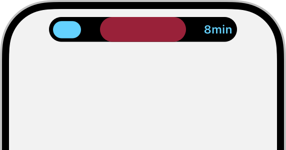

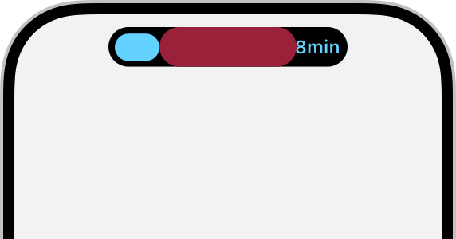

**Link to relevant app content.** When people tap a compact Live Activity, open your app directly to the related details. Ensure both leading and trailing elements link to the same screen.

### Minimal presentation

**Ensure that your Live Activity is recognizable in the minimal presentation.** If possible, display updated information rather than just a logo, while ensuring people can quickly recognize your app. For example, the Timer app’s minimal Live Activity presentation displays the remaining time instead of a static icon.

### Expanded presentation

**Maintain the relative placement of elements to create a coherent layout between presentations.** The expanded presentation is an enlarged version of the compact or minimal presentation. Ensure information and layouts expand predictably when the Live Activity expands.

**Wrap content tightly around the TrueDepth camera.** Arrange content close to the TrueDepth camera, and try to avoid leaving too much room around it to use space more efficiently and to help diminish the camera’s presence.

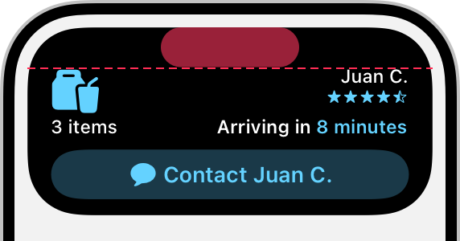

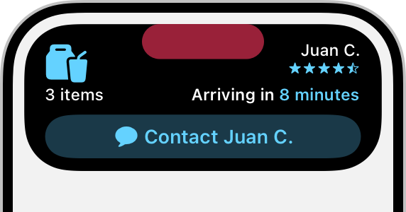

### Lock Screen presentation

**Don’t replicate notification layouts.** Create a unique layout that’s specific to the information that appears in the Live Activity.

**Choose colors that work well on a personalized Lock Screen.** People customize their Lock Screen with wallpapers, custom tint colors, and widgets. To make a Live Activity fit a custom Lock Screen aesthetic while remaining legible, use custom background or tint colors and opacity sparingly.

**Make sure your design, assets, and colors look great and offer enough contrast in Dark Mode and on an Always-On display.** By default, a Live Activity on the Lock Screen uses a light background color in the light appearance and a dark background color in the dark appearance. If you use a custom background color, choose a color that works well in both modes or a different color for each appearance. Verify your choices on a device with an Always-On display with reduced luminance because the system adapts colors as needed in this appearance. For guidance, see [Dark Mode](./dark-mode.md) and [Always On](./always-on.md); for developer guidance, see [About asset catalogs](https://help.apple.com/xcode/mac/current/#/dev10510b1f7).

**Verify the generated color of the dismiss button.** The system automatically generates a matching dismiss button based on the background and foreground colors of your Live Activity.  Verify that the generated color matches your design and adjust it if needed using [activitySystemActionForegroundColor(_:)](https://developer.apple.com/documentation/SwiftUI/View/activitySystemActionForegroundColor(_:)).

**Use standard margins to align your design with notifications.** The standard layout margin for Live Activities on the Lock Screen is 14 points. While tighter margins may be appropriate for elements like graphics or buttons, avoid crowding the edges and creating a cluttered appearance. For developer guidance, see [padding(_:_:)](https://developer.apple.com/documentation/SwiftUI/View/padding(_:_:)).

### StandBy presentation

**Update your layout for StandBy.** Make sure assets look great at the larger scale, and consider creating a custom layout that makes use of the extra space. For developer guidance, see [Creating custom views for Live Activities](https://developer.apple.com/documentation/ActivityKit/creating-custom-views-for-live-activities).

**Consider using the default background color in StandBy.** The default background color seamlessly blends your Live Activity with the device bezel, achieves a softer look that integrates with a person’s surroundings, and allows the system to scale the Live Activity slightly larger because it doesn’t need to account for the margins around the TrueDepth camera.

**Use standard margins and avoid extending graphic elements to the edge of the screen.** Without standard margins, content gets cut off as the Live Activity extends, making it feel broken.

**Verify your design in Night Mode.** In Night Mode, the system applies a red tint to your Live Activity. Check that your Live Activity design uses colors that provide enough contrast in Night Mode.

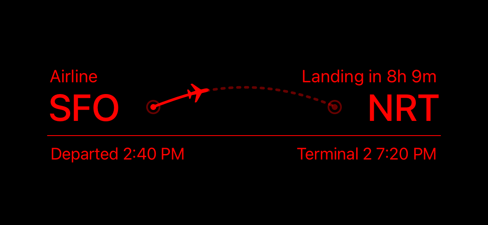

## CarPlay

In CarPlay, the system automatically combines the leading and trailing elements of the compact presentation into a single layout that appears on CarPlay Dashboard.

Your Live Activity design applies to both CarPlay and Apple Watch, so design for both contexts. While Live Activities on Apple Watch can be interactive, the system deactivates interactive elements in CarPlay. For more information, refer to [watchOS](./live-activities.md) below. For developer guidance, refer to [Creating custom views for Live Activities](https://developer.apple.com/documentation/ActivityKit/creating-custom-views-for-live-activities).

**Consider creating a custom layout if your Live Activity would benefit from larger text or additional information.** Instead of using the default appearance in CarPlay, declare support for a [ActivityFamily.small](https://developer.apple.com/documentation/WidgetKit/ActivityFamily/small) supplemental activity family.

**Carefully consider including buttons or toggles in your custom layout.** In CarPlay, the system deactivates interactive elements in your Live Activity. If people are likely to start or observe your Live Activity while driving, prefer displaying timely content rather than buttons and toggles.

## Platform considerations

*No additional considerations for iOS or iPadOS. Not supported in tvOS or visionOS.*

### macOS

Active Live Activities automatically appear in the Menu bar of a paired Mac using the compact, minimal, and expanded presentations. Clicking the Live Activity launches iPhone Mirroring to display your app.

## Specifications

When you design your Live Activities, use the following values for guidance.

### CarPlay dimensions

The system may scale your Live Activity to best fit a vehicle’s screen size and resolution. Use the listed values to verify your design:

| Live Activity size (pt) |
| --- |
| 240x78 |
| 240x100 |
| 170x78 |

Test your designs with the CarPlay Simulator and the following configurations for Smart Display Zoom  — available in in Settings > Display in CarPlay:

| Configuration | Resolution (pt) |
| --- | --- |
| Widescreen | 1920x720 |
| Portrait | 900x1200 |
| Standard | 800x480 |

### iOS dimensions

All values listed in the tables below are in points.

| Screen dimensions (portrait) | Compact leading | Compact trailing | Minimal (width given as a range) | Expanded (height given as a range) | Lock Screen (height given as a range) |
| --- | --- | --- | --- | --- | --- |
| 430x932 | 62.33x36.67 | 62.33x36.67 | 36.67–45x36.67 | 408x84–160 | 408x84–160 |
| 393x852 | 52.33x36.67 | 52.33x36.67 | 36.67–45x36.67 | 371x84–160 | 371x84–160 |

The Dynamic Island uses a corner radius of 44 points, and its rounded corner shape matches the TrueDepth camera.

| Presentation type | Device | Dynamic Island width (pt) |
| --- | --- | --- |
| Compact or minimal | iPhone 17 Pro Max | 250 |
|  | iPhone 17 Pro | 230 |
|  | iPhone Air | 250 |
|  | iPhone 17 | 230 |
|  | iPhone 16 Pro Max | 250 |
|  | iPhone 16 Pro | 230 |
|  | iPhone 16 Plus | 250 |
|  | iPhone 16 | 230 |
|  | iPhone 15 Pro Max | 250 |
|  | iPhone 15 Pro | 230 |
|  | iPhone 15 Plus | 250 |
|  | iPhone 15 | 230 |
|  | iPhone 14 Pro Max | 250 |
|  | iPhone 14 Pro | 230 |
| Expanded | iPhone 17 Pro Max | 408 |
|  | iPhone 17 Pro | 371 |
|  | iPhone Air | 408 |
|  | iPhone 17 | 371 |
|  | iPhone 16 Pro Max | 408 |
|  | iPhone 16 Pro | 371 |
|  | iPhone 16 Plus | 408 |
|  | iPhone 16 | 371 |
|  | iPhone 15 Pro Max | 408 |
|  | iPhone 15 Pro | 371 |
|  | iPhone 15 Plus | 408 |
|  | iPhone 15 | 371 |
|  | iPhone 14 Pro Max | 408 |
|  | iPhone 14 Pro | 371 |

### iPadOS dimensions

All values listed in the table below are in points.

| Screen dimensions (portrait) | Lock Screen (height given as a range) |
| --- | --- |
| 1366x1024 | 500x84–160 |
| 1194x834 | 425x84–160 |
| 1012x834 | 425x84–160 |
| 1080x810 | 425x84–160 |
| 1024x768 | 425x84–160 |

### macOS dimensions

Use the provided iOS dimensions.

### watchOS dimensions

Live Activities in the Smart Stack use the same dimensions as watchOS widgets.

| Apple Watch size | Size of a Live Activity in the Smart Stack (pt) |
| --- | --- |
| 40mm | 152x69.5 |
| 41mm | 165x72.5 |
| 44mm | 173x76.5 |
| 45mm | 184x80.5 |
| 49mm | 191x81.5 |

## Resources

#### Developer documentation

[ActivityKit](https://developer.apple.com/documentation/ActivityKit)

[SwiftUI](https://developer.apple.com/documentation/SwiftUI)

[WidgetKit](https://developer.apple.com/documentation/WidgetKit)

[Developing a WidgetKit strategy](https://developer.apple.com/documentation/WidgetKit/Developing-a-WidgetKit-strategy) — WidgetKit

#### Videos

- [Turbocharge your app for CarPlay](https://developer.apple.com/videos/play/wwdc2025/216)
- [What’s new in widgets](https://developer.apple.com/videos/play/wwdc2025/278)
- [Design Live Activities for Apple Watch](https://developer.apple.com/videos/play/wwdc2024/10098)
- [Design dynamic Live Activities ](https://developer.apple.com/videos/play/wwdc2023/10194)
- [Meet ActivityKit](https://developer.apple.com/videos/play/wwdc2023/10184)

## Change log

| Date | Changes |
| --- | --- |
| December 16, 2025 | Updated guidance for all platforms, and added guidance for macOS and CarPlay. |
| June 10, 2024 | Added guidance for Live Activities in watchOS. |
| October 24, 2023 | Expanded and updated guidance and added new artwork. |
| June 5, 2023 | Updated guidance to include features of iOS 17 and iPadOS 17. |
| November 3, 2022 | Updated artwork and specifications. |
| September 23, 2022 | New page. |
