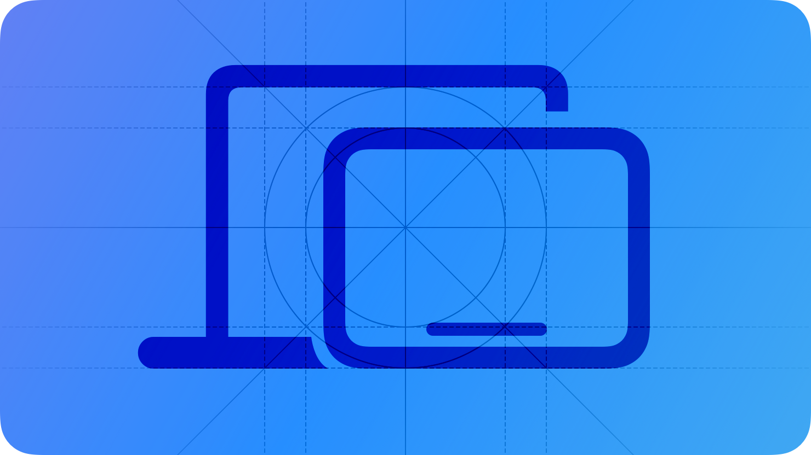

# Mac Catalyst

When you use Mac Catalyst to create a Mac version of your iPad app, you give people the opportunity to enjoy the experience in a new environment.

## Before you start

Many iPad apps are great candidates for creating a Mac app built with Mac Catalyst. This is especially true for apps that already work well on iPad and support key iPad features, such as:

**Drag and drop.** When you support drag and drop in your iPad app, you also get support for drag and drop in the Mac version.

**Keyboard navigation and shortcuts.** Even though a physical keyboard may not always be available on iPad, iPad users appreciate using the keyboard to navigate and keyboard shortcuts to streamline their interactions. On the Mac, people expect apps to offer both keyboard navigation and shortcuts.

**Multitasking.** Apps that do a good job scaling the interface to support Split View, Slide Over, and Picture in Picture lay the necessary groundwork to support the extensive window resizability that Mac users expect.

**Multiple windows**. By supporting multiple scenes on iPad, you also get support for multiple windows in the macOS version of your app.

Although great iPad apps can provide a solid foundation for creating a Mac app built with Mac Catalyst, some apps rely on frameworks or features that don’t exist on a Mac. For example, if the essential features of your experience require capabilities like gyroscope, accelerometer, or rear camera, frameworks like HealthKit or ARKit, or if the primary function you offer is something like marking, handwriting, or navigation, your app might not be suitable for the Mac.

Creating a Mac version of your iPad app with Mac Catalyst gives the app automatic support for fundamental macOS features such as:

- Pointer interactions and keyboard-based focus and navigation
- Window management
- Toolbars
- Rich text interaction, including copy and paste as well as contextual menus for editing
- File management
- Menu bar menus
- App-specific settings in the system-provided Settings app

System-provided UI elements take on a more Mac-like appearance, too; for example:

- Split view
- File browser
- Activity view
- Form sheet
- Contextual actions
- Color picker

To learn more about the characteristics that distinguish the Mac experience, see [Designing for macOS](./designing-for-macos.md). For developer guidance, see [Mac Catalyst](https://developer.apple.com/documentation/UIKit/mac-catalyst).

> **Note:**
> To discover how views and controls can change when you create a Mac app using Mac Catalyst, download [UIKit Catalog: Creating and customizing views and controls](https://developer.apple.com/documentation/UIKit/uikit-catalog-creating-and-customizing-views-and-controls) and build the macOS target.

## Choose an idiom

When you first create your Mac app using Mac Catalyst, Xcode defaults to the “Scale Interface to Match iPad” setting, or *iPad idiom*. With this setting, the system ensures that your Mac app appears consistent with the macOS display environment without requiring significant changes to the app’s layout. However, text and graphics may appear slightly less detailed because iPadOS views and text scale down to 77% in macOS when you use the iPad idiom. For example, the system scales text that uses the iPadOS baseline font size of 17pt down to 13pt in macOS.

When your app feels at home on the Mac using the iPad idiom, consider switching to the *Mac idiom*. With this setting, text and artwork render in more detail, some interface elements and views take on an even more Mac-like appearance, and graphics-intensive apps may see improved performance and lower power consumption.

You’re most likely to benefit from the Mac idiom if your app displays a lot of text, detailed artwork, or animations, but choosing this idiom can also mean that you need to spend additional time updating your Mac app’s layout, text, and images.

**When you adopt the Mac idiom, thoroughly audit your app’s layout, and plan to make changes to it.** To help with this effort, consider using a separate asset catalog to contain your Mac app’s assets instead of reusing the asset catalog that contains your iPad app’s assets.

**Adjust font sizes as needed.** With the Mac idiom, text renders at 100% of its configured size, which can appear too large without adjustment. When possible, use text styles and avoid fixed font sizes.

**Make sure views and images look good in the Mac version of your app.** With the Mac idiom, iPadOS views render at 100% of their size, making them appear more detailed. To help you visualize the difference, consider the two depictions of an image asset shown below. One version illustrates how the asset appears when you use the iPad idiom, and the other version shows how the asset appears when you adopt the Mac idiom. Both depictions are zoomed in to show how the image renders with more details when you use the Mac idiom.

> **Note:**
> When you adopt the Mac idiom, the unscaled views and interface elements report different metrics, often resulting in a significant amount of additional work. To reduce the amount of work, avoid using fixed font, view, or layout sizes. For developer guidance, see [Choosing a user interface idiom for your Mac app](https://developer.apple.com/documentation/UIKit/choosing-a-user-interface-idiom-for-your-mac-app).

**Limit your appearance customizations to standard macOS appearance customizations that are the same or similar to those available in iPadOS.** Not all appearance customizations available to iPadOS controls are available to macOS controls.

## Integrate the Mac experience

When you use Mac Catalyst to create a Mac version of your iPad app, you need to ensure that your Mac app gives people a rich Mac experience. Regardless of the idiom you choose, it’s essential to go beyond simply displaying your iPadOS layout in a macOS window.

iPadOS and macOS each define patterns and conventions that are rooted in the different ways people use their devices. Before you dive in and update specific views and controls, become familiar with the main differences between the platforms so you can create a great Mac app.

### Navigation

Many iPad and Mac apps organize data in similar ways, but they use different controls and visual indicators to help people understand and navigate through the data.

Typically, iPad apps use the following components to organize their content and features:

- [Split views](./split-views.md). A split view supports hierarchical navigation, which consists of a two- or three-column interface that shows a primary column, an optional supplementary column, and a secondary pane of content. Frequently, apps use the primary column to create a sidebar-based interface where changes in the sidebar drive changes in the optional supplementary column, which then affect the content in the content pane.
- [Tab bars](./tab-bars.md). A tab bar supports flat navigation by displaying top-level categories in a persistent bar at the bottom of the screen.
- [Page controls](./page-controls.md). A page control displays dots at the bottom of the screen that indicate the position of the current page in a flat list of pages.

If you use a tab bar in your iPad app, consider using a split view with a sidebar or a segmented control. Both items are similar to macOS navigation conventions. To choose between a split view or a segmented control, consider the following:

- A split view with a sidebar displays a list of top-level items, each of which can disclose a list of child items. Using a sidebar streamlines navigation, because each tab’s contents are available within the sidebar. By using a sidebar on both iPad and Mac, you create a consistent layout that makes it easy for iPad users to start using the Mac version of your app.
- A segmented control and a tab bar both accommodate similar interactions, such as mutually exclusive selection. In general, using a split view instead of a tab bar works better than using a segmented control. However, a segmented control can work well on the Mac if your app uses a flat navigation hierarchy.

**Make sure people retain access to important tab-bar items in the Mac version of your app.** Regardless of whether you use a split view or a segmented control instead of a tab bar in your iPad app, be sure to give people quick access to top-level items by listing them in the macOS View menu.

**Offer multiple ways to move between pages.** Mac users — especially those who interact using a pointing device or only the keyboard — appreciate Next and Previous buttons in addition to iPad or trackpad gestures that let them swipe between pages.

### Inputs

Although both iPad and Mac accept user input from a range of devices — such as keyboard, mouse, and trackpad — touch interactions are the basis for iPadOS conventions. In contrast, keyboard and mouse interactions inform most macOS conventions.

Most iPadOS gestures convert automatically when you create your Mac app using Mac Catalyst; for example:

| iPadOS gesture… | Translates to mouse interaction |
| --- | --- |
| Tap | Left or right click |
| Touch and hold | Click and hold |
| Pan | Left click and drag |

| iPadOS gesture… | Translates to trackpad gesture |
| --- | --- |
| Tap | Click |
| Touch and hold | Click and hold |
| Pan | Click and drag |
| Pinch | Pinch |
| Rotate | Rotate |

> **Note:**
> The system sends the two touches in the pinch and rotate gestures to the view under the pointer, not the view under each touch.

### App icons

**Create a macOS version of your app icon.** Great macOS app icons showcase the lifelike rendering style that people expect in macOS while maintaining a harmonious experience across all platforms.

### Layout

To take advantage of the wider Mac screen in ways that give Mac users a great experience, consider updating your layout in the following ways:

- Divide a single column of content and actions into multiple columns.
- Use the regular-width and regular-height size classes, and consider reflowing elements in the content area to a side-by-side arrangement as people resize the window.
- Present an inspector UI next to the main content instead of using a popover.

**Consider moving controls from the main UI of your iPad app to your Mac app’s toolbar.** Be sure to list the commands associated with these controls in the menus of your Mac app’s menu bar.

**As much as possible, adopt a top-down flow.** Mac apps place the most important actions and content near the top of the window. If your iPad app provides controls in a toolbar, put these controls in the window toolbar of the macOS version of your app.

**Relocate buttons from the side and bottom edges of the screen.** On iPad, placing buttons on these screen edges can help people reach them, but on a Mac, this ergonomic consideration doesn’t apply. You may want to relocate these controls to other areas or put them in the toolbar of your macOS window.

### Menus

Mac users are familiar with the persistent menu bar and expect to find all of an app’s commands in it. In contrast, iPadOS doesn’t have a persistent menu bar, and iPad users expect to find app commands within the app’s UI or in the shortcut interface that displays when they hold the Command key on a connected keyboard.

> **Note:**
> To support keyboard shortcuts for menu commands, use [UIKeyCommand](https://developer.apple.com/documentation/UIKit/UIKeyCommand). For developer guidance, see [Adding menus and shortcuts to the menu bar and user interface](https://developer.apple.com/documentation/UIKit/adding-menus-and-shortcuts-to-the-menu-bar-and-user-interface).

If you provide [pop-up buttons](https://developer.apple.com/design/human-interface-guidelines/pop-up-buttons) or [pull-down buttons](https://developer.apple.com/design/human-interface-guidelines/pull-down-buttons) that reveal a menu in your iPad app, the menu automatically takes on a macOS appearance in the Mac app you create with Mac Catalyst.

> **Note:**
> To add and remove custom app menus, use [UIMenuBuilder](https://developer.apple.com/documentation/UIKit/UIMenuBuilder) and add menu items that represent your iPad app’s commands as menu items with [UICommand](https://developer.apple.com/documentation/UIKit/UICommand).

The system automatically converts the context menus in your iPad app to context menus in the macOS version of your app. As you create the Mac version of your app, consider looking for additional places to support context menus. Mac users tend to expect every object in your app to offer a context menu of relevant actions. Note that on a Mac, a context menu is sometimes called a *contextual* menu.

## Platform considerations

*No additional considerations for iPadOS or macOS. Not supported in iOS, tvOS, visionOS, or watchOS.*

## Resources

#### Related

[Designing for macOS](./designing-for-macos.md)

#### Developer documentation

[Mac Catalyst](https://developer.apple.com/documentation/UIKit/mac-catalyst) — UIKit

#### Videos

- [Designing iPad Apps for Mac](https://developer.apple.com/videos/play/wwdc2019/809)

## Change log

| Date | Changes |
| --- | --- |
| May 2, 2023 | Consolidated guidance into one page. |
