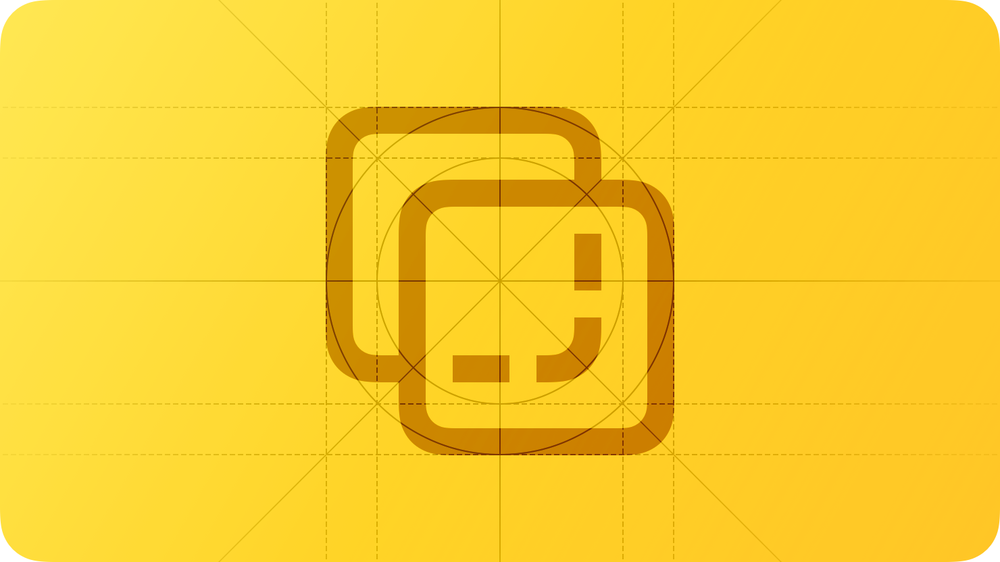
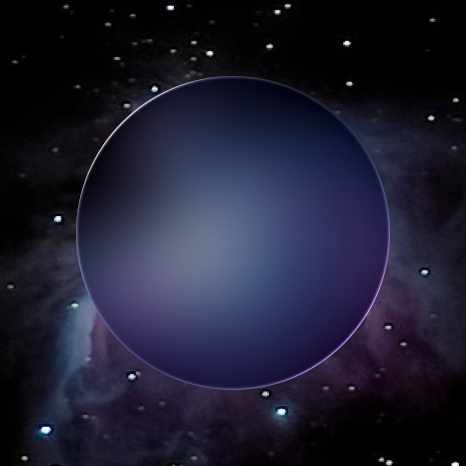
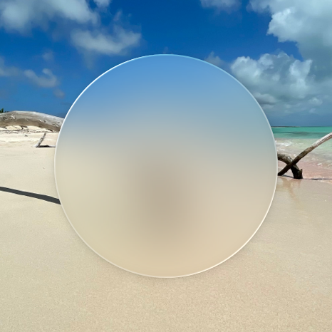
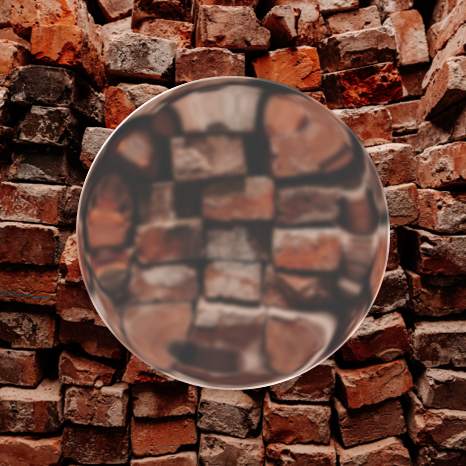
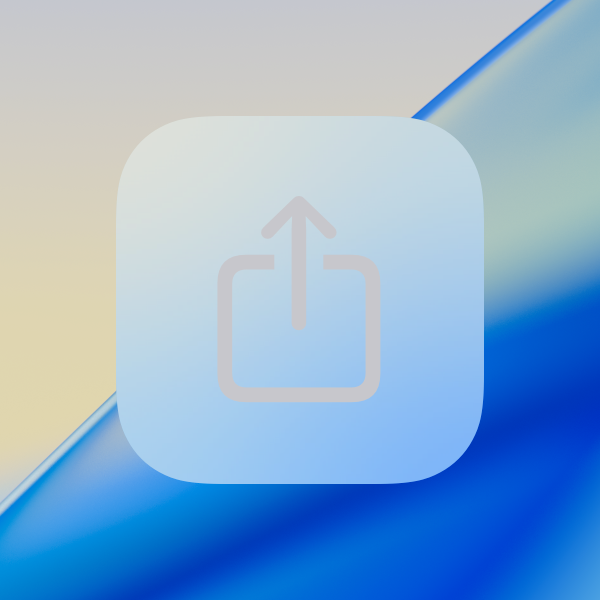
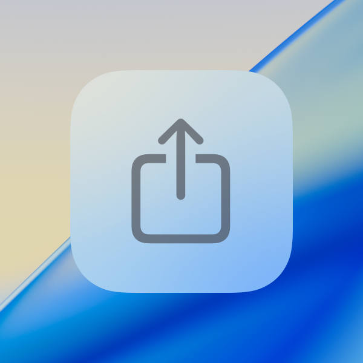
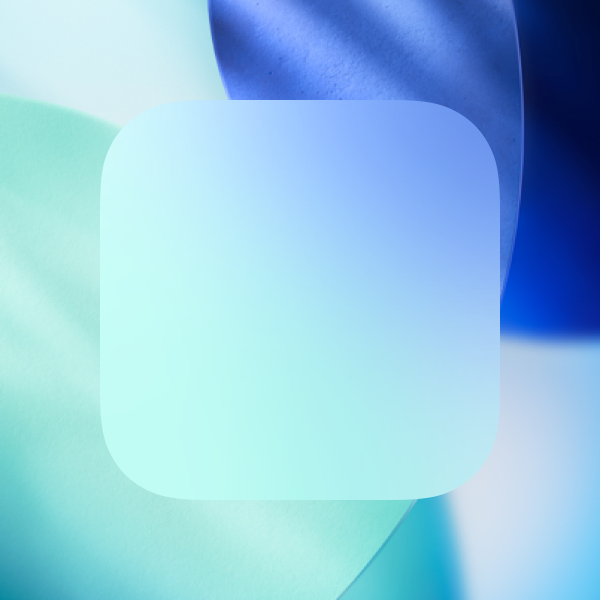
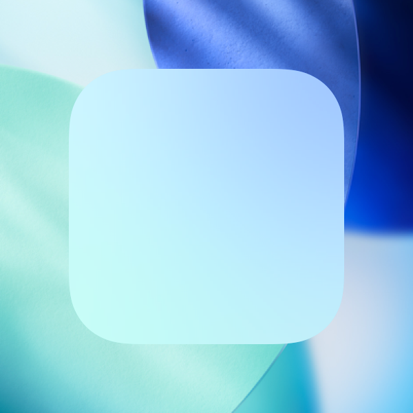
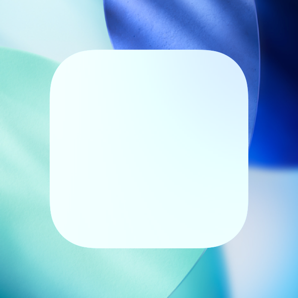
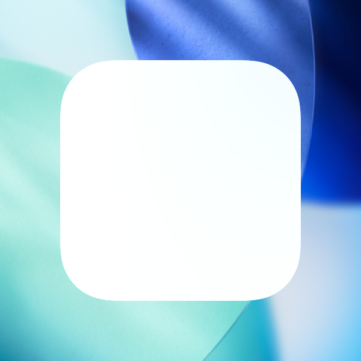

# Materials

A material is a visual effect that creates a sense of depth, layering, and hierarchy between foreground and background elements.

Materials help visually separate foreground elements, such as text and controls, from background elements, such as content and solid colors. By allowing color to pass through from background to foreground, a material establishes visual hierarchy to help people more easily retain a sense of place.

Apple platforms feature two types of materials: Liquid Glass, and standard materials. [Liquid Glass](./materials.md) is a dynamic material that unifies the design language across Apple platforms, allowing you to present controls and navigation without obscuring underlying content. In contrast to Liquid Glass, the [Standard materials](./materials.md) help with visual differentiation within the content layer.

## Liquid Glass

Liquid Glass forms a distinct functional layer for controls and navigation elements — like tab bars and sidebars — that floats above the content layer, establishing a clear visual hierarchy between functional elements and content. Liquid Glass allows content to scroll and peek through from beneath these elements to give the interface a sense of dynamism and depth, all while maintaining legibility for controls and navigation.

**Don’t use Liquid Glass in the content layer.** Liquid Glass works best when it provides a clear distinction between interactive elements and content, and including it in the content layer can result in unnecessary complexity and a confusing visual hierarchy. Instead, use [Standard materials](./materials.md) for elements in the content layer, such as app backgrounds. An exception to this is for controls in the content layer with a transient interactive element like [Sliders](./sliders.md) and [Toggles](./toggles.md); in these cases, the element takes on a Liquid Glass appearance to emphasize its interactivity when a person activates it.

**Use Liquid Glass effects sparingly.** Standard components from system frameworks pick up the appearance and behavior of this material automatically. If you apply Liquid Glass effects to a custom control, do so sparingly. Liquid Glass seeks to bring attention to the underlying content, and overusing this material in multiple custom controls can provide a subpar user experience by distracting from that content. Limit these effects to the most important functional elements in your app. For developer guidance, see [Applying Liquid Glass to custom views](https://developer.apple.com/documentation/SwiftUI/Applying-Liquid-Glass-to-custom-views).

**Only use clear Liquid Glass for components that appear over visually rich backgrounds.** Liquid Glass provides two variants — [regular](https://developer.apple.com/documentation/SwiftUI/Glass/regular) and [clear](https://developer.apple.com/documentation/SwiftUI/Glass/clear) — that you can choose when building custom components or styling some system components. The appearance of these variants can differ in response to certain system settings, like if people choose a preferred look for Liquid Glass in their device’s display settings, or turn on accessibility settings that reduce transparency or increase contrast in the interface.

The *regular* variant blurs and adjusts the luminosity of background content to maintain legibility of text and other foreground elements. Scroll edge effects further enhance legibility by blurring and reducing the opacity of background content. Most system components use this variant. Use the regular variant when background content might create legibility issues, or when components have a significant amount of text, such as alerts, sidebars, or popovers.

The *clear* variant is highly translucent, which is ideal for prioritizing the visibility of the underlying content and ensuring visually rich background elements remain prominent. Use this variant for components that float above media backgrounds — such as photos and videos — to create a more immersive content experience.

For optimal contrast and legibility, determine whether to add a dimming layer behind components with clear Liquid Glass:

- If the underlying content is bright, consider adding a dark dimming layer of 35% opacity. For developer guidance, see [clear](https://developer.apple.com/documentation/SwiftUI/Glass/clear).
- If the underlying content is sufficiently dark, or if you use standard media playback controls from AVKit that provide their own dimming layer, you don’t need to apply a dimming layer.

For guidance about the use of color, see [Liquid Glass color](./color.md).

## Standard materials

Use standard materials and effects — such as [UIBlurEffect](https://developer.apple.com/documentation/UIKit/UIBlurEffect), [UIVibrancyEffect](https://developer.apple.com/documentation/UIKit/UIVibrancyEffect), and [NSVisualEffectView.BlendingMode](https://developer.apple.com/documentation/AppKit/NSVisualEffectView/BlendingMode-swift.enum) — to convey a sense of structure in the content beneath Liquid Glass.

**Choose materials and effects based on semantic meaning and recommended usage.** Avoid selecting a material or effect based on the apparent color it imparts to your interface, because system settings can change its appearance and behavior. Instead, match the material or vibrancy style to your specific use case.

**Help ensure legibility by using vibrant colors on top of materials.** When you use system-defined vibrant colors, you don’t need to worry about colors seeming too dark, bright, saturated, or low contrast in different contexts. Regardless of the material you choose, use vibrant colors on top of it. For guidance, see [System colors](./color.md).

**Consider contrast and visual separation when choosing a material to combine with blur and vibrancy effects.** For example, consider that:

- Thicker materials, which are more opaque, can provide better contrast for text and other elements with fine features.
- Thinner materials, which are more translucent, can help people retain their context by providing a visible reminder of the content that’s in the background.

For developer guidance, see [Material](https://developer.apple.com/documentation/SwiftUI/Material).

## Platform considerations

### iOS, iPadOS

In addition to Liquid Glass, iOS and iPadOS continue to provide four standard materials — ultra-thin, thin, regular (default), and thick — which you can use in the content layer to help create visual distinction.

iOS and iPadOS also define vibrant colors for labels, fills, and separators that are specifically designed to work with each material. Labels and fills both have several levels of vibrancy; separators have one level. The name of a level indicates the relative amount of contrast between an element and the background: The default level has the highest contrast, whereas quaternary (when it exists) has the lowest contrast.

Except for quaternary, you can use the following vibrancy values for labels on any material. In general, avoid using quaternary on top of the [thin](https://developer.apple.com/documentation/SwiftUI/Material/thin) and [ultraThin](https://developer.apple.com/documentation/SwiftUI/Material/ultraThin) materials, because the contrast is too low.

- [UIVibrancyEffectStyle.label](https://developer.apple.com/documentation/UIKit/UIVibrancyEffectStyle/label) (default)
- [UIVibrancyEffectStyle.secondaryLabel](https://developer.apple.com/documentation/UIKit/UIVibrancyEffectStyle/secondaryLabel)
- [UIVibrancyEffectStyle.tertiaryLabel](https://developer.apple.com/documentation/UIKit/UIVibrancyEffectStyle/tertiaryLabel)
- [UIVibrancyEffectStyle.quaternaryLabel](https://developer.apple.com/documentation/UIKit/UIVibrancyEffectStyle/quaternaryLabel)

You can use the following vibrancy values for fills on all materials.

- [UIVibrancyEffectStyle.fill](https://developer.apple.com/documentation/UIKit/UIVibrancyEffectStyle/fill) (default)
- [UIVibrancyEffectStyle.secondaryFill](https://developer.apple.com/documentation/UIKit/UIVibrancyEffectStyle/secondaryFill)
- [UIVibrancyEffectStyle.tertiaryFill](https://developer.apple.com/documentation/UIKit/UIVibrancyEffectStyle/tertiaryFill)

The system provides a single, default vibrancy value for a [UIVibrancyEffectStyle.separator](https://developer.apple.com/documentation/UIKit/UIVibrancyEffectStyle/separator), which works well on all materials.

### macOS

macOS provides several standard materials with designated purposes, and vibrant versions of all [Specifications](./color.md). For developer guidance, see [NSVisualEffectView.Material](https://developer.apple.com/documentation/AppKit/NSVisualEffectView/Material-swift.enum).

**Choose when to allow vibrancy in custom views and controls.** Depending on configuration and system settings, system views and controls use vibrancy to make foreground content stand out against any background. Test your interface in a variety of contexts to discover when vibrancy enhances the appearance and improves communication.

**Choose a background blending mode that complements your interface design.** macOS defines two modes that blend background content: behind window and within window. For developer guidance, see [NSVisualEffectView.BlendingMode](https://developer.apple.com/documentation/AppKit/NSVisualEffectView/BlendingMode-swift.enum).

## Resources

#### Related

[Color](./color.md)

[Accessibility](./accessibility.md)

[Dark Mode](./dark-mode.md)

#### Developer documentation

[Adopting Liquid Glass](https://developer.apple.com/documentation/TechnologyOverviews/adopting-liquid-glass)

[glassEffect(_:in:)](https://developer.apple.com/documentation/SwiftUI/View/glassEffect(_:in:)) — SwiftUI

[Material](https://developer.apple.com/documentation/SwiftUI/Material) — SwiftUI

[UIVisualEffectView](https://developer.apple.com/documentation/UIKit/UIVisualEffectView) — UIKit

[NSVisualEffectView](https://developer.apple.com/documentation/AppKit/NSVisualEffectView) — AppKit

#### Videos

- [Meet Liquid Glass](https://developer.apple.com/videos/play/wwdc2025/219)
- [Get to know the new design system](https://developer.apple.com/videos/play/wwdc2025/356)

## Change log

| Date | Changes |
| --- | --- |
| September 9, 2025 | Updated guidance for Liquid Glass. |
| June 9, 2025 | Added guidance for Liquid Glass. |
| August 6, 2024 | Added platform-specific art. |
| December 5, 2023 | Updated descriptions of the various material types, and clarified terms related to vibrancy and material thickness. |
| June 21, 2023 | Updated to include guidance for visionOS. |
| June 5, 2023 | Added guidance on using materials to provide context and orientation in watchOS apps. |
