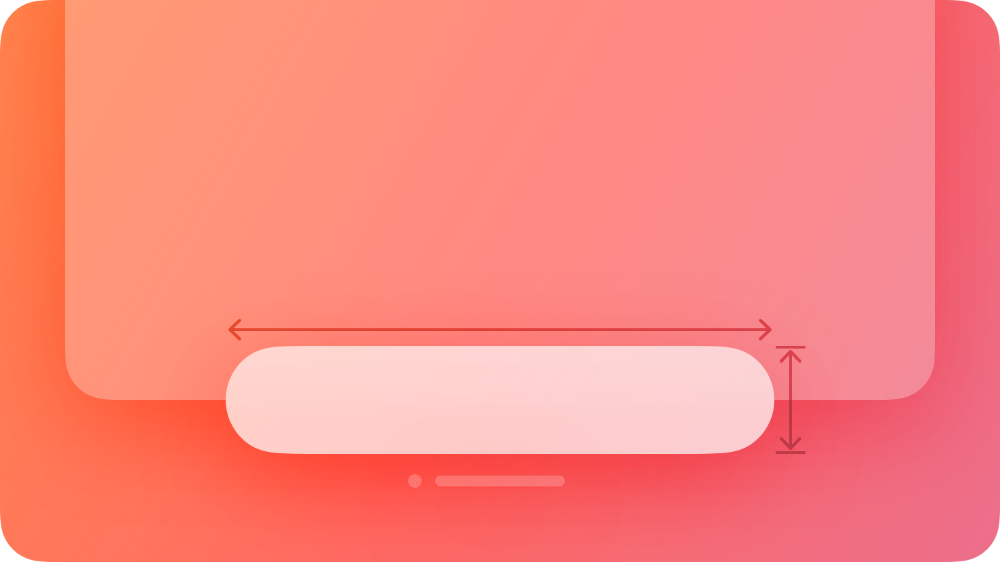

# Ornaments

In visionOS, an ornament presents controls and information related to a window, without crowding or obscuring the window’s contents.

An ornament floats in a plane that’s parallel to its associated window and slightly in front of it along the z-axis. If the associated window moves, the ornament moves with it, maintaining its relative position; if the window’s contents scroll, the controls or information in the ornament remain unchanged.

Ornaments can appear on any edge of a window and can contain UI components like buttons, segmented controls, and other views. The system uses ornaments to create and manage components like [Toolbars](./toolbars.md), [Tab bars](./tab-bars.md), and video playback controls; you can use an ornament to create a custom component.

## Best practices

**Consider using an ornament to present frequently needed controls or information in a consistent location that doesn’t clutter the window.** Because an ornament stays close to its window, people always know where to find it. For example, Music uses an ornament to offer Now Playing controls, ensuring that these controls remain in a predictable location that’s easy to find.

**In general, keep an ornament visible.** It can make sense to hide an ornament when people dive into a window’s content — for example, when they watch a video or view a photo — but in most cases, people appreciate having consistent access to an ornament’s controls.

**If you need to display multiple ornaments, prioritize the overall visual balance of the window.** Ornaments help elevate important actions, but they can sometimes distract from your content. When necessary, consider constraining the total number of ornaments to avoid increasing a window’s visual weight and making your app feel more complicated. If you decide to remove an ornament, you can relocate its elements into the main window.

**Aim to keep an ornament’s width the same or narrower than the width of the associated window.** If an ornament is wider than its window, it can interfere with a tab bar or other vertical content on the window’s side.

**Consider using borderless buttons in an ornament.** By default, an ornament’s background is [visionOS](./materials.md), so if you place a button directly on the background, it may not need a visible border. When people look at a borderless button in an ornament, the system automatically applies the hover affect to it (for guidance, see [Eyes](./eyes.md)).

**Use system-provided toolbars and tab bars unless you need to create custom components.** In visionOS, toolbars and tab bars automatically appear as ornaments, so you don’t need to use an ornament to create these components. For developer guidance, see [Toolbars](https://developer.apple.com/documentation/SwiftUI/Toolbars) and [TabView](https://developer.apple.com/documentation/SwiftUI/TabView).

## Platform considerations

*Not supported in iOS, iPadOS, macOS, tvOS, or watchOS.*

## Resources

#### Related

[Layout](./layout.md)

[Toolbars](./toolbars.md)

#### Developer documentation

[ornament(visibility:attachmentAnchor:contentAlignment:ornament:)](https://developer.apple.com/documentation/SwiftUI/View/ornament(visibility:attachmentAnchor:contentAlignment:ornament:)) — SwiftUI

#### Videos

- [Design for spatial user interfaces](https://developer.apple.com/videos/play/wwdc2023/10076)

## Change log

| Date | Changes |
| --- | --- |
| February 2, 2024 | Added guidance on using multiple ornaments. |
| December 5, 2023 | Removed a statement about using ornaments to present supplementary items. |
| June 21, 2023 | New page. |
