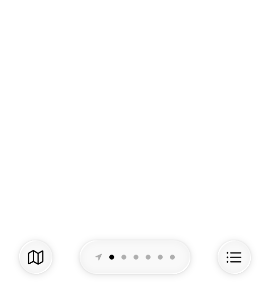

# Page controls

A page control displays a row of indicator images, each of which represents a page in a flat list.

The scrolling row of indicators helps people navigate the list to find the page they want. Page controls can handle an arbitrary number of pages, making them particularly useful in situations where people can create custom lists.

Page controls appear as a series of small indicator dots by default, representing the available pages. A solid dot denotes the current page. Visually, these dots are always equidistant, and are clipped if there are too many to fit in the window.

## Best practices

**Use page controls to represent movement between an ordered list of pages.** Page controls don’t represent hierarchical or nonsequential page relationships. For more complex navigation, consider using a sidebar or split view instead.

**Center a page control at the bottom of the view or window.** To ensure people always know where to find a page control, center it horizontally and position it near the bottom of the view.

**Although page controls can handle any number of pages, don’t display too many**. More than about 10 dots are hard to count at a glance. If your app needs to display more than 10 pages as peers, consider using a different arrangement‚ such as a grid, that lets people navigate the content in any order.

## Customizing indicators

By default, a page control uses the system-provided dot image for all indicators, but it can also display a unique image to help people identify a specific page. For example, Weather uses the `location.fill` symbol to distinguish the current location’s page.

If it enhances your app or game, you can provide a custom image to use as the default image for all indicators and you can also supply a different image for a specific page. For developer guidance, see [preferredIndicatorImage](https://developer.apple.com/documentation/UIKit/UIPageControl/preferredIndicatorImage) and [setIndicatorImage(_:forPage:)](https://developer.apple.com/documentation/UIKit/UIPageControl/setIndicatorImage(_:forPage:)).

**Make sure custom indicator images are simple and clear.** Avoid complex shapes, and don’t include negative space, text, or inner lines, because these details can make an icon muddy and indecipherable at very small sizes. Consider using simple [SF Symbols](./sf-symbols.md) as indicators or design your own icons. For guidance, see [Icons](./icons.md).

**Customize the default indicator image only when it enhances the page control’s overall meaning.** For example, if every page you list contains bookmarks, you might use the `bookmark.fill` symbol as the default indicator image.

**Avoid using more than two different indicator images in a page control.** If your list contains one page with special meaning — like the current-location page in Weather — you can make the page easy to find by giving it a unique indicator image. In contrast, a page control that uses several unique images to mark several important pages is hard to use because people must memorize the meaning of each image. A page control that displays more than two types of indicator images tends to look messy and haphazard, even when each image is clear.

**Avoid coloring indicator images.** Custom colors can reduce the contrast that differentiates the current-page indicator and makes the page control visible on the screen. To ensure that your page control is easy to use and looks good in different contexts, let the system automatically color the indicators.

## Platform considerations

*Not supported in macOS.*

### iOS, iPadOS

A page control can adjust the appearance of indicators to provide more information about the list. For example, the control highlights the indicator of the current page so people can estimate the page’s relative position in the list. When there are more indicators than fit in the space, the control can shrink indicators at both sides to suggest that more pages are available.

People interact with page controls by tapping or scrubbing (to *scrub*, people touch the control and drag left or right). Tapping on the leading or trailing side of the current-page indicator reveals the next or previous page; in iPadOS, people can also use the pointer to target a specific indicator. Scrubbing opens pages in sequence, and scrubbing past the leading or trailing edge of the control helps people quickly reach the first or last page.

> **Note:**
> In the API, *tapping* is a *discrete interaction*, whereas *scrubbing* is a *continuous interaction*; for developer guidance, see [UIPageControl.InteractionState](https://developer.apple.com/documentation/UIKit/UIPageControl/InteractionState-swift.enum).

**Avoid animating page transitions during scrubbing.** People can scrub very quickly, and using the scrolling animation for every transition can make your app lag and cause distracting visual flashes. Use the animated scrolling transition only for tapping.

A page control can include a translucent, rounded-rectangle background appearance that provides visual contrast for the indicators. You can choose one of the following background styles:

- Automatic — Displays the background only when people interact with the control. Use this style when the page control isn’t the primary navigational element in the UI.
- Prominent — Always displays the background. Use this style only when the control is the primary navigational control in the screen.
- Minimal — Never displays the background. Use this style when you just want to show the position of the current page in the list and you don’t need to provide visual feedback during scrubbing.

For developer guidance, see [backgroundStyle](https://developer.apple.com/documentation/UIKit/UIPageControl/backgroundStyle-swift.property).

**Avoid supporting the scrubber when you use the minimal background style.** The minimal style doesn’t provide visual feedback during scrubbing. If you want to let people scrub a list of pages in your app, use the automatic or prominent background styles.

## Resources

#### Related

[Scroll views](./scroll-views.md)

#### Developer documentation

[PageTabViewStyle](https://developer.apple.com/documentation/SwiftUI/PageTabViewStyle) — SwiftUI

[UIPageControl](https://developer.apple.com/documentation/UIKit/UIPageControl) — UIKit

## Change log

| Date | Changes |
| --- | --- |
| June 21, 2023 | Updated to include guidance for visionOS. |
| June 5, 2023 | Updated guidance for using page controls in watchOS. |
