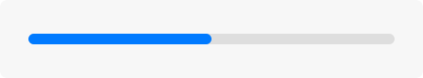
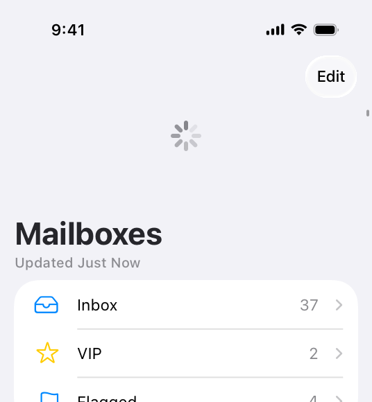

# Progress indicators

Progress indicators let people know that your app isn’t stalled while it loads content or performs lengthy operations.

Some progress indicators also give people a way to estimate how long they have to wait for something to complete. All progress indicators are transient, appearing only while an operation is ongoing and disappearing after it completes.

Because the duration of an operation is either known or unknown, there are two types of progress indicators:

- *Determinate*, for a task with a well-defined duration, such as a file conversion
- *Indeterminate*, for unquantifiable tasks, such as loading or synchronizing complex data

Both determinate and indeterminate progress indicators can have different appearances depending on the platform. A determinate progress indicator shows the progress of a task by filling a linear or circular track as the task completes. *Progress bars* include a track that fills from the leading side to the trailing side. *Circular progress indicators* have a track that fills in a clockwise direction.

An indeterminate progress indicator — also called an *activity indicator* — uses an animated image to indicate progress. All platforms support a circular image that appears to spin; however, macOS also supports an indeterminate progress bar.

For developer guidance, see [ProgressView](https://developer.apple.com/documentation/SwiftUI/ProgressView).

## Best practices

**When possible, use a determinate progress indicator.** An indeterminate progress indicator shows that a process is occurring, but it doesn’t help people estimate how long a task will take. A determinate progress indicator can help people decide whether to do something else while waiting for the task to complete, restart the task at a different time, or abandon the task.

**Be as accurate as possible when reporting advancement in a determinate progress indicator.** Consider evening out the pace of advancement to help people feel confident about the time needed for the task to complete. Showing 90 percent completion in five seconds and the last 10 percent in 5 minutes can make people wonder if your app is still working and can even feel deceptive.

**Keep progress indicators moving so people know something is continuing to happen.** People tend to associate a stationary indicator with a stalled process or a frozen app. If a process stalls for some reason, provide feedback that helps people understand the problem and what they can do about it.

**When possible, switch a progress bar from indeterminate to determinate.** If an indeterminate process reaches a point where you can determine its duration, switch to a determinate progress bar. People generally prefer a determinate progress indicator, because it helps them gauge what’s happening and how long it will take.

**Don’t switch from the circular style to the bar style.** Activity indicators (also called *spinners*) and progress bars are different shapes and sizes, so transitioning between them can disrupt your interface and confuse people.

**If it’s helpful, display a description that provides additional context for the task.** Be accurate and succinct. Avoid vague terms like *loading* or *authenticating* because they seldom add value.

**Display a progress indicator in a consistent location.** Choosing a consistent location for a progress indicator helps people reliably find the status of an operation across platforms or within or between apps.

**When it’s feasible, let people halt processing.** If people can interrupt a process without causing negative side effects, include a Cancel button. If interrupting the process might cause negative side effects — such as losing the downloaded portion of a file — it can be useful to provide a Pause button in addition to a Cancel button.

**Let people know when halting a process has a negative consequence.** When canceling a process results in lost progress, it’s helpful to provide an [alert](https://developer.apple.com/design/human-interface-guidelines/alerts) that includes an option to confirm the cancellation or resume the process.

## Platform considerations

*No additional considerations for tvOS or visionOS.*

### iOS, iPadOS

#### Refresh content controls

A refresh control lets people immediately reload content, typically in a table view, without waiting for the next automatic content update to occur. A refresh control is a specialized type of activity indicator that’s hidden by default, becoming visible when people drag down the view they want to reload. In Mail, for example, people can drag down the list of Inbox messages to check for new messages.

**Perform automatic content updates.** Although people appreciate being able to do an immediate content refresh, they also expect automatic refreshes to occur periodically. Don’t make people responsible for initiating every update. Keep data fresh by updating it regularly.

**Supply a short title only if it adds value.** Optionally, a refresh control can include a title. In most cases, this is unnecessary, as the animation of the control indicates that content is loading. If you do include a title, don’t use it to explain how to perform a refresh. Instead, provide information of value about the content being refreshed. A refresh control in Podcasts, for example, uses a title to tell people when the last podcast update occurred.

For developer guidance, see [UIRefreshControl](https://developer.apple.com/documentation/UIKit/UIRefreshControl).

### macOS

In macOS, an indeterminate progress indicator can have a bar or circular appearance. Both versions use an animated image to indicate that the app is performing a task.

**Prefer an activity indicator (spinner) to communicate the status of a background operation or when space is constrained.** Spinners are small and unobtrusive, so they’re useful for asynchronous background tasks, like retrieving messages from a server. Spinners are also good for communicating progress within a small area, such as within a text field or next to a specific control, such as a button.

**Avoid labeling a spinning progress indicator.** Because a spinner typically appears when people initiate a process, a label is usually unnecessary.

## Resources

#### Developer documentation

[ProgressView](https://developer.apple.com/documentation/SwiftUI/ProgressView) — SwiftUI

[UIProgressView](https://developer.apple.com/documentation/UIKit/UIProgressView) — UIKit

[UIActivityIndicatorView](https://developer.apple.com/documentation/UIKit/UIActivityIndicatorView) — UIKit

[UIRefreshControl](https://developer.apple.com/documentation/UIKit/UIRefreshControl) — UIKit

[NSProgressIndicator](https://developer.apple.com/documentation/AppKit/NSProgressIndicator) — AppKit

## Change log

| Date | Changes |
| --- | --- |
| September 12, 2023 | Combined guidance common to all platforms. |
| June 5, 2023 | Updated guidance to reflect changes in watchOS 10. |
