# Right to left

Support right-to-left languages like Arabic and Hebrew by reversing your interface as needed to match the reading direction of the related scripts.

When people choose a language for their device — or just your app or game — they expect the interface to adapt in various ways (to learn more, see [Localization](https://developer.apple.com/localization/)).

System-provided UI frameworks support right-to-left (RTL) by default, allowing system-provided UI components to flip automatically in the RTL context. If you use system-provided elements and standard layouts, you might not need to make any changes to your app’s automatically reversed interface.

If you want to fine-tune your layout or enhance specific localizations to adapt to different currencies, numerals, or mathematical symbols that can occur in various locales in countries that use RTL languages, follow these guidelines.

## Text alignment

**Adjust text alignment to match the interface direction, if the system doesn’t do so automatically.** For example, if you left-align text with content in the left-to-right (LTR) context, right-align the text to match the content’s mirrored position in the RTL context.

**Align a paragraph based on its language, not on the current context.** When the alignment of a paragraph — defined as three or more lines of text — doesn’t match its language, it can be difficult to read. For example, right-aligning a paragraph that consists of LTR text can make the beginning of each line difficult to see. To improve readability, continue aligning one- and two-line text blocks to match the reading direction of the current context, but align a paragraph to match its language.

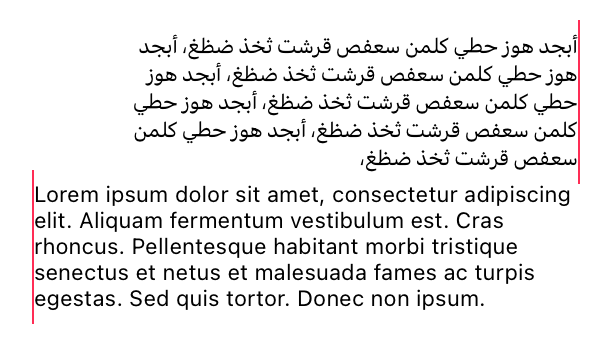

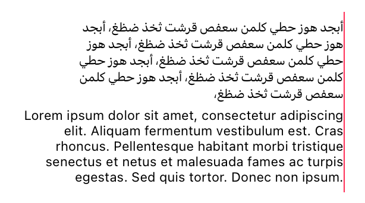

**Use a consistent alignment for all text items in a list.** To ensure a comfortable reading and scanning experience, reverse the alignment of all items in a list, including items that are displayed in a different script.

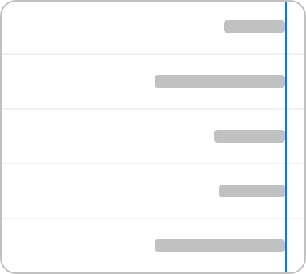

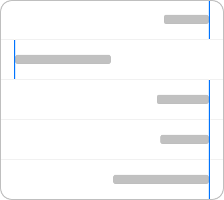

## Numbers and characters

Different RTL languages can use different number systems. For example, Hebrew text uses Western Arabic numerals, whereas Arabic text might use either Western or Eastern Arabic numerals. The use of Western and Eastern Arabic numerals varies among countries and regions and even among areas within the same country or region.

If your app covers mathematical concepts or other number-centric topics, it’s a good idea to identify the appropriate way to display such information in each locale you support. In contrast, apps that don’t address number-related topics can generally rely on system-provided number representations.

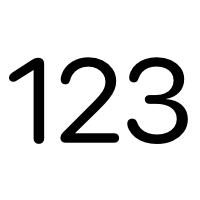

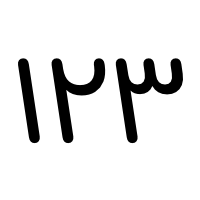

**Don’t reverse the order of numerals in a specific number.** Regardless of the current language or the surrounding content, the digits in a specific number — such as “541,” a phone number, or a credit card number — always appear in the same order.

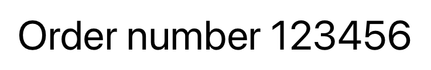

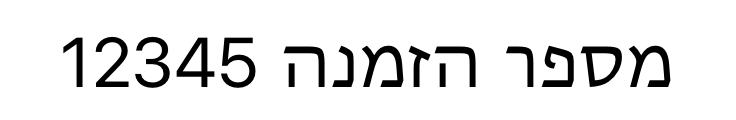

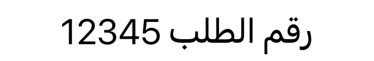

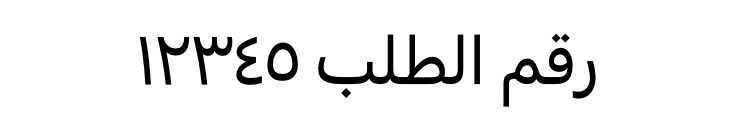

**Reverse the order of numerals that show progress or a counting direction; never flip the numerals themselves.** Controls like progress bars, sliders, and rating controls often include numerals to clarify their meaning. If you use numerals in this way, be sure to reverse the order of the numerals to match the direction of the flipped control. Also reverse a sequence of numerals if you use the sequence to communicate a specific order.

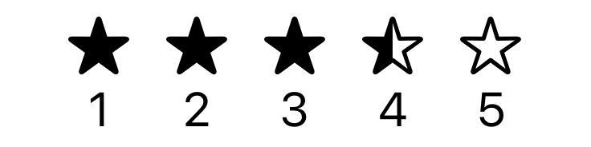

## Controls

**Flip controls that show progress from one value to another.** Because people tend to view forward progress as moving in the same direction as the language they read, it makes sense to flip controls like sliders and progress indicators in the RTL context. When you do this, also be sure to reverse the positions of the accompanying glyphs or images that depict the beginning and ending values of the control.

**Flip controls that help people navigate or access items in a fixed order.** For example, in the RTL context, a back button must point to the right so the flow of screens matches the reading order of the RTL language. Similarly, next or previous buttons that let people access items in an ordered list need to flip in the RTL context to match the reading order.

**Preserve the direction of a control that refers to an actual direction or points to an onscreen area.** For example, if you provide a control that means “to the right,” it must always point right, regardless of the current context.

**Visually balance adjacent Latin and RTL scripts when necessary.** In buttons, labels, and titles, Arabic or Hebrew text can appear too small when next to uppercased Latin text, because Arabic and Hebrew don’t include uppercase letters. To visually balance Arabic or Hebrew text with Latin text that uses all capitals, it often works well to increase the RTL font size by about 2 points.

![A horizontal row of three blue oval buttons. Each button is labeled with the word download. From the left, the labels are in Latin, Arabic, and Hebrew scripts, with the English label using all capital letters. Two horizontal red lines run across all three buttons, the top line is the ascender line and the bottom line is the baseline. Every letter in the English label touches both lines. Only the last two letters in the Arabic label touch or extend below the baseline; only the last letter touches the ascender line. No letters in the Hebrew label touch either line. In comparison with the Latin label, both the Arabic and Hebrew labels look small.](../images/download-uneven-vertical-height.png)

![A horizontal row of three blue oval buttons. Each button is labeled with the word download. From the left, the labels are in Latin, Arabic, and Hebrew scripts, with the English label using all capital letters. Two horizontal red lines run across all three buttons, the top line is the ascender line and the bottom line is the baseline. Every letter in the English label touches both lines. The last two letters in the Arabic label touch or extend below the baseline, and the first and last letters extend above the ascender line. All letters in the Hebrew label touch the base line and the ascender line. The increased size of the Arabic and Hebrew labels make them look similar in size to the Latin label.](../images/download-even-vertical-height.png)

## Images

**Avoid flipping images like photographs, illustrations, and general artwork.** Flipping an image often changes the image’s meaning; flipping a copyrighted image could be a violation. If an image’s content is strongly connected to reading direction, consider creating a new version of the image instead of flipping the original.

**Reverse the positions of images when their order is meaningful.** For example, if you display multiple images in a specific order like chronological, alphabetical, or favorite, reverse their positions to preserve the order’s meaning in the RTL context.

## Interface icons

When you use [SF Symbols](./sf-symbols.md) to supply interface icons for your app, you get variants for the RTL context and localized symbols for Arabic and Hebrew, among other languages. If you create custom symbols, you can specify their directionality. For developer guidance, see [Creating custom symbol images for your app](https://developer.apple.com/documentation/UIKit/creating-custom-symbol-images-for-your-app).

![Three horizontal lines, stacked evenly on top of each other. Each line is preceded by a bullet on left. The shape of a closed book with its spine on the left. A rounded rectangle containing a left-aligned row of three dots. A pencil is slanted at about forty-five degrees, with its point right of the rightmost dot and its eraser extending out of the top-right corner of the rectangle. A rounded rectangle with a black bar across the top that occupies about a quarter of the rectangle's height. A left-aligned row of white dots is in the left side of the bar. A rounded rectangle that contains a smaller, solid-black rounded rectangle near the left side. Outside the rectangle and to the right is a solid-black semicircle with a vertical straight edge that's close to the vertical right side of the rectangle.](../images/directional-symbols-ltr.png)

![Three horizontal lines, stacked evenly on top of each other. Each line is preceded by a bullet on right. The shape of a closed book with its spine on the right. A rounded rectangle containing a right-aligned row of three dots. A pencil is slanted at about forty-five degrees, with its point left of the leftmost dot and its eraser extending out of the middle of the rectangle's top. A rounded rectangle with a black bar across the top that occupies about a quarter of the rectangle's height. A right-aligned row of white dots is in the right side of the bar. A rounded rectangle that contains a smaller, solid-black rounded rectangle near the right side. Outside the rectangle and to the left is a solid-black semicircle with a vertical straight edge that's close to the vertical left side of the rectangle.](../images/directional-symbols-rtl.png)

**Flip interface icons that represent text or reading direction.** For example, if an interface icon uses left-aligned bars to represent text in the LTR context, right-align the bars in the RTL context.

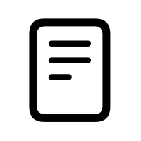

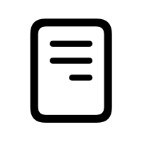

**Consider creating a localized version of an interface icon that displays text.** Some interface icons include letters or words to help communicate a script-related concept, like font-size choice or a signature. If you have a custom interface icon that needs to display actual text, consider creating a localized version. For example, SF Symbols offers different versions of the signature, rich-text, and I-beam pointer symbols for use with Latin, Hebrew, and Arabic text, among others.

If you have a custom interface icon that uses letters or words to communicate a concept unrelated to reading or writing, consider designing an alternative image that doesn’t use text.

**Flip an interface icon that shows forward or backward motion.** When something moves in the same direction that people read, they typically interpret that direction as forward; when something moves in the opposite direction, people tend to interpret the direction as backward. An interface icon that depicts an object moving forward or backward needs to flip in the RTL context to preserve the meaning of the motion. For example, an icon that represents a speaker typically shows sound waves emanating forward from the speaker. In the LTR context, the sound waves come from the left, so in the RTL context, the icon needs to flip to show the waves coming from the right.

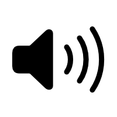

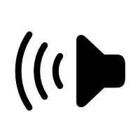

**Don’t flip logos or universal signs and marks.** Displaying a flipped logo confuses people and can have legal repercussions. Always display a logo in its original form, even if it includes text. People expect universal symbols and marks like the checkmark to have a consistent appearance, so avoid flipping them.

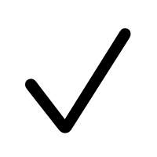

**In general, avoid flipping interface icons that depict real-world objects.** Unless you use the object to indicate directionality, it’s best to avoid flipping an icon that represents a familiar item. For example, clocks work the same everywhere, so a traditional clock interface icon needs to look the same regardless of language direction. Some interface icons might seem to reference language or reading direction because they represent items that are slanted for right-handed use. However, most people are right-handed, so flipping an icon that shows a right-handed tool isn’t necessary and might be confusing.

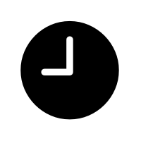

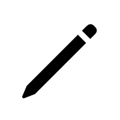

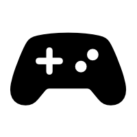

**Before merely flipping a complex custom interface icon, consider its individual components and the overall visual balance.** In some cases, a component — like a badge, slash, or magnifying glass — needs to adhere to a visual design language regardless of localization. For example, SF Symbols maintains visual consistency by using the same backslash to represent the prohibition or negation of a symbol’s meaning in both LTR and RTL versions.

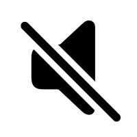

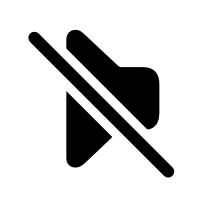

In other cases, you might need to flip a component (or its position) to ensure the localized version of the icon still makes sense. For example, if a badge represents the actual UI that people see in your app, it needs to flip if your UI flips. Alternatively, if a badge modifies the meaning of an interface icon, consider whether flipping the badge preserves both the modified meaning and the overall visual balance of the icon. In the images shown below, the badge doesn’t depict an object in the UI, but keeping it in the top-right corner visually unbalances the cart.

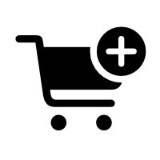

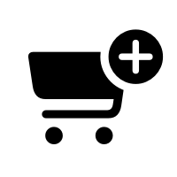

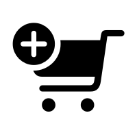

If your custom interface icon includes a component that can imply handedness, like a tool, consider preserving the orientation of the tool while flipping the base image if necessary.

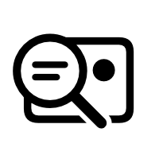

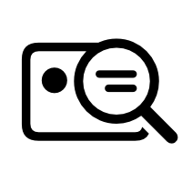

## Platform considerations

*No additional considerations for iOS, iPadOS, macOS, tvOS, visionOS, or watchOS.*

## Resources

#### Related

[Layout](./layout.md)

[Inclusion](./inclusion.md)

[SF Symbols](./sf-symbols.md)

#### Developer documentation

[Localization](https://developer.apple.com/localization/)

[Preparing views for localization](https://developer.apple.com/documentation/SwiftUI/Preparing-views-for-localization) — SwiftUI

#### Videos

- [Enhance your app’s multilingual experience](https://developer.apple.com/videos/play/wwdc2025/222)
- [Design for Arabic](https://developer.apple.com/videos/play/wwdc2022/10034)
