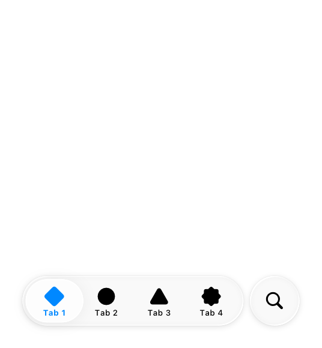
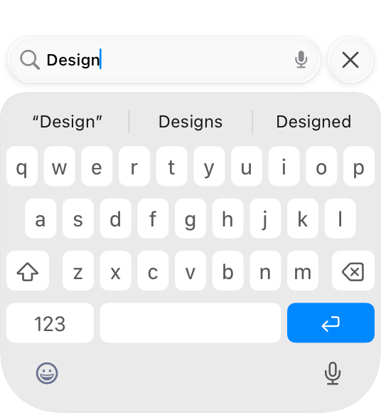
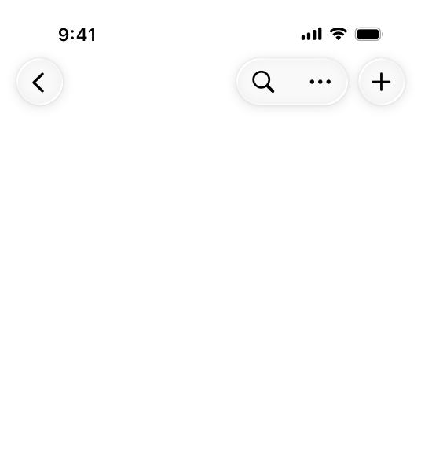
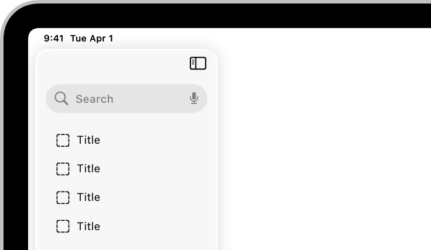
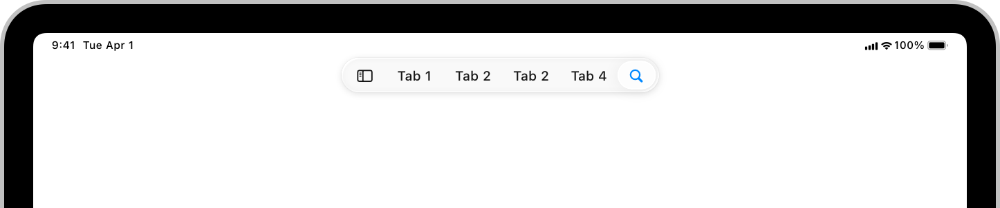

# Search fields

A search field lets people search a collection of content for specific terms they enter.

A search field is an editable text field that displays a Search icon, a Clear button, and placeholder text where people can enter what they are searching for. Search fields can use a [Scope controls and tokens](./search-fields.md) as well as [Scope controls and tokens](./search-fields.md) to help filter and refine the scope of their search. Across each platform, there are different patterns for accessing search based on the goals and design of your app.

For developer guidance, see [Adding a search interface to your app](https://developer.apple.com/documentation/SwiftUI/Adding-a-search-interface-to-your-app); for guidance related to systemwide search, see [Searching](./searching.md).

## Best practices

**Display placeholder text that describes the type of information people can search for.** For example, the Apple TV app includes the placeholder text *Shows, Movies, and More*. Avoid using a term like *Search* for placeholder text because it doesn’t provide any helpful information.

**If possible, start search immediately when a person types.** Searching while someone types makes the search experience feel more responsive because it provides results that are continuously refined as the text becomes more specific.

**Consider showing suggested search terms before search begins, or as a person types.** This can help someone search faster by suggesting common searches, even when the search itself doesn’t begin immediately.

**Simplify search results.** Provide the most relevant search results first to minimize the need for someone to scroll to find what they’re looking for. In addition to prioritizing the most likely results, consider categorizing them to help people find what they want.

**Consider letting people filter search results.** For example, you can include a scope control in the search results content area to help people quickly and easily filter search results.

## Scope controls and tokens

Scope controls and tokens are components you can use to let someone narrow the parameters of a search either before or after they make it.

- A *scope control* acts like a [Segmented controls](./segmented-controls.md) for choosing a category for the search.
- A *token* is a visual representation of a search term that someone can select and edit, and acts as a filter for any additional terms in the search.

**Use a scope control to filter among clearly defined search categories.** A scope control can help someone move from a broader scope to a narrower one. For example, in Mail on iPhone, a scope control helps people move from searching their entire mailbox to just the specific mailbox they’re viewing. For developer guidance, see [Scoping a search operation](https://developer.apple.com/documentation/SwiftUI/Scoping-a-search-operation).

**Default to a broader scope and let people refine it as they need.** A broader scope provides context for the full set of available results, which helps guide people in a useful direction when they choose to narrow the scope.

**Use tokens to filter by common search terms or items.** When you define a token, the term it represents gains a visual treatment that encapsulates it, indicating that people can select and edit it as a single item. Tokens can clarify a search term, like filtering by a specific contact in Mail, or focus a search to a specific set of attributes, like filtering by photos in Messages. For the related macOS component, see [Token fields](./token-fields.md).

**Consider pairing tokens with search suggestions.** People may not know which tokens are available, so pairing them with search suggestions can help people learn how to use them.

## Platform considerations

*No additional considerations for visionOS*.

### iOS

There are three main places you can position the entry point for search:

- In a tab bar at the bottom of the screen
- In a toolbar at the bottom or top of the screen
- Directly inline with content

Where search makes the most sense depends on the layout, content, and navigation of your app.

#### Search in a tab bar

You can place search as a visually distinct tab on the trailing side of a tab bar, which keeps search visible and always available as people switch between the sections of your app.

When someone navigates to the search tab, the search field that appears can start as *focused* or *unfocused*.

**Start with the search field focused to help people quickly find what they need.** When the search field starts focused, the keyboard immediately appears with the search field above it, ready to begin the search. This provides a more transient experience that brings people directly back to their previous tab after they exit search, and is ideal when you want search to resolve quickly and seamlessly.

**Start with the search field unfocused to promote discovery and exploration.** When the search field starts unfocused, the search tab expands into an unselected field at the bottom of the screen. This provides space on the rest of the screen for additional discovery or navigation before someone taps the field to begin the search. This is great for an app with a large collection of content to showcase, like Music or TV.

#### Search in a toolbar

As an alternative to search in a tab bar, you can also place search in a toolbar either at the bottom or top of the screen.

- You can include search in a bottom toolbar either as an expanded field or as a toolbar button, depending on how much space is available and how important search is to your app. When someone taps it, it animates into a search field above the keyboard so they can begin typing.
- You can include search in a top toolbar, also called a navigation bar, where it appears as a toolbar button. When someone taps it, it animates into a search field that appears either above the keyboard or inline at the top if there isn’t space at the bottom.

**Place search at the bottom if there’s room.** You can either add a search field to an existing toolbar, or as a new toolbar where search is the only item. Search at the bottom is useful in any situation where search is a priority, since it keeps the search experience easy to reach. Examples of apps with search at the bottom in various toolbar layouts include Settings, where it’s the only item, and Mail and Notes, where it fits alongside other important controls.

**Place search at the top when itʼs important to defer to content at the bottom of the screen, or thereʼs no bottom toolbar.** Use search at the top in cases where covering the content might interfere with a primary function of the app. The Wallet app, for example, includes event passes in a stack at the bottom of the screen for easy access and viewing at a glance.

#### Search as an inline field

In some cases you might want your app to include a search field inline with content.

**Place search as an inline field when its position alongside the content it searches strengthens that relationship.** When you need to filter or search within a single view, it can be helpful to have search appear directly next to content to illustrate that the search applies to it, rather than globally. For example, although the main search in the Music app is in the tab bar, people can navigate to their library and use an inline search field to filter their songs and albums.

**Prefer placing search at the bottom.** Generally, even for search that applies to a subset of your app’s content, it’s better to locate search where people can reach it easily. The Settings app, for example, places search at the bottom both for its top-level search and for search in the section for individual apps. If there isn’t space at the bottom (because it’s occupied by a tab bar or other important UI, for example), it’s okay to place search inline at the top.

**When at the top, position an inline search field above the list it searches, and pin it to the top toolbar when scrolling.** This helps keep it distinct from search that appears in other locations.

### iPadOS, macOS

The placement and behavior of the search field in iPadOS and macOS is similar; on both platforms, clearing the field exits search and dismisses the keyboard if present. If your app is available on both iPad and Mac, try to keep the search experience as consistent as possible across both platforms.

**Put a search field at the trailing side of the toolbar for many common uses.** Many apps benefit from the familiar pattern of search in the toolbar, particularly apps with split views or apps that navigate between multiple sources, like Mail, Notes, and Voice Memos. The persistent availability of search at the side of the toolbar gives it a global presence within your app, so it’s generally appropriate to start with a global scope for the initial search.

**Include search at the top of the sidebar when filtering content or navigation there.** Apps such as Settings take advantage of search to quickly filter the sidebar and expose sections that may be multiple levels deep, providing a simple way for people to search, preview, and navigate to the section or setting they’re looking for.

**Include search as an item in the sidebar or tab bar when you want an area dedicated to discovery.** If your search is paired with rich suggestions, categories, or content that needs more space, it can be helpful to have a dedicated area for it. This is particularly true for apps where browsing and search go hand in hand, like Music and TV, where it provides a unified location to highlight suggested content, categories, and recent searches. A dedicated area also ensures search is always available as people navigate and switch sections of your app.

**In a search field in a dedicated area, consider immediately focusing the field when a person navigates to the section to help people search faster and locate the field itself more easily.** An exception to this is on iPad when only a virtual keyboard is available, in which case it’s better to leave the field unfocused to prevent the keyboard from unexpectedly covering the view.

**Account for window resizing with the placement of the search field.** On iPad, the search field fluidly resizes with the app window like it does on Mac. However, for compact views on iPad, itʼs important to ensure that search is available where it’s most contextually useful. For example, Notes and Mail place search above the column for the content list when they resize down to a compact view.

## Resources

#### Related

[Searching](./searching.md)

[Token fields](./token-fields.md)

#### Developer documentation

[Adding a search interface to your app](https://developer.apple.com/documentation/SwiftUI/Adding-a-search-interface-to-your-app) — SwiftUI

[searchable(text:placement:prompt:)](https://developer.apple.com/documentation/SwiftUI/View/searchable(text:placement:prompt:)) — SwiftUI

[UISearchBar](https://developer.apple.com/documentation/UIKit/UISearchBar) — UIKit

[UISearchTextField](https://developer.apple.com/documentation/UIKit/UISearchTextField) — UIKit

[NSSearchField](https://developer.apple.com/documentation/AppKit/NSSearchField) — AppKit

#### Videos

- [Get to know the new design system](https://developer.apple.com/videos/play/wwdc2025/356)
- [Discoverable design](https://developer.apple.com/videos/play/wwdc2021/10126)
- [Craft search experiences in SwiftUI](https://developer.apple.com/videos/play/wwdc2021/10176)

## Change log

| Date | Changes |
| --- | --- |
| June 9, 2025 | Updated guidance for search placement in iOS, consolidated iPadOS and macOS platform considerations, and added guidance for tokens. |
| September 12, 2023 | Combined guidance common to all platforms. |
| June 5, 2023 | Added guidance for using search fields in watchOS. |
