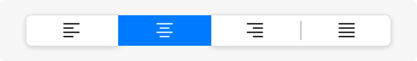
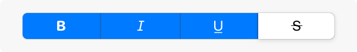
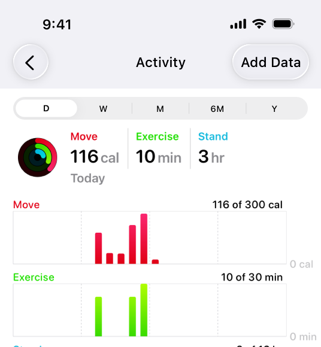
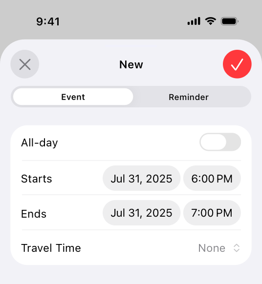
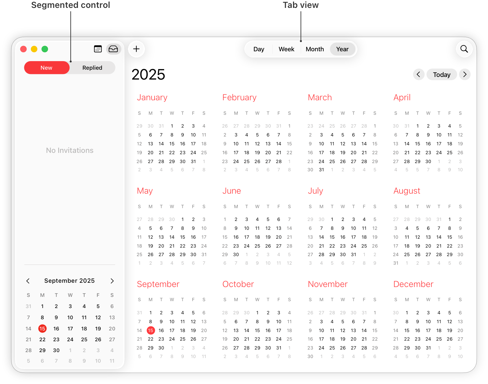

# Segmented controls

A segmented control is a linear set of two or more segments, each of which functions as a button.

Within a segmented control, all segments are usually equal in width. Like [Buttons](./buttons.md), segments can contain text or images. Segments can also have text labels beneath them (or beneath the control as a whole).

A segmented control offers a single choice from among a set of options, or in macOS, either a single choice or multiple choices. For example, in macOS Keynote people can select only one segment in the alignment options control to align selected text. In contrast, people can choose multiple segments in the font attributes control to combine styles like bold, italics, and underline. The toolbar of a Keynote window also uses a segmented control to let people show and hide various editing panes within the main window area.

In addition to representing the state of a single or multiple-choice selection, a segmented control can function as a set of buttons that perform actions without showing a selection state. For example, the Reply, Reply all, and Forward buttons in macOS Mail. For developer guidance, see [isMomentary](https://developer.apple.com/documentation/UIKit/UISegmentedControl/isMomentary) and [NSSegmentedControl.SwitchTracking.momentary](https://developer.apple.com/documentation/AppKit/NSSegmentedControl/SwitchTracking/momentary).

## Best practices

**Use a segmented control to provide closely related choices that affect an object, state, or view.** For example, a segmented control in an inspector could let people choose one or more attributes to apply to a selection, or a segmented control in a toolbar could offer a set of actions to perform on the current view.

**Consider a segmented control when it’s important to group functions together, or to clearly show their selection state.** Unlike other button styles, segmented controls preserve their grouping regardless of the view size or where they appear. This grouping can also help people understand at a glance which controls are currently selected.

**Keep control types consistent within a single segmented control.** Don’t assign actions to segments in a control that otherwise represents selection state, and don’t show a selection state for segments in a control that otherwise performs actions.

**Limit the number of segments in a control.** Too many segments can be hard to parse and time-consuming to navigate. Aim for no more than about five to seven segments in a wide interface and no more than about five segments on iPhone.

**In general, keep segment size consistent.** When all segments have equal width, a segmented control feels balanced. To the extent possible, it’s best to keep icon and title widths consistent too.

## Content

**Prefer using either text or images — not a mix of both — in a single segmented control.** Although individual segments can contain text labels or images, mixing the two in a single control can lead to a disconnected and confusing interface.

**As much as possible, use content with a similar size in each segment.** Because all segments typically have equal width, it doesn’t look good if content fills some segments but not others.

**Use nouns or noun phrases for segment labels.** Write text that describes each segment and uses [title-style capitalization](https://support.apple.com/guide/applestyleguide/c-apsgb744e4a3/web#apdca93e113f1d64). A segmented control that displays text labels doesn’t need introductory text.

## Platform considerations

*Not supported in watchOS.*

### iOS, iPadOS

**Consider a segmented control to switch between closely related subviews.** A segmented control can be useful as a way to quickly switch between related subviews. For example, the segmented control in Calendar’s New Event sheet switches between the subviews for creating a new event and a new reminder. For switching between completely separate sections of an app, use a [Tab bars](./tab-bars.md) instead.

### macOS

**Consider using introductory text to clarify the purpose of a segmented control.** When the control uses symbols or interface icons, you could also add a label below each segment to clarify its meaning. If your app includes tooltips, provide one for each segment in a segmented control.

**Use a tab view in the main window area — instead of a segmented control — for view switching.** A [Tab views](./tab-views.md) supports efficient view switching and is similar in appearance to a [Boxes](./boxes.md) combined with a segmented control. Consider using a segmented control to help people switch views in a toolbar or inspector pane.

**Consider supporting spring loading.** On a Mac equipped with a Magic Trackpad, spring loading lets people activate a segment by dragging selected items over it and force clicking without dropping the selected items. People can also continue dragging the items after a segment activates.

## Resources

#### Related

[Split views](./split-views.md)

#### Developer documentation

[segmented](https://developer.apple.com/documentation/SwiftUI/PickerStyle/segmented) — SwiftUI

[UISegmentedControl](https://developer.apple.com/documentation/UIKit/UISegmentedControl) — UIKit

[NSSegmentedControl](https://developer.apple.com/documentation/AppKit/NSSegmentedControl) — AppKit

## Change log

| Date | Changes |
| --- | --- |
| June 21, 2023 | Updated to include guidance for visionOS. |
