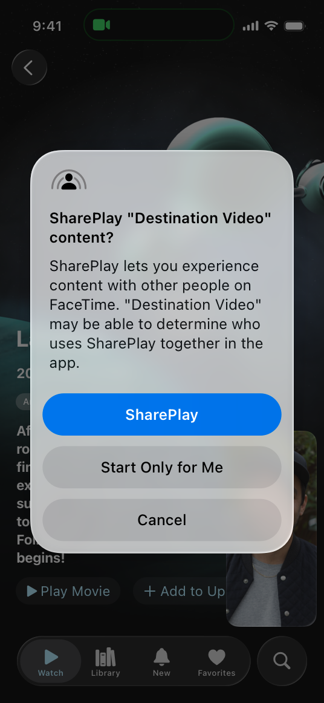

# SharePlay

SharePlay helps multiple people share activities — like viewing a movie, listening to music, playing a game, or sketching ideas on a whiteboard — while they’re in a FaceTime call or Messages conversation.

The system synchronizes app playback on all participating devices to support seamless media and content sharing that lets everyone enjoy the experience simultaneously. In visionOS, SharePlay helps people enjoy these experiences while they’re together in the same virtual space.

When someone shares content during a FaceTime call, the system asks each participant to launch the app to begin the experience. If people don’t have the app installed, the SharePlay alert encourages them to download it from the App Store. If you make the platform-specific versions of your app available as a [Universal Purchase](https://developer.apple.com/support/universal-purchase/), people can make one purchase and use your app and their in-app purchases across all the platforms you support.

## Best practices

**Let people know that you support SharePlay.** People often expect media playback experiences to be shareable, so indicate this capability in your interface. For example, you can use the `shareplay` SF Symbol to identify the content or experiences in your app that support SharePlay.

**If part of your app requires a subscription, consider ways to help nonsubscriber participants quickly join a group activity.** For example, you might offer temporary or provisional access to nonsubscribers or let an existing subscriber send a one-time pass to a friend. To make it easy for family members to share your content in a SharePlay experience, you can support [Family Sharing](https://developer.apple.com/design/human-interface-guidelines/in-app-purchase#Supporting-Family-Sharing). If people can start a subscription during a SharePlay experience, present a streamlined version of your sign-up flow so they can join the activity without making others wait. For guidance, see [Auto-renewable subscriptions](./in-app-purchase.md).

**Support Picture in Picture (PiP) when possible.** On iPhone and iPad, people can open a shared video in a PiP window. On a Mac, a shared video opens in a background window that people can move into the foreground when they want to watch.

**Use the term *SharePlay* correctly.** You can use *SharePlay* as a noun — as in “Join SharePlay” — and also as a verb when describing a direct action in your interface. For example, in a button or sheet that lets people share a movie-viewing activity, you can use a phrase like “SharePlay Movie.” Avoid using an adjective with SharePlay; for example, in your visionOS app, don’t add terms like *virtual* or *spatial*. Avoid changing the term *SharePlay* in any way; for example, don’t use variations like *SharePlayed*, *SharePlays*, or *SharePlaying*.

## Sharing activities

An *activity* is an app-defined type of shareable experience. For example, an app that lets people view videos might define a separate activity for viewing each type of content — like movies, TV shows, and uploaded videos — and display a different description for each activity. You can define as many different activities as make sense in your app. For developer guidance, see [Defining your app’s SharePlay activities](https://developer.apple.com/documentation/GroupActivities/defining-your-apps-shareplay-activities).

**Briefly describe each activity.** When people receive an invitation to participate in an activity, your description helps them understand the experience they’re about to share. For example, a video-viewing app might associate its descriptive movie view with a movie-viewing activity. In this case, the descriptive view might display a movie’s title, a plot summary, and a poster image. Write a simple, meaningful description that’s short enough to avoid truncation.

**Make it easy to start sharing an activity.** If there’s no session available when people start a shareable activity, you can present UI that lets them start a group activity. In response, the system asks people if they want to share or continue the experience solo.

**Help people prepare to join a session before displaying the activity.** For example, if people must log in, download content, or make a payment before they can participate, display views that help them perform these tasks before showing the activity UI. Make these tasks as simple and effortless as possible so people can join the group activity quickly.

**When possible, defer app tasks that might delay a shared activity.** For example, if your app needs to know a participant’s profile, consider asking for this information at a convenient time, like when playback pauses or finishes.

## Platform considerations

*No additional considerations for iOS, iPadOS, macOS, or tvOS. Not supported in watchOS.*

## Resources

#### Related

[Auto-renewable subscriptions](./in-app-purchase.md)

#### Developer documentation

[Group Activities](https://developer.apple.com/documentation/GroupActivities)

#### Videos

- [Share visionOS experiences with nearby people](https://developer.apple.com/videos/play/wwdc2025/318)
- [Design spatial SharePlay experiences](https://developer.apple.com/videos/play/wwdc2023/10075)
- [Add SharePlay to your app](https://developer.apple.com/videos/play/wwdc2023/10239)

## Change log

| Date | Changes |
| --- | --- |
| December 5, 2023 | Added artwork for visionOS. |
| June 21, 2023 | Updated to include guidance for visionOS. |
| December 19, 2022 | Clarified guidance for helping nonsubscribers join a group activity. |
