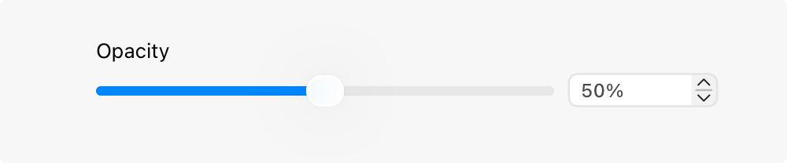
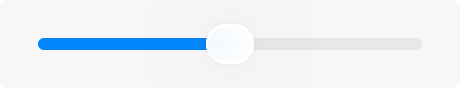
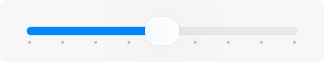
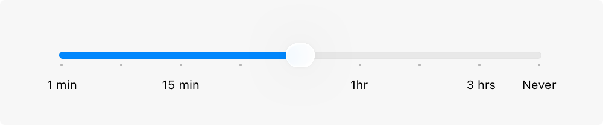

# Sliders

A slider is a horizontal track with a control, called a thumb, that people can adjust between a minimum and maximum value.

As a slider’s value changes, the portion of track between the minimum value and the thumb fills with color. A slider can optionally display left and right icons that illustrate the meaning of the minimum and maximum values.

## Best practices

**Customize a slider’s appearance if it adds value.** You can adjust a slider’s appearance — including track color, thumb image and tint color, and left and right icons — to blend with your app’s design and communicate intent. A slider that adjusts image size, for example, could show a small image icon on the left and a large image icon on the right.

**Use familiar slider directions.** People expect the minimum and maximum sides of sliders to be consistent in all apps, with minimum values on the leading side and maximum values on the trailing side (for horizontal sliders) and minimum values at the bottom and maximum values at the top (for vertical sliders). For example, people expect to be able to move a horizontal slider that represents a percentage from 0 percent on the leading side to 100 percent on the trailing side.

**Consider supplementing a slider with a corresponding text field and stepper.** Especially when a slider represents a wide range of values, people may appreciate seeing the exact slider value and having the ability to enter a specific value in a text field. Adding a stepper provides a convenient way for people to increment in whole values. For related guidance, see [Text fields](./text-fields.md) and [Steppers](./steppers.md).

## Platform considerations

*Not supported in tvOS.*

### iOS, iPadOS

**Don’t use a slider to adjust audio volume.** If you need to provide volume control in your app, use a volume view, which is customizable and includes a volume-level slider and a control for changing the active audio output device. For guidance, see [Playing audio](./playing-audio.md).

### macOS

Sliders in macOS can also include tick marks, making it easier for people to pinpoint a specific value within the range.

In a linear slider either with or without tick marks, the thumb is a narrow lozenge shape, and the portion of track between the minimum value and the thumb is filled with color. A linear slider often includes supplementary icons that illustrate the meaning of the minimum and maximum values.

In a circular slider, the thumb appears as a small circle. Tick marks, when present, appear as evenly spaced dots around the circumference of the slider.

**Consider giving live feedback as the value of a slider changes.** Live feedback shows people results in real time. For example, your Dock icons are dynamically scaled when adjusting the Size slider in Dock settings.

**Choose a slider style that matches peoples’ expectations.** A horizontal slider is ideal when moving between a fixed starting and ending point. For example, a graphics app might offer a horizontal slider for setting the opacity level of an object between 0 and 100 percent. Use circular sliders when values repeat or continue indefinitely. For example, a graphics app might use a circular slider to adjust the rotation of an object between 0 and 360 degrees. An animation app might use a circular slider to adjust how many times an object spins when animated — four complete rotations equals four spins, or 1440 degrees of rotation.

**Consider using a label to introduce a slider.** Labels generally use [sentence-style capitalization](https://help.apple.com/applestyleguide/#/apsgb744e4a3?sub=apdca93e113f1d64) and end with a colon. For guidance, see [Labels](./labels.md).

**Use tick marks to increase clarity and accuracy.** Tick marks help people understand the scale of measurements and make it easier to locate specific values.

**Consider adding labels to tick marks for even greater clarity.** Labels can be numbers or words, depending on the slider’s values. It’s unnecessary to label every tick mark unless doing so is needed to reduce confusion. In many cases, labeling only the minimum and maximum values is sufficient. When the values of the slider are nonlinear, like in the Energy Saver settings pane, periodic labels provide context. It’s also a good idea to provide a [tooltip](https://developer.apple.com/design/human-interface-guidelines/offering-help#macOS-visionOS) that displays the value of the thumb when people hold their pointer over it.

## Resources

#### Related

[Steppers](./steppers.md)

[Pickers](./pickers.md)

#### Developer documentation

[Slider](https://developer.apple.com/documentation/SwiftUI/Slider) — SwiftUI

[UISlider](https://developer.apple.com/documentation/UIKit/UISlider) — UIKit

[NSSlider](https://developer.apple.com/documentation/AppKit/NSSlider) — AppKit

## Change log

| Date | Changes |
| --- | --- |
| June 21, 2023 | Updated to include guidance for visionOS. |
