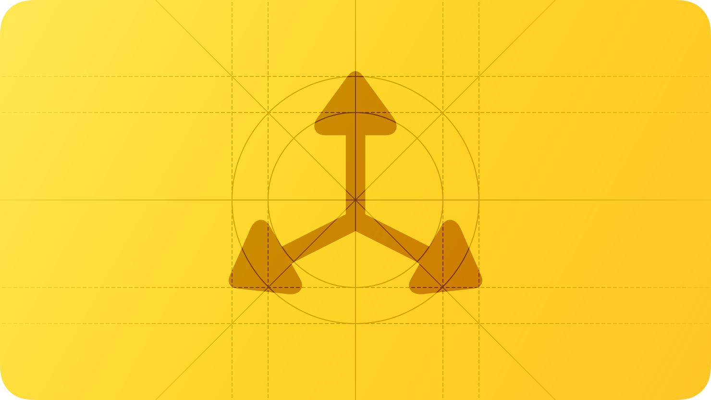
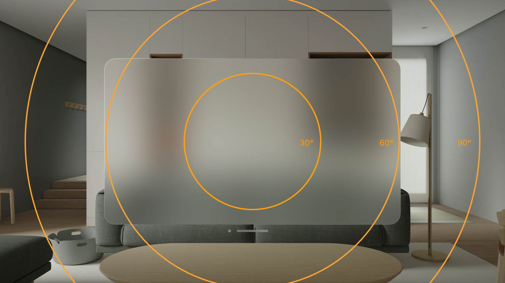
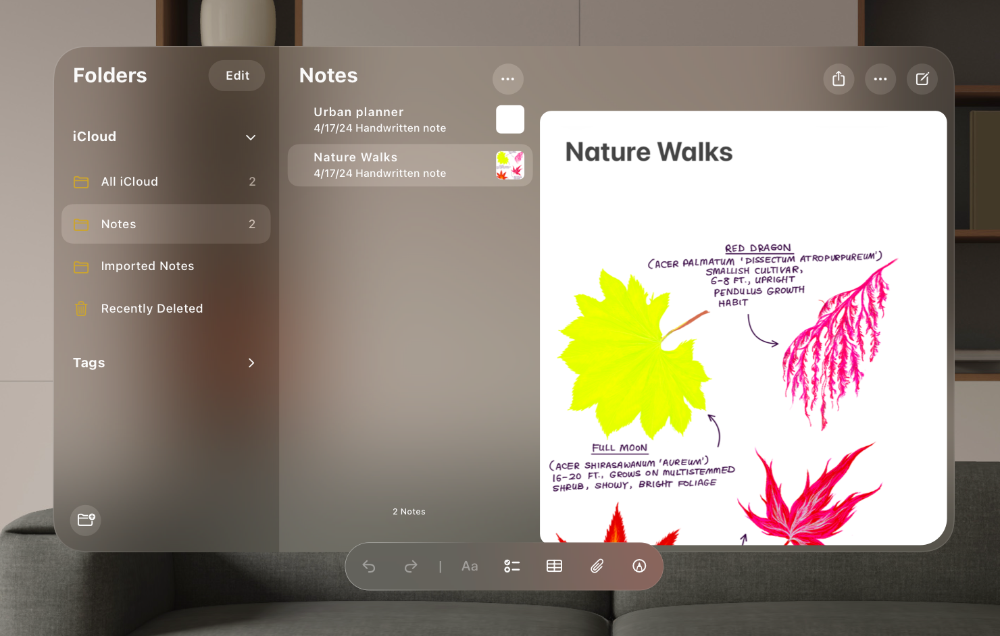

# Spatial layout

Spatial layout techniques help you take advantage of the infinite canvas of Apple Vision Pro and present your content in engaging, comfortable ways.

## Field of view

A person’s *field of view* is the space they can see without moving their head. The dimensions of an individual’s field of view while wearing Apple Vision Pro vary based on factors like the way people configure the Light Seal and the extent of their peripheral acuity.

> **Important:**
> The system doesn’t provide information about a person’s field of view.

**Center important content within the field of view.** By default, visionOS launches an app directly in front of people, placing it within their field of view. In an immersive experience, you can help people keep their attention on important content by keeping it centered and not displaying distracting motion or bright, high-contrast objects in the periphery.

**Avoid anchoring content to the wearer’s head.** Although you generally want your app to stay within the field of view, anchoring content so that it remains statically in front of someone can make them feel stuck, confined, and uncomfortable, especially if the content obscures a lot of passthrough and decreases the apparent stability of their surroundings. Instead, anchor content in people’s space, giving them the freedom to look around naturally and view different objects in different locations.

## Depth

People rely on visual cues like distance, occlusion, and shadow to perceive depth and make sense of their surroundings. On Apple Vision Pro, the system automatically uses visual effects like color temperature, reflections, and shadow to help people perceive the depth of virtual content. When people move a virtual object in space — or when they change their position relative to that object — the visual effects change the object’s apparent depth, making the experience feel more lifelike.

Because people can view your content from any angle, incorporating small amounts of depth throughout your interface — even in standard windows — can help it look more natural. When you use SwiftUI, the system adds visual effects to views in a 2D window, making them appear to have depth. For developer guidance, see [Adding 3D content to your app](https://developer.apple.com/documentation/visionOS/adding-3d-content-to-your-app).

If you need to present content with additional depth, you use RealityKit to create a 3D object (for developer guidance, see [RealityKit](https://developer.apple.com/documentation/RealityKit)). You can display the 3D object anywhere, or you can use a *volume*, which is a component that displays 3D content. A volume is similar to a window, but without a visible frame. For guidance, see [visionOS volumes](./windows.md).

**Provide visual cues that accurately communicate the depth of your content.** If visual cues are missing or they conflict with a person’s real-world experience, people can experience visual discomfort.

**Use depth to communicate hierarchy.** Depth helps an object appear to stand out from surrounding content, making it more noticeable. People also tend to notice changes in depth: for example, when a sheet appears over a window, the window recedes along the z-axis, allowing the sheet to come forward and become visually prominent.

**In general, avoid adding depth to text.** Text that appears to hover above its background is difficult to read, which slows people down and can sometimes cause vision discomfort.

**Make sure depth adds value.** In general, you want to use depth to clarify and delight — you don’t need to use it everywhere. As you add depth to your design, think about the size and relative importance of objects. Depth is great for visually separating large, important elements in your app, like making a tab bar or toolbar stand out from a window, but it may not work as well on small objects. For example, using depth to make a button’s symbol stand out from its background can make the button less legible and harder to use. Also review how often you use different depths throughout your app. People need to refocus their eyes to perceive each difference in depth, and doing so too often or quickly can be tiring.

## Scale

visionOS defines two types of scale to preserve the appearance of depth while optimizing usability.

*Dynamic scale* helps content remain comfortably legible and interactive regardless of its proximity to people. Specifically, visionOS automatically increases a window’s scale as it moves away from the wearer and decreases it as the window moves closer, making the window appear to maintain the same size at all distances.

*Fixed scale* means that an object maintains the same scale regardless of its proximity to people. A fixed-scale object appears smaller when it moves farther from the viewer along the z-axis, similar to the way an object in a person’s physical surroundings looks smaller when it’s far away than it does when it’s close up.

To support dynamic scaling and the appearance of depth, visionOS defines a point as an angle, in contrast to other platforms, which define a point as a number of pixels that can vary with the [Resolution](./images.md) of a 2D display.

**Consider using fixed scale when you want a virtual object to look exactly like a physical object.** For example, you might want to maintain the life-size scale of a product you offer so it can look more realistic when people view it in their space. Because interactive content needs to scale to maintain usability as it gets closer or farther away, prefer applying fixed scale sparingly, reserving it for noninteractive objects that need it.

## Best practices

**Avoid displaying too many windows.** Too many windows can obscure people’s surroundings, making them feel overwhelmed, constricted, and even uncomfortable. It can also make it cumbersome for people to relocate an app because it means moving a lot of windows.

**Prioritize standard, indirect gestures.** People can make an *indirect* gesture without moving their hand into their field of view. In contrast, making a *direct* gesture requires people to touch the virtual object with their finger, which can be tiring, especially when the object is positioned at or above their line of sight. In visionOS, people use indirect gestures to perform the standard gestures they already know. When you prioritize indirect gestures, people can use them to interact with any object they look at, whatever its distance. If you support direct gestures, consider reserving them for nearby objects that invite close inspection or manipulation for short periods of time. For guidance, see [visionOS](./gestures.md).

**Rely on the Digital Crown to help people recenter windows in their field of view.** When people move or turn their head, content might no longer appear where they want it to. If this happens, people can press the [Digital Crown](./digital-crown.md) when they want to recenter content in front of them. Your app doesn’t need to do anything to support this action.

**Include enough space around interactive components to make them easy for people to look at.** When people look at an interactive element, visionOS displays a visual hover effect that helps them confirm the element is the one they want. It’s crucial to include enough space around an interactive component so that looking at it is easy and comfortable, while preventing the hover effect from crowding other content. For example, place multiple, regular-size [visionOS](./buttons.md) so their centers are at least 60 points apart, leaving 16 points or more of space between them. Also, don’t let controls overlap other interactive elements or views, because doing so can make selecting a single element difficult.

**Let people use your app with minimal or no physical movement.** Unless some physical movement is essential to your experience, help everyone enjoy it while remaining stationary.

**Use the floor to help you place a large immersive experience.** If your immersive experience includes content that extends up from the floor, place it using a flat horizontal plane. Aligning this plane with the floor can help it blend seamlessly with people’s surroundings and provide a more intuitive experience.

To learn more about windows and volumes in visionOS, see [visionOS](./windows.md); for guidance on laying content within a window, see [visionOS](./layout.md).

## Platform considerations

*Not supported in iOS, iPadOS, macOS, tvOS, or watchOS.*

## Resources

#### Related

[Eyes](./eyes.md)

[Layout](./layout.md)

[Immersive experiences](./immersive-experiences.md)

#### Developer documentation

[Presenting windows and spaces](https://developer.apple.com/documentation/visionOS/presenting-windows-and-spaces) — visionOS

[Positioning and sizing windows](https://developer.apple.com/documentation/visionOS/positioning-and-sizing-windows) — visionOS

[Adding 3D content to your app](https://developer.apple.com/documentation/visionOS/adding-3d-content-to-your-app) — visionOS

#### Videos

- [Meet SwiftUI spatial layout](https://developer.apple.com/videos/play/wwdc2025/273)
- [Principles of spatial design](https://developer.apple.com/videos/play/wwdc2023/10072)
- [Design for spatial user interfaces](https://developer.apple.com/videos/play/wwdc2023/10076)

## Change log

| Date | Changes |
| --- | --- |
| March 29, 2024 | Emphasized the importance of keeping interactive elements from overlapping each other. |
| June 21, 2023 | New page. |
