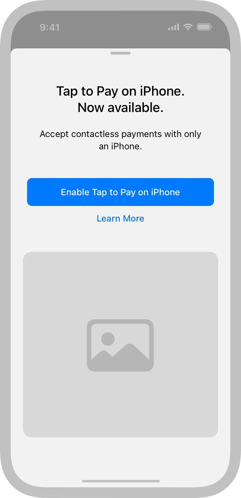
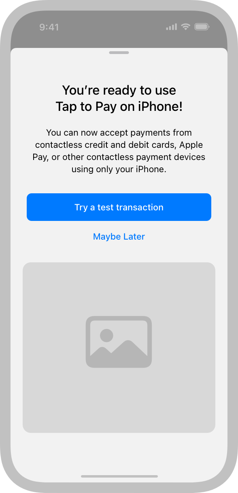
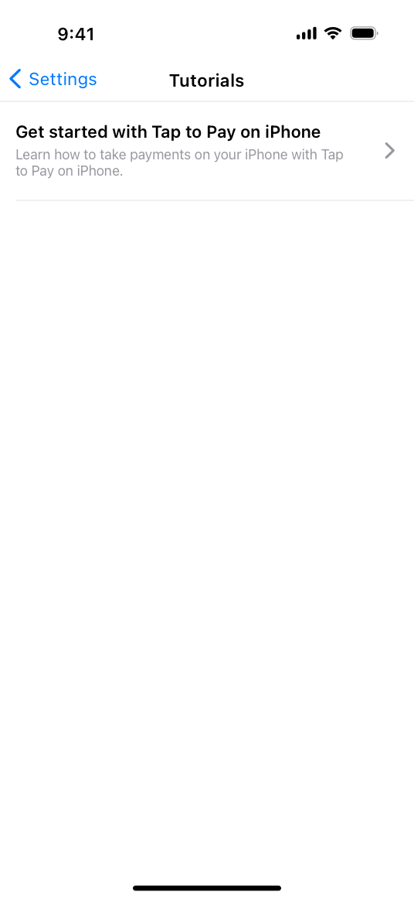
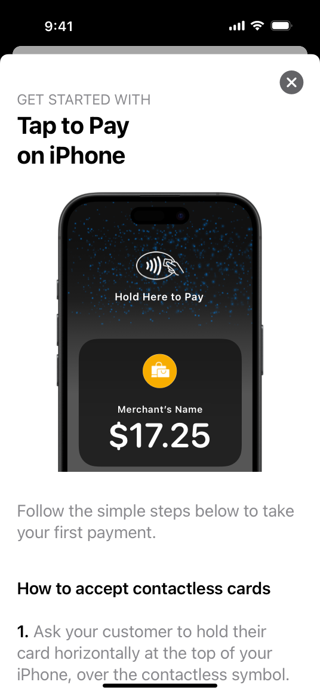
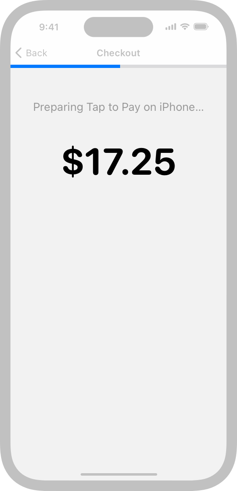
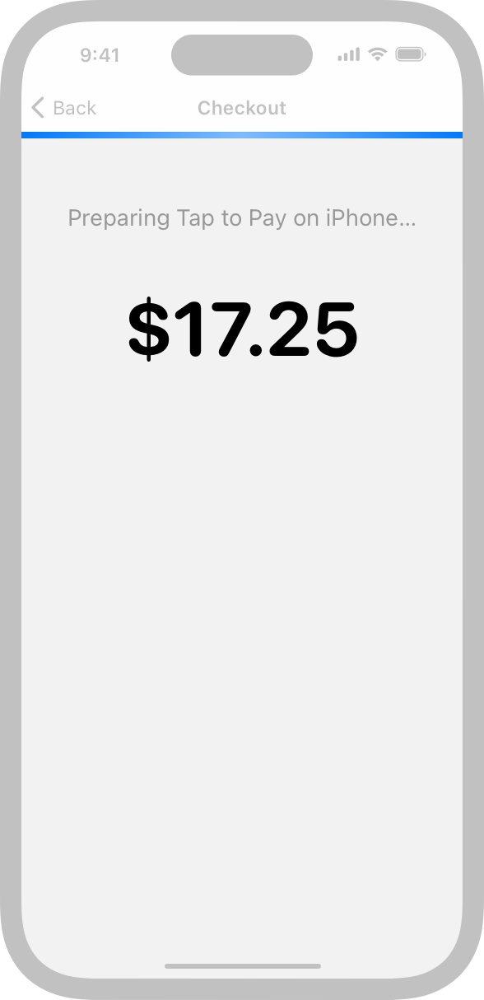
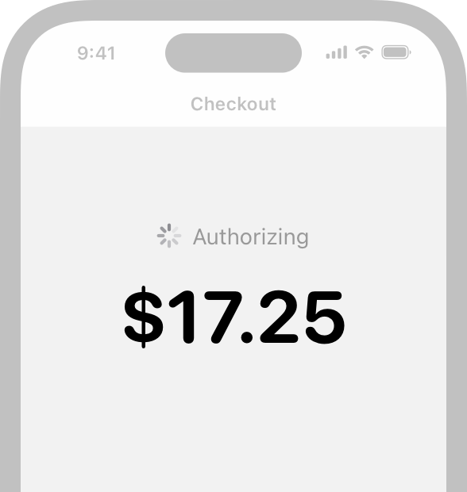
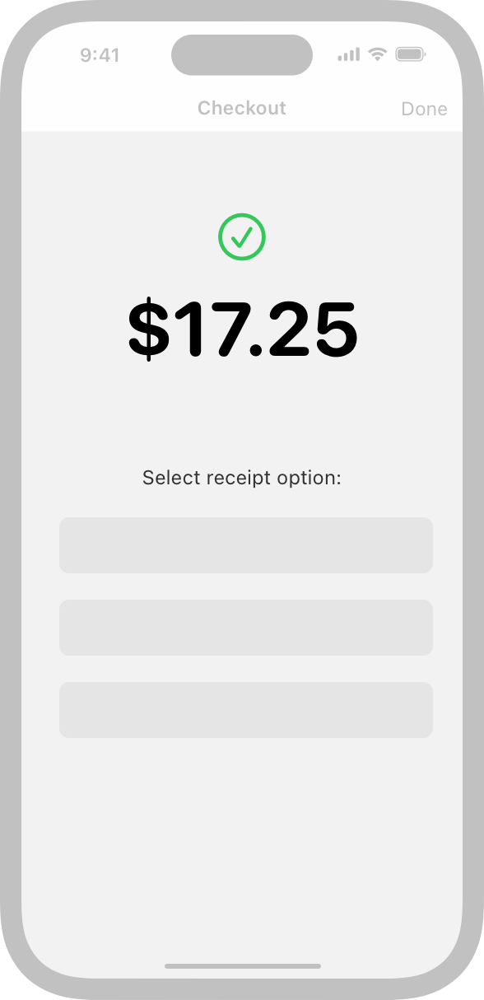
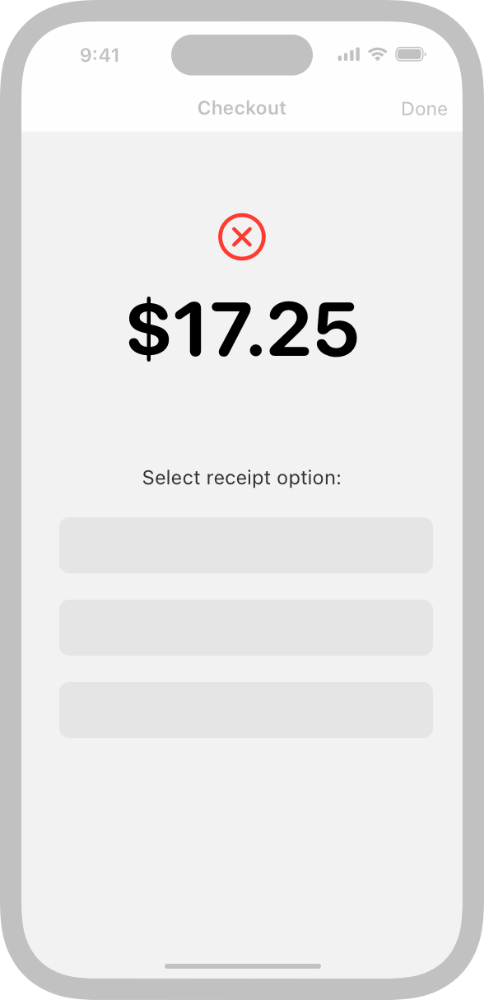
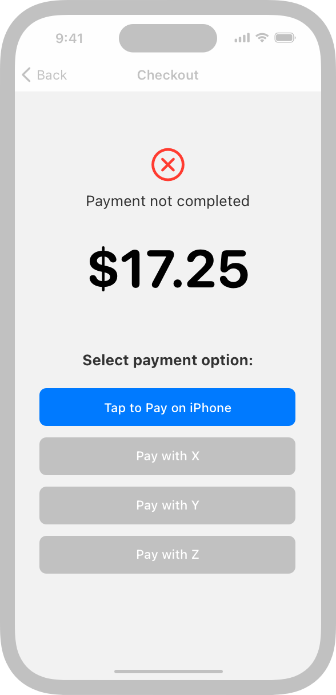

# Tap to Pay on iPhone

Tap to Pay on iPhone lets merchants accept contactless payments using an app on their iPhone, without having to connect external hardware.

When you support Tap to Pay on iPhone in your iOS payment app, you help merchants present a consistent and trusted payment experience to their customers.

> **Note:**
> Tap to Pay on iPhone works alongside your existing payment-acceptance hardware and accessories.

Before you can integrate Tap to Pay on iPhone into your iOS app, you need to work with a supported payment service provider (PSP), request the Tap to Pay on iPhone entitlement, and use [ProximityReader](https://developer.apple.com/documentation/ProximityReader) APIs, either through the PSP’s SDK or by adopting the framework. For high-level guidance — including marketing recommendations for letting people know about your app’s new capabilities — see [Tap to Pay on iPhone](https://developer.apple.com/tap-to-pay/); for developer guidance, see [Setting up Tap to Pay on iPhone](https://developer.apple.com/documentation/ProximityReader/setting-up-the-entitlement-for-tap-to-pay-on-iPhone).

> **Note:**
> If your PSP offers an SDK that supplies user interfaces for experiences like showing a tap result, see the documentation the PSP provides.

## Enabling Tap to Pay on iPhone

Before your app can enable Tap to Pay on iPhone and configure a merchant’s device, the merchant must accept the relevant terms and conditions. Use the ProximityReader API to help you get the current status and present an acceptance flow only when necessary. For developer guidance, see [Adding support for Tap to Pay on iPhone to your app](https://developer.apple.com/documentation/ProximityReader/adding-support-for-tap-to-pay-on-iphone-to-your-app#Display-the-Terms-and-Conditions-interface-to-the-merchant).

**Help merchants accept Tap to Pay on iPhone terms and conditions before they begin interacting with their customers.** Merchants must accept the terms and conditions before you perform the initial device configuration, so it works well when they can do so before they begin a checkout or other customer-facing flow. For example, you can provide buttons that let people accept Tap to Pay on iPhone terms and conditions from within your [in-app messaging](https://developer.apple.com/tap-to-pay/marketing-guidelines/#in-your-app) or onboarding flows.

**Present Tap to Pay on iPhone terms and conditions only to an administrative user.** If a nonadministrator tries to activate the feature, present a message explaining that administrator access is required. If your app’s primary users are enterprise or nonadministrative users, you can let an administrator accept Tap to Pay on iPhone terms and conditions through a web interface or a different app, including one that can run on devices other than iPhone. Contact your PSP for implementation details.

**If necessary, help merchants make sure their device is up to date.** If your PSP requires specific versions of iOS, be sure to present the terms and conditions only after the merchant updates their device.

## Educating merchants

Some merchants may be unfamiliar with Tap to Pay on iPhone, so it’s important to give them a quick and easy way to get started.

**Provide a tutorial that describes the supported payment types and shows how to use Tap to Pay on iPhone to accept each type.** You can offer this tutorial by:

- Including it in a Learn More option in your in-app messaging
- Automatically presenting it after merchants accept the Tap to Pay on iPhone terms and conditions
- Automatically presenting it to new users of your app
- Making it easy to find in a consistent place like your app’s help content or settings area

You can build your app’s tutorial using Apple-approved assets from the [Tap to Pay on iPhone marketing guidelines](https://developer.apple.com/tap-to-pay/marketing-guidelines/), or you can use the [ProximityReaderDiscovery](https://developer.apple.com/documentation/ProximityReader/ProximityReaderDiscovery) API to provide a pre-built merchant education experience. Apple ensures that the API is up to date and is localized for the merchant’s region.

If you design your own tutorial, make sure it shows how to:

- Launch a checkout flow for each type of payment
- Help a customer position their contactless card or digital wallet on the merchant’s device for payment
- Handle PIN entry for a card, including accessibility mode

Finally, provide an opportunity at the end of the tutorial for merchants who haven’t accepted the Tap to Pay on iPhone terms and conditions yet to do so.

## Checking out

Checking out is a time-sensitive action, and merchants need the process to work smoothly. As you design your checkout flow, be prepared to:

- Offer payment options in addition to Tap to Pay on iPhone, as necessary
- Respond quickly if a merchant initiates checkout before enabling Tap to Pay on iPhone
- Help merchants perform checkout even if device configuration is still in progress
- Present pre-payment actions that affect the final total before checkout completes

**Provide Tap to Pay on iPhone as a checkout option whether the feature is enabled or not.** Including a Tap to Pay on iPhone button gives merchants the flexibility to use the feature without exiting the checkout flow. When merchants tap the button, present the terms and conditions if necessary and automatically display the Tap to Pay on iPhone screen when configuration completes.

**Avoid making merchants wait to use Tap to Pay on iPhone.** In addition to performing the initial configuration for each device, you need to perform a subsequent configuration each time your app becomes frontmost. To minimize potential wait times, prepare the feature as soon as your app starts and immediately after each transition to the foreground. For developer guidance, see [prepare(using:)](https://developer.apple.com/documentation/ProximityReader/PaymentCardReader/prepare(using:)).

**Make sure the Tap to Pay on iPhone checkout option is available even if configuration is continuing in the background.** Merchants must always be able to select the Tap to Pay on iPhone checkout option in a checkout flow. During configuration, let merchants select the checkout option and then display a progress indicator — avoid waiting for configuration to complete before making the option available. In most scenarios, you can display an indeterminate progress indicator, but if ProximityReader API shows that configuration is ongoing, display a determinate progress indicator. For guidance, see [Progress indicators](./progress-indicators.md); for developer guidance see [PaymentCardReader.Event.updateProgress(_:)](https://developer.apple.com/documentation/ProximityReader/PaymentCardReader/Event/updateProgress(_:)).

**If your app supports multiple payment-acceptance methods, make the Tap to Pay on iPhone button easy to find.** Avoid making merchants scroll to access the feature. If your app doesn’t support other payment acceptance options, open Tap to Pay on iPhone automatically when checkout begins.

**Make it easy for merchants to switch between Tap to Pay on iPhone and the hardware accessories you support.** Even though your support for Tap to Pay on iPhone is separate from your support for a hardware accessory, such as a Bluetooth chip and PIN card reader, you can streamline the user experience by helping merchants set up both methods at the same time. After setup, make sure merchants can choose the appropriate payment-acceptance method during the checkout flow without having to visit your app settings.

**For the label of the button that activates the feature, use “Tap to Pay on iPhone” or, if space is constrained, “Tap to Pay.”** The exception is if Tap to Pay on iPhone is the only payment-acceptance method you support. In this case, you can reuse your existing Charge or Checkout buttons to activate Tap to Pay on iPhone. If you support multiple payment-acceptance methods and you use icons in the buttons that activate them, use the `wave.3.right.circle` or `wave.3.right.circle.fill` [SF Symbols](./sf-symbols.md) in your Tap to Pay on iPhone button. Always avoid including the Apple logo in Tap to Pay on iPhone buttons.

> **Important:**
> Use the “Tap to Pay on iPhone” label only for payment actions. For language you can use for nonpayment actions, see [Additional interactions](./tap-to-pay-on-iphone.md).

**Design your Tap to Pay on iPhone button to match the other buttons in your app.** Although you must use the labels “Tap to Pay on iPhone” or “Tap to Pay” as described above, you can use the button color and shape that coordinate best with your interface.

**Determine the final amount that customers need to pay before merchants initiate the Tap to Pay on iPhone experience.** For example, if your app supports tipping or other customer interactions that can affect the total, make sure merchants offer these interactions before displaying the Tap to Pay on iPhone screen. Aim to display the final amount customers need to pay in the Tap to Pay on iPhone screen.

**If you support pre-payment options in your checkout flow, display them before the Tap to Pay on iPhone screen.** For example, if you support the selection of different payment types, you can display these options in your checkout screen after a merchant taps the Tap to Pay on iPhone button and before you open the Tap to Pay on iPhone screen.

## Displaying results

Customers pay by *tapping* — that is, bringing a contactless card or digital wallet near the Tap to Pay on iPhone screen in your app. After a successful tap (and after a successful PIN entry, if required), Tap to Pay on iPhone displays a checkmark and gives your app an object that contains the encrypted payment information you send to your PSP for processing. When a tap fails, Tap to Pay on iPhone displays an error screen. Your app is responsible for displaying transaction results after a successful tap or offering alternative payment options after an unsuccessful tap.

**Start processing a transaction as soon as possible.** The system provides API you can use to request the result of a successful tap before the Tap to Pay on iPhone screen finishes displaying the checkmark animation that indicates tap completion. For developer guidance, see [returnReadResultImmediately](https://developer.apple.com/documentation/ProximityReader/PaymentCardReader/Options-swift.struct/returnReadResultImmediately).

**Display a progress indicator while payment is authorizing before you show your transaction result screen.** Transaction authorization can take several seconds to complete, depending on factors like connectivity for both the PSP and the merchant’s device. To ensure a smooth visual transition, display your authorization [Progress indicators](./progress-indicators.md) after the Tap to Pay on iPhone screen animation finishes (for developer guidance, see [PaymentCardReader.Event.readyForTap](https://developer.apple.com/documentation/ProximityReader/PaymentCardReader/Event/readyForTap)).

**Clearly display the result of a transaction, whether it’s declined or successful.** A transaction can be declined for reasons like insufficient funds, suspicion of fraud, or when the customer enters an incorrect PIN. As much as possible, also give the merchant ways to offer customers a digital receipt, such as through a QR code or text message.

**Help merchants complete the checkout flow when a payment can’t complete with Tap to Pay on iPhone.** For example, a tap can fail when a card isn’t readable, isn’t from a supported payment network, doesn’t allow transactions at the stated amount, or doesn’t allow online PIN entry. In cases like these, you can:

- Present a new screen or reuse your checkout screen, letting merchants accept an alternate form of payment, like cash
- Support checkout with a different method, like external hardware or a payment link
- Relaunch Tap to Pay on iPhone, if a customer has another card they want to try

After you receive payment card data, you might also encounter scenarios like the ones listed below. If such scenarios occur, contact your PSP for guidance on addressing them.

- Some regions require Strong Customer Authentication (SCA) support, which means that although the payment card might not require a card PIN during a tap, the bank that issues the card can request a PIN after receiving the transaction processing request. In this scenario, your app may need to display the PIN entry screen instead of the transaction result.
- In some regions your app may need to meet additional requirements to address the limitations of some cards, such as those in Offline PIN markets. Some PSPs support additional PIN fallback functionality to collect partial data from a tap, letting merchants continue the payment with another method such as a payment link.

**If the system returns an error that the merchant must address, display a clear description of the problem and recommend an appropriate resolution.** For example, if the device’s version of iOS doesn’t support Tap to Pay on iPhone, present an [Alerts](./alerts.md) that recommends updating to the latest version. For developer guidance, see [PaymentCardReaderSession.ReadError](https://developer.apple.com/documentation/ProximityReader/PaymentCardReaderSession/ReadError).

**Make it easy for merchants to get help with issues they can’t resolve.** For example, direct merchants to the help content in your app or on your website, and provide an action that contacts your support team.

## Additional interactions

Tap to Pay on iPhone lets merchants read a payment card when there’s no transaction amount to support use cases like looking up a past transaction, or retaining card information to ensure future payment, issue refunds, or verify customer information.

**Use a generic label in a button that opens the Tap to Pay on iPhone screen to read a payment card when there’s no transaction amount.** Don’t include “Tap to Pay on iPhone” or “Tap to Pay” in such a label; instead, use a generic label like “Look Up,” “Store Card,” “Verify,” or “Refund.”

When customers have other types of NFC-compatible cards or passes in Apple Wallet — such as loyalty, discount, and points cards — Tap to Pay on iPhone lets merchants read these items at the same time that they read a payment card or independently.

**If your app supports an independent loyalty card transaction, distinguish this flow from a payment-acceptance flow that uses Tap to Pay on iPhone.** It works well to give merchants a separate, clearly labeled button to initiate a loyalty card transaction. To help merchants avoid choosing the wrong button by mistake, avoid including “Tap to Pay on iPhone,” “Tap to Pay,” or other payment-related terms in the label for a loyalty-transaction button.

## Platform considerations

*No additional considerations for iOS. Not supported in iPadOS, macOS, tvOS, visionOS, or watchOS.*

## Resources

#### Related

[Tap to Pay on iPhone marketing guidelines](https://developer.apple.com/tap-to-pay/marketing-guidelines/)

#### Developer documentation

[Adding support for Tap to Pay on iPhone to your app](https://developer.apple.com/documentation/ProximityReader/adding-support-for-tap-to-pay-on-iphone-to-your-app) — ProximityReader

## Change log

| Date | Changes |
| --- | --- |
| January 17, 2024 | Updated merchant education guidance. |
| May 7, 2024 | Updated to include guidance on enabling the feature and educating merchants. |
| March 3, 2023 | Enhanced guidance for educating merchants and improving their experience. |
| September 14, 2022 | Refined guidance on preparing Tap to Pay on iPhone and helping merchants learn how to use the feature. |
