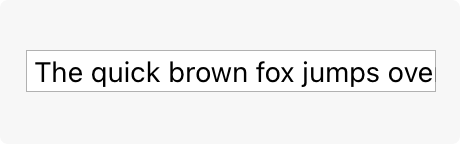
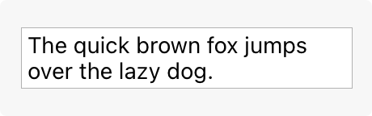
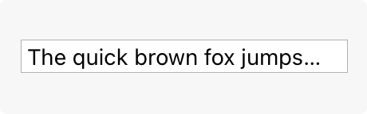

# Text fields

A text field is a rectangular area in which people enter or edit small, specific pieces of text.

## Best practices

**Use a text field to request a small amount of information, such as a name or an email address.** To let people input larger amounts of text, use a [Text views](./text-views.md) instead.

**Show a hint in a text field to help communicate its purpose.** A text field can contain placeholder text — such as “Email” or “Password” — when there’s no other text in the field. Because placeholder text disappears when people start typing, it can also be useful to include a separate label describing the field to remind people of its purpose.

**Use secure text fields to hide private data.** Always use a secure text field when your app asks for sensitive data, such as a password. For developer guidance, see [SecureField](https://developer.apple.com/documentation/SwiftUI/SecureField).

**To the extent possible, match the size of a text field to the quantity of anticipated text.** The size of a text field helps people visually gauge the amount of information to provide.

**Evenly space multiple text fields.** If your layout includes multiple text fields, leave enough space between them so people can easily see which input field belongs with each introductory label. Stack multiple text fields vertically when possible, and use consistent widths to create a more organized layout. For example, the first and last name fields on an address form might be one width, while the address and city fields might be a different width.

**Ensure that tabbing between multiple fields flows as people expect.** When tabbing between fields, move focus in a logical sequence. The system attempts to achieve this result automatically, so you won’t need to customize this too often.

**Validate fields when it makes sense.** For example, if the only legitimate value for a field is a string of digits, your app needs to alert people if they’ve entered characters other than digits. The appropriate time to check the data depends on the context: when entering an email address, it’s best to validate when people switch to another field; when creating a user name or password, validation needs to happen before people switch to another field.

**Use a number formatter to help with numeric data.** A number formatter automatically configures the text field to accept only numeric values. It can also display the value in a specific way, such as with a certain number of decimal places, as a percentage, or as currency. Don’t assume the actual presentation of data, however, as formatting can vary significantly based on people’s locale.

**Adjust line breaks according to the needs of the field.** By default, the system clips any text extending beyond the bounds of a text field. Alternatively, you can set up a text field to wrap text to a new line at the character or word level, or to truncate (indicated by an ellipsis) at the beginning, middle, or end.

**Consider using an expansion tooltip to show the full version of clipped or truncated text.** An expansion tooltip behaves like a regular [tooltip](https://developer.apple.com/design/human-interface-guidelines/offering-help#macOS-visionOS) and appears when someone places the pointer over the field.

**In iOS, iPadOS, tvOS, and visionOS apps, show the appropriate keyboard type.** Several different keyboard types are available, each designed to facilitate a different type of input, such as numbers or URLs. To streamline data entry, display the keyboard that’s appropriate for the type of content people are entering. For guidance, see [Virtual keyboards](./virtual-keyboards.md).

**Minimize text entry in your tvOS and watchOS apps.** Entering long passages of text or filling out numerous text fields is time-consuming on Apple TV and Apple Watch. Minimize text input and consider gathering information more efficiently, such as with buttons.

## Platform considerations

*No additional considerations for tvOS or visionOS.*

### iOS, iPadOS

**Display a Clear button in the trailing end of a text field to help people erase their input.** When this element is present, people can tap it to clear the text field’s contents, without having to keep tapping the Delete key.

**Use images and buttons to provide clarity and functionality in text fields.** You can display custom images in both ends of a text field, or you can add a system-provided button, such as the Bookmarks button. In general, use the leading end of a text field to indicate a field’s purpose and the trailing end to offer additional features, such as bookmarking.

### macOS

**Consider using a combo box if you need to pair text input with a list of choices.** For related guidance, see [Combo boxes](./combo-boxes.md).

## Resources

#### Related

[Text views](./text-views.md)

[Combo boxes](./combo-boxes.md)

[Entering data](./entering-data.md)

#### Developer documentation

[TextField](https://developer.apple.com/documentation/SwiftUI/TextField) — SwiftUI

[SecureField](https://developer.apple.com/documentation/SwiftUI/SecureField) — SwiftUI

[UITextField](https://developer.apple.com/documentation/UIKit/UITextField) — UIKit

[NSTextField](https://developer.apple.com/documentation/AppKit/NSTextField) — AppKit

## Change log

| Date | Changes |
| --- | --- |
| June 5, 2023 | Updated guidance to reflect changes in watchOS 10. |
