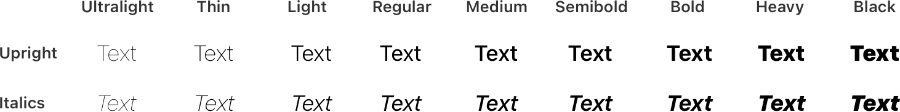

# Typography

Your typographic choices can help you display legible text, convey an information hierarchy, communicate important content, and express your brand or style.

## Ensuring legibility

**Use font sizes that most people can read easily.** People need to be able to read your content at various viewing distances and under a variety of conditions. Follow the recommended default and minimum text sizes for each platform — for both custom and system fonts — to ensure your text is legible on all devices. Keep in mind that font weight can also impact how easy text is to read. If you use a custom font with a thin weight, aim for larger than the recommended sizes to increase legibility.

| Platform | Default size | Minimum size |
| --- | --- | --- |
| iOS, iPadOS | 17 pt | 11 pt |
| macOS | 13 pt | 10 pt |
| tvOS | 29 pt | 23 pt |
| visionOS | 17 pt | 12 pt |
| watchOS | 16 pt | 12 pt |

**Test legibility in different contexts.** For example, you need to test game text for legibility on each platform on which your game runs. If testing shows that some of your text is difficult to read, consider using a larger type size, increasing contrast by modifying the text or background colors, or using typefaces designed for optimized legibility, like the system fonts.

**In general, avoid light font weights.** For example, if you’re using system-provided fonts, prefer Regular, Medium, Semibold, or Bold font weights, and avoid Ultralight, Thin, and Light font weights, which can be difficult to see, especially when text is small.

## Conveying hierarchy

**Adjust font weight, size, and color as needed to emphasize important information and help people visualize hierarchy.** Be sure to maintain the relative hierarchy and visual distinction of text elements when people adjust text sizes.

**Minimize the number of typefaces you use, even in a highly customized interface.** Mixing too many different typefaces can obscure your information hierarchy and hinder readability, in addition to making an interface feel internally inconsistent or poorly designed.

**Prioritize important content when responding to text-size changes.** Not all content is equally important. When someone chooses a larger text size, they typically want to make the content they care about easier to read; they don’t always want to increase the size of every word on the screen. For example, when people increase text size to read the content in a tabbed window, they don’t expect the tab titles to increase in size. Similarly, in a game, people are often more interested in a character’s dialog than in transient hit-damage values.

## Using system fonts

Apple provides two typeface families that support an extensive range of weights, sizes, styles, and languages.

**San Francisco (SF)** is a sans serif typeface family that includes the SF Pro, SF Compact, SF Arabic, SF Armenian, SF Georgian, SF Hebrew, and SF Mono variants.

The system also offers SF Pro, SF Compact, SF Arabic, SF Armenian, SF Georgian, and SF Hebrew in rounded variants you can use to coordinate text with the appearance of soft or rounded UI elements, or to provide an alternative typographic voice.

**New York (NY)** is a serif typeface family designed to work well by itself and alongside the SF fonts.

You can download the San Francisco and New York fonts [here](https://developer.apple.com/fonts/).

The system provides the SF and NY fonts in the *variable* font format, which combines different font styles together in one file, and supports interpolation between styles to create intermediate ones.

> **Note:**
> Variable fonts support *optical sizing*, which refers to the adjustment of different typographic designs to fit different sizes. On all platforms, the system fonts support *dynamic optical sizes*, which merge discrete optical sizes (like Text and Display) and weights into a single, continuous design, letting the system interpolate each glyph or letterform to produce a structure that’s precisely adapted to the point size. With dynamic optical sizes, you don’t need to use discrete optical sizes unless you’re working with a design tool that doesn’t support all the features of the variable font format.

To help you define visual hierarchies and create clear and legible designs in many different sizes and contexts, the system fonts are available in a variety of weights, ranging from Ultralight to Black, and — in the case of SF — several widths, including Condensed and Expanded. Because SF Symbols use equivalent weights, you can achieve precise weight matching between symbols and adjacent text, regardless of the size or style you choose.

> **Note:**
> [SF Symbols](./sf-symbols.md) provides a comprehensive library of symbols that integrate seamlessly with the San Francisco system font, automatically aligning with text in all weights and sizes. Consider using symbols when you need to convey a concept or depict an object, especially within text.

The system defines a set of typographic attributes — called text styles — that work with both typeface families. A *text style* specifies a combination of font weight, point size, and leading values for each text size. For example, the *body* text style uses values that support a comfortable reading experience over multiple lines of text, while the *headline* style assigns a font size and weight that help distinguish a heading from surrounding content. Taken together, the text styles form a typographic hierarchy you can use to express the different levels of importance in your content. Text styles also allow text to scale proportionately when people change the system’s text size or make accessibility adjustments, like turning on Larger Text in Accessibility settings.

**Consider using the built-in text styles.** The system-defined text styles give you a convenient and consistent way to convey your information hierarchy through font size and weight. Using text styles with the system fonts also ensures support for Dynamic Type and larger accessibility type sizes (where available), which let people choose the text size that works for them. For guidance, see [Supporting Dynamic Type](./typography.md).

**Modify the built-in text styles if necessary.** System APIs define font adjustments — called *symbolic traits* — that let you modify some aspects of a text style. For example, the bold trait adds weight to text, letting you create another level of hierarchy. You can also use symbolic traits to adjust leading if you need to improve readability or conserve space. For example, when you display text in wide columns or long passages, more space between lines (*loose leading*) can make it easier for people to keep their place while moving from one line to the next. Conversely, if you need to display multiple lines of text in an area where height is constrained — for example, in a list row — decreasing the space between lines (*tight leading*) can help the text fit well. If you need to display three or more lines of text, avoid tight leading even in areas where height is limited. For developer guidance, see [leading(_:)](https://developer.apple.com/documentation/SwiftUI/Font/leading(_:)).

> **Note:**
> You can use the constants defined in [Font.Design](https://developer.apple.com/documentation/SwiftUI/Font/Design) to access all system fonts — don’t embed system fonts in your app or game. For example, use [Font.Design.default](https://developer.apple.com/documentation/SwiftUI/Font/Design/default) to get the system font on all platforms; use [Font.Design.serif](https://developer.apple.com/documentation/SwiftUI/Font/Design/serif) to get the New York font.

**If necessary, adjust tracking in interface mockups.** In a running app, the system font dynamically adjusts tracking at every point size. To produce an accurate interface mockup of an interface that uses the variable system fonts, you don’t have to choose a discrete optical size at certain point sizes, but you might need to adjust the tracking. For guidance, see [Tracking values](./typography.md).

## Using custom fonts

**Make sure custom fonts are legible.** People need to be able to read your custom font easily at various viewing distances and under a variety of conditions. While using a custom font, be guided by the recommended minimum font sizes for various styles and weights in [Specifications](./typography.md).

**Implement accessibility features for custom fonts.** System fonts automatically support Dynamic Type (where available) and respond when people turn on accessibility features, such as Bold Text. If you use a custom font, make sure it implements the same behaviors. For developer guidance, see [Applying custom fonts to text](https://developer.apple.com/documentation/SwiftUI/Applying-Custom-Fonts-to-Text). In a Unity-based game, you can use [Apple’s Unity plug-ins](https://github.com/apple/unityplugins) to support Dynamic Type. If the plug-in isn’t appropriate for your game, be sure to let players adjust text size in other ways.

## Supporting Dynamic Type

Dynamic Type is a system-level feature in iOS, iPadOS, tvOS, visionOS, and watchOS that lets people adjust the size of visible text on their device to ensure readability and comfort. For related guidance, see [Accessibility](./accessibility.md).

For a list of available Dynamic Type sizes, see [Specifications](./typography.md). You can also download Dynamic Type size tables in the [Apple Design Resources](https://developer.apple.com/design/resources/) for each platform.

For developer guidance, see [Text input and output](https://developer.apple.com/documentation/SwiftUI/Text-input-and-output). To support Dynamic Type in Unity-based games, use [Apple’s Unity plug-ins](https://github.com/apple/unityplugins).

**Make sure your app’s layout adapts to all font sizes.** Verify that your design scales, and that text and glyphs are legible at all font sizes. On iPhone or iPad, turn on Larger Accessibility Text Sizes in Settings > Accessibility > Display & Text Size > Larger Text, and confirm that your app remains comfortably readable.

**Increase the size of meaningful interface icons as font size increases.** If you use interface icons to communicate important information, make sure they’re easy to view at larger font sizes too. When you use [SF Symbols](./sf-symbols.md), you get icons that scale automatically with Dynamic Type size changes.

**Keep text truncation to a minimum as font size increases.** In general, aim to display as much useful text at the largest accessibility font size as you do at the largest standard font size. Avoid truncating text in scrollable regions unless people can open a separate view to read the rest of the content. You can prevent text truncation in a label by configuring it to use as many lines as needed to display a useful amount of text. For developer guidance, see [numberOfLines](https://developer.apple.com/documentation/UIKit/UILabel/numberOfLines).

**Consider adjusting your layout at large font sizes.** When font size increases in a horizontally constrained context, inline items (like glyphs and timestamps) and container boundaries can crowd text and cause truncation or overlapping. To improve readability, consider using a stacked layout where text appears above secondary items. Multicolumn text can also be less readable at large sizes due to horizontal space constraints. Reduce the number of columns when the font size increases to avoid truncation and enhance readability. For developer guidance, see [isAccessibilityCategory](https://developer.apple.com/documentation/UIKit/UIContentSizeCategory/isAccessibilityCategory).

**Maintain a consistent information hierarchy regardless of the current font size.** For example, keep primary elements toward the top of a view even when the font size is very large, so that people don’t lose track of these elements.

## Platform considerations

### iOS, iPadOS

SF Pro is the system font in iOS and iPadOS. iOS and iPadOS apps can also use NY.

### macOS

SF Pro is the system font in macOS. NY is available for Mac apps built with Mac Catalyst. macOS doesn’t support Dynamic Type.

**When necessary, use dynamic system font variants to match the text in standard controls.** Dynamic system font variants give your text the same look and feel of the text that appears in system-provided controls. Use the variants listed below to achieve a look that’s consistent with other apps on the platform.

| Dynamic font variant | API |
| --- | --- |
| Control content | [controlContentFont(ofSize:)](https://developer.apple.com/documentation/AppKit/NSFont/controlContentFont(ofSize:)) |
| Label | [labelFont(ofSize:)](https://developer.apple.com/documentation/AppKit/NSFont/labelFont(ofSize:)) |
| Menu | [menuFont(ofSize:)](https://developer.apple.com/documentation/AppKit/NSFont/menuFont(ofSize:)) |
| Menu bar | [menuBarFont(ofSize:)](https://developer.apple.com/documentation/AppKit/NSFont/menuBarFont(ofSize:)) |
| Message | [messageFont(ofSize:)](https://developer.apple.com/documentation/AppKit/NSFont/messageFont(ofSize:)) |
| Palette | [paletteFont(ofSize:)](https://developer.apple.com/documentation/AppKit/NSFont/paletteFont(ofSize:)) |
| Title | [titleBarFont(ofSize:)](https://developer.apple.com/documentation/AppKit/NSFont/titleBarFont(ofSize:)) |
| Tool tips | [toolTipsFont(ofSize:)](https://developer.apple.com/documentation/AppKit/NSFont/toolTipsFont(ofSize:)) |
| Document text (user) | [userFont(ofSize:)](https://developer.apple.com/documentation/AppKit/NSFont/userFont(ofSize:)) |
| Monospaced document text (user fixed pitch) | [userFixedPitchFont(ofSize:)](https://developer.apple.com/documentation/AppKit/NSFont/userFixedPitchFont(ofSize:)) |
| Bold system font | [boldSystemFont(ofSize:)](https://developer.apple.com/documentation/AppKit/NSFont/boldSystemFont(ofSize:)) |
| System font | [systemFont(ofSize:)](https://developer.apple.com/documentation/AppKit/NSFont/systemFont(ofSize:)) |

## Specifications

You can display emphasized variants of system text styles using symbolic traits. In SwiftUI, use the [bold()](https://developer.apple.com/documentation/SwiftUI/Text/bold()) modifier; in UIKit, use [traitBold](https://developer.apple.com/documentation/UIKit/UIFontDescriptor/SymbolicTraits-swift.struct/traitBold) in the [UIFontDescriptor](https://developer.apple.com/documentation/UIKit/UIFontDescriptor) API. The emphasized weights can be medium, semibold, bold, or heavy. The following specifications include the emphasized weight for each text style.

### iOS, iPadOS Dynamic Type sizes

### iOS, iPadOS larger accessibility type sizes

### macOS built-in text styles

| Text style | Weight | Size (points) | Line height (points) | Emphasized weight |
| --- | --- | --- | --- | --- |
| Large Title | Regular | 26 | 32 | Bold |
| Title 1 | Regular | 22 | 26 | Bold |
| Title 2 | Regular | 17 | 22 | Bold |
| Title 3 | Regular | 15 | 20 | Semibold |
| Headline | Bold | 13 | 16 | Heavy |
| Body | Regular | 13 | 16 | Semibold |
| Callout | Regular | 12 | 15 | Semibold |
| Subheadline | Regular | 11 | 14 | Semibold |
| Footnote | Regular | 10 | 13 | Semibold |
| Caption 1 | Regular | 10 | 13 | Medium |
| Caption 2 | Medium | 10 | 13 | Semibold |

### tvOS built-in text styles

| Text style | Weight | Size (points) | Leading (points) | Emphasized weight |
| --- | --- | --- | --- | --- |
| Title 1 | Medium | 76 | 96 | Bold |
| Title 2 | Medium | 57 | 66 | Bold |
| Title 3 | Medium | 48 | 56 | Bold |
| Headline | Medium | 38 | 46 | Bold |
| Subtitle 1 | Regular | 38 | 46 | Medium |
| Callout | Medium | 31 | 38 | Bold |
| Body | Medium | 29 | 36 | Bold |
| Caption 1 | Medium | 25 | 32 | Bold |
| Caption 2 | Medium | 23 | 30 | Bold |

### watchOS Dynamic Type sizes

### watchOS larger accessibility type sizes

### Tracking values

#### iOS, iPadOS, visionOS tracking values

#### macOS tracking values

| Size (points) | Tracking (1/1000 em) | Tracking (points) |
| --- | --- | --- |
| 6 | +41 | +0.24 |
| 7 | +34 | +0.23 |
| 8 | +26 | +0.21 |
| 9 | +19 | +0.17 |
| 10 | +12 | +0.12 |
| 11 | +6 | +0.06 |
| 12 | 0 | 0.0 |
| 13 | -6 | -0.08 |
| 14 | -11 | -0.15 |
| 15 | -16 | -0.23 |
| 16 | -20 | -0.31 |
| 17 | -26 | -0.43 |
| 18 | -25 | -0.44 |
| 19 | -24 | -0.45 |
| 20 | -23 | -0.45 |
| 21 | -18 | -0.36 |
| 22 | -12 | -0.26 |
| 23 | -4 | -0.10 |
| 24 | +3 | +0.07 |
| 25 | +6 | +0.15 |
| 26 | +8 | +0.22 |
| 27 | +11 | +0.29 |
| 28 | +14 | +0.38 |
| 29 | +14 | +0.40 |
| 30 | +14 | +0.40 |
| 31 | +13 | +0.39 |
| 32 | +13 | +0.41 |
| 33 | +12 | +0.40 |
| 34 | +12 | +0.40 |
| 35 | +11 | +0.38 |
| 36 | +10 | +0.37 |
| 37 | +10 | +0.36 |
| 38 | +10 | +0.37 |
| 39 | +10 | +0.38 |
| 40 | +10 | +0.37 |
| 41 | +9 | +0.36 |
| 42 | +9 | +0.37 |
| 43 | +9 | +0.38 |
| 44 | +8 | +0.37 |
| 45 | +8 | +0.35 |
| 46 | +8 | +0.36 |
| 47 | +8 | +0.37 |
| 48 | +8 | +0.35 |
| 49 | +7 | +0.33 |
| 50 | +7 | +0.34 |
| 51 | +7 | +0.35 |
| 52 | +6 | +0.31 |
| 53 | +6 | +0.33 |
| 54 | +6 | +0.32 |
| 56 | +6 | +0.30 |
| 58 | +5 | +0.28 |
| 60 | +4 | +0.26 |
| 62 | +4 | +0.24 |
| 64 | +4 | +0.22 |
| 66 | +3 | +0.19 |
| 68 | +2 | +0.17 |
| 70 | +2 | +0.14 |
| 72 | +2 | +0.14 |
| 76 | +1 | +0.07 |
| 80 | 0 | 0 |
| 84 | 0 | 0 |
| 88 | 0 | 0 |
| 92 | 0 | 0 |
| 96 | 0 | 0 |

#### tvOS tracking values

| Size (points) | Tracking (1/1000 em) | Tracking (points) |
| --- | --- | --- |
| 6 | +41 | +0.24 |
| 7 | +34 | +0.23 |
| 8 | +26 | +0.21 |
| 9 | +19 | +0.17 |
| 10 | +12 | +0.12 |
| 11 | +6 | +0.06 |
| 12 | 0 | 0.0 |
| 13 | -6 | -0.08 |
| 14 | -11 | -0.15 |
| 15 | -16 | -0.23 |
| 16 | -20 | -0.31 |
| 17 | -26 | -0.43 |
| 18 | -25 | -0.44 |
| 19 | -24 | -0.45 |
| 20 | -23 | -0.45 |
| 21 | -18 | -0.36 |
| 22 | -12 | -0.26 |
| 23 | -4 | -0.10 |
| 24 | +3 | +0.07 |
| 25 | +6 | +0.15 |
| 26 | +8 | +0.22 |
| 27 | +11 | +0.29 |
| 28 | +14 | +0.38 |
| 29 | +14 | +0.40 |
| 30 | +14 | +0.40 |
| 31 | +13 | +0.39 |
| 32 | +13 | +0.41 |
| 33 | +12 | +0.40 |
| 34 | +12 | +0.40 |
| 35 | +11 | +0.38 |
| 36 | +10 | +0.37 |
| 37 | +10 | +0.36 |
| 38 | +10 | +0.37 |
| 39 | +10 | +0.38 |
| 40 | +10 | +0.37 |
| 41 | +9 | +0.36 |
| 42 | +9 | +0.37 |
| 43 | +9 | +0.38 |
| 44 | +8 | +0.37 |
| 45 | +8 | +0.35 |
| 46 | +8 | +0.36 |
| 47 | +8 | +0.37 |
| 48 | +8 | +0.35 |
| 49 | +7 | +0.33 |
| 50 | +7 | +0.34 |
| 51 | +7 | +0.35 |
| 52 | +6 | +0.31 |
| 53 | +6 | +0.33 |
| 54 | +6 | +0.32 |
| 56 | +6 | +0.30 |
| 58 | +5 | +0.28 |
| 60 | +4 | +0.26 |
| 62 | +4 | +0.24 |
| 64 | +4 | +0.22 |
| 66 | +3 | +0.19 |
| 68 | +2 | +0.17 |
| 70 | +2 | +0.14 |
| 72 | +2 | +0.14 |
| 76 | +1 | +0.07 |
| 80 | 0 | 0 |
| 84 | 0 | 0 |
| 88 | 0 | 0 |
| 92 | 0 | 0 |
| 96 | 0 | 0 |

#### watchOS tracking values

## Resources

#### Related

[here](https://developer.apple.com/fonts/)

[SF Symbols](./sf-symbols.md)

#### Developer documentation

[Text input and output](https://developer.apple.com/documentation/SwiftUI/Text-input-and-output) — SwiftUI

[Text display and fonts](https://developer.apple.com/documentation/UIKit/text-display-and-fonts) — UIKit

[Fonts](https://developer.apple.com/documentation/AppKit/fonts) — AppKit

#### Videos

- [Get started with Dynamic Type](https://developer.apple.com/videos/play/wwdc2024/10074)
- [Meet the expanded San Francisco font family](https://developer.apple.com/videos/play/wwdc2022/110381)
- [The details of UI typography](https://developer.apple.com/videos/play/wwdc2020/10175)

## Change log

| Date | Changes |
| --- | --- |
| December 16, 2025 | Added emphasized weights to the Dynamic Type style specifications for each platform. |
| March 7, 2025 | Expanded guidance for Dynamic Type. |
| June 10, 2024 | Added guidance for using Apple’s Unity plug-ins to support Dynamic Type in a Unity-based game and enhanced guidance on billboarding in a visionOS app or game. |
| September 12, 2023 | Added artwork illustrating system font weights, and clarified tvOS specification table descriptions. |
| June 21, 2023 | Updated to include guidance for visionOS. |
