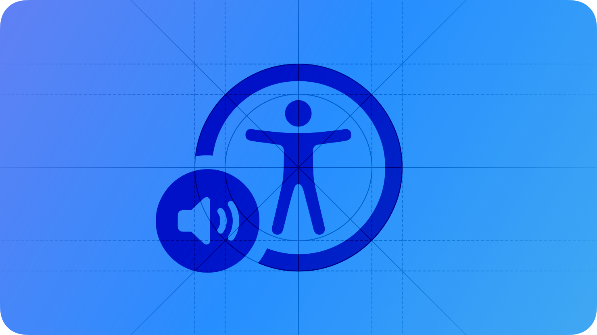

# VoiceOver

VoiceOver is a screen reader that lets people experience your app’s interface without needing to see the screen.

By supporting VoiceOver, you help people who are blind or have low vision access information in your app and navigate its interface and content when they can’t see the display.

VoiceOver is supported in apps and games built for Apple platforms. It’s also supported in apps and games developed in Unity using [Apple’s Unity plug-ins](https://github.com/apple/unityplugins). For related guidance, see [Accessibility](./accessibility.md).

## Descriptions

You inform VoiceOver about your app’s content by providing alternative text that explains your app’s interface and the content it displays.

**Provide alternative labels for all key interface elements.** VoiceOver uses alternative labels (which aren’t visible onscreen) to audibly describe your app’s interface. System-provided controls have generic labels by default, but you should provide more descriptive labels that convey your app’s functionality. Add labels to any custom elements your app defines. Be sure to keep your descriptions up-to-date as your app’s interface and content change. For developer guidance, see [Accessibility modifiers](https://developer.apple.com/documentation/SwiftUI/View-Accessibility).

**Describe meaningful images.** If you don’t describe key images in your app’s content, people can’t use VoiceOver to fully experience them within your app. Because VoiceOver helps people understand the interface surrounding images too, such as nearby captions, describe only the information the image itself conveys.

**Make charts and other infographics fully accessible.** Provide a concise description of each infographic that explains what it conveys. If people can interact with the infographic to get more or different information, make these interactions available to people using VoiceOver, too. The accessibility APIs offer ways to represent custom interactive elements so that assistive technologies can help people use them. For guidance, see [Charts](https://developer.apple.com/design/Human-Interface-Guidelines/charts#Enhancing-the-accessibility-of-a-chart).

**Exclude purely decorative images from VoiceOver.** It’s unnecessary to describe images that are decorative and don’t convey useful or actionable information. Excluding these images shows respect for people’s time and reduces cognitive load when they use VoiceOver. For developer guidance, see [accessibilityHidden(_:)](https://developer.apple.com/documentation/SwiftUI/View/accessibilityHidden(_:)), [accessibilityElement](https://developer.apple.com/documentation/AppKit/NSAccessibility-c.protocol/accessibilityElement), and [isAccessibilityElement](https://developer.apple.com/documentation/UIKit/UIAccessibilityElement/isAccessibilityElement).

## Navigation

**Use titles and headings to help people navigate your information hierarchy.** The title is the first information someone receives from an assistive technology when arriving on a page or screen in your app. Offer unique titles that succinctly describe each page’s content and purpose. Likewise, use accurate section headings that help people build a mental model of each page’s information hierarchy.

**Specify how elements are grouped, ordered, or linked.** Proximity, alignment, and other visible contextual cues help sighted people perceive the relationships between elements. Examine your app for places where relationships among elements are visual only. Then, describe these relationships to VoiceOver.

VoiceOver reads elements in the same order people read content in the their active language and locale. For example, in US English, this is top-to-bottom, left-to-right. In the ungrouped example below, VoiceOver describes each image before moving on to the captions. In the grouped example, VoiceOver describes each image with its respective caption.

For developer guidance, see [shouldGroupAccessibilityChildren](https://developer.apple.com/documentation/ObjectiveC/NSObject-swift.class/shouldGroupAccessibilityChildren).

**Inform VoiceOver when visible content or layout changes occur.** People may find an unexpected content or layout change confusing because it means their mental map of the content is no longer accurate. It’s crucial to report visible changes so VoiceOver and other assistive technologies can help people update their understanding of the content. For developer guidance, see [AccessibilityNotification](https://developer.apple.com/documentation/Accessibility/AccessibilityNotification).

**Support the VoiceOver rotor when possible.** People can use an interface element called the VoiceOver rotor to navigate a document or webpage by headings, links, and other content types. You can help people navigate content in your app by identifying these elements to the rotor. The rotor can also bring up the braille keyboard. For developer guidance, see [AccessibilityRotorEntry](https://developer.apple.com/documentation/SwiftUI/AccessibilityRotorEntry) (SwiftUI), [UIAccessibilityCustomRotor](https://developer.apple.com/documentation/UIKit/UIAccessibilityCustomRotor) (UIKit), and [NSAccessibilityCustomRotor](https://developer.apple.com/documentation/AppKit/NSAccessibilityCustomRotor) (AppKit).

## Platform considerations

*No additional considerations for iOS, iPadOS, macOS, tvOS, or watchOS.*

## Resources

#### Related

[Accessibility](./accessibility.md)

[Inclusion](./inclusion.md)

#### Developer documentation

[Accessibility](https://developer.apple.com/documentation/Accessibility)

[VoiceOver](https://developer.apple.com/documentation/Accessibility/voiceover)

[Supporting VoiceOver in your app](https://developer.apple.com/documentation/UIKit/supporting-voiceover-in-your-app)

#### Videos

- [Writing Great Accessibility Labels](https://developer.apple.com/videos/play/wwdc2019/254)
- [Tailor the VoiceOver experience in your data-rich apps](https://developer.apple.com/videos/play/wwdc2021/10121)
- [VoiceOver efficiency with custom rotors](https://developer.apple.com/videos/play/wwdc2020/10116)

## Change log

| Date | Changes |
| --- | --- |
| March 7, 2025 | New page. |
