# Wallet

Wallet helps people securely store their credit and debit cards, driver’s license or state ID, transit cards, event tickets, keys, and more on iPhone and Apple Watch.

People use their cards and passes in Wallet to make Apple Pay purchases, track their orders, confirm their identity, and streamline activities like boarding a plane, attending a concert, or receiving a discount.

When you integrate Apple Wallet into your app, you can create custom passes and present them the moment people need them, securely verify an individual’s identity so they can access personal content, and offer detailed receipts and tracking information where it’s most convenient. For developer guidance, see [Wallet](https://developer.apple.com/documentation/PassKit/wallet).

## Passes

**Offer to add new passes to Wallet.** When people do something that results in a new pass — like checking into a flight, purchasing an event ticket, or registering for a store reward program — you can present system-provided UI that helps them add the pass to Wallet with one tap (for developer guidance, see [addPasses(_:withCompletionHandler:)](https://developer.apple.com/documentation/PassKit/PKPassLibrary/addPasses(_:withCompletionHandler:))). If people want to review a pass before adding it, you can display a custom view that displays the pass and provides an Add to Apple Wallet button; for developer guidance, see [PKAddPassesViewController](https://developer.apple.com/documentation/PassKit/PKAddPassesViewController).

**Help people add a pass that they created outside of your app.** If people create a pass using your website or another device, suggest adding it to Wallet the next time they open your app. If people decline your suggestion, don’t ask them again.

**Add related passes as a group.** If your app generates multiple passes, like boarding passes for a multi-connection flight, add all passes at the same time so people don’t have to add each one individually. If people can receive a group of passes from your website — such as a set of tickets for an event — bundle them together so that people can download all of them at one time. For developer guidance, see [Distributing and updating a pass](https://developer.apple.com/documentation/WalletPasses/distributing-and-updating-a-pass).

**Display an Add to Apple Wallet button to let people add an existing pass that isn’t already in Wallet.** If people previously declined your suggestion to add a pass to Wallet — or if they removed the pass — a button makes it easy to add it if they change their minds. You can display an Add to Apple Wallet button wherever the corresponding pass information appears in your app. For developer guidance, see [PKAddPassButton](https://developer.apple.com/documentation/PassKit/PKAddPassButton). You can also display an Add to Apple Wallet badge in an email or on a webpage; for guidance, see [Add to Apple Wallet guidelines](https://developer.apple.com/wallet/add-to-apple-wallet-guidelines/).

**Let people jump from your app to their pass in Wallet.** Wherever your app displays information about a pass that exists in Wallet, you can offer a link that opens it directly. Label the link something like “View in Wallet.”

**Tell the system when your pass expires.** Wallet automatically hides expired passes to reduce crowding, while also providing a button that lets people revisit them. To help ensure the system hides passes appropriately, set the expiration date, relevant date, and voided properties of each pass correctly; for developer guidance, see [Pass](https://developer.apple.com/documentation/WalletPasses/Pass).

**Always get people’s permission before deleting a pass from Wallet.** For example, you could include an in-app setting that lets people specify whether they want to delete passes manually or have them removed automatically. If necessary, you can display an alert before deleting a pass.

**Help the system suggest a pass when it’s contextually relevant.** Ideally, passes automatically appear when they’re needed so people don’t have to manually locate them. When you supply information about when and where your pass is relevant, the system can display a link to it on the Lock Screen when people are most likely to want it. For example, a gym membership card could appear on the Lock Screen as people enter the gym. For developer guidance, see [Showing a Pass on the Lock Screen](https://developer.apple.com/documentation/WalletPasses/showing-a-pass-on-the-lock-screen). Starting in iOS 18 and watchOS 11, the system starts a Live Activity for poster event ticket style passes when they’re relevant.

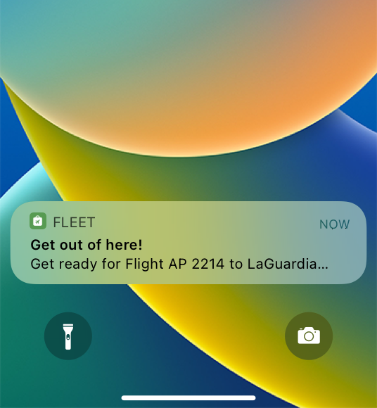

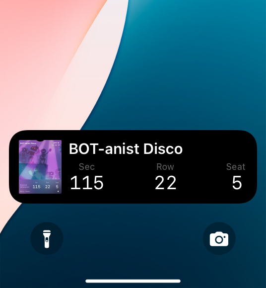

**Update passes as needed.** Physical passes don’t typically change, but a digital pass can reflect updates to events. An airline boarding pass, for example, can automatically update to display flight delays and gate changes.

**Use change messages only for updates to time-critical information.** A change message interrupts people’s current workflow, so it’s essential to send one only when you make an update they need to know about. For example, people need to know when there’s a gate change in a boarding pass, but they don’t need to know when a customer service phone number changes. Never use a change message for marketing or other noncritical communication. Change messages are available on a per-field basis; for developer guidance, see [Adding a Web Service to Update Passes](https://developer.apple.com/documentation/WalletPasses/adding-a-web-service-to-update-passes).

## Designing passes

Wallet uses a consistent design aesthetic to strengthen familiarity and build trust. Instead of merely replicating the appearance of a physical item, design a clean, simple pass that looks at home in Wallet.

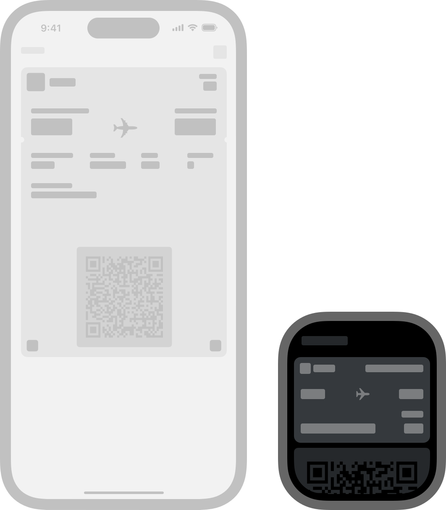

**Design a pass that looks great and works well on all devices.** Passes can look different on different devices. For example, when a pass appears on Apple Watch, it doesn’t display all the images it displays when it appears on iPhone (for guidance, see [Passes for Apple Watch](./wallet.md)). Don’t put essential information in elements that might be unavailable on certain devices. Also, don’t add padding to images; for example, watchOS crops white space from some images.

**Avoid using device-specific language.** You can’t predict the device people will use to view your pass, so don’t write text that might not make sense on a particular device. For example, text that tells people to “slide to view” content doesn’t make sense when it appears on Apple Watch.

**Make your pass instantly identifiable.** Using color — especially a color that’s linked to your brand — can help people recognize your pass as soon as they see it. Make sure that pass content remains comfortably readable against the background you choose.

**Keep the front of a pass uncluttered so people can get important information at a glance.** Show essential information — like an event date or account balance — in the top-right area of the pass so people can still see it when the pass is collapsed in Wallet. Use the rest of the pass front to provide important information; consider putting extra information on the back of a pass (iOS) or in a details screen (watchOS).

**Prefer an NFC-compatible pass.** People appreciate having a contactless pass, because it means that they can just hold their device near a reader. If you support both NFC and a barcode or QR code, the code appears on the back of the pass (in iOS) or in the details screen (in watchOS). In iOS, you can display a QR code or barcode on the front of your pass if necessary for your design.

**Reduce image sizes for optimal performance.** People can receive passes via email or a webpage. To make downloads as fast as possible, use the smallest image files that still look great.

**Provide an icon that represents your company or brand.** The system includes your icon when displaying information about a relevant pass on the Lock Screen. Mail also uses the icon to represent your pass in an email message. You can use your app icon or design an icon for this purpose.

### Pass styles

The system defines several pass *styles* for categories like boarding pass, coupon, store card, and event ticket. Pass styles specify the appearance and layout of content in your pass, and the information that the system needs to suggest your pass when it’s relevant (for guidance, see [Passes](./wallet.md)).

Although each pass style is different, all styles display information using the basic layout areas shown below:

All passes display a logo image, and some can display additional images in other areas depending on the pass style. To display information in the layout areas, use the following [PassFields](https://developer.apple.com/documentation/WalletPasses/PassFields).

| Field | Layout area | Use to provide… |
| --- | --- | --- |
| Header | Essential | Critical information that needs to remain visible when the pass is collapsed in Wallet. |
| Primary | Primary | Important information that helps people use the pass. |
| Secondary and auxiliary | Secondary and auxiliary | Useful information that people might not need every time they use the pass. |
| Back | Not shown in diagram | Supplemental details that don’t need to be on the pass front. |

In general, a pass can have up to three header fields, one primary field, up to four secondary fields, and up to four auxiliary fields. Depending on the amount of content you display in each field, some fields may not be visible.

**Display text only in pass fields.** Don’t embed text in images — it’s not accessible and not all images are displayed on all devices — and avoid using custom fonts that might make text hard to read.

#### Boarding passes

Use the boarding pass style for train tickets, airline boarding passes, and other types of transit passes. Typically, each pass corresponds to a single trip with a specific starting and ending point.

A boarding pass can display logo and footer images, and it can have up to two primary fields and up to five auxiliary fields.

#### Coupons

Use the coupon style for coupons, special offers, and other discounts. A coupon can display logo and strip images, and it can have up to four secondary and auxiliary fields, all displayed on one row.

#### Store cards

Use the store card style for store loyalty cards, discount cards, points cards, and gift cards. If an account related to a store card carries a balance, the pass usually shows the current balance.

A store card can display logo and strip images, and it can have up to four secondary and auxiliary fields, all displayed on one row.

#### Event tickets

Use the event ticket pass style to give people entry into events like concerts, movies, plays, and sporting events. Typically, each pass corresponds to a specific event, but you can also use a single pass for several events, as with a season ticket.

An event ticket can display logo, strip, background, or thumbnail images. However, if you supply a strip image, don’t include a background or thumbnail image. You can also include an extra row of up to four auxiliary fields. For developer guidance, see the `row` property of [PassFields.AuxiliaryFields](https://developer.apple.com/documentation/WalletPasses/PassFields/AuxiliaryFields-data.dictionary).

In iOS 18 and later, the system defines an additional style for contactless event tickets called *poster event ticket*. Poster event tickets offer a rich visual experience that prominently features the event artwork, provides easy access to additional event information, and integrates with system apps like Weather and Maps.

> **Important:**
> Poster event tickets aren’t compatible with tickets that require a QR code or barcode for entry.

A poster event ticket displays an event logo and background image, and can optionally display a separate ticket issuer or event company logo. The system uses metadata about your event to structure ticket information and suggest relevant actions. You must provide a required set of metadata in [SemanticTags](https://developer.apple.com/documentation/WalletPasses/SemanticTags) for all poster event tickets, and an additional set of required metadata depending on the event type — general, sports, or live performance. You can also add optional metadata to further enhance your ticket. For example, you can specify an admission level for a live performance, like General Admission, which the system displays with the seating information. For developer guidance, see [Supporting semantic tags in Wallet passes](https://developer.apple.com/documentation/WalletPasses/supporting-semantic-tags-in-wallet-passes).

The system uses the metadata that you provide to generate a Maps shortcut to the venue directions and an event guide below the ticket when in the Wallet app. The event guide provides convenient access to information like the weather forecast and venue map, and to quick actions like checking the baggage policy and ordering food. You can display a minimum of one and up to four quick action buttons in the event guide; if you include more than four, the system collapses them into a menu. You can optionally include additional ticket information, such as pre-paid parking details, which the system also displays below the ticket.

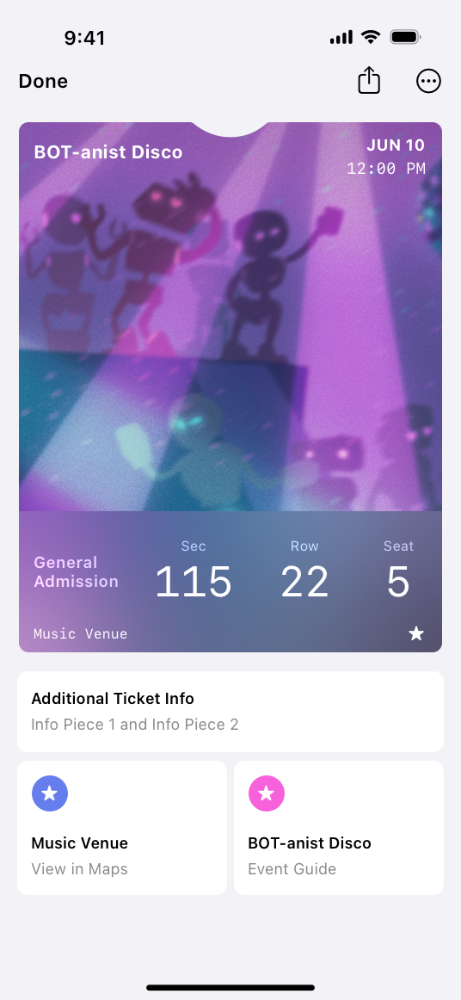

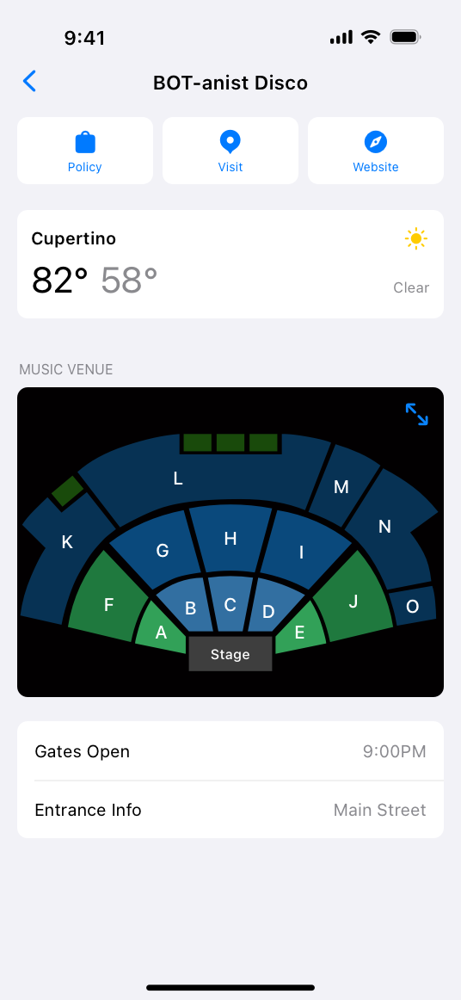

**Create a vibrant and engaging background.** As the centerpiece of a poster event ticket, your background image serves as a visual representation of the event. Limit text in your artwork, and create an image that’s easily identifiable to help people quickly find their ticket among other passes in their Wallet app. If your background image is a solid color or includes a solid color in the footer, consider setting a footer background color to better blend the background image with the footer.

**Position your background image in the safe area.** The system displays ticket information in the header and footer, which overlap the background image. To ensure that the content in your artwork isn’t covered, position it in the safe area. For developer guidance, see `footerBackgroundColor` in [Pass](https://developer.apple.com/documentation/WalletPasses/Pass).

**Ensure sufficient contrast so that ticket information is easy to read.** By default, the system applies a gradient in the header and a blur effect in the footer of your poster event ticket to provide sufficient contrast between the background image and ticket information. Consider adjusting the gradient and blur effect if you need more contrast. The system can also automatically determine the best text color for ticket information and labels based on your background image. If you choose to customize text colors, make sure to select a color that provides sufficient contrast, especially if you set a footer background color or a seat section color to support wayfinding. For developer guidance, see `useAutomaticColors` in [Pass](https://developer.apple.com/documentation/WalletPasses/Pass) and `seatSectionColor` in [SemanticTagType.Seat](https://developer.apple.com/documentation/WalletPasses/SemanticTagType/Seat-data.dictionary).

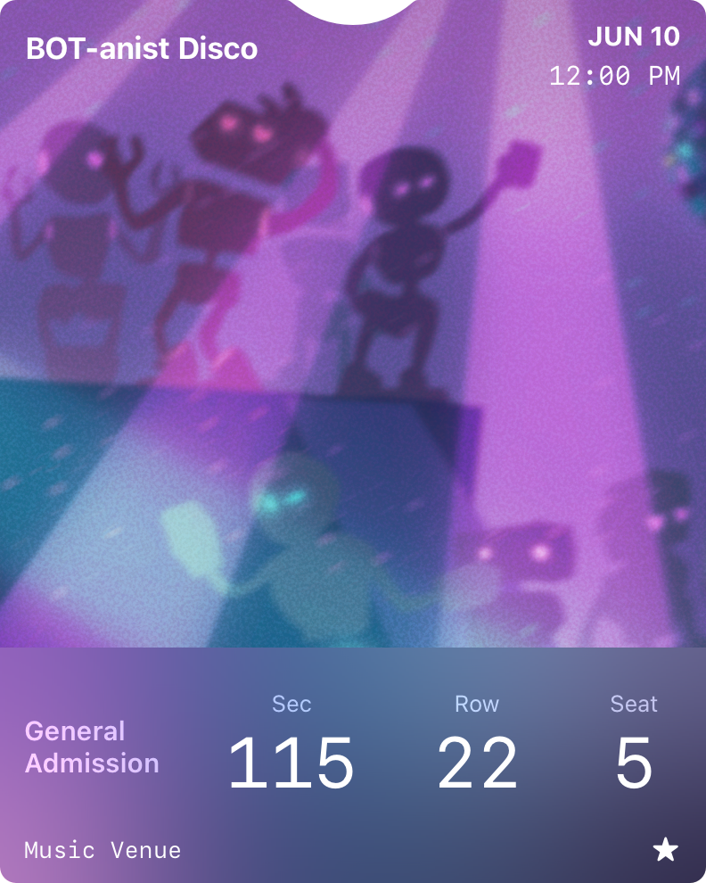

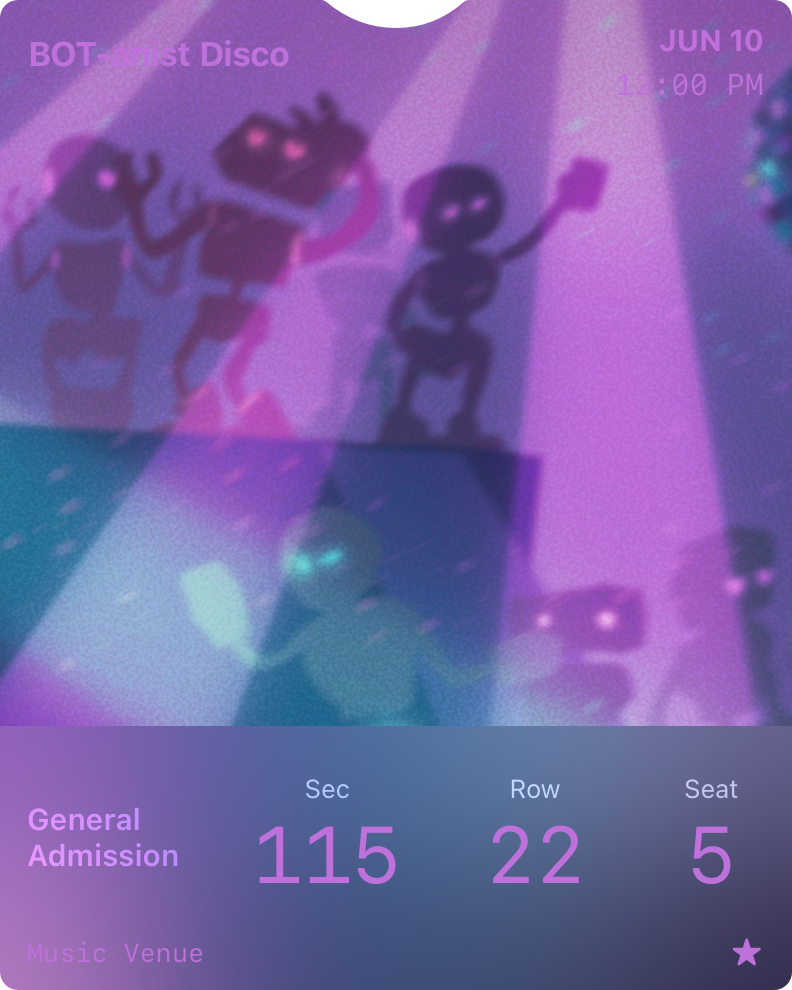

**Consider using the additional information tile for extra event details.** When you have more information about the event that people may find helpful, the additional information tile below the ticket is a great place to put it. If you have additional information that’s essential to display on the front of the ticket, keep the text short to avoid cluttering the footer. For developer guidance, see `additionalTicketAttributes` in [SemanticTags](https://developer.apple.com/documentation/WalletPasses/SemanticTags) and [PassFields.AdditionalInfoFields](https://developer.apple.com/documentation/WalletPasses/PassFields/AdditionalInfoFields-data.dictionary).

**Continue to support event tickets for earlier versions of iOS.** People expect contactless event tickets to work, regardless of their device’s software version. Continue to provide primary, secondary, and auxiliary information in [PassFields](https://developer.apple.com/documentation/WalletPasses/PassFields) and image assets for your event ticket. This enables the system to automatically generate the appropriate ticket style for a person’s device; otherwise, your ticket appears empty on devices running earlier versions of iOS.

#### Generic passes

Use the generic style for a type of pass that doesn’t fit into the other categories, such as a gym membership card or coat-check claim ticket. A generic pass can display logo and thumbnail images, and it can have up to four secondary and auxiliary fields, all displayed on one row.

### Passes for Apple Watch

On Apple Watch, Wallet displays passes in a scrolling carousel of cards. People can add your pass to their Apple Watch even if you don’t create a watch-specific app, so it’s important to understand how your pass can look on the device.

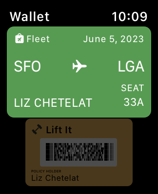

People can tap a pass on their Apple Watch to reveal a details screen that displays additional information in a scroll view. In some cases, people can also tap a specific transaction to get more information.

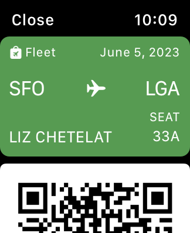

Each pass style specifies the fields and images that can appear in the basic layout areas shown below:

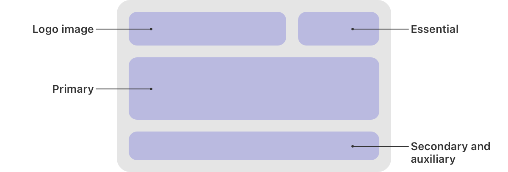

If some information doesn’t fit within the layout areas, the system displays it in the scrolling details screen.

> **Important:**
> In every style, watchOS crops the strip image to fit the aspect ratio of the card interface and may crop white space from other images.

## Order tracking

When you support order tracking, Wallet can display information about an order a customer placed through your app or website, updating the information whenever the status of the order changes. In iOS 17 and later, you can help people start tracking their order right from your app or website and offer additional ways to add their order to Wallet.

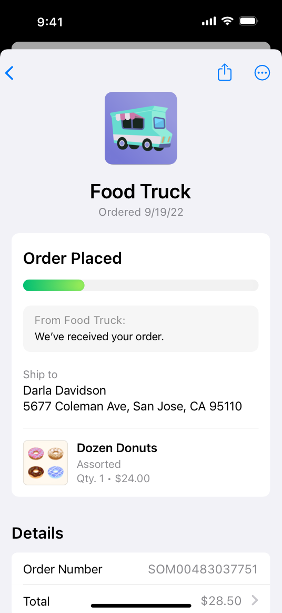

Wallet presents a dashboard that displays a customer’s active and completed orders. People can choose an order to view details about it, like the items they ordered and fulfillment information for shipping and pickup.

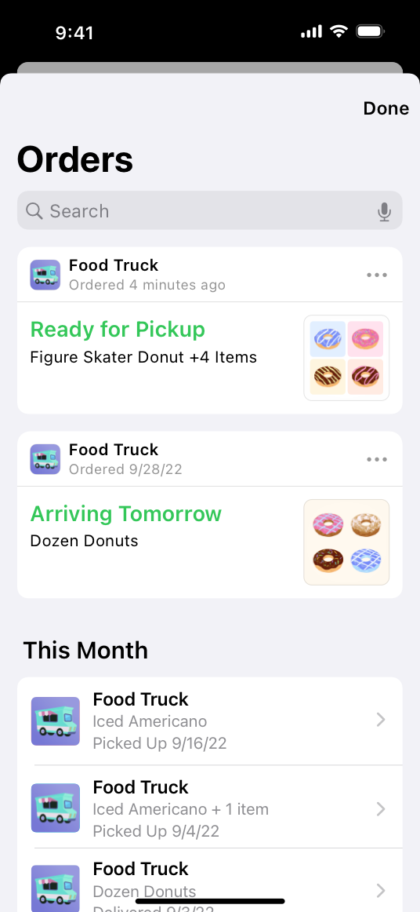

The [Wallet Orders](https://developer.apple.com/documentation/WalletOrders) schema defines the properties you use to provide order data like product descriptions, order status, contact information, and shipping and pickup details, including estimated arrival dates, addresses, tracking numbers, and pickup instructions. Wallet displays the information you supply within consistent, system-defined interfaces. To help people get the information they need quickly and conveniently, supply as much information as you can, using the properties that match your order processes.

**Make it easy for people to add an order to Wallet.** For example, when a customer completes an Apple Pay transaction in your app or website, use [PKPaymentOrderDetails](https://developer.apple.com/documentation/PassKit/PKPaymentOrderDetails) (app) or [ApplePayPaymentOrderDetails](https://developer.apple.com/documentation/ApplePayontheWeb/ApplePayPaymentOrderDetails) (web) to automatically add the order to Wallet. In iOS 17 and later, you can use [AddOrderToWalletButton](https://developer.apple.com/documentation/FinanceKitUI/AddOrderToWalletButton) to display the system-provided Track with Apple Wallet button in relevant areas of your app or website — such as in pages for order confirmation, status, or tracking — or in emails to customers. If a person already added an order to Wallet, trying to add it again opens Wallet and displays the order.

**Make information about an order available immediately after people place it.** People need to confirm that their order was received, even when payment, processing, and fulfillment are still pending. If you won’t have details until a later time, provide the data you have at the time of the order and supply a status [description](https://developer.apple.com/documentation/walletorders/order) like “Check back later for full order details.”

**Provide fulfillment information as soon as it’s available, and keep the status up to date.** When you supply fulfillment data or you change the status of an order, the system updates the order information and can automatically send a notification to customers. The system uses the fulfillment status you report to update the order’s current status to a value like Order Placed, Processing, Ready for Pickup, Picked Up, Out for Delivery, Delivered, or — if something goes wrong — Issue or Canceled. For guidance on describing a status, see [Displaying order and fulfillment details](./wallet.md).

**Supply a high-resolution logo image that uses a nontransparent background.** The system displays your logo image in the dashboard and detail view, so you want to make sure that people can instantly recognize it at various sizes. Use the PNG or JPEG format to create a logo image that measures 300x300 pixels. To help ensure that your logo image renders correctly, be sure to use a nontransparent background. For developer guidance, see [logo](https://developer.apple.com/documentation/walletorders/merchant).

**Supply distinct, high-resolution product images that use nontransparent backgrounds.** The system displays a product’s image — along with descriptive information you supply — in the detail views, order dashboard, and notifications for an order or a fulfillment. When creating a product image, use a straightforward depiction and a solid, nontransparent background. Showing a product in a “lifestyle” context or against a busy background can make the item hard to distinguish at small sizes. For each product, use the PNG or JPEG format to create an image that measures 300x300 pixels.

**In general, keep text brief.** People appreciate being able to read text at a glance, and the system can truncate text that’s too long.

**Use clear, approachable language, and localize the text you provide.** You want to make sure that all your customers can read the information in an order. Also, make sure the price you show matches the final price the customer confirmed.

### Displaying order and fulfillment details

An order gives people ways to contact the merchant and displays details about their Apple Pay purchase, including fulfillment status and per-item information.

**Provide a link to an area where people manage their order.** When you provide a universal link, people can open your order management area even if they don’t have your app installed. To learn more about universal links, see [Allowing apps and websites to link to your content](https://developer.apple.com/documentation/Xcode/allowing-apps-and-websites-to-link-to-your-content); for developer guidance, see [Order](https://developer.apple.com/documentation/WalletOrders/Order).

**Clearly describe each item so people can verify that their order contains everything they expect.** You can use the [LineItem](https://developer.apple.com/documentation/WalletOrders/LineItem) property to provide information like a product’s price, name, and image. An order lists the line items for every item the customer ordered; a fulfillment lists only the line items that fulfillment includes. When appropriate, you can also attach a PDF receipt to an individual transaction related to an order.

**Supply a prioritized list of your apps that might be installed on the device.** The system uses this list when it needs to display a link to your app within the order details view. For example, if you provide multiple apps and more than one of them is installed on the device, the system displays a link to the installed app that’s highest on your list. If none of your apps are installed on the device, the system displays a link to the first app on your list. For developer guidance, see [Order](https://developer.apple.com/documentation/WalletOrders/Order).

**Avoid sending duplicate notifications.** For example, you can tell the system to avoid sending order-related notifications through Wallet when the customer has one of your associated apps installed.

**Make it easy for customers to contact the merchant.** Provide multiple contact methods, so people can choose the one that works best for them. At minimum, you need to provide a link to the merchant’s website or landing page, but you can also provide a Messages for Business link, a phone number, an email address, and a link to a support page. When people choose the Contact button in an order, the system displays a menu of the contact methods you supply. For developer guidance, see [Merchant](https://developer.apple.com/documentation/WalletOrders/Merchant).

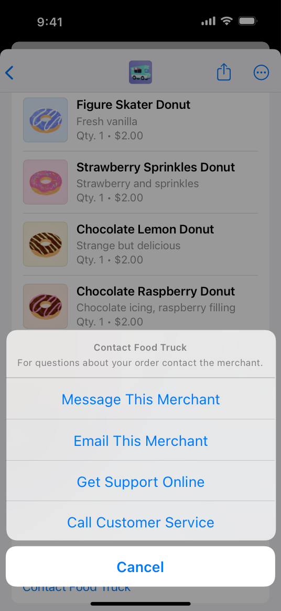

**Help people track their order.** A multi-item order can have multiple fulfillments, where each fulfillment is either shipping or pickup. For example, if a customer orders a pair of shoes and a T-shirt, the customer might want to have one item shipped, while picking up the other. Regardless of fulfillment type, you need to supply enough information for people to know where their items are and when to expect them at the destination they specified. In addition to an estimated time of arrival, here’s some information that people particularly appreciate:

- A link that opens the carrier’s website to a page with information about a shipping fulfillment. When possible, provide a direct link — in addition to a tracking number — so people can easily view the most up-to-date shipping information. If necessary, display this link on any intermediate order-tracking page you open.
- A scannable barcode when one is required to pick up the order in a pickup fulfillment. It’s convenient when people can offer the barcode from within Wallet instead of finding it in an email or webpage.
- Clear, detailed instructions that can help people receive or pick up their order.

**Keep the fulfillment screen centered on order tracking.** For example, if you recommend your app or other services to customers, be sure to prioritize order-tracking information over other content in the screen.

**Choose shipping-fulfillment values that match the details you have about the shipping process.** If you know the carrier, enter its name in the `carrier` property; otherwise, leave the default “Track Shipment” value. If you can access details about a carrier’s interim shipping steps — such as when a fulfillment is on the way or out for delivery — indicate each step by using specific status values like `onTheWay`, `outForDelivery`, or `delivered`. In contrast, if you don’t have access to a carrier’s shipping details, use the `shipped` status. In both cases, provide a tracking link (when one is available) so people can track their order on their own. For developer guidance, see [ShippingFulfillment](https://developer.apple.com/documentation/WalletOrders/ShippingFulfillment).

**Keep customers informed through relevant fulfillment status descriptions.** A great status message is approachable, accurate, and clearly related to the status it describes. In addition to supplying information that helps people understand the status of their order, a status message also gives you an opportunity to use your brand’s communication style.

**Be direct and thorough when describing an Issue or Canceled status.** People generally need to know why there’s a problem and what they can do about it.

## Identity verification

On iPhone running iOS 16 and later, people can store an ID card in Wallet, and later allow an app or App Clip to access information on the card to verify their identity without leaving their current context. For example, a person might need to confirm their identity when they apply for a credit card within their banking app. To learn how to support in-person mobile ID verification, see [ID Verifier](./id-verifier.md).

> **Note:**
> Apple doesn’t create or see the ID documents that people add to Wallet, and when people agree to share identifying information with your app, you receive only encrypted data that isn’t readable on the device. For developer guidance, see [Requesting identity data from a Wallet pass](https://developer.apple.com/documentation/PassKit/requesting-identity-data-from-a-wallet-pass).

To help you offer a consistent experience that people can trust, Apple provides a Verify with Wallet button you can use in your app when you need to ask for identify verification. The button reveals a sheet that describes your request and lets people agree to share their information or cancel.

**Present a Wallet verification option only when the device supports it.** If the current device can’t return the identify information you request, don’t display a Verify with Apple Wallet button. Be prepared to present a fallback view that offers a different verification method if Verify with Apple Wallet isn’t available; for developer guidance, see [VerifyIdentityWithWalletButton](https://developer.apple.com/documentation/PassKit/VerifyIdentityWithWalletButton).

**Ask for identity information only at the precise moment you need it.** People can be suspicious of a request for personal information if it doesn’t seem to be related to their current action. If your app needs identity verification, for example, wait to ask for this information until people are completing the process or transaction that requires it; don’t request verification before people are ready to start the process or when they’re simply creating an account.

**Clearly and succinctly describe the reason you need the information you’re requesting.** You must write text that explains why people need to share identity information with your app (this text is called a *purpose string* or *usage description string*). The system displays your purpose string in the verification sheet so people can make an informed decision. Here are a couple of examples:

| To verify… | To support… | Example purpose string |
| --- | --- | --- |
| Identity | Opening an account for which proof of identity is legally required to prevent fraud | Federal law requires this information to verify your identity and also to help [App Name] prevent fraud. |
| Driving privilege | Renting a vehicle that requires legal driving privileges | Applicable state law requires [App Name] to verify your driving privileges. |

For each purpose string, aim for a brief, complete sentence that’s direct, specific, and easy for everyone to understand. Use sentence case, avoid passive voice, and include a period at the end.

**Ask only for the data you actually need.** People may lose trust in your app if you ask for more data than you need to complete the current task or action. For example, if you need to ensure that a customer is at least a certain age, use a request that specifies an age threshold; avoid requesting the customer’s current age or birth date. For developer guidance, see [age(atLeast:)](https://developer.apple.com/documentation/PassKit/PKIdentityElement/age(atLeast:)).

**Clearly indicate whether you will keep the data and — if you need to keep it — specify how long you’ll do so.** To help people trust your app, it’s essential to explain how long you might need to keep the personal information they agree to share with you. When you use PassKit APIs to specify a duration — such as a particular period, indefinitely, or only as long as it takes to complete the current verification — the system automatically displays explanatory content in the verification sheet. For developer guidance, see [PKIdentityIntentToStore](https://developer.apple.com/documentation/PassKit/PKIdentityIntentToStore).

**Choose the system-provided verification button that matches your use case and the visual design of your app.** The system provides the following button labels to support various use cases:

| Button type | Consider using when… |
| --- | --- |
|  | Your app can complete the current transaction after you verify a person’s age. An example transaction is making a car available to lease. |
|  | Your app can complete the current transaction after you verify a person’s identity. An example transaction is a car rental. |
|  | Verify with Wallet forms one part of a verification process that also requires people to supply additional information not provided by Verify with Wallet, such as a Social Security number or phone number. Examples include opening a financial account or performing a background check. |
|  | Your app can complete the current verification flow without additional steps, but the “Verify Age,” “Verify Identity,” and “Continue” button labels aren’t appropriate for your use case. An example is an app that helps people sign up for a government service. |

All button labels are also available in a multiline variant that the system automatically uses when horizontal space is constrained. For developer guidance, see [PKIdentityButton.Label](https://developer.apple.com/documentation/PassKit/PKIdentityButton/Label).

The verification button always uses white letters on a black background. You can choose the style that includes a light outline if you need to ensure that the button contrasts well with a dark background in your app. In addition, you can use the [cornerRadius](https://developer.apple.com/documentation/PassKit/PKIdentityButton/cornerRadius) property to adjust the verification button’s corners to match other related buttons in your interface. For developer guidance, see [PKIdentityButton.Style.blackOutline](https://developer.apple.com/documentation/PassKit/PKIdentityButton/Style/blackOutline).

## Platform considerations

*No additional considerations for iOS, iPadOS, macOS, visionOS, or watchOS. Not supported in tvOS.*

## Specifications

### Pass image dimensions

As you design images for your wallet passes, create PNG files and use the following values for guidance.

| Image | Supported pass styles | Filename | Dimensions (pt) |
| --- | --- | --- | --- |
| Logo | Boarding pass, coupon, store card, event ticket, generic pass | `logo.png` | Any, up to 160x50 |
| Primary logo | Poster event ticket | `primaryLogo.png` | Any, up to 126x30 |
| Secondary logo | Poster event ticket | `secondaryLogo.png` | Any, up to 135x12 |
| Icon | All | `icon.png` | 38x38 |
| Background | Event ticket, poster event ticket | `background.png` (event ticket), `artwork.png` (poster event ticket) | 180x220 (event ticket), 358x448 (poster event ticket) |
| Strip | Coupon, store card, event ticket | `strip.png` | 375x144 (coupon, store card), 375x98 (event ticket) |
| Footer | Boarding pass | `footer.png` | Any, up to 286x15 |
| Thumbnail | Event ticket, generic pass | `thumbnail.png` | 90x90 |

> **Note:**
> Dimensions for the logo, primary logo, and secondary logo images are the maximum — not the required — values. For example, if you create a primary logo image that measures 30x30 points, you don’t need to add unnecessary padding so that it measures the maximum 126x30 points.

## Resources

#### Related

[Apple Pay](./apple-pay.md)

[ID Verifier](./id-verifier.md)

#### Developer documentation

[FinanceKitUI](https://developer.apple.com/documentation/FinanceKitUI)

[FinanceKit](https://developer.apple.com/documentation/FinanceKit)

[PassKit (Apple Pay and Wallet)](https://developer.apple.com/documentation/PassKit)

[Wallet Passes](https://developer.apple.com/documentation/WalletPasses)

[Wallet Orders](https://developer.apple.com/documentation/WalletOrders)

#### Videos

- [What’s new in Wallet and Apple Pay](https://developer.apple.com/videos/play/wwdc2024/10108)
- [What’s new in Wallet and Apple Pay](https://developer.apple.com/videos/play/wwdc2023/10114)
- [What’s new in Wallet and Apple Pay](https://developer.apple.com/videos/play/wwdc2022/10041)

## Change log

| Date | Changes |
| --- | --- |
| January 17, 2025 | Added specifications for pass image dimensions. |
| December 18, 2024 | Added guidance for the poster event ticket style. |
| September 12, 2023 | Added guidance for helping people add orders to Wallet. |
| February 20, 2023 | Enhanced guidance for presenting order-tracking information and added artwork. |
| November 30, 2022 | Added guidance to include a carrier name in status information for a shipping fulfillment. |
| September 14, 2022 | Added guidelines for using Verify with Wallet, updated guidance on providing shipping status values and descriptions, and consolidated guidance into one page. |
