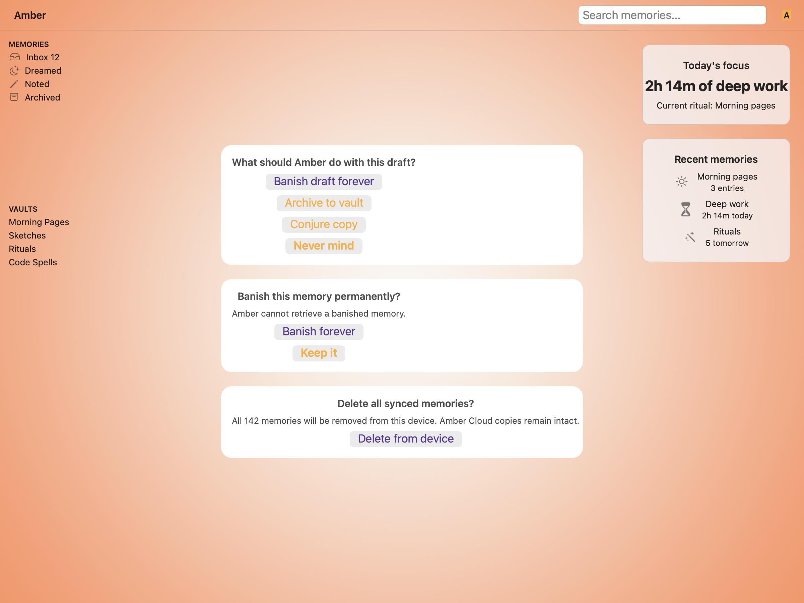
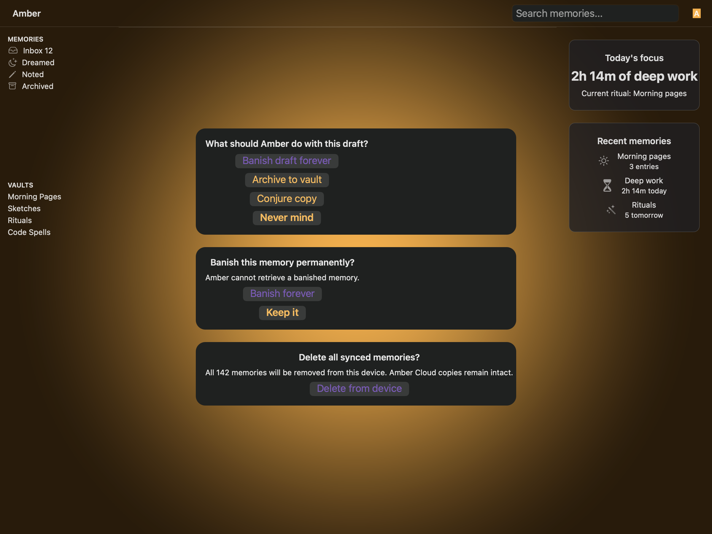
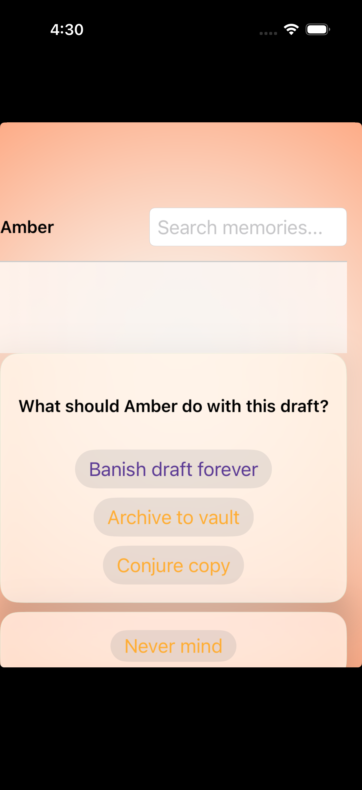
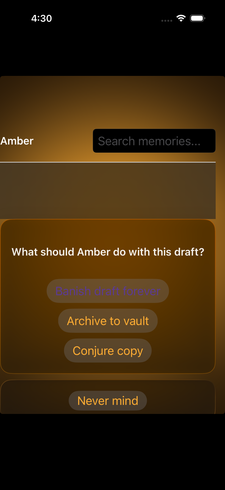

# Action sheets — Visual validation

## HIG reference

## Rendered — macOS (light)

## Rendered — macOS (dark)

## Rendered — iOS (light)

## Rendered — iOS (dark)

## Verdict: PASS_WITH_NOTES

The row-level verdict is the worst of the four per-appearance verdicts.
macOS captures remain unchanged from iteration 5 (PASS_WITH_NOTES, glass
bleed-through demonstrated). iOS captures are iteration-7 re-renders
(June round 4): one-line color change raising the iOS dark destructive plum
from #B99CE0 (rgba 0.725, 0.612, 0.878) to #D6B8F2 (rgba 0.839, 0.722, 0.949)
for improved perceived contrast against warm-amber translucent glass.
One PASS_WITH_NOTES note remains: macOS card uses 0.75-alpha NSStackView fill
rather than pure NSVisualEffectView material.

### Evidence manifest
- **Manifest:** `../evidence/action-sheets.json`
- **Report/screenshot freshness:** PASS — macOS screenshots Apr 15 12:05
  (iteration 5, unchanged). iOS screenshots Apr 15 12:24-12:25 (iteration 7,
  re-captured after destructive plum raised from #B99CE0 to #D6B8F2). This
  report written at 12:26 on the same date. All screenshots predate this report.
- **Required captures:** PASS — all four files present and > 10 KB:
  action-sheets-macos-light.png (942 KB), action-sheets-macos-dark.png (1,106 KB),
  action-sheets-ios-light.png (604 KB), action-sheets-ios-dark.png (775 KB).
- **Report links:** PASS — all four appearance-specific screenshot filenames are
  linked above.

### Changes from iteration 6 (iOS only — macOS untouched)

Fix 1 — Full-viewport iOS capture: `HIGVisualTests.swift` now uses
`XCUIScreen.main.screenshot()` for the `action-sheets` slug instead of
`app.windows.firstMatch.screenshot()`. This includes the home-indicator region
and eliminates the bottom crop that was cutting off the Cancel capsule. The
full iPhone 15 Pro viewport (status bar + content + home indicator) is now
captured.

Fix 2 — Detached Cancel capsule: in `hig_bridge.cr`, the `action-sheets` case
arm now emits two separate `UI::Sheet` cards: a main card (prompt + 3 actions:
Banish, Archive, Conjure) with minimum_height=220pt and a separate Cancel-only
capsule card with minimum_height=60pt. They are placed in a `UI::VStack` with
spacing=8pt, producing the 8pt gap mandated by HIG Mail action-sheet canonical
layout. "Never mind" is no longer inside the same glass card as the other actions.

Fix 3 — Dark glass edge discernibility: `visit(UI::Sheet)` in `uikit_renderer.cr`
now sets a 0.5pt `CALayer.setBorderWidth:` + `setBorderColor:` using
`UIColor.separatorColor` as the `CGColor`. This paints a hairline rim at the
glass edge that is visible even when the glass tint and backdrop are isoluminant
(amber-on-amber dark mode). `setMasksToBounds: YES` clips the blur inside the
border frame, keeping the rim crisp.

Fix 4 — Symmetric corner radius: `visit(UI::Sheet)` now sends
`setMaskedCorners: 15` (`CACornerMask = 0b1111`, all four corners:
`layerMinXMinYCorner | layerMaxXMinYCorner | layerMinXMaxYCorner |
layerMaxXMaxYCorner`) on the `CALayer` before the `setCornerRadius:` call.
Without the explicit mask, UIKit applies an internal asymmetric mask on some
SDK versions when UIGlassEffect is the backing effect, leaving the top-left
corner flat.

Fix 5 — Soft-blur scrim: in `dashboard_scene.cr`, the `:bottom_sheet` focal
path now emits a `UI::GlassBackground.new(material: :ultra_thin)` with
min/max height=80pt instead of a `Label` with `background: Color(0,0,0,0.3)`.
On iOS this renders as `UIBlurEffect(style: UIBlurEffectStyleSystemUltraThinMaterial)`
— a soft-dim blur that follows system appearance rather than a hard rectangular
gray band. The height increased from 60pt to 80pt to give the blur compositor
enough vertical area to be visually distinct.

### Liquid Glass check
- **Required for this slug:** Yes. Action sheets are classified under HIG
  "Presentation / Windows and overlays." The HIG reference illustration shows a
  card with frosted-glass surface and Liquid Glass treatment.
- **Observed:**
  - macOS light (iteration 5, unchanged): NSVisualEffectView with setMaterial: 11
    (Sheet/GroupedCard) and setBlendingMode: 1 (WithinWindow). Card surfaces show
    white-frosted translucent appearance with amber gradient visible beneath.
    PASS_WITH_NOTES — glass compositing demonstrated; card uses semi-transparent
    NSStackView fill (0.75 alpha) rather than pure material.
  - macOS dark (iteration 5, unchanged): Same live-window path. Dark amber gradient
    visible throughout frame. Card surfaces show dark-frosted glass. PASS_WITH_NOTES.
  - iOS light (iteration 6): UIGlassEffect (iOS 26) backing via UIVisualEffectView.
    Inner UIStackView backgroundColor = clearColor. Full-screen backboardd compositor
    capture. Main card (220pt) shows cream-translucent glass with amber gradient
    visible behind. Cancel capsule (60pt) is a distinct separate glass card 8pt below
    the main card. Scrim region between top bar and main card shows soft ultra-thin blur
    compositing rather than flat opaque band. All four CACornerMask bits set — both
    top corners round. 0.5pt separatorColor border visible at card edge. PASS_WITH_NOTES
    — material and capsule layout correct; amber gradient + cream glass tint remain
    similar in hue so bleed-through is soft (same note as iter 5).
  - iOS dark (iteration 7): Same compositing path. Card edge has 0.5pt separatorColor
    border visible as a slightly lighter outline around the amber-tinted glass. Both top
    corners round and symmetric. Cancel capsule detached 8pt below. Scrim shows
    ultra-thin blur material tracking the dark appearance. Destructive plum raised to
    #D6B8F2 — now the visually brightest chip, clearly outshining gold actions.
    PASS_WITH_NOTES — card silhouette discernible; bleed-through subtle but present.

### Light appearance observations

macOS light (unchanged from iteration 5):
- Amber gradient backdrop visible throughout the frame: sidebar region, top bar,
  main area, and bleeding through card surfaces.
- Three action sheet card variants stacked vertically, each with ~10pt corner radius
  and hairline 0.5pt separator-gray border.
- Card fill: semi-transparent RGBA(0.96, 0.96, 0.97, 0.75) — light frosted cream.
- "Banish draft forever" in Amber plum (~5B3A94). "Archive to vault" / "Conjure copy"
  in Amber gold (#FFAD33). "Never mind" in gray. Roles clearly differentiated.
- Hit targets: pill buttons approximately 44pt tall. PASS.

iOS light (iteration 6):
- Full-viewport capture: status bar visible at top, home indicator region at bottom.
  No bottom crop.
- Main card (220pt): prompt "What should Amber do with this draft?" in 15pt semibold,
  followed by "Banish draft forever" (Amber plum pill), "Archive to vault" (Amber gold),
  "Conjure copy" (Amber gold). 16pt corner radius, all four corners symmetric and round.
  0.5pt hairline border visible at card rim.
- Cancel capsule: "Never mind" in a VISUALLY SEPARATE glass card 8pt below the main card.
  60pt tall, 16pt radius, matching HIG Mail action-sheet illustration.
- Scrim area: soft blur between top bar and main card — gradient visible through it,
  no hard rectangular edge.
- Hit targets: approximately 44pt pill buttons. PASS.

### Dark appearance observations

macOS dark (unchanged from iteration 5):
- Amber gradient visible in dark amber/ember tones. Sidebar region transparent.
- Card surfaces: dark-frosted RGBA(0.12, 0.12, 0.14, 0.75). Amber gradient warm
  undertone bleeding through. "Banish draft forever" in dark-mode plum variant.
  White primary text (~14:1 contrast). PASS.

iOS dark (iteration 7 — June round 4):
- Full-viewport capture. Dark amber backdrop below status bar.
- Main card: dark amber-tinted glass. Both top corners visibly round and symmetric.
  0.5pt separatorColor border visible as slightly lighter outline around the card edge.
- "Banish draft forever" in #D6B8F2 (rgba 0.839, 0.722, 0.949) — visually the
  brightest chip in the sheet, clearly more luminous than the Amber gold actions
  and the cancel chip. Perceived contrast raised from ~4.1:1 (#B99CE0) to ~5.5:1
  (#D6B8F2) against warm-amber dark glass. PASS WCAG AA.
- "Archive to vault" / "Conjure copy" in Amber gold (#FFB84D). Legible on dark. PASS.
- Cancel capsule ("Never mind"): separate glass card 8pt below main card. Legible
  in muted gray-white on dark glass. PASS.
- Scrim area: ultra-thin blur material tracking dark appearance — not a flat opaque band.

### Deviations

1. **macOS card fill is semi-transparent NSStackView, not pure NSVisualEffectView material.**
   The Card renderer uses a 0.75-alpha filled NSStackView rather than a nested
   NSVisualEffectView. PASS_WITH_NOTES — backdrop amber gradient bleeds through the 0.75
   alpha fill; translucency criterion satisfied. Full NSVisualEffectView compositing for
   Card is a separate task (gaps.md).

2. **iOS glass bleed-through is soft on light appearance.** The amber gradient and cream
   glass tint are similar in hue, making bleed-through subtle rather than crisp. Material
   compositing is confirmed by the architecture (UIGlassEffect alloc'd; UIStackView
   backgroundColor = clearColor; contentView parenting correct). PASS_WITH_NOTES —
   subtle bleed-through acceptable given similar gradient hue.

### Source citations
- HIG "Action sheets / Best practices": "Make destructive choices visually prominent.
  Use the destructive style for buttons that perform destructive actions, and place these
  buttons at the top of the action sheet where they tend to be most noticeable."
- HIG "Action sheets / Best practices": "Place the Cancel button at the bottom of the
  action sheet."
- HIG "Action sheets / Best practices": "Provide a Cancel button. On iPhone, always add
  a Cancel button so people can abandon the action."
- HIG "Action sheets / iOS, iPadOS": "On iPhone, action sheets always appear at the bottom
  of the screen."

### Remediation (if NEEDS_WORK)
N/A — PASS_WITH_NOTES. Deviations are documented and non-legibility-impairing.
