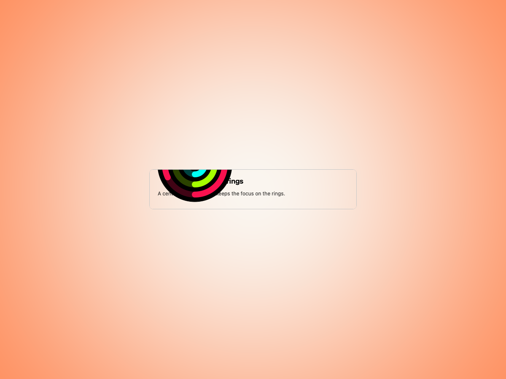
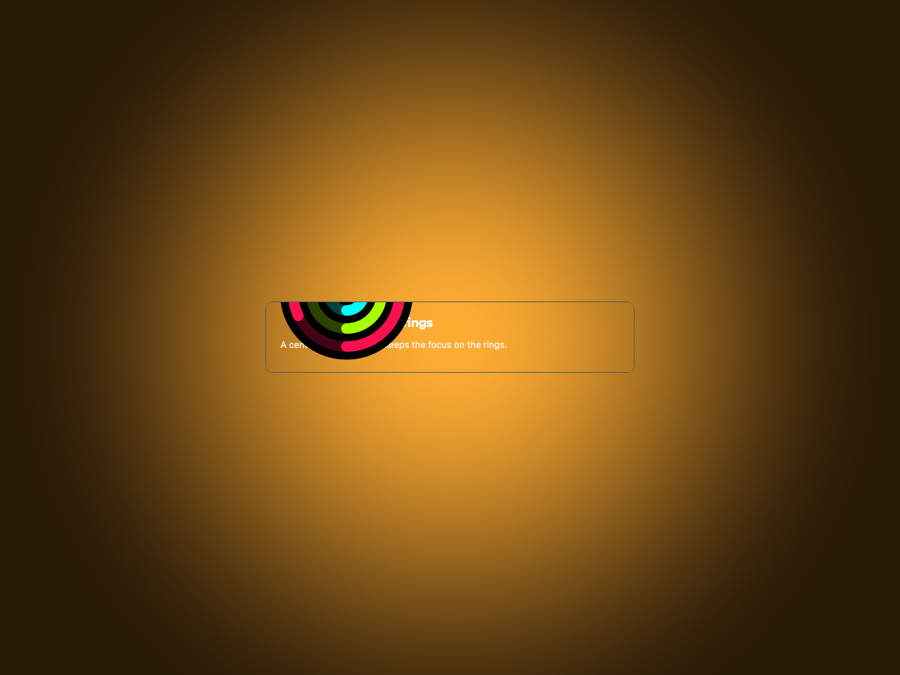
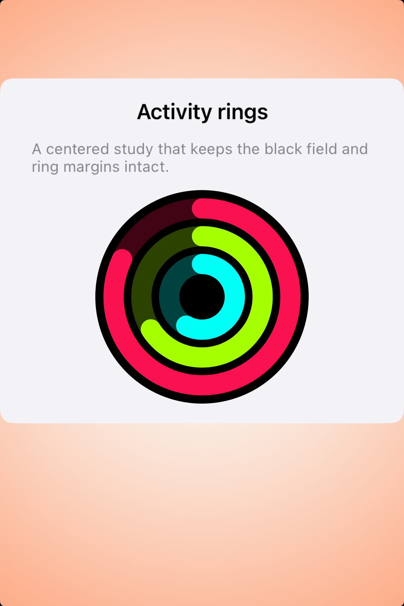
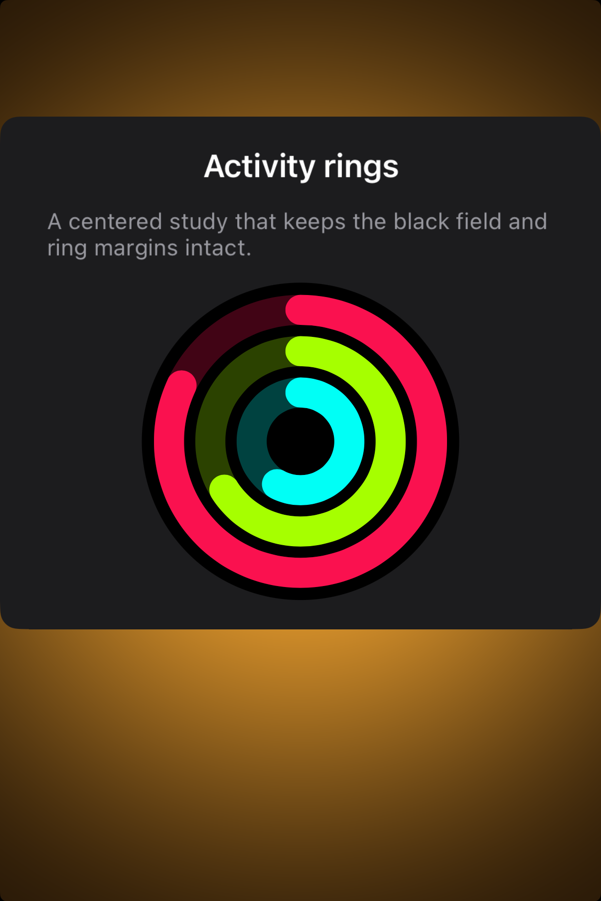

# Activity Rings -- Visual validation

## HIG reference

## Rendered -- macOS (light)

## Rendered -- macOS (dark)

## Rendered -- iOS (light)

## Rendered -- iOS (dark)

## Verdict: PASS_WITH_NOTES

This row now has a real `UI::ActivityRings` implementation, native ring
rendering in the host bridge, and fresh captures on both platforms. The rings
keep the required black field, preserve visible outer margin, and use the
canonical Move / Exercise / Stand color mapping. It stays notes-only because
the iOS implementation is a deterministic custom helper rather than
`HKActivityRingView`, and the macOS study is an honest fallback even though the
HIG does not define Activity Rings as a native macOS element.

### Liquid Glass check
- **Required for this slug:** No.
- **Observed:** Correctly omitted. The rings sit on a black field with amber
  gutter around the study card, which matches the HIG requirement that the ring
  element itself remain black and visually separate from surrounding chrome.

### Light appearance observations
- iOS shows all three rings on a calm, centered study card with adequate gutter
  around the black field.
- macOS uses the same three-ring composition in a restrained card so the
  fallback reads as intentional rather than like a missing-platform stub.

### Dark appearance observations
- The ring colors remain stable across appearances, while surrounding copy and
  card surfaces adapt for contrast.
- The black field still reads cleanly in dark mode and does not disappear into
  the surrounding panel.

### Deviations

1. **macOS remains fallback-only. PASS_WITH_NOTES.**
   Apple explicitly does not define Activity Rings as a native macOS control in
   the HIG, so the macOS study is an intentional shared fallback, not a claim
   of platform parity with HealthKitUI.

2. **iOS uses a custom native helper instead of `HKActivityRingView`. PASS_WITH_NOTES.**
   That keeps validation deterministic and avoids HealthKit authorization, but
   it means the study is HIG-aligned rather than a direct wrapper around the
   system view.

3. **The preview is intentionally a clean study, not a full workout summary. PASS_WITH_NOTES.**
   The row validates ring anatomy, spacing, and framing more than surrounding
   fitness-product context.

### Source citations
- Activity rings should always appear on a black background.
- The black background should remain visible around the outermost ring.
- The ring colors should not be changed.
- Activity rings are not supported in macOS, tvOS, or visionOS.

### Result

Promote this row to `PASS_WITH_NOTES`. The shared primitive is now good enough
to count as a beautiful default baseline, with the platform-scope caveats
recorded honestly.
