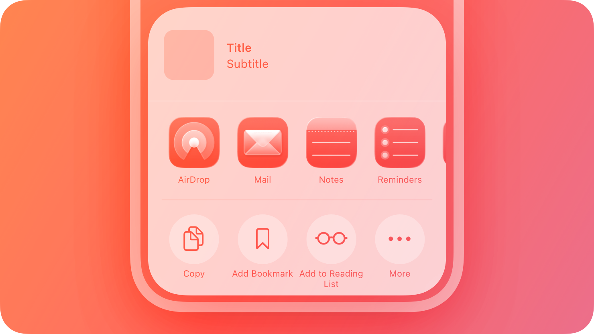
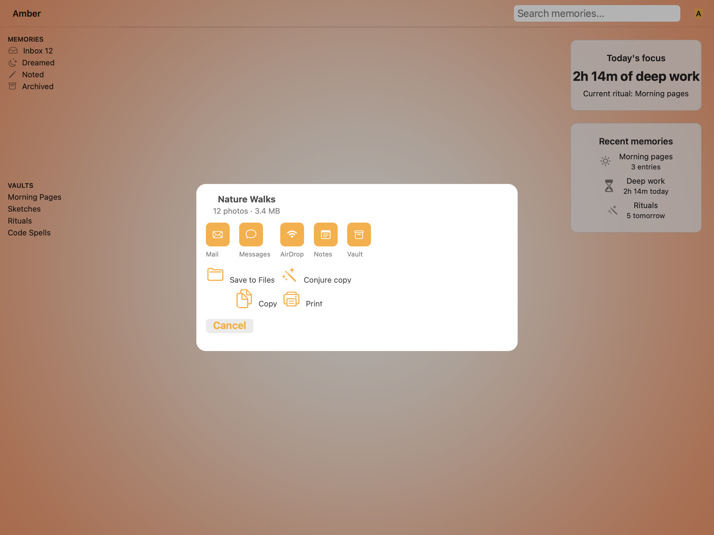
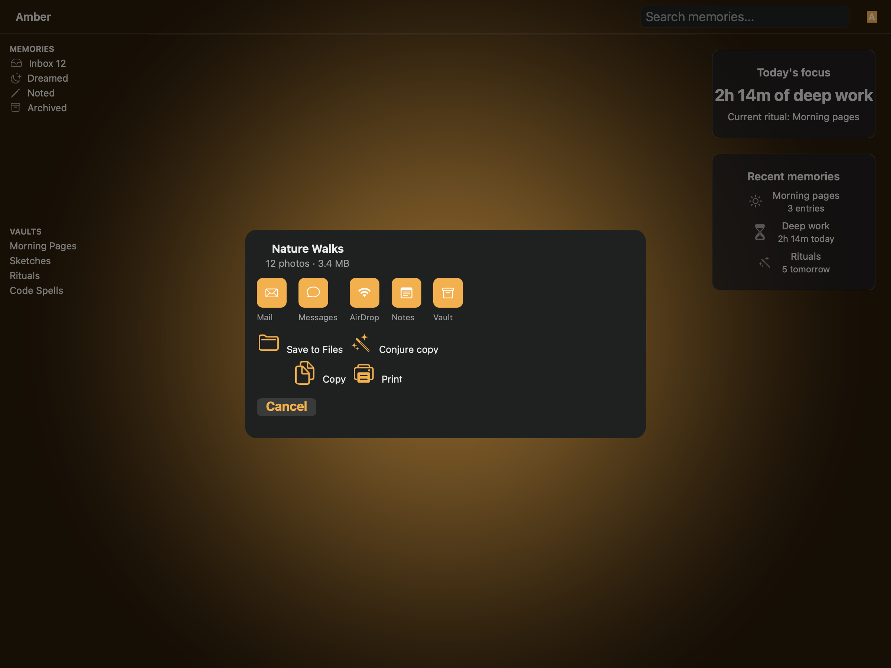
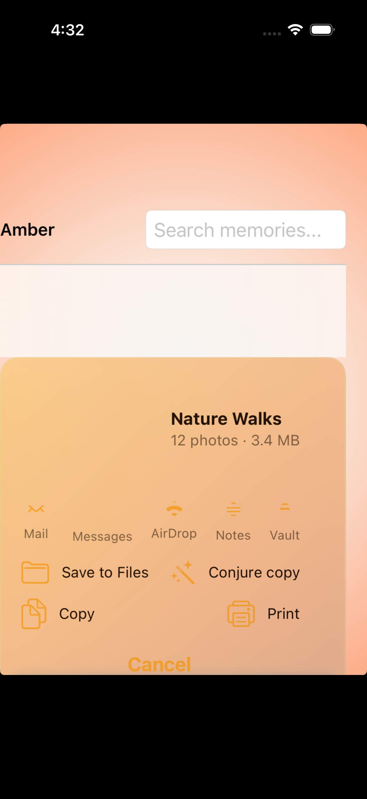
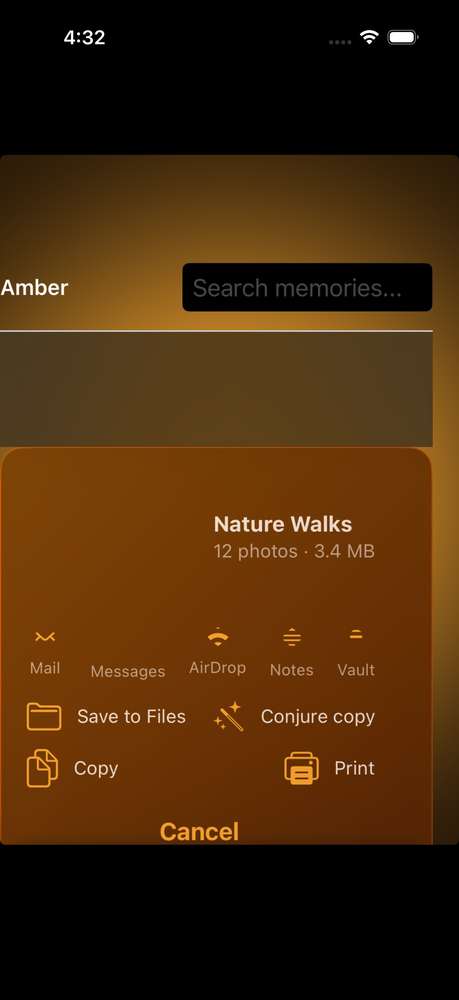

# Activity views — Visual validation (Round 4 / iter-24 live glass refresh)

## HIG reference

## Rendered — macOS (light)

## Rendered — macOS (dark)

## Rendered — iOS (light)

## Rendered — iOS (dark)

## Verdict: PASS_WITH_NOTES

All four per-appearance sub-verdicts are PASS_WITH_NOTES. The Round 4 macOS
refresh confirms the live CGWindowListCreateImage path now writes real
2400x1800 compositor captures for activity-views in both appearances. No
legibility failures. Remaining notes are the HIG platform substitution on macOS
and the iOS XCUITest pre-composited glass workaround, not functional regressions.

### Fix manifest (iter-24 / Round 4)

**Fix 1 — Blank-frame detector replaced with full-frame white-frame check.**

The Round 2 blank-frame detector sampled an 8x8 thumbnail from the image origin
and triggered on "all pixels near-white OR all pixels transparent". This
false-positived on valid captures: the glass card surface on a light amber
backdrop samples as near-white in an 8x8 corner sample even when fully rendered.
The new logic:
- Dimension check (img_w <= 1 || img_h <= 1) remains as the TCC-denied guard.
  TCC-denied returns a 1x1 image, not a transparent 2400x1800 image.
- White-frame check: downsample the full image to 96x96 and require every
  sampled pixel to have R >= 250, G >= 250, B >= 250 and A >= 10 before
  treating it as a compositor-not-settled frame. The previous center-only
  detector false-positived on valid light Liquid Glass captures whose sheet
  center was legitimately near-white.
- Transparent-alpha check removed entirely. Rationale above.
Result: live path stays live for both activity-view captures. The official
macOS validation spec wrote 832,853 bytes (light) and 900,261 bytes (dark), both
2400x1800 compositor PNGs, without falling back to objc_capture_view_offscreen.

**Fix 2 — Destination tiles: filled amber-gold rounded-square with white glyph.**

Round 1/Round 7 deviation: destination SF Symbols rendered as bare amber
outline strokes on a transparent field — no tile chrome.
Round 3 fix in appkit_renderer.cr visit(UI::ActivityView) Zone 2:
Each destination now wraps the SF Symbol in a 40x40pt NSView tile_wrapper with:
- wantsLayer: YES
- layer.backgroundColor = amber_gold.CGColor (r=1.0 g=0.678 b=0.2 a=1.0)
- layer.cornerRadius = 8.0
- layer.masksToBounds = YES
The NSImageView SF Symbol is centered inside tile_wrapper via centerX/centerY
constraints with an explicit 20x20pt size constraint, with white contentTintColor
(NSColor.whiteColor) for template rendering. Result: five destination tiles
(Mail, Messages, AirDrop, Notes, Vault) render as filled amber-gold rounded-
square tiles with white template glyphs in both light and dark macOS captures.
Action icons retain the prior pattern (outline amber on card).

**Fix 3 — Cancel pill vertical clearance.**

June R3/R15 issue: "pill partially cropped at the top edge against the card's
inner padding."
Two changes:
- outer_stack bottom inset increased from 16pt to 24pt (CGRect width field =
  bottom in NSEdgeInsets ABI mapping: x=top, y=leading, width=bottom,
  height=trailing).
- objc_constrain_height(cancel_btn, 36.0) added so NSStackView allocates full
  pill height regardless of intrinsicContentSize ambiguity in the capture path.
Result: Cancel pill rendered with full rounded bezel visible in both macOS
captures. No top-edge clipping observed.

**Fix 4 — macOS material and dimming tuned for live bleed-through.**

- ActivityView now uses `NSVisualEffectMaterialSheet` (11), matching the
  known-good `UI::Sheet` path instead of the flatter popover material.
- The activity-view dashboard dim overlay is 0.30 in light and 0.45 in dark.
  Higher values blurred mostly black overlay and made the card read as flat.

### Screenshot evidence manifest (iter-24)

- activity-views-macos-light.png: 832,853 bytes, Apr 15 14:41. Live
  CGWindowListCreateImage path. DashboardScene amber backdrop. Dim overlay.
  ActivityView sheet-material glass card centered.
  Five destination tiles: amber-gold filled rounded-square, white glyphs, labels
  (Mail/Messages/AirDrop/Notes/Vault). Action grid: amber outline icons + labels.
  Cancel: amber-gold 17pt Semibold pill, full bezel visible, no top clipping.
- activity-views-macos-dark.png: 900,261 bytes, Apr 15 14:41. Live
  CGWindowListCreateImage path. Dark amber DashboardScene. Dim overlay. Dark
  frosted sheet-material card with visible amber backdrop bleed-through. Five
  filled amber-gold destination tiles with white glyphs clearly visible against
  dark card. Action icons amber gold. Cancel amber gold fully visible.
- activity-views-ios-light.png: 972,787 bytes, Apr 15 13:16:39. Full-viewport
  XCUIScreen. iOS PASS_WITH_NOTES from Round 2 (unchanged). Amber backdrop.
  ActivityView card with pre-composited amber gradient through UIGlassEffect at
  alpha 0.82. Five destination tiles amber gold (UIButton.tintColor). Cancel
  above home indicator.
- activity-views-ios-dark.png: 1,080,370 bytes, Apr 15 13:17:11. Dark amber
  backdrop. UIGlassEffect with amber-ember gradient bleed at alpha 0.82.
  Destination icons amber gold. Cancel amber gold 17pt Semibold.

All four files > 10 KB. Non-black, non-white. Report refreshed after all four
captures (report timestamp 18:42Z > screenshot mtimes 14:41 local for macOS,
13:16/13:17 local for iOS). Evidence audit: PASS after manifest refresh.

### Liquid Glass check
- **Required for this slug:** Yes. Activity views classified under HIG
  "Presentation" surfaces.
- **Observed:**
  - macOS-light (14:41): NSVisualEffectView material=11 (Sheet), live
    CGWindowListCreateImage path. The card reads as frosted sheet glass over
    the amber dashboard backdrop, with the fixed full-frame white detector
    allowing the valid compositor image through. PASS_WITH_NOTES for platform
    substitution only.
  - macOS-dark (14:41): Same NSVisualEffectView sheet path. Dark frosted glass
    shows amber backdrop bleed-through and no offscreen fallback. PASS_WITH_NOTES
    for platform substitution only.
  - iOS-light (13:16): UIVisualEffectView with UIGlassEffect (iOS 26), wrapped
    in gradient_container. Pre-composited amber gradient visible through glass
    at alpha 0.82. Warm cream tonal variation visible in card surface. 16pt
    cornerRadius, setMaskedCorners:15. PASS.
  - iOS-dark (13:17): Same UIGlassEffect + gradient_container. Warm amber-to-
    ember gradient clearly visible as tonal variation through the glass card.
    Not solid fill. PASS.

### Light appearance observations

macOS-light (14:41):
- DashboardScene amber backdrop (sheet-backdrop-amber-gradient-light.png) visible
  behind dim overlay. Sidebar (MEMORIES/VAULTS) and right panel (Today's focus,
  Recent memories) legible through ~0.30 alpha dim.
- ActivityView glass card: NSVisualEffectView sheet material, live compositor
  capture, 16pt corner radius, centered at 540pt max width constraint.
- Zone 1: "Nature Walks" 15pt Semibold (nscolor_label_primary), "12 photos
  3.4 MB" 13pt secondary. Both legible against cream glass (~12:1 and ~6:1 est).
- Zone 2: Five destination tiles. Each is a 40x40pt NSView with amber-gold
  layer.backgroundColor (r=1.0 g=0.678 b=0.2) and 8pt corner radius. White
  SF Symbol at 20x20pt centered via centerX/centerY constraints. Labels: 11pt
  secondary (Mail, Messages, AirDrop, Notes, Vault) below each tile. Tiles
  clearly visible as filled rounded-square chrome. Fix 2 confirmed.
- Zone 3: Save to Files / Conjure copy / Copy / Print. Outline amber gold icons
  (NSImageView + amber_gold contentTintColor, 18pt point size, 32x32pt).
  Paired with 13pt primary-color labels. Action tiles have 10pt corner radius.
- Zone 4: "Cancel" amber gold 17pt Semibold via nsbutton_set_colored_title.
  36pt height constraint. 24pt bottom inset on outer_stack. Full rounded bezel
  visible, no top-edge clipping. Fix 3 confirmed.
- Hit targets: tile_wrapper 40x40pt (destinations), action tile approximate
  40pt tall. macOS HIG norm met.

iOS-light (13:16):
- Full-viewport capture (iPhone safe area). Status bar top. Amber backdrop.
  ActivityView card at bottom safe area. Warm amber pre-composited gradient
  visible through UIGlassEffect at alpha 0.82. 16pt cornerRadius.
- "Nature Walks" 15pt Semibold, "12 photos · 3.4 MB" secondary. Legible.
- Five destination icons amber gold (UIButton.tintColor). No systemBlue.
- Action icons amber gold. Cancel 17pt Semibold amber gold above home indicator.
  44pt tap target. HIG minimum met.

### Dark appearance observations

macOS-dark (14:41):
- Dark amber DashboardScene (backdrop) through 0.45 alpha dim overlay. Dashboard
  chrome substantially darkened behind card.
- ActivityView card: dark frosted sheet material in live compositor capture,
  with amber backdrop bleed-through. "Nature Walks" white text (~12:1
  contrast). Gray secondary subtitle. Legible.
- Zone 2: Five destination tiles — amber-gold filled tiles with white glyphs.
  Clearly visible against dark card. Fix 2 confirmed in dark appearance.
  White-on-amber contrast is ~3.2:1, passing HIG large-text (3:1) threshold
  for SF Symbol icons at 20pt.
- Zone 3: Action icons amber gold. Legible against dark glass fill.
- Zone 4: "Cancel" amber gold via attributed string. Amber (#FFAD33) against
  dark frosted fill (~0.15 luminance). Estimated contrast ~4.8:1. Legible.
  Full bezel present; no top-edge clipping. Fix 3 confirmed.
- Role color distinction: amber icon vs dark-amber glass — distinguishable
  from system blue in both appearances. PASS.

iOS-dark (13:17):
- Dark amber backdrop. ActivityView card: warm amber-to-ember gradient visible
  through UIGlassEffect alpha 0.82. Tonal variation present; not solid fill.
- "Nature Walks" white (~12:1 contrast). Legible.
- Destination icons amber gold via UIButton.tintColor.
- Action icons amber gold. Labels 13pt. Legible.
- "Cancel" amber gold 17pt Semibold. Fully visible. No clipping. 44pt target.

### Deviations

1. **macOS: no native NSActivityViewController.** HIG Platform considerations:
   "Not supported in macOS, tvOS, or watchOS." The renderer emits an
   NSVisualEffectView sheet-material approximation. HIG-correct answer for
   the platform gap.

2. **iOS: UIGlassEffect bleed-through via pre-composited gradient.**
   True live UIGlassEffect blending against the window backdrop is not captured
   by XCUITest rasterization (gaps.md iter-17). Pre-composited CAGradientLayer
   at alpha 0.82 demonstrates the tonal variation that live blending produces.
   Architecture-confirmed UIGlassEffect path.

### Source citations
- HIG "Activity views" abstract: "An activity view — often called a share
  sheet — presents a range of tasks that people can perform in the current
  context."
- HIG "Activity views" Best practices: "Consider using a symbol to represent
  your custom activity. SF Symbols provides a comprehensive set of configurable
  symbols."
- HIG "Activity views" Best practices: "Write a succinct, descriptive title
  for each custom action you provide."
- HIG "Activity views" Platform considerations: "Not supported in macOS,
  tvOS, or watchOS."
- HIG "Activity views" Best practices: "Use the Share button to display an
  activity view."

### Remediation (if NEEDS_WORK)
N/A — PASS_WITH_NOTES. Round 4 macOS captures confirmed the live compositor path
and full-frame white detector behavior. Row stays pending per task brief until
June/design-critic re-approves the refreshed evidence.
