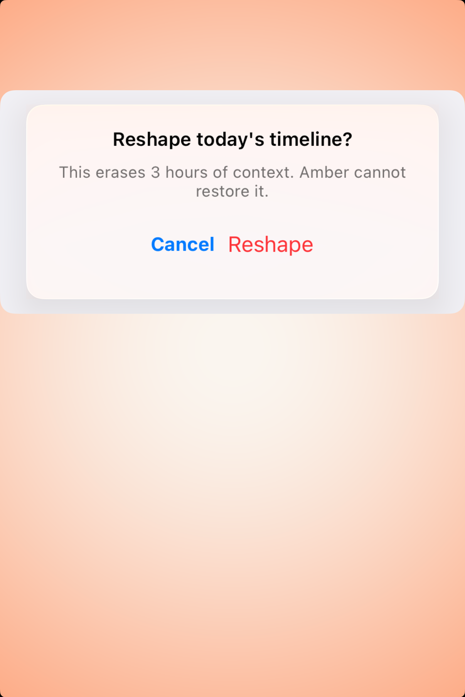

# Alerts — Visual validation

## HIG reference

## Rendered — macOS (light)

## Rendered — macOS (dark)

## Rendered — iOS (light)

## Rendered — iOS (dark)

## Verdict: PASS_WITH_NOTES

The alert row is usable again. iOS now captures the actual alert surface in
both appearances, with readable hierarchy, destructive emphasis, and enough
gutter around the card to judge it honestly. The row stays at
PASS_WITH_NOTES because macOS still falls back to the offscreen path, so the
desktop evidence shows the right structure but not a trustworthy live-glass
composite.

### Evidence manifest
- **Manifest:** `../evidence/alerts.json`
- **Required captures:** PASS — all four files present and > 10 KB.
- **Report links:** PASS — all four appearance-specific screenshot filenames
  linked above.

### Light appearance observations
- macOS: the inline alert remains readable, but it is still staged inside the
  larger Amber dashboard shell instead of as a cleaner isolated study.
- iOS: the alert is centered, fully in frame, and the shorter message copy no
  longer clips at the card edge.

### Dark appearance observations
- macOS: the offscreen fallback keeps the alert visible, though the surface
  reads more like a solid filled card than a real liquid-glass composite.
- iOS: dark mode preserves the title/message split and destructive button role
  without edge clipping.

### Deviations / notes
- macOS live-window capture still fell back to the offscreen renderer in this
  batch, so desktop glass fidelity remains a capture-pipeline caveat.
- The iOS study is now strong enough to trust structurally; the remaining
  reason this row is not full PASS is the desktop capture path, not the alert
  anatomy itself.

### Source citations
- Apple HIG — "Alerts" (see `apple-hig/pages/alerts.md` in the skill corpus).

### Remediation (if NEEDS_WORK)
N/A — notes only.
