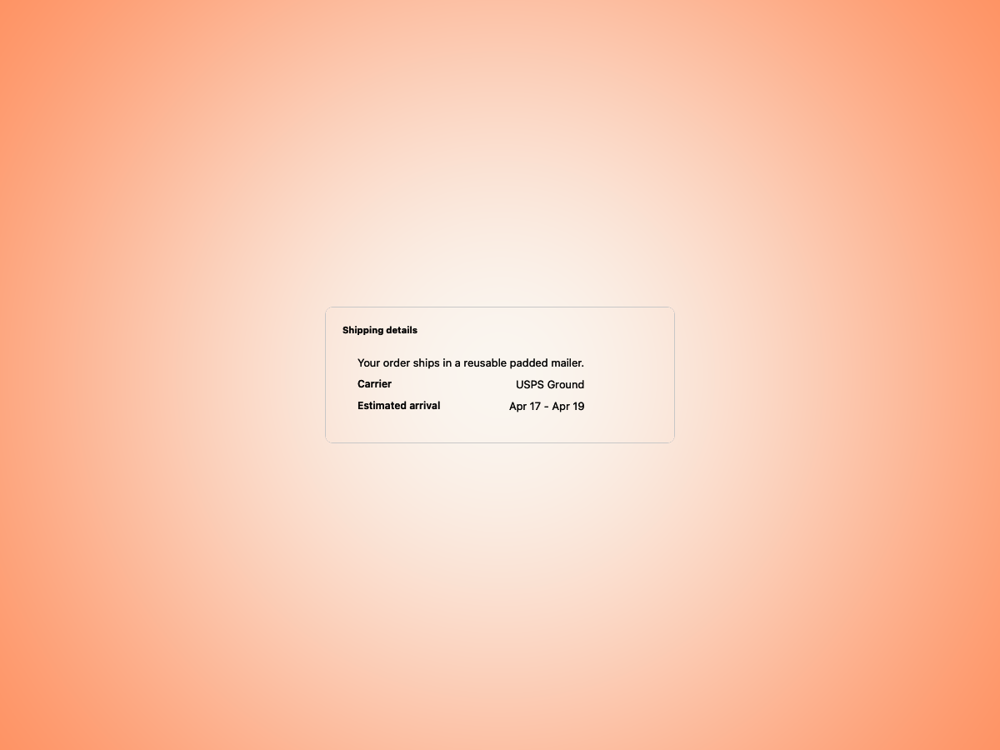
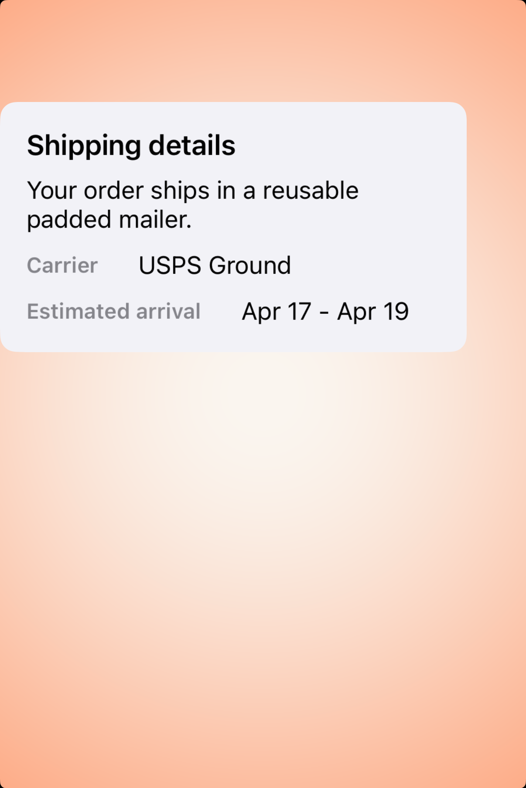
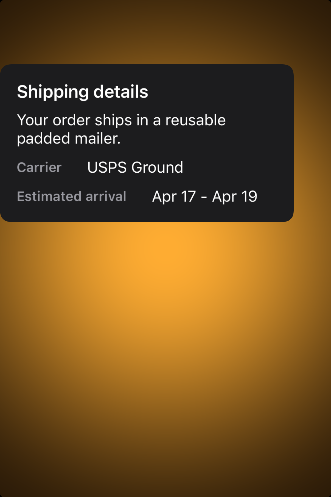

# Boxes -- Visual validation

## HIG reference

## Rendered -- macOS (light)

## Rendered -- macOS (dark)

## Rendered -- iOS (light)

## Rendered -- iOS (dark)

## Verdict: PASS_WITH_NOTES

The refreshed captures are finally using honest gutters and readable padding on both
platforms. The component now reads like a small grouped container instead of content
stuck to the rounded edges.

### What improved
- Both platforms now keep clear ambient space around the box, so the amber backdrop
  remains visible and the component no longer feels edge-hugging.
- The content padding reads correctly in the rounded container. Labels and values no
  longer crowd the corners.
- Dark mode is legible on both platforms, with the card surface clearly separated
  from the background.

### Why this is still notes-only
- The study is still a staged validation card rather than a more literal macOS/iOS
  settings-style composition.
- The iOS framing is cleaner than before, but the box still rides a little high in
  the capture instead of feeling perfectly centered in the viewport.

### Result
This is a good default taste baseline now. Keep it as `PASS_WITH_NOTES` until the
host framing becomes a little calmer and more platform-native.
