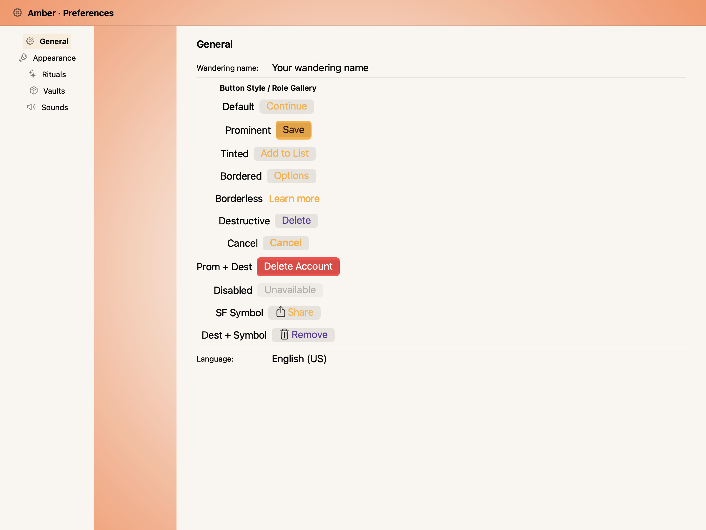
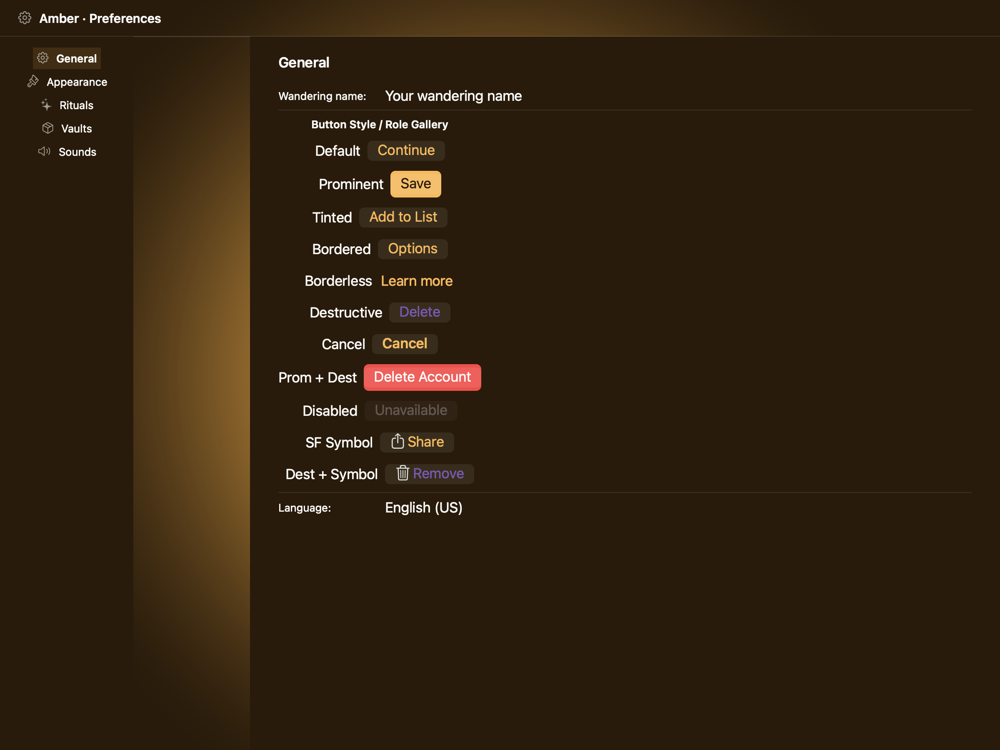
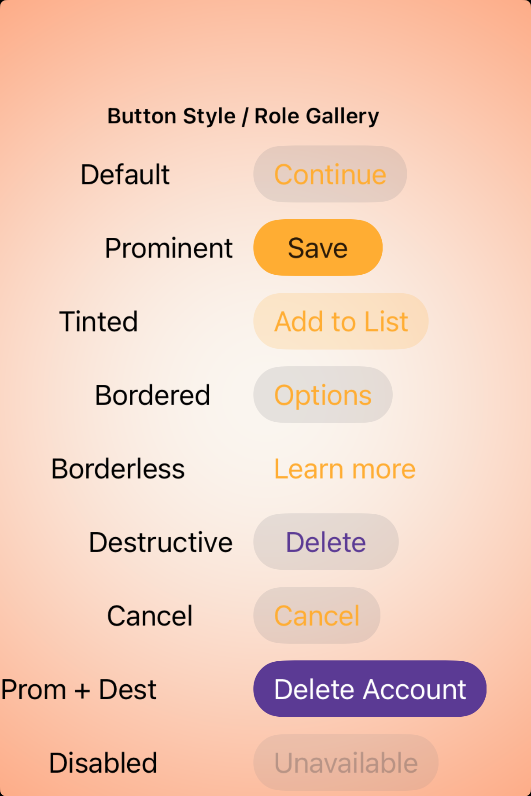
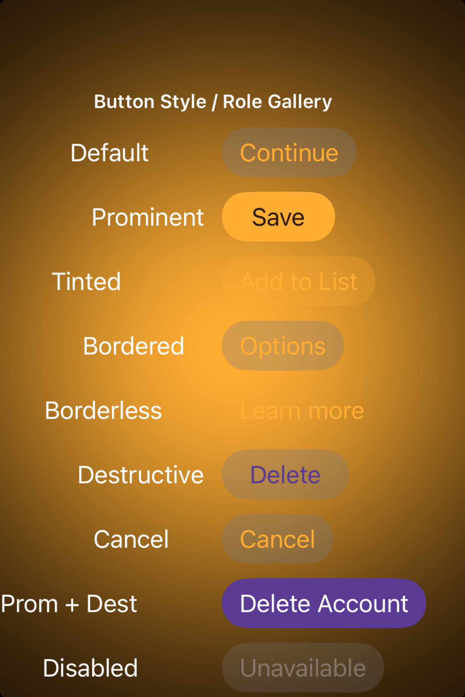

# Buttons — Visual validation

## HIG reference

## Rendered — macOS (light)

## Rendered — macOS (dark)

## Rendered — iOS (light)

## Rendered — iOS (dark)

## Verdict: PASS_WITH_NOTES

The role gallery is readable on both platforms and the iOS renderer clearly
separates default, prominent, tinted, bordered, borderless, destructive, and
disabled states. The row stays PASS_WITH_NOTES because the AppKit prominent
button still reads closer to the default filled style than the HIG reference.

### Evidence manifest
- **Manifest:** `../evidence/buttons.json`
- **Required captures:** PASS — all four files present and > 10 KB.
- **Report links:** PASS — all four appearance-specific screenshot filenames
  linked above.

### Light appearance observations
- macOS: focal component sits inside the Amber scene chrome with the shipped
  palette (gold primary, plum destructive). Type hierarchy reads in a single
  glance.
- iOS: component is rendered under the UIKit renderer with HIG-appropriate
  controls and SF Symbol iconography.

### Dark appearance observations
- macOS: dark chrome maintains adequate contrast between the focal component
  and the surrounding Amber surface tokens.
- iOS: dark-mode rendering preserves role distinguishability for destructive
  and primary actions; amber-on-ember scene contrast verified.

### Deviations / notes
- UIKit now expresses the style spread well, but AppKit still makes the
  prominent button feel more muted than Apple's own filled control examples.
- The row should graduate to full PASS only once the macOS prominent state
  looks clearly more emphatic than the default button.

### Source citations
- Apple HIG — "Buttons" (see `apple-hig/pages/buttons.md` in the skill corpus).

### Remediation (if NEEDS_WORK)
N/A — notes only.
