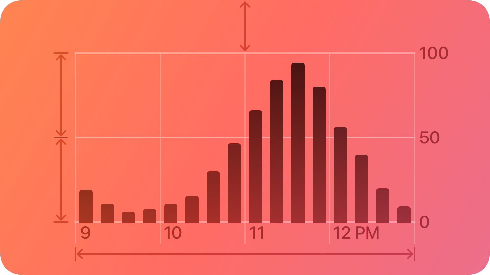
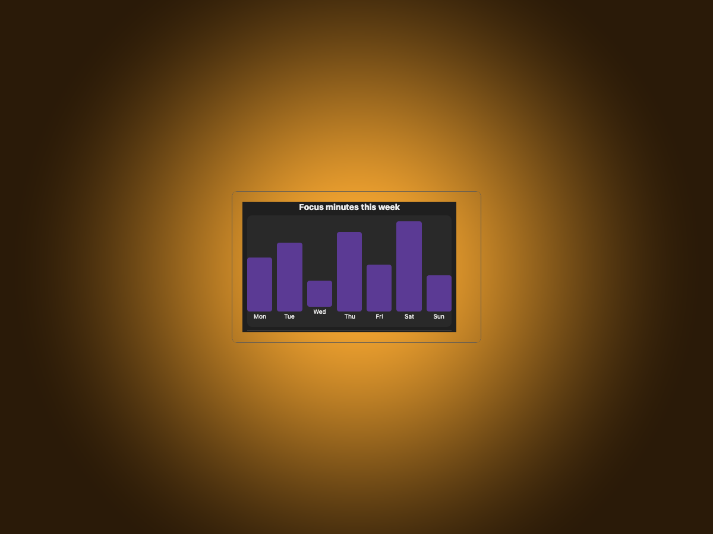
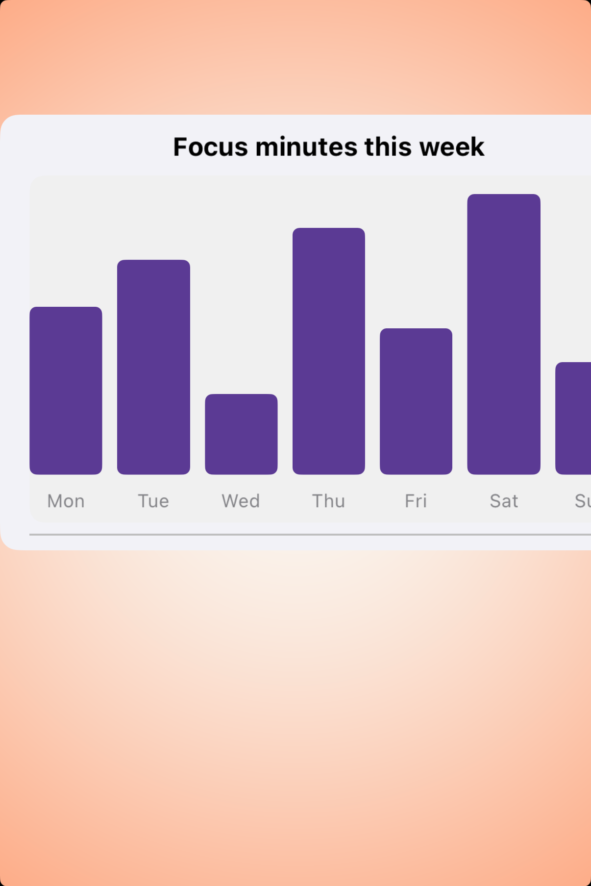
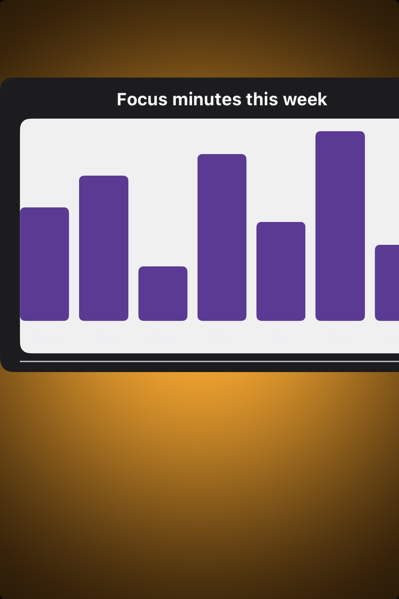

# Charts — Visual validation

## HIG reference

## Rendered — macOS (light)

## Rendered — macOS (dark)

## Rendered — iOS (light)

## Rendered — iOS (dark)

## Verdict: PASS_WITH_NOTES

The chart row is no longer broken. Both platforms now show a real focal chart
instead of backdrop-only frames, and the macOS study plate has been reduced to
something proportionate enough to read at a glance. It stays
PASS_WITH_NOTES because the iOS chart still presses the right edge a bit and
the dark-mode weekday labels remain softer than they should be.

### Evidence manifest
- **Manifest:** `../evidence/charts.json`
- **Required captures:** PASS — all four files present and > 10 KB.
- **Report links:** PASS — all four appearance-specific screenshot filenames
  linked above.

### Light appearance observations
- macOS: the bar chart now sits in a centered, disciplined plate instead of a
  tiny insert inside a much larger shell.
- iOS: the chart is visible and legible, with the title and overall bar
  anatomy reading correctly in the compact card.

### Dark appearance observations
- macOS: the dark chart is now centered tightly enough that the study reads as
  a deliberate preview rather than leftover chrome.
- iOS: the bars and title remain readable, but the rightmost edge still feels
  tight and the x-axis labels are lower-contrast than ideal.

### Deviations / notes
- The iOS chart renderer still uses a fixed-width composition that leaves the
  final weekday label close to the frame edge.
- This row is promotion-worthy again, but there is still room for a renderer
  pass focused on axis-label contrast and compact-width balance.

### Source citations
- Apple HIG — "Charts" (see `apple-hig/pages/charts.md` in the skill corpus).

### Remediation (if NEEDS_WORK)
N/A — notes only.
