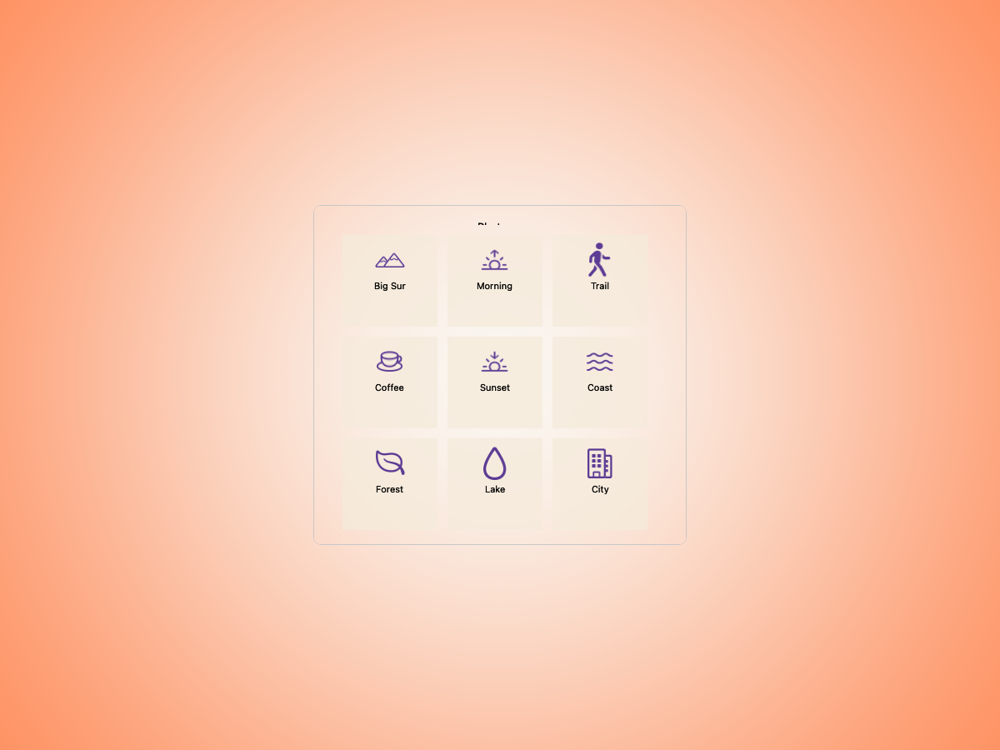
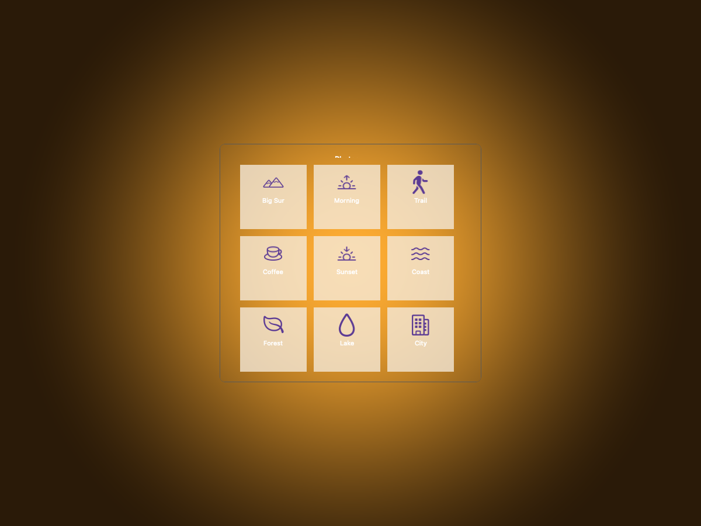
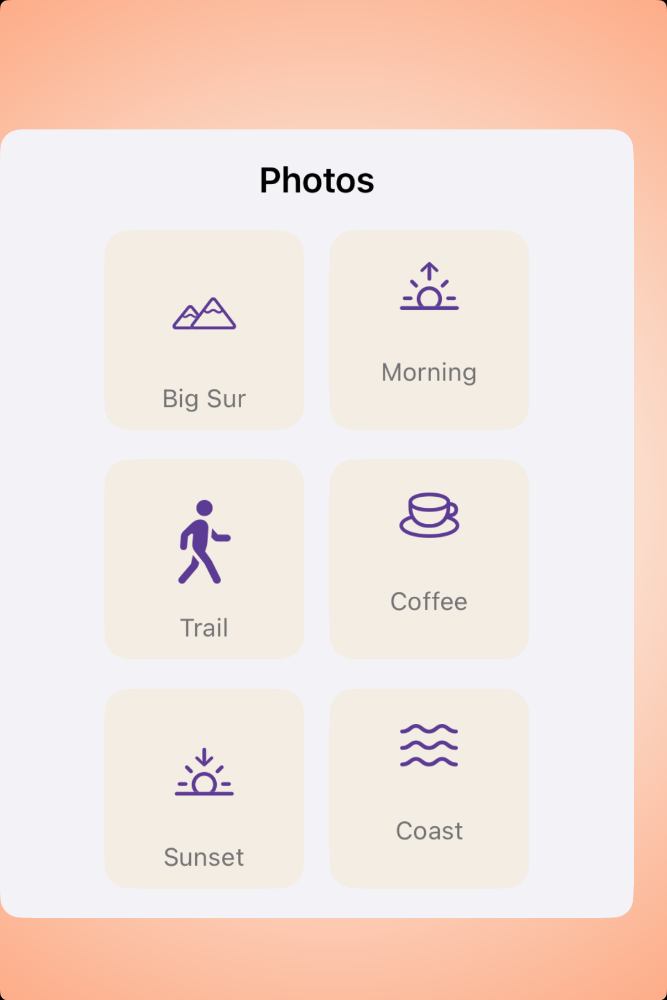

# Collections -- Visual validation

## HIG reference

## Rendered -- macOS (light)

## Rendered -- macOS (dark)

## Rendered -- iOS (light)

## Rendered -- iOS (dark)

## Verdict: PASS_WITH_NOTES

This study is much more coherent now. The grid reads as a small, centered content
surface instead of a loose layout drifting across the frame.

### What improved
- Both platforms now present the collection inside a focused study card with visible
  gutters, so the backdrop supports the component instead of competing with it.
- Tile spacing and sizing feel consistent across the grid, and the icons/captions
  now read as a single family rather than unrelated placeholders.
- iOS especially benefits from the tighter width; the grid no longer looks like it
  is falling off one side of the screen.

### Why this is still notes-only
- The macOS title area is still a little cramped at the top edge of the card.
- The preview is still a composed grid study, not a true native collection view with
  scrolling and selection behavior.

### Result
This is good enough to keep as an opinionated default preview, but it still wants one
more polish pass before it feels completely effortless.
