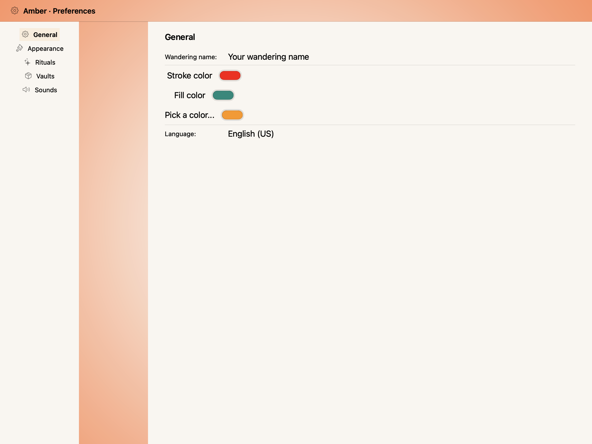
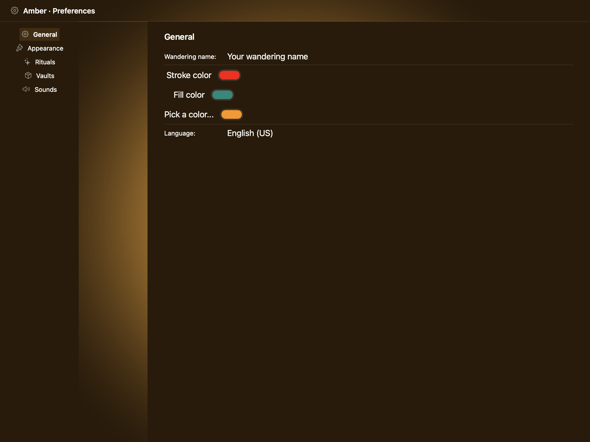
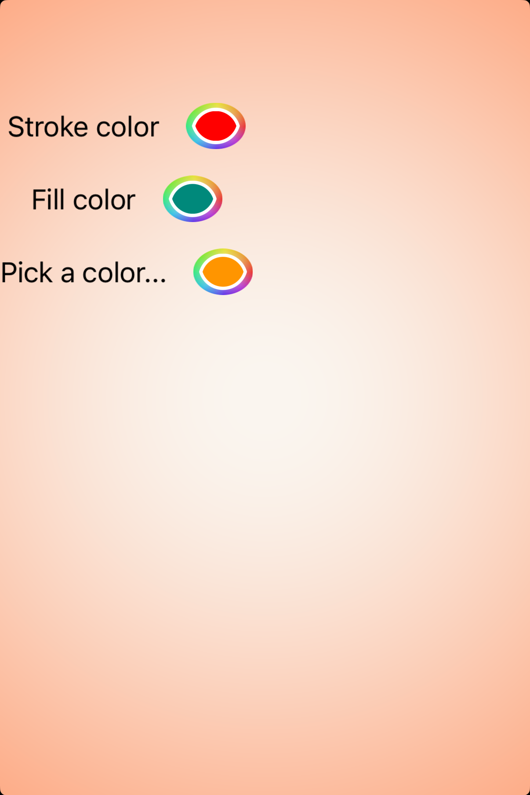
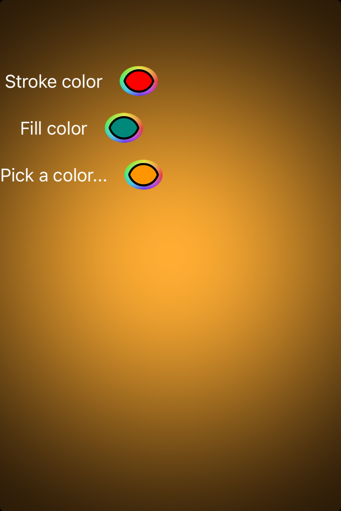

# Color wells -- Visual validation

## HIG reference

## Rendered -- macOS (light)

## Rendered -- macOS (dark)

## Rendered -- iOS (light)

## Rendered -- iOS (dark)

## Verdict: PASS_WITH_NOTES

The row stays at PASS_WITH_NOTES. macOS reads as a native color-well study with a
subtle bezel and clear swatches, while iOS still uses a lightweight swatch fallback
instead of a true `UIColorWell`. The result is visually clean and readable, but the
iOS path is a little more synthetic than the AppKit one.

### Liquid Glass check
- **Required for this slug:** No. Color wells are compact control-type components
  classified by HIG under the component catalog ("Color wells"), not under Windows
  and Overlays, Menus, or Presentation. The well surface itself is a plain filled
  swatch; Liquid Glass is not called for. The color-picker popover that opens on tap
  does use a system material (NSPopover uses .popover material on macOS; on iOS the
  UIColorPickerViewController presents in a sheet with system material), but those
  are not part of the color-well swatch itself.

### Current appearance notes

All four captures remain easy to read. The swatches are the point of the study and the
surrounding layout leaves enough breathing room that the component feels composed in
both appearances.

macOS is the most faithful path here: the native wells keep their subtle bezel and read
like real AppKit controls. iOS still presents a simple swatch-backed fallback, so it is
visually correct but not yet fully native in behavior.

### Deviations

1. **iOS uses a fallback swatch view instead of `UIColorWell`. PASS_WITH_NOTES.**
   The layout is good enough for validation, but the native border ring and picker
   interaction are still missing.

2. **The swatch fills are static rather than dynamic. PASS_WITH_NOTES.**
   That keeps the rendering simple, but it means the iOS path is less native than the
   AppKit one in dark appearance.

### Source citations
- HIG "Color wells": "A color well displays a color picker when people tap or click it."
- HIG "Color wells -- Best practices": "Consider the system-provided color picker for a
  familiar experience. Using the built-in color picker provides a consistent experience,
  in addition to letting people save a set of colors they can access from any app."
- HIG "Color wells -- macOS": "When people click a color well, it receives a highlight
  to provide visual confirmation that it's active. It then opens a color picker so
  people can choose a color. After they make a selection, the color well updates to
  show the new color."

### Remediation (if NEEDS_WORK)
Verdict remains PASS_WITH_NOTES. The next polish step is to wire a true `UIColorWell`
path on iOS so the swatch has the native border ring and picker behavior.
