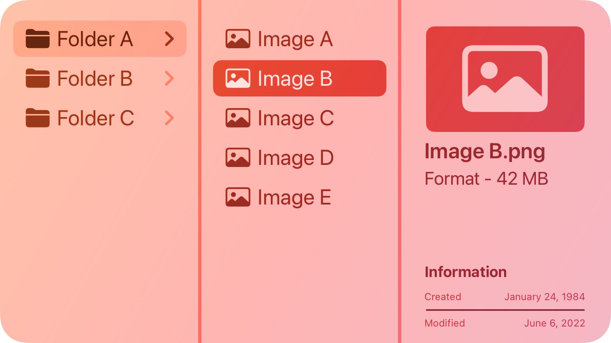
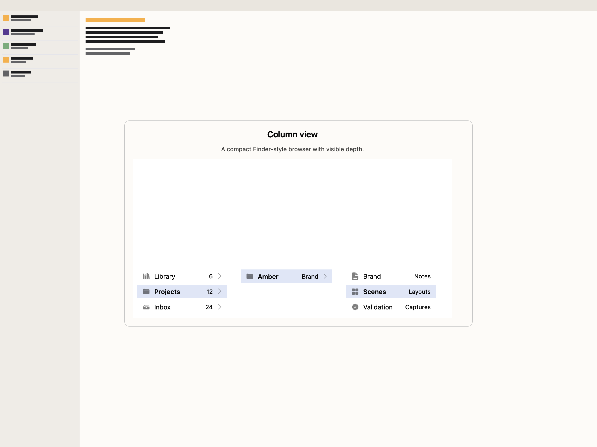
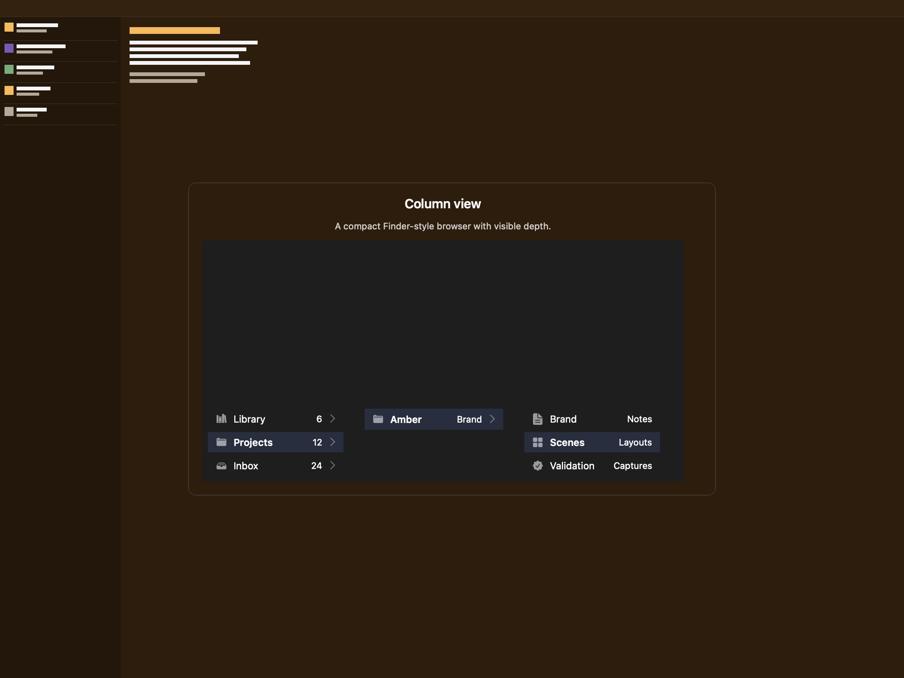
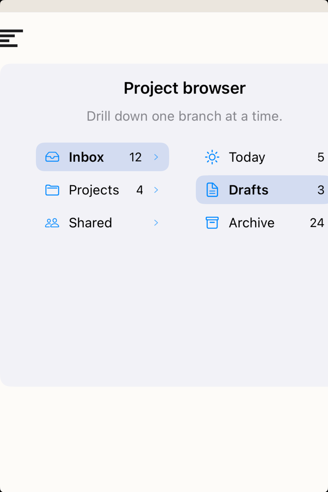
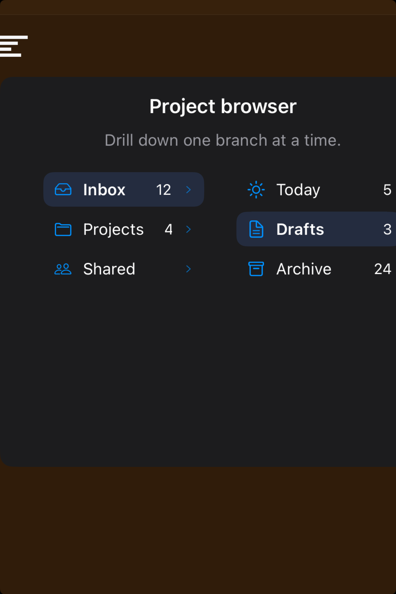

# Column views -- Visual validation

## HIG reference

## Rendered -- macOS (light)

## Rendered -- macOS (dark)

## Rendered -- iOS (light)

## Rendered -- iOS (dark)

## Verdict: PASS_WITH_NOTES

The current study now reads as a real column browser instead of a placeholder:
measured column widths, a visible selected path, and enough amber-backed
breathing room to keep the hierarchy legible. It stays notes-only because the
component is fundamentally macOS-shaped and the iOS presentation is an honest
fallback study rather than a native platform control.

### Light appearance observations

- macOS light presents the strongest read: the browser feels Finder-like,
  centered, and properly framed, with labels no longer collapsing into narrow
  wrapped columns.
- iOS light stays clear and useful, with a compact drill-down card instead of a
  full-window faux file manager.

### Dark appearance observations

- macOS dark keeps the hierarchy readable and preserves depth without turning
  into one flat slab.
- iOS dark remains legible, with selection and column boundaries still visible
  against the darker plate.

### Deviations

1. iOS is a portability fallback, not a native Apple column-browser control.
2. The study isolates the browser rather than embedding it in a richer Finder-
   style document context.

### Remediation (if NEEDS_WORK)

N/A -- notes only.
