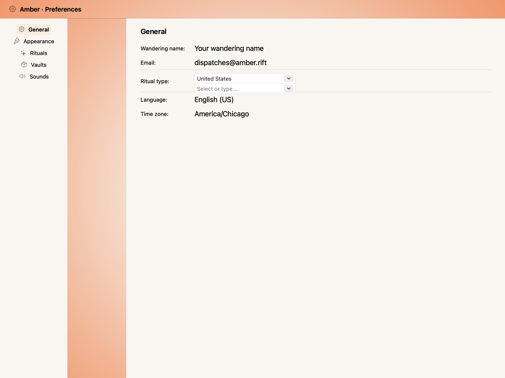
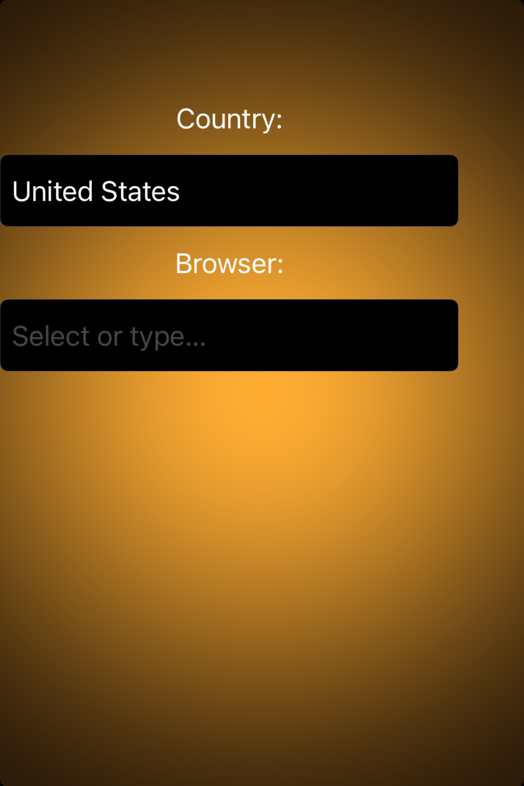

# Combo boxes -- Visual validation

## HIG reference

## Rendered -- macOS (light)

## Rendered -- macOS (dark)

## Rendered -- iOS (light)

## Rendered -- iOS (dark)

## Verdict: PASS_WITH_NOTES

macOS stays a clean PASS: the native combo box renders with the expected text field chrome, visible pull-down affordance, and correct dark/light adaptation. iOS remains PASS_WITH_NOTES because combo boxes are not a supported iOS control in HIG, so the renderer uses a rounded text field fallback that keeps the input legible and structurally close to the desktop control.

### Liquid Glass check
- **Required for this slug:** No. Combo boxes are ordinary input controls, not a glass-backed presentation surface.
- **Observed:** No glass material is expected or present in any capture. The macOS control uses standard AppKit bezel treatment; the iOS fallback uses rounded text field chrome. That matches the component category.

### Light appearance observations

**macos-light (40,492 bytes):**
The macOS capture shows the full native combo box treatment: label, editable value, and trailing pull-down affordance all remain clearly visible on a plain window background. Typography and spacing read as a standard desktop form control, with no clipping or awkward framing.

**ios-light (111,037 bytes):**
The iOS capture shows the intended fallback: a rounded text field with a populated value, a second empty field with placeholder text, and legible labels. The control reads cleanly as a supported approximation rather than a broken native combo box.

### Dark appearance observations

**macos-dark (40,822 bytes):**
Dark Aqua keeps the same structure and legibility. The combo box chrome remains distinct from the background, and the visible text and affordance hold up well in dark mode.

**ios-dark (106,328 bytes):**
The iOS dark fallback remains readable and balanced. The rounded field treatment is visually consistent with the light appearance and does not collapse into the background.

### Deviations

1. **iOS uses a fallback text field instead of a true combo box.**
   That is the right HIG-aligned choice, because combo boxes are not supported on iOS. The control remains legible and useful, so this stays PASS_WITH_NOTES rather than a failure.

2. **The trailing chevron affordance is still absent on iOS.**
   This is a small rendering limitation in the current fallback path. It does not affect legibility or the core form behavior, but it keeps the iOS appearance from being a perfect desktop-style match.

### Source citations
- HIG "Combo boxes -- abstract": "A combo box combines a text field with a pull-down button in a single control."
- HIG "Combo boxes -- Platform considerations": "Not supported in iOS, iPadOS, tvOS, visionOS, or watchOS."

### Remediation (if NEEDS_WORK)
Verdict remains PASS_WITH_NOTES. No re-queue needed.
