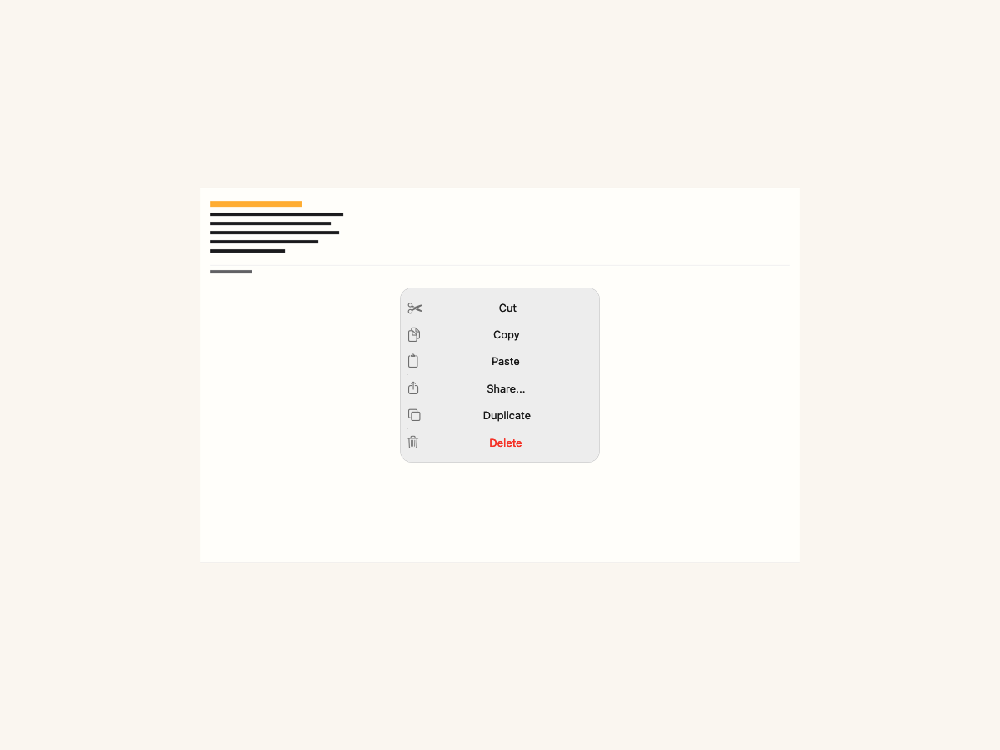
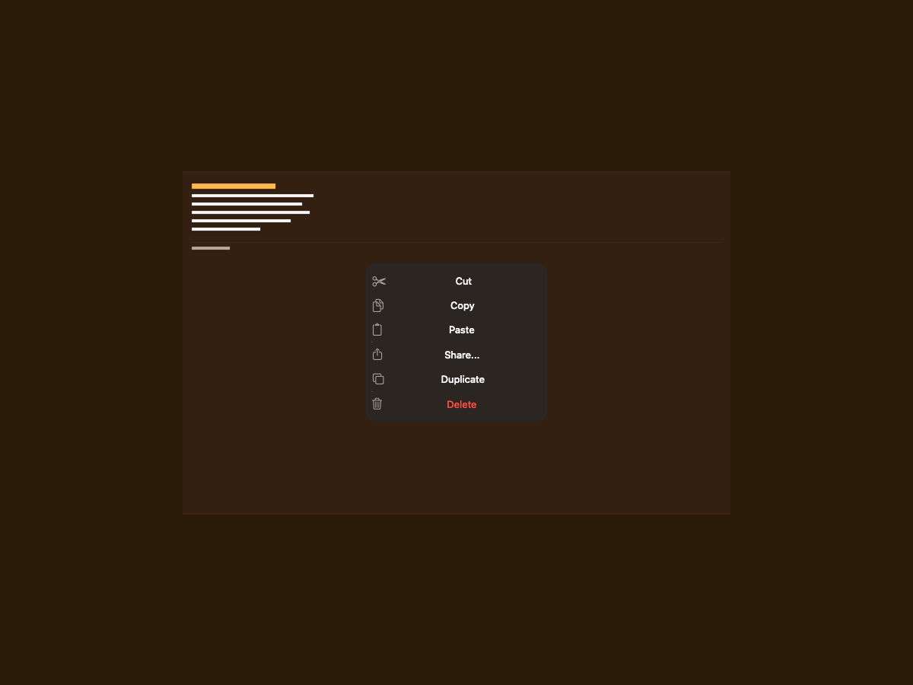
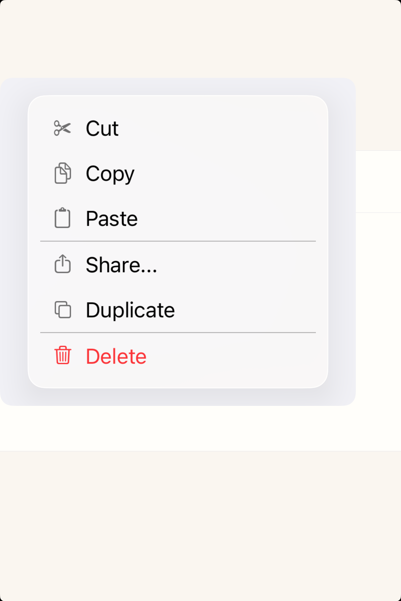
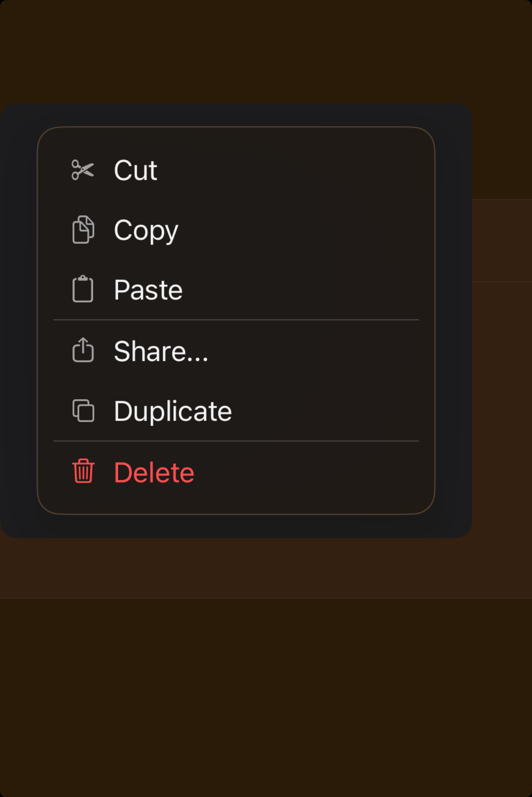

# Context menus -- Visual validation

## HIG reference

## Rendered -- macOS (light)

## Rendered -- macOS (dark)

## Rendered -- iOS (light)

## Rendered -- iOS (dark)

## Verdict: PASS_WITH_NOTES

The new captures finally read like a menu study instead of a broken mockup. The menu
surface is centered, the action hierarchy is legible, and the destructive action now
lands with the right visual weight.

### What improved
- The menu width is restrained enough to feel intentional on both platforms.
- The amber-themed environment is present but no longer overwhelms the menu itself.
- Destructive treatment, separators, and action spacing are clear and readable.

### Why this is still notes-only
- The study still shows a staged menu surface rather than a true invoked context-menu
  interaction anchored to content.
- The macOS preview keeps a little more supporting chrome than the HIG example needs,
  so it still reads slightly like a demo scene.

### Result
This is strong enough to count as `PASS_WITH_NOTES`. The remaining gap is more about
interaction realism than basic layout taste.
