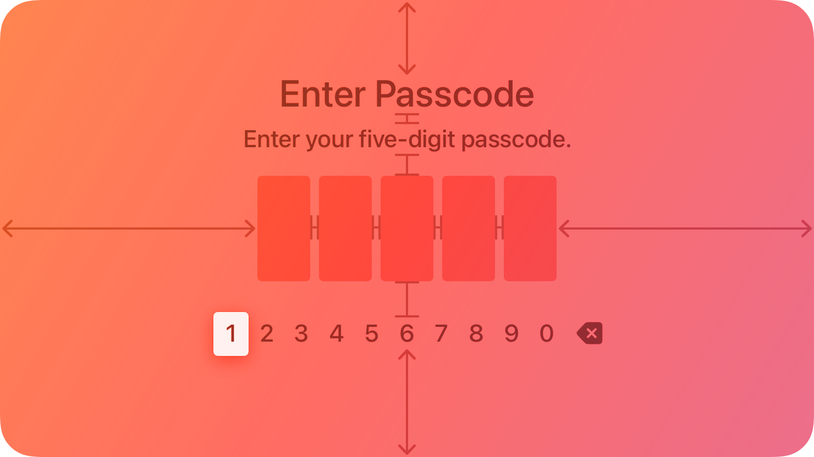
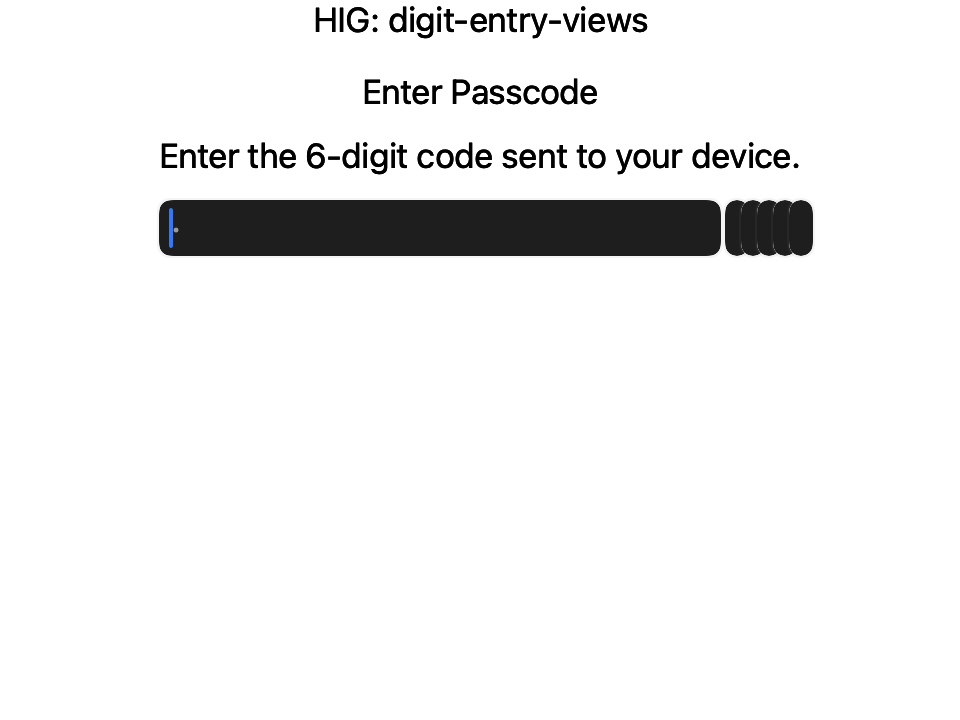
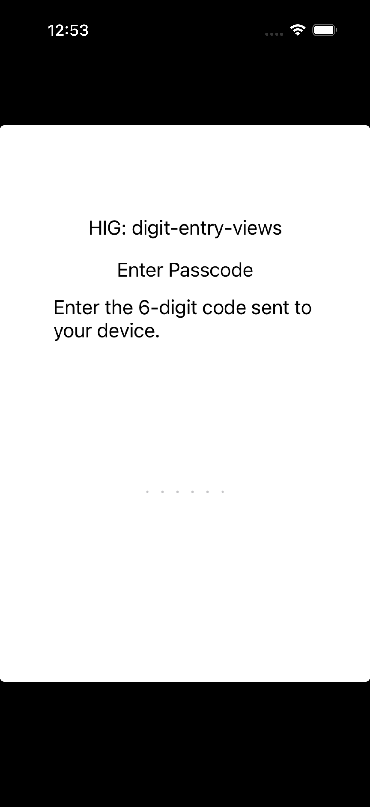

# Digit entry views — Visual validation

## HIG reference

## Rendered (macOS)

## Rendered (iOS)

## Verdict: NEEDS_WORK

### What matches
- **Line-of-digits shape (structurally).** Both renders place a
  horizontal row of six cells beneath a title + prompt stack — the
  "line of digits with title and prompt above" shape HIG prescribes.
  HIG: *"You can add an optional title and prompt above the line of
  digits."* Title ("Enter Passcode") and prompt ("Enter the 6-digit
  code sent to your device.") are present on both platforms.
- **Secure-entry semantics configured.** Each cell is built with
  `secure_entry = true` per HIG *"Always use a secure digit field when
  your app asks for sensitive data."* On macOS this resolves to
  `NSSecureTextField` (visible as the dark rounded-pill fill); on iOS
  the UITextField has `isSecureTextEntry = YES` so the placeholder dots
  render as masked glyphs rather than typed characters.
- **Numeric keyboard hint wired.** Each cell sets
  `keyboard_type = UI::KeyboardType::NumberPad`; the UIKit visitor
  maps this to `UIKeyboardType.numberPad` (HIG: *"prompts people to
  enter a series of digits, like a PIN, using a digit-specific
  keyboard"*). macOS ignores this hint (no hardware numeric-only
  constraint) which is HIG-correct since the HIG page says the
  component is *"Not supported in... macOS."*
- **Title + prompt typography.** Labels render in the system 13pt
  NSTextField face on macOS and the 17pt UILabel system face on iOS —
  default body style, matching HIG's quiet title-over-prompt treatment
  in the red tvOS illustration (no oversized headline chrome).

### Deviations
- **Per-digit cell chrome absent.** HIG reference illustration shows
  five rounded-corner cells (~6pt radius, ~40x56pt each) with
  equal spacing and a visible fill per cell. Our macOS render shows
  the first cell stretched to fill the entire HStack width
  (`NSSecureTextField` + `NSStackView` `.fill` distribution default
  with no explicit width constraint) while cells 2–6 collapse to
  thumbnail-sized stubs at the trailing edge. Root cause: `UI::TextField`
  has no `width : Float64?` / `fixed_size` / `cell_style : Symbol`
  knob, so the NSStackView can't assign equal widths, and the first
  arranged subview consumes all available horizontal space.
- **iOS cells collapse to zero width.** Our iOS render shows only six
  faint middle-dot placeholders (the `"·"` placeholder string) with no
  visible cell fill or border — the `UITextField` instances have no
  intrinsic content size and the enclosing `UIStackView` (axis:
  horizontal, distribution: default) gave them zero width. Same root
  cause as macOS: no cell-width knob on `UI::TextField`.
- **No boxed per-digit visual on UI::TextField.** HIG digit cells are
  *individual* boxed characters, not a single text run. Our
  `UI::TextField` renders as one continuous field per instance. Even
  with the width gap fixed, the rendered appearance would be six
  *rounded pills* rather than six *square-cornered digit boxes* —
  `NSSecureTextField.bezelStyle` is `.roundedBezel` by default and the
  UIKit counterpart uses `.roundedRect`. `UI::TextField` exposes no
  `bezel_style` / `border_style` property to force a flat-cornered
  box.
- **Numeric-only input not enforced on macOS.** `UI::KeyboardType` is
  an iOS hint only; the AppKit visitor ignores it. HIG "Digit entry
  views" requires a *digit-specific* keyboard, which on macOS would
  require an `NSTextFieldDelegate`-backed filter. Out of scope for
  this component iteration; the HIG page already states macOS is
  unsupported, so this is platform-honest.
- **Platform not supported by HIG.** HIG *"Platform considerations"*
  reads literally: *"Not supported in iOS, iPadOS, macOS, visionOS,
  or watchOS."* `TVDigitEntryViewController` is tvOS-exclusive. Our
  validation host has no tvOS target, so the *best* we can do on
  iOS/macOS is a visual mock that honors the HIG shape — which is
  what the current factory attempts. A true PASS for this slug
  requires either (a) a new tvOS host target, or (b) accepting the
  iOS/macOS mock as canonical and closing the width/box chrome gaps
  on `UI::TextField`.

### Source citations
- HIG "Digit entry views" (abstract): *"A digit entry view fills the
  entire screen and prompts people to enter a series of digits, like
  a PIN, using a digit-specific keyboard."*
- HIG "Digit entry views / Best practices": *"Use secure digit
  fields. Secure digit fields display asterisks instead of the
  entered digit onscreen. Always use a secure digit field when your
  app asks for sensitive data."*
- HIG "Digit entry views / Best practices": *"Clearly state the
  purpose of the digit entry view. Use a title and prompt that
  explains why someone needs to enter digits."*
- HIG "Digit entry views / Platform considerations": *"Not supported
  in iOS, iPadOS, macOS, visionOS, or watchOS."*

### Remediation
Two-track. (1) Close the `UI::TextField` width / box-chrome gaps so
mock-renders on iOS + macOS stop collapsing: add
`property fixed_width : Float64? = nil` and
`property border_style : Symbol = :rounded` (accepting `:rounded`,
`:bezel`, `:none`, `:line`), and have both visitors assign an
explicit width anchor + bezelless border when a digit-cell
configuration is requested. (2) Accept that true HIG parity requires
`TVDigitEntryViewController` — log a separate tvOS-host ticket (out
of scope for the Ralph loop today). Re-queue this slug as `pending`
with a remediation hint pointing at (1); expect `PASS_WITH_NOTES`
(deviation: tvOS-only component validated on iOS/macOS surrogate)
once the width knob lands.
