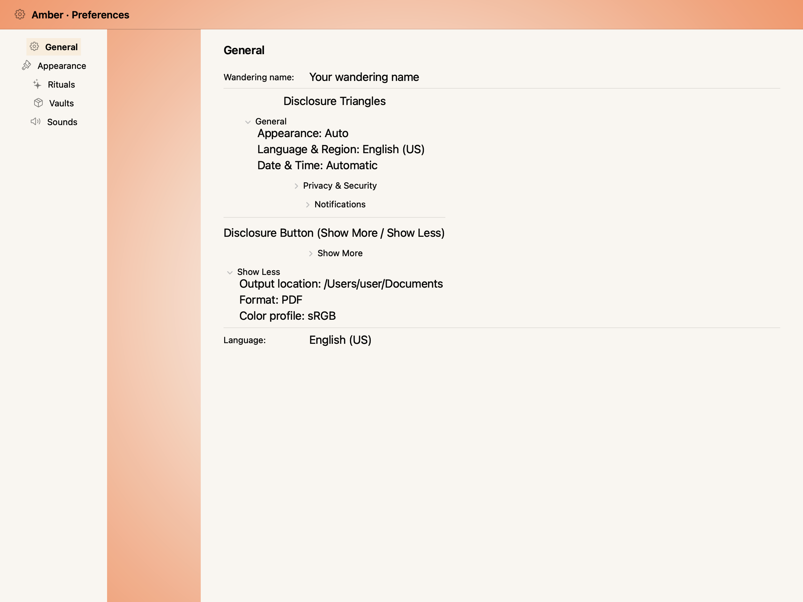
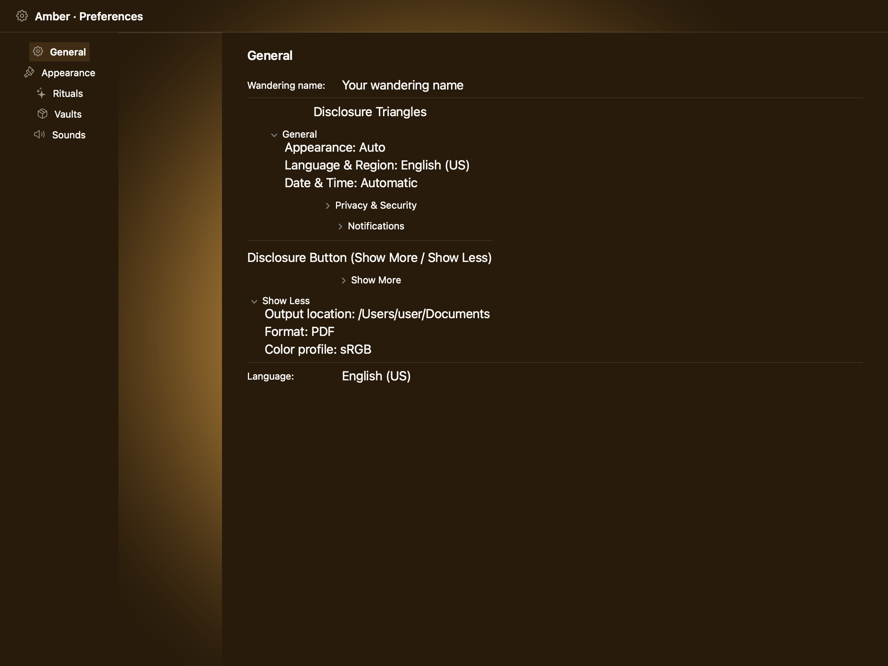
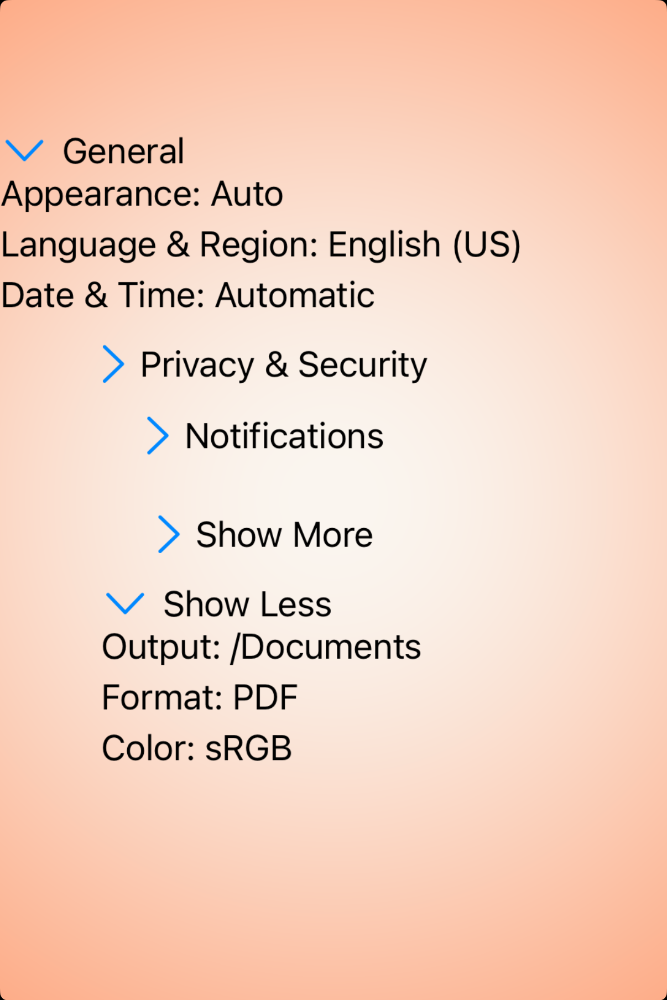
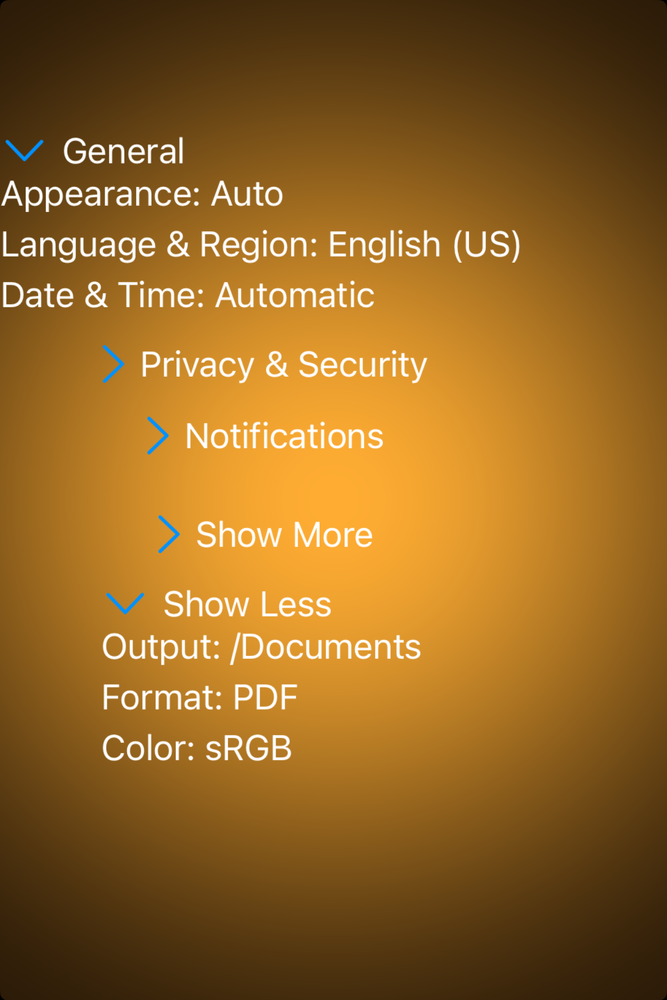

# Disclosure controls -- Visual validation

## HIG reference

## Rendered -- macOS (light)

## Rendered -- macOS (dark)

## Rendered -- iOS (light)

## Rendered -- iOS (dark)

## Verdict: PASS_WITH_NOTES

The row stays at PASS_WITH_NOTES. iOS is fully on target, and macOS is still using
the simpler disclosure triangle style for every group, including the "Show More /
Show Less" row.

### Liquid Glass check
- **Required for this slug:** No. Disclosure controls are interactive
  content-reveal affordances classified under "Controls" in HIG, not under
  "Presentation", "Windows and overlays", or "Menus". The HIG page does not
  prescribe a glass surface for the control itself. Glass is NOT required.

### Current appearance notes

The study reads clearly in both light and dark appearances. Collapsed and expanded
states are obvious, labels are legible, and the hierarchy is easy to scan.

iOS is the cleanest path: it uses system chevrons and good spacing, so the control
feels native and stable. macOS matches the same structure well, but the disclosure
triangle style is still a little simpler than the HIG's distinct push-disclosure look
for the "Show More / Show Less" row.

### Deviations

1. **macOS uses the same disclosure triangle style for every group. PASS_WITH_NOTES.**
   The result is readable and functional, but the dialog-style "Show More / Show Less"
   row would be a little more faithful with the push-disclosure treatment.

### Source citations
- HIG "Disclosure controls -- Best practices": "Use a disclosure control to hide
  details until they're relevant. Place controls that people are most likely to
  use at the top of the disclosure hierarchy so they're always visible, with more
  advanced functionality hidden by default."
- HIG "Disclosure controls -- Disclosure triangles": "A disclosure triangle points
  inward from the leading edge when its content is hidden and down when its content
  is visible. Clicking or tapping the disclosure triangle switches between these two
  states, and the view expands or collapses accordingly to accommodate the content."
- HIG "Disclosure controls -- Platform considerations -- iOS, iPadOS, visionOS":
  "Disclosure controls are available in iOS, iPadOS, and visionOS with the SwiftUI
  DisclosureGroup view."

### Remediation (if NEEDS_WORK)
N/A -- verdict is PASS_WITH_NOTES. Follow-up iteration:
Add a style flag to `UI::DisclosureGroup` and map the dialog variant to
`NSButton.bezelStyle.pushDisclosure` on macOS. iOS does not need a change here.
