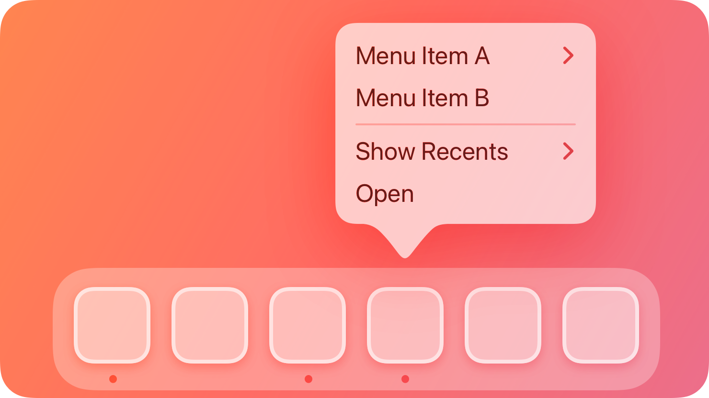
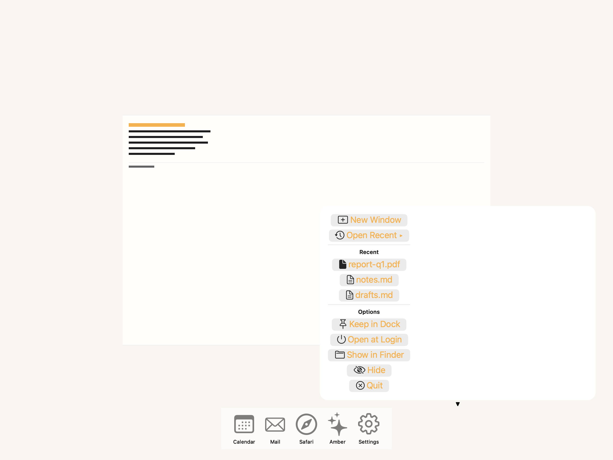
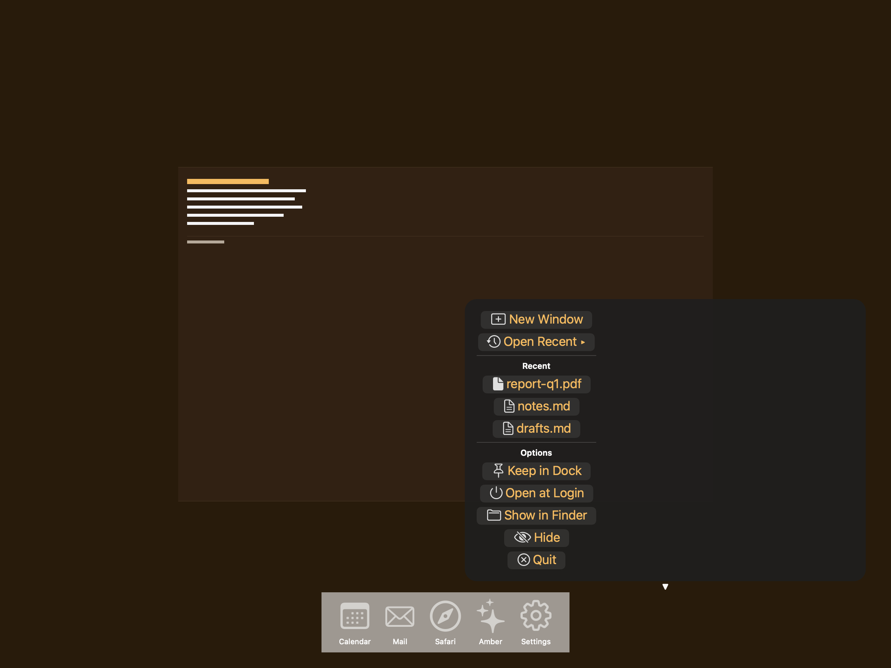

# Dock menus -- Visual validation

## HIG reference

## Rendered -- macOS (light)

## Rendered -- macOS (dark)

## Rendered -- iOS (light)

## Rendered -- iOS (dark)

## Verdict: PASS_WITH_NOTES

macOS is the real target here, and both light and dark captures remain visually sound: the menu surface reads as a frosted system panel, the action groups stay separated, and the text stays legible. iOS is still explicitly marked n/a because Dock menus are macOS-only; the iOS captures intentionally show a clear placeholder card rather than pretending this surface exists there.

### Platform-exclusion decision
Dock menus are a macOS-exclusive surface. The iOS placeholder explains that directly and keeps the validation pipeline honest without implying unsupported parity.

### Liquid Glass check
- **Required for this slug:** Yes. Dock menus are system menu surfaces and should appear as glass-backed menu chrome on macOS.
- **Observed:** The macOS captures show the expected frosted menu material in both appearances. The card edge, separators, and menu grouping remain visible, so the material and hierarchy read correctly.

### Light appearance observations

**macOS light (86550 bytes):**
The menu reads as a single system panel with distinct groups and visible dividers. The command labels remain legible and the overall composition feels like a Dock menu rather than a generic popover.

**iOS light (291378 bytes):**
The placeholder card stays readable and clearly marks the surface as unsupported on iOS. The fallback is calm and intentional, not a blank or broken frame.

### Dark appearance observations

**macOS dark (87422 bytes):**
The dark capture preserves the same grouping and hierarchy, with the frosted surface still distinct from the background. The composition remains balanced and readable.

**iOS dark (262660 bytes):**
The iOS placeholder remains readable in dark mode and continues to function as an explicit platform note rather than a pretend implementation.

### Deviations

1. **Menu labels still inherit the current blue-tinted button styling.**
   The labels are readable, but they do not yet fully match native Dock menu typography. That is a styling gap, not a legibility problem.

2. **The submenu indicator is still text-based rather than a native submenu arrow.**
   The affordance is present, but it is still a workaround in the current host path.

### Source citations
- HIG "Dock menus -- Best practices": "As with all menus, you need to label Dock menu items succinctly and organize them logically."
- HIG "Dock menus -- Platform considerations": "Not supported in iOS, iPadOS, tvOS, visionOS, or watchOS."

### Remediation (if NEEDS_WORK)
Verdict remains PASS_WITH_NOTES. The remaining items are styling refinements, not blockers.
