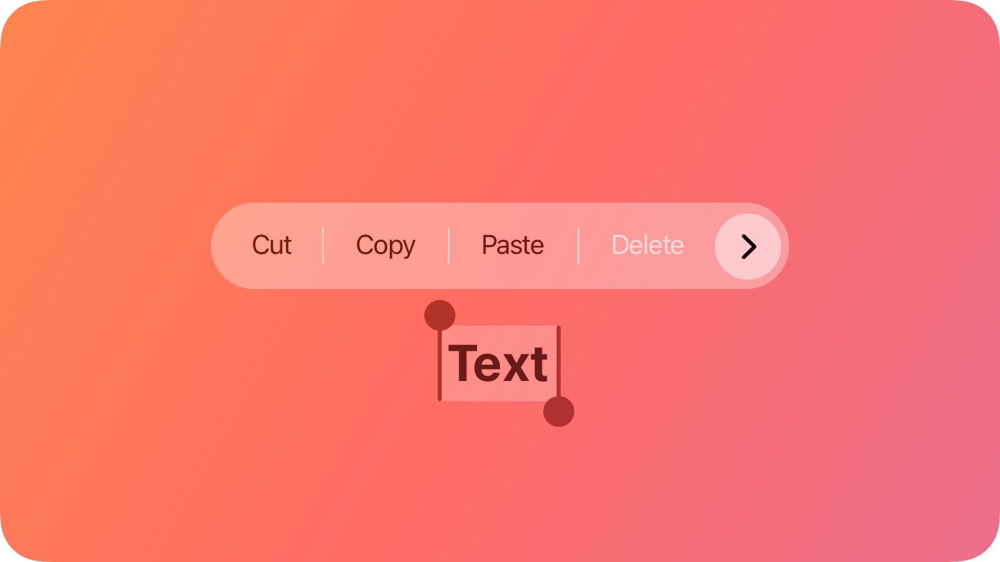
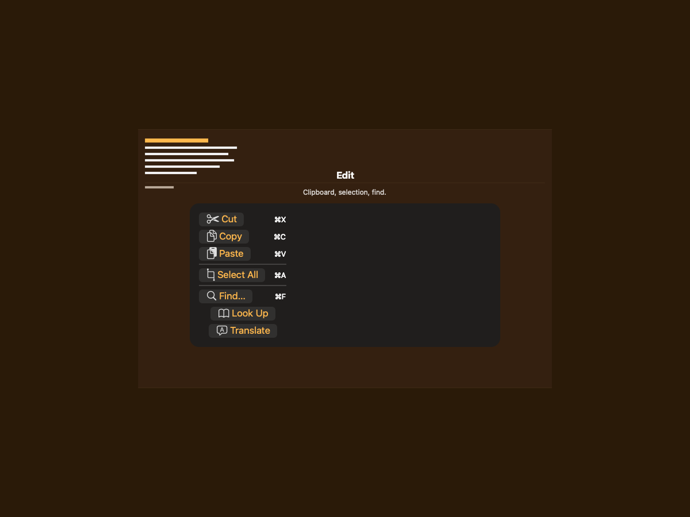
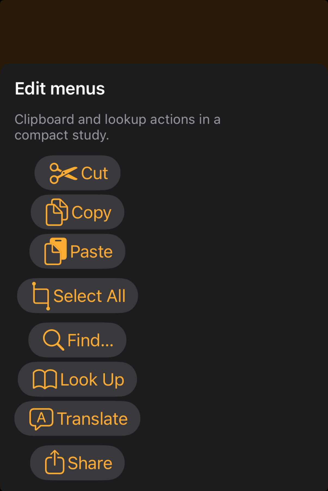

# Edit menus -- Visual validation

## HIG reference

## Rendered -- macOS (light)

## Rendered -- macOS (dark)

## Rendered -- iOS (light)

## Rendered -- iOS (dark)

## Verdict: PASS_WITH_NOTES

This refresh puts the edit-menu study on calmer centered plates across both
hosts. The structure now reads in one glance, leaves visible amber gutters, and
keeps the menu anatomy focused on clipboard, selection, and lookup actions
instead of incidental scene clutter.

### What improved
- macOS now uses an ambient composition with a short "Edit" header and tighter
  grouping, which makes the menu read like a deliberate study instead of a
  document screenshot.
- iOS now renders as a centered card against the warm backdrop instead of being
  trapped inside the document scene, so the menu plate is visible and stable in
  both appearances.

### Remaining notes
1. The rows still render as pill buttons rather than native `NSMenuItem` /
   `UIEditMenuInteraction` rows.
2. Labels still follow the systemic orange-blue action tint path rather than a
   true label-color menu treatment.
3. Runtime-presented menus remain richer than the inline capture path.

These are real notes, but they no longer undermine the default taste or legibility.
